# SaaS Financeiro Multi-Tenant — Documento Consolidado de Design

> **Para quem é este documento.** Para você (sócio, decisor de produto), para o futuro time de desenvolvimento, e para qualquer pessoa que precise entender em 30 minutos como o sistema está pensado e por quê. Não é manual de uso, não é spec de implementação — é o **mapa do raciocínio** do design.
>
> **Como ler.** Comece pelo TL;DR. Se quiser entender algo específico, use o índice. Se quiser entender *por que* algo foi decidido, vá ao registro de decisões. Os diagramas estão nas seções que fazem sentido — não no fim como anexos.
>
> **Última atualização:** 06/05/2026 — fixados os 3 últimos provedores de infraestrutura: **Asaas** como PSP de pagamento (D-155), **AWS S3** como storage de documentos (D-156), **RabbitMQ** como mensageria do Event Bus (D-157). Stack de infra do MVP agora 100% definida. Histórico anterior: 30/04/2026 (sessão 2) — fechadas todas as decisões estratégicas dos 3 contextos do MVP (D-138 a D-154); 30/04/2026 (sessão 1) — D-131 a D-137 (Padrão Substituição, Estorno, Falha de Gateway); 29/04/2026 — consolidação de Bill Ingestion, Expected Recurring Bills e Expense Classification, A+ES seletivo (D-405), auditoria universal (D-406), Apêndice C (Vernon), tipologia de Payables (D-110), política de timing (D-111-113), camada de aprovação e travas (D-121-130).

---

## 📌 TL;DR — o sistema em 30 segundos

Um SaaS de gestão financeira para **PMEs de serviços** que **automatiza ao máximo** o ciclo de contas a pagar: captura sozinho contas recorrentes (e-mail dedicado, web scraping, upload manual), processa compras parceladas, folha de pagamento e despesas diárias com cupom fiscal. Pagamento via **Asaas** (PSP) com Boleto e PIX, agendado pelo provedor. Tem **camada opcional de aprovação de pagamentos** com 8 travas de segurança. Inclui DRE gerencial e oficial, balanço e análise de margem por contrato com rateio configurável.

**MVP foca em 3 bounded contexts:** Bill Ingestion + Accounts Payable + Payment Execution. Os demais têm modelagem alto nível para preservar coerência arquitetural mas ficam para pós-MVP. **A+ES seletivo** para os aggregates do ciclo financeiro garante auditoria total. Já existe cliente real esperando.

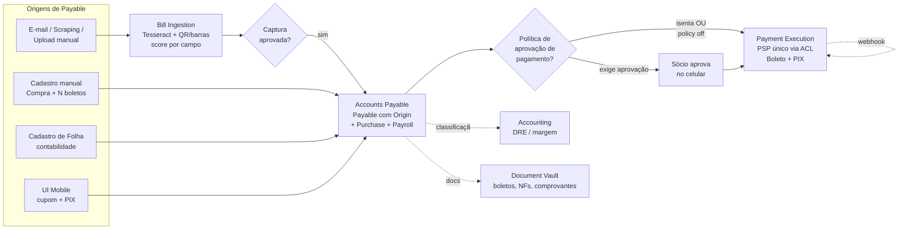

---

## 📖 Índice

1. [Introdução e objetivos](#1-introdução-e-objetivos)
2. [Restrições e premissas](#2-restrições-e-premissas)
3. [Contexto e fronteiras do sistema](#3-contexto-e-fronteiras-do-sistema)
4. [Estratégia de solução](#4-estratégia-de-solução)
5. [Bounded Contexts](#5-bounded-contexts)
6. [Visão de arquitetura](#6-visão-de-arquitetura)
7. [Cenários de runtime](#7-cenários-de-runtime)
8. [Conceitos transversais](#8-conceitos-transversais)
9. [Modelagem tática detalhada](#9-modelagem-tática-detalhada)
   - 9.7 [Tipologia de Payables — `PayableOrigin`](#97-tipologia-de-payables--payableorigin)
   - 9.8 [Política de Timing de Pagamento — `PaymentTimingPolicy`](#98-política-de-timing-de-pagamento--paymenttimingpolicy)
   - 9.9 [Camada de Aprovação de Pagamentos e Travas de Segurança](#99-camada-de-aprovação-de-pagamentos-e-travas-de-segurança)
   - 9.10 [Ciclo de vida da Payable — Substituição, Estorno e Falha de Gateway](#910-ciclo-de-vida-da-payable--substituição-estorno-e-falha-de-gateway)
   - 9.11 [Payment Execution — PaymentOrder e fluxos críticos](#911-payment-execution--paymentorder-e-fluxos-críticos)
10. [Registro de decisões (ADRs)](#10-registro-de-decisões-adrs)
    - 10.6 [Decisões de Accounts Payable, Documentos e Compras (D-110 a D-199)](#106-decisões-de-accounts-payable-documentos-e-compras-d-110-a-d-199)
    - 10.7 [Decisões do ciclo de vida da Payable (D-131 a D-199)](#107-decisões-do-ciclo-de-vida-da-payable-d-131-a-d-199)
    - 10.8 [Decisões de escopo do MVP e Payment Execution (D-138 a D-152)](#108-decisões-de-escopo-do-mvp-e-payment-execution-d-138-a-d-152)
    - 10.9 [Decisões de provedores fixadas (D-155 a D-157)](#109-decisões-de-provedores-fixadas-d-155-a-d-157)
11. [Glossário](#11-glossário)
12. [O que ainda está aberto](#12-o-que-ainda-está-aberto)

**Apêndices**

- [A — Estado da modelagem por contexto](#apêndice-a--estado-da-modelagem-por-contexto)
- [B — Material de referência](#apêndice-b--material-de-referência)
- [C — Aggregates and Event Sourcing (A+ES) [Vernon]](#apêndice-c--aggregates-and-event-sourcing-aes-vernon)

---

## 1. Introdução e objetivos

### 1.1 O que o sistema é

Um SaaS multi-tenant de gestão financeira focado em automação. Diferente de ERPs tradicionais que pedem cadastro manual de cada conta, este sistema é construído em torno de uma ideia central: **o único ponto de ação humana deve ser a aprovação quando o automatismo não tem segurança**. Tudo antes (descobrir a conta) e depois (pagar, conciliar, lançar) é máquina.

### 1.2 Para quem é

- **Cliente-alvo:** PMEs brasileiras de serviços, hoje no Simples Nacional, com perspectiva de migrar para Lucro Real.
- **Operador-alvo:** o sócio dono. UX desenhada para alguém que **não é contador** e que aprova pagamentos pelo celular entre reuniões.
- **Persona técnica secundária:** contador externo da empresa, que consome relatórios oficiais (DRE, Balanço).

### 1.3 Objetivos de qualidade priorizados

Em ordem decrescente de prioridade — em caso de conflito, ganha o primeiro:

1. **Confiabilidade financeira.** Auditabilidade total. Toda mudança de estado tem rastro de quem, quando e por quê. Nenhum pagamento sai sem aprovação rastreável.
2. **Automação útil.** Reduzir trabalho operacional do dono. Métrica concreta: % de Payables que viram pagamento sem toque humano.
3. **Manutenibilidade do modelo.** Sistema vai evoluir por anos — modelagem rica é investimento no Core, mantém complexidade gerenciável.
4. **Tempo até MVP.** Já existe cliente real esperando. Cortes pragmáticos onde necessário, mas sem cortar fundação.

### 1.4 Stakeholders

| Papel | Expectativa principal |
|---|---|
| Sócio/dono (você) | Sistema visível e útil rápido, com cliente real |
| Cliente real (PME) | Para de fazer trabalho manual de pagamento |
| Contador externo | Relatórios oficiais corretos, fechamento limpo |
| Time de desenvolvimento (futuro) | Modelo claro, decisões documentadas, código escala |

---

## 2. Restrições e premissas

### 2.1 Restrições técnicas fixadas

- **Stack do front:** Flutter (web, desktop, mobile) — decisão tomada antes deste design
- **Multi-tenancy lite:** discriminador `tenantId` no banco, sem schemas separados (D-400)
- **Monolito modular** primeiro, microsserviços só quando algum contexto precisar escalar diferente (D-005)
- **Mensageria assíncrona** entre contextos via Domain Events (D-402)

### 2.2 Restrições de domínio

- **Brasil.** Plano de contas brasileiro, DRE no formato CPC, retenções (IRRF/INSS/ISS) eventualmente, regime de competência separado de regime de caixa.
- **PME.** Não é sistema corporativo de banco grande — não precisa ser ultra-escalável. Mas precisa ser **simples para um sócio operar**.
- **Captura é sempre obrigatória.** Mesmo para contas de valor fixo conhecido, o pagamento exige código de barras / QR / linha digitável que vem na conta. Sem captura, não há pagamento (D-200).

### 2.3 Premissas de fundo

- O contador externo configura plano de contas e classificações. O sócio opera no dia a dia.
- Existe orçamento para serviços pagos críticos (gateway, OCR cloud, Open Finance) — mas escolhas precisam ser justificadas.
- LGPD se aplica. RawDocuments têm dados sensíveis e precisam de tratamento adequado.

---

## 3. Contexto e fronteiras do sistema

### 3.1 Diagrama de contexto

Quem o sistema fala, e o que entra/sai.

```mermaid
flowchart TB
    subgraph Atores["Atores humanos"]
        Socio[Sócio<br/>opera dia a dia]
        Contador[Contador externo<br/>configura, audita]
        Operacional[Equipe operacional<br/>cadastra contratos]
    end

    Sistema((SaaS Financeiro))

    subgraph Ext["Sistemas externos no MVP"]
        Email[Caixa de e-mail<br/>dedicada]
        Portais[Portais de<br/>concessionárias]
        OCR[Tesseract local<br/>+ decoder QR/barras]
        Gateway[Asaas<br/>PSP de pagamento]
        Notif[Provedor de<br/>notificações]
        Storage[AWS S3<br/>RawDocuments + ManagedDocs]
        Bus[RabbitMQ<br/>Event Bus]
        Auth[Keycloak<br/>(login UI)]
    end

    subgraph Future["Roadmap pós-MVP"]
        OF[Open Finance<br/>Pluggy / Belvo]
        Banco[Banco<br/>extrato + débito]
    end

    Socio -->|aprovações,<br/>consultas| Sistema
    Contador -->|configurações,<br/>relatórios| Sistema
    Operacional -->|cadastros| Sistema

    Email -.->|recebe e-mails| Sistema
    Portais -.->|scraping| Sistema
    Sistema -->|envia documentos<br/>para extrair| OCR
    Sistema -->|ordena pagamento| Gateway
    Gateway -.->|webhooks HMAC| Sistema
    Sistema -->|push, e-mail| Notif
    Sistema <-->|RawDocuments| Storage
    Sistema <-->|login/SSO| Auth

    OF -.->|futuro: captura DDA<br/>conciliação| Sistema
    Banco -.->|futuro: extrato| Sistema

    classDef future fill:#e0e7ff,stroke:#6366f1,stroke-dasharray: 5 5
    class OF,Banco future
```

### 3.2 O que está dentro do escopo

Captura, validação, classificação, agendamento, pagamento, conciliação, contabilização, relatórios. Tudo com auditoria completa.

### 3.3 O que está **explicitamente fora** do escopo

- Cálculo trabalhista da folha de pagamento (sócio digita os valores que a contabilidade fornece — sistema cria Payables e contabiliza, mas não calcula salário/INSS/FGTS)
- Apuração tributária complexa (Simples até pode, Lucro Real não no MVP)
- Emissão de NFS-e (consumir sim, emitir não no MVP)
- Procurement detalhado (rascunho → orçamento → aprovação → entrega) — existe como bounded context futuro com interface definida (D-117)
- Cartão de crédito corporativo — bounded context futuro com interface conhecida (D-130)

---

## 4. Estratégia de solução

Cinco princípios fundadores que dirigem todas as outras decisões.

### Princípio 1 — Domain-Driven Design estratégico antes de tático

Antes de modelar aggregates, isolar bounded contexts. Cada contexto tem sua linguagem ubíqua, seu time mental, suas forças. Misturar é receita para Big Ball of Mud.

### Princípio 2 — Clean Architecture com domain no centro

Camadas concêntricas: Domain → Application → Adapters/Infrastructure. **Dependências apontam para dentro**. Domain não conhece banco, gateway, scraper. Trocar provedor de OCR não toca no modelo.

### Princípio 3 — Aggregates pequenos com referência por id

Aggregate só carrega o que precisa para suas invariantes. Outras entidades são referenciadas por id (não objeto). Reduz contenção, simplifica transações, força fronteiras claras.

### Princípio 4 — Eventual consistency entre contextos

Comunicação assíncrona via Domain Events é o default. Síncrona (Open Host Service) só quando query pontual exige resposta imediata. O acoplamento fica por contrato de evento, não por modelo compartilhado.

### Princípio 5 — Monolito modular primeiro

Um deploy só, mas com módulos rigidamente separados (`src/contexts/{nome}/`). Quando algum contexto precisar escalar diferente (provavelmente Bill Ingestion por causa dos scrapers), extrai para serviço separado sem refactor traumático.

---

## 5. Bounded Contexts

### 5.1 Mapa de contextos

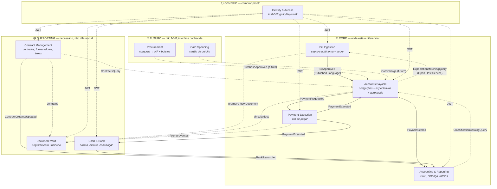

**Convenção de setas:**
- Linha cheia = evento de domínio publicado (assíncrono)
- Linha tracejada = consulta síncrona via Open Host Service ou referência de id

### 5.2 Por que essas fronteiras

A pergunta "por que separar X de Y" é decisão estratégica de DDD e merece justificativa explícita em cada caso.

| Separação | Por quê |
|---|---|
| Bill Ingestion ≠ Accounts Payable | Mundo da extração probabilística (com score, dúvida, OCR) é fundamentalmente diferente do mundo da obrigação financeira auditável (D-002). |
| Payment Execution ≠ Accounts Payable | Uma Payable é uma obrigação. Um pagamento é um ato. Uma Payable pode ter N tentativas de pagamento — modelar junto bagunçaria os dois ciclos de vida (D-003). |
| ExpectedRecurringBill em Accounts Payable, não em Bill Ingestion | É decisão financeira (orçamento, fluxo projetado), não de captura. Bill Ingestion apenas consulta via Open Host Service (D-004). |
| Accounting separado de Accounts Payable | Plano de contas é catálogo reutilizável compartilhado por receitas, despesas, ativos. Não pertence a Payable. |
| Document Vault separado dos demais | Arquivamento de boletos, NFs, contratos e comprovantes é capacidade transversal usada por todos os contextos. Modelar dentro de cada um geraria duplicação e inconsistência (D-114). |

### 5.3 Classificação por tipo de subdomínio

Seguindo Vernon — essa classificação dirige onde investir:

- **Core** (modelagem rica obrigatória): Bill Ingestion, Accounts Payable, Payment Execution, Accounting & Reporting
- **Supporting** (modelagem simples basta): Contract Management, Cash & Bank, Document Vault
- **Generic** (comprar pronto): Identity & Access, Notifications, Storage
- **Futuro** (não-MVP, interface conhecida): Procurement, Card Spending

---

## 6. Visão de arquitetura

### 6.1 Camadas dentro de cada bounded context

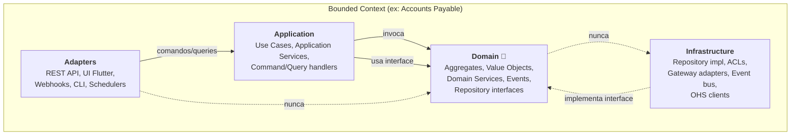

**Regra inviolável:** as setas só apontam para dentro. Domain não conhece infra. Application só conhece Domain. Adapters só conhecem Application.

### 6.2 Camada Application acima dos contextos

Sistemas reais sempre têm casos de uso multi-contexto. Cadastrar uma `ExpectedRecurringBill` exige validar classificação em Accounting + contrato em Contract Management. Esses casos de uso vivem em uma camada `application/` acima dos contextos (D-404).

```
src/
├── contexts/
│   ├── bill-ingestion/
│   │   ├── domain/
│   │   ├── application/   ← use cases internos do contexto
│   │   ├── infrastructure/
│   │   └── adapters/
│   ├── accounts-payable/
│   ├── payment-execution/
│   ├── contract-management/
│   ├── accounting/
│   └── cash-bank/
└── application/           ← orquestração entre contextos
    └── use-cases/
        ├── register-expected-recurring-bill/
        └── ...
```

Os contextos **não se conhecem entre si**. Quem orquestra é a camada de cima.

### 6.3 Comunicação entre contextos

Dois mecanismos, escolhidos por natureza:

- **Domain Events (assíncrono)** — default. Bill Ingestion publica `BillApproved`; Accounts Payable consome. Desacopla, permite resiliência, escala bem.
- **Open Host Service (síncrono)** — exceção. Quando uma consulta precisa de resposta imediata. Exemplos: Bill Ingestion consulta Accounts Payable via `ExpectationMatchingQuery` durante a extração; Accounts Payable consulta Accounting via `ClassificationCatalogQuery` ao validar cadastro.

### 6.4 Persistência

Cada bounded context com seu próprio schema (PostgreSQL com schemas separados). Isso preserva fronteira mesmo dentro de um banco único — nenhuma query cruza schemas, comunicação só via eventos/OHS.

---

## 7. Cenários de runtime

Os fluxos críticos do sistema. Cada um é um cenário concreto que valida o desenho.

### 7.1 Cenário principal — captura automática até pagamento

O caminho feliz que justifica todo o produto.

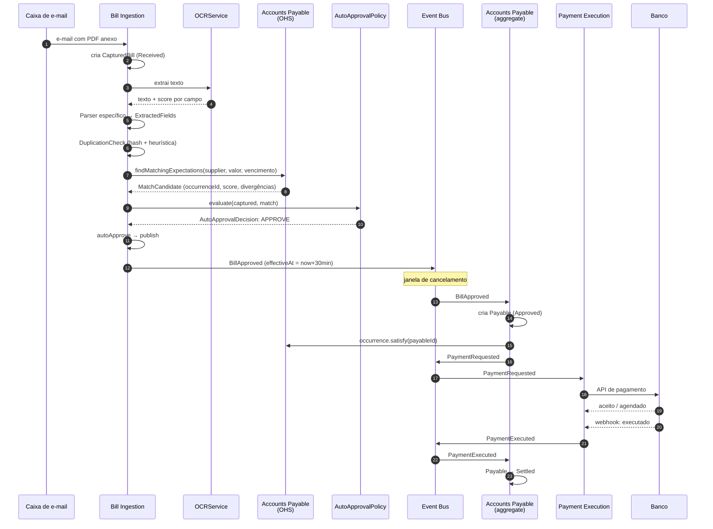

### 7.2 Cenário alternativo — captura com divergência (revisão humana)

Quando o automatismo encontra dúvida, o humano entra em cena de forma cirúrgica.

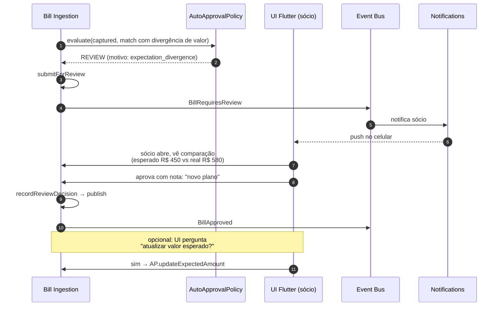

### 7.3 Cenário alternativo — expectativa expira sem captura

Quando a conta esperada não chega — falha do sistema ou exceção legítima.

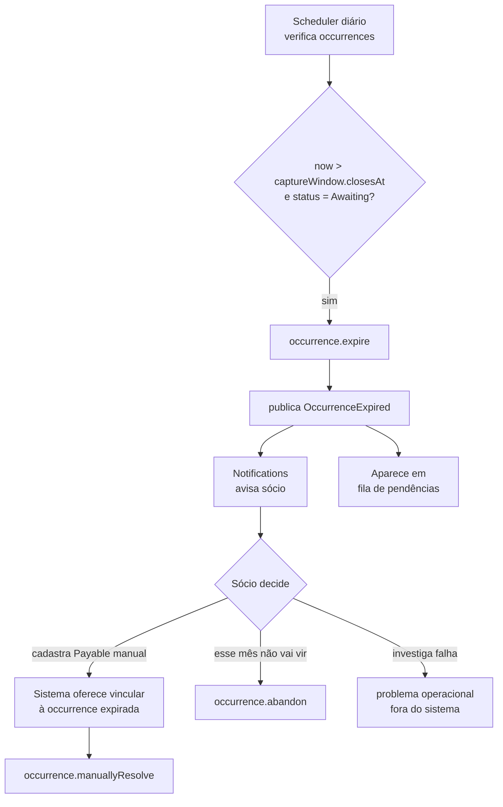

### 7.4 Casos de uso — visão de alto nível

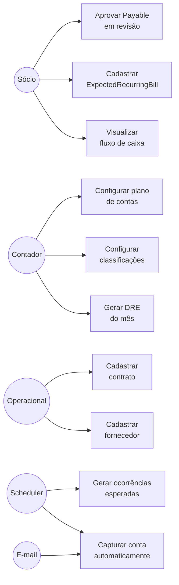

---

## 8. Conceitos transversais

Decisões que valem em mais de um contexto.

### 8.1 Identidade e tenant em todo lugar

Toda entidade carrega `tenantId`. Vem do JWT, **nunca** do payload. Repositórios base aplicam filtro automaticamente — código de domínio nem vê (D-400).

### 8.2 Idempotência por hash

Captura de e-mail roda a cada 5 min. Webhook do gateway pode chegar duas vezes. Cron pode rodar duas vezes. Toda operação que cria coisa precisa de chave de idempotência. A primeira linha de defesa é o **hash SHA-256 do RawDocument** (D-106). Para Payables, a chave é o `capturedBillId` (uma BillApproved só vira uma Payable, não importa quantas vezes o evento chegue).

### 8.3 Auditoria e Event Sourcing seletivo

Auditoria não é "feature" neste sistema — é **requisito de primeira classe**. Toda mudança de estado em qualquer aggregate precisa permitir responder: *quem fez, quando, por quê, e qual era o estado antes*. Esse princípio se traduz em duas estratégias complementares aplicadas conforme a natureza do aggregate.

#### Estratégia 1 — Aggregates + Event Sourcing (A+ES)

Para os aggregates onde a história importa tanto quanto o estado atual, aplicamos **A+ES** conforme descrito por Vernon (Apêndice A do livro, reproduzido no [Apêndice C](#apêndice-c--aggregates-and-event-sourcing-aes-vernon) deste documento). O estado é reconstruído replayando o stream de eventos do aggregate desde sua criação. O Event Store é append-only; nada é sobrescrito, nada é apagado.

A regra para escolher A+ES é direta: **aplicamos onde "voltar no tempo" tem valor de negócio ou compliance**. Isto vale para os aggregates do ciclo de obrigação financeira (auditoria fiscal, disputa, fraude, regulação), e não vale para catálogos e configurações (basta saber o estado atual).

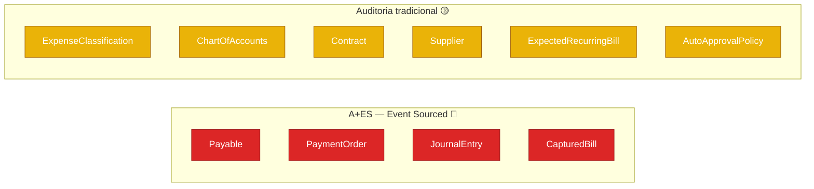

**Aggregates Event-Sourced** (decisão D-405):

| Aggregate | Por que merece A+ES |
|---|---|
| `Payable` | Núcleo da obrigação financeira. Auditoria fiscal exige reconstituir cada estado. Disputa com fornecedor exige saber exatamente quem aprovou e quando. |
| `PaymentOrder` | Pode ter N tentativas de pagamento, retries, falhas, conciliações tardias. A história de tentativas é informação de domínio, não detalhe técnico. |
| `JournalEntry` | Lançamento contábil, por definição, é registro histórico imutável. Estorno é novo lançamento, não edição. A+ES é a representação natural. |
| `CapturedBill` | Compliance: precisamos demonstrar de onde veio cada conta, qual parser extraiu, qual humano revisou, com qual confiança em cada momento. |

**Aggregates com auditoria tradicional** (snapshot + tabela de auditoria):

Para catálogos e configurações (`ExpenseClassification`, `ChartOfAccounts`, `Contract`, `Supplier`, `ExpectedRecurringBill`, `AutoApprovalPolicy`, etc.) usamos snapshot do estado atual + tabela de auditoria com diff por mudança. Saber "quem mudou o quê e quando" basta — não precisamos reconstruir o estado replayando eventos. Isso evita a complexidade de A+ES onde ela não traz benefício proporcional.

#### Estratégia 2 — Tabela de auditoria universal

Independente da estratégia de persistência, **toda** ação que modifica qualquer aggregate gera registro em tabela de auditoria com o seguinte schema mínimo:

| Campo | Significado |
|---|---|
| `auditId` | UUID do registro de auditoria |
| `tenantId` | Multi-tenant — sempre presente |
| `aggregateType` | "Payable", "ExpenseClassification", etc. |
| `aggregateId` | Id do aggregate alterado |
| `actorId` | UserId do humano OU SystemActorId (cron, scheduler, webhook) |
| `actorType` | `Human`, `Scheduler`, `Webhook`, `System` |
| `action` | Comando executado ("approve", "updateAmount", etc.) |
| `payload` | JSON do comando |
| `previousStateHash` | Hash do estado anterior (snapshot) |
| `newStateHash` | Hash do estado novo |
| `reason` | Justificativa textual (obrigatória em ações sensíveis) |
| `clientIp`, `userAgent` | Origem da ação |
| `correlationId` | Para rastrear ações encadeadas entre contextos |
| `occurredAt` | Timestamp UTC |

Para aggregates A+ES, essa tabela é **derivada** do Event Store (cada evento gera um registro de auditoria via projeção). Para os outros, é populada explicitamente pela camada de Application Service.

#### Princípios não-negociáveis

1. **Sem ações anônimas.** Toda mudança tem `actorId`. Schedulers e webhooks usam SystemActor com identidade própria — nunca null, nunca "system" genérico.
2. **Justificativa em ações sensíveis.** Auto-aprovação registra a regra que disparou. Aprovação humana registra nota livre opcional. Cancelamento e estorno exigem `reason` obrigatório.
3. **Append-only.** Registros de auditoria nunca são editados nem deletados. Se uma informação estava errada, novo registro corrige — antigo permanece.
4. **Correlação entre contextos.** `correlationId` propagado em eventos permite rastrear: "essa Payable veio dessa CapturedBill, que veio desse e-mail capturado em 14/10 às 09:23 pelo scheduler X".
5. **Retenção.** Registros de auditoria seguem prazo fiscal brasileiro (5 anos no mínimo, sendo mais conservador que o domínio fiscal exige).

### 8.4 Janela de cancelamento de auto-aprovação

Mesmo após `BillApproved`, há janela curta (proposto: 30 min) onde Accounts Payable ainda não processa. O evento carrega `effectiveAt = now + 30min`. Cancelamento publica `BillApprovalCancelled`. Proteção contra erro de regra sem precisar desfazer pagamento (D-107).

### 8.5 Money Value Object

Todo valor monetário é `Money(amount, currency)` — não float, não decimal solto. Operações aritméticas só entre mesma moeda. Multimoeda fica como evolução; modelagem desde já evita refactor.

### 8.6 LGPD e dados sensíveis

RawDocuments contêm CNPJ, valores, eventualmente dados pessoais. Storage encriptado em repouso. Acesso controlado por role. Política de retenção (proposto: 5 anos, alinhado com prazo fiscal).

### 8.7 Multi-tenancy lite

Discriminador `tenantId` no banco. Sem schemas separados, sem instâncias separadas. Adequado ao estágio atual; pode evoluir para schema-per-tenant quando o número de clientes/dados crescer (D-400).

---

## 9. Modelagem tática detalhada

Esta seção condensa o que está modelado em profundidade hoje. Para detalhamento exaustivo, ver os documentos por contexto (`01-bill-ingestion.md`, `02-expected-recurring-bills.md`, `03-expense-classification.md`).

### 9.1 Bill Ingestion — diagrama de classes

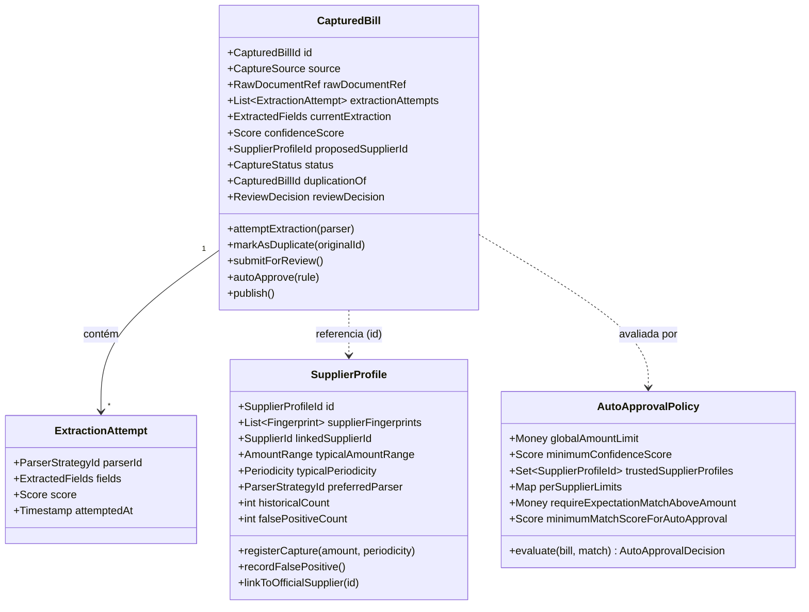

### 9.2 Bill Ingestion — diagrama de estados de `CapturedBill`

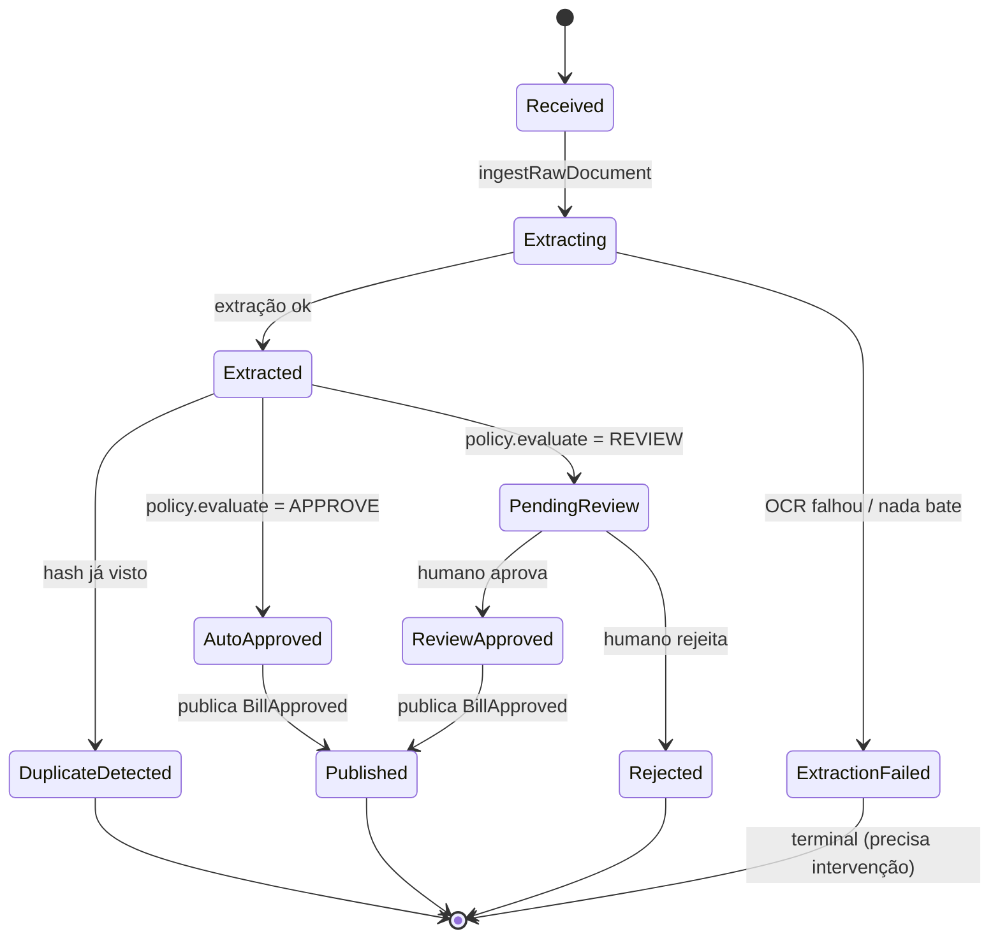

### 9.3 Expected Recurring Bills — modelo conceitual

Dois aggregates separados, conectados por id (D-201):

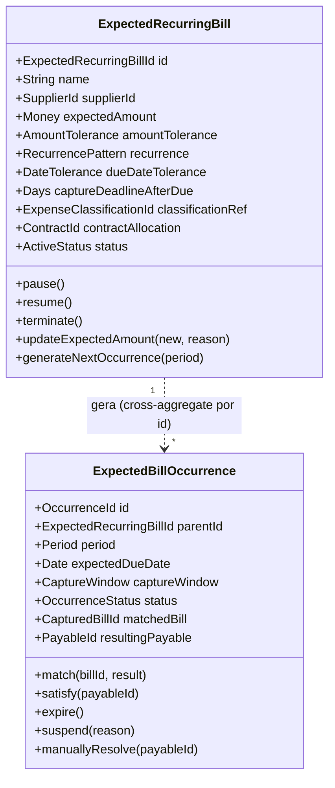

### 9.4 Expected Recurring Bills — estados de `ExpectedBillOccurrence`

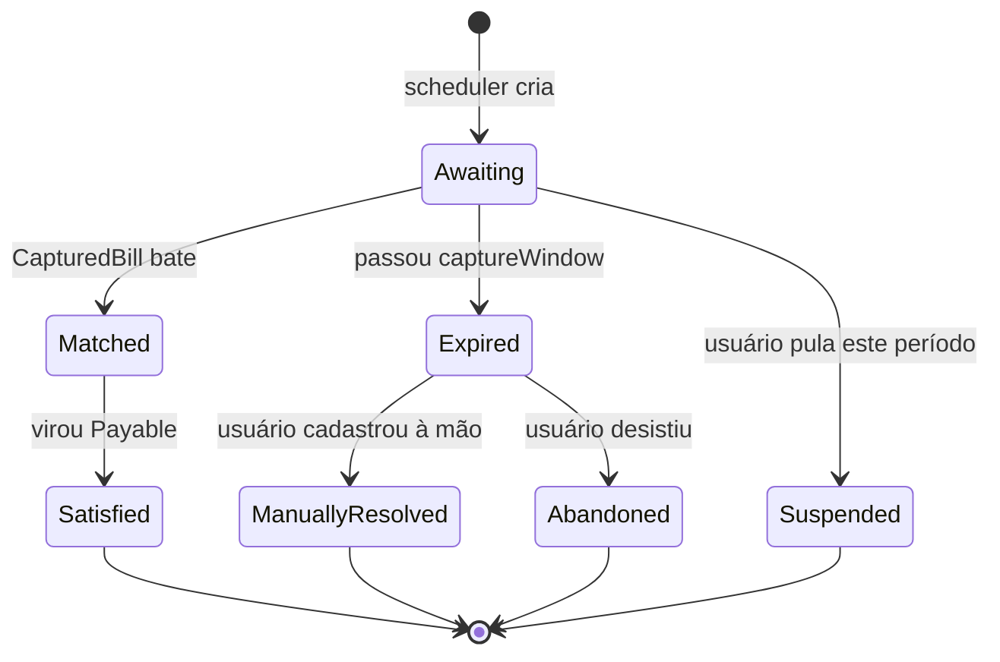

> **Por que separar `Matched` de `Satisfied`?** Entre os dois pode haver revisão humana. Match é "achei sua conta capturada"; satisfação é "a conta virou obrigação oficial". No fluxo automático, sequência rápida; no manual, há delay e o humano pode rejeitar (D-205).

### 9.5 Classificação contábil — visão de entidade-relacionamento

Como uma Payable recebe sua classificação atravessando três bounded contexts.

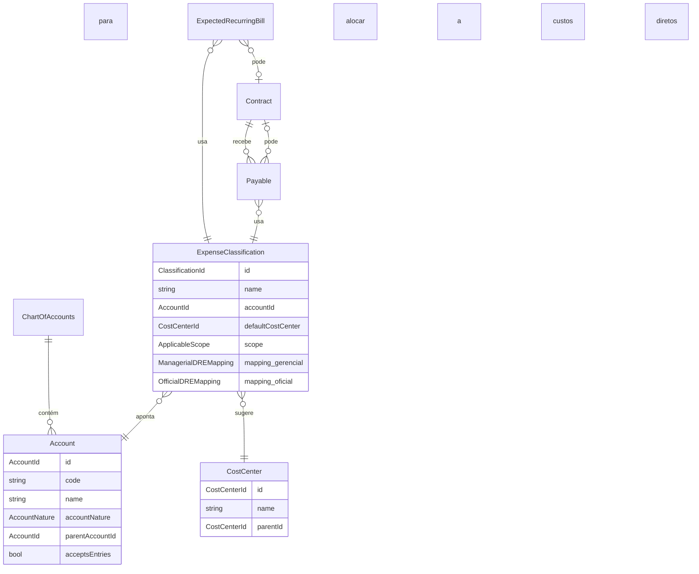

> A regra contábil derivada (D-304): Payable vinculada a contrato → classificação aponta para Account de natureza Cost. Sem contrato → pode ser Cost ou Expense conforme classificação. Sistema valida coerência.

### 9.6 Modos de alocação de custos

Quatro variantes coexistindo, escolhidas por despesa (D-307):

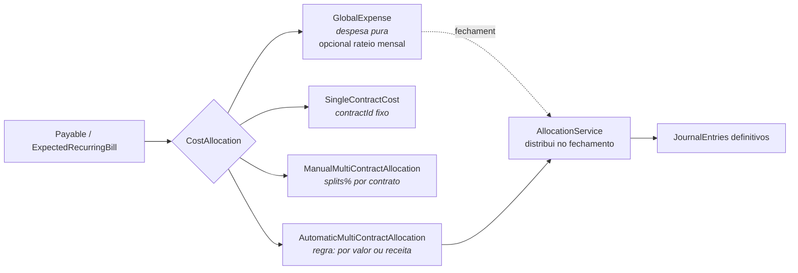

---

### 9.7 Tipologia de Payables — `PayableOrigin`

O aggregate `Payable` é único, com ciclo de estados único. O que muda é **de onde a Payable nasceu** e quais regras extras valem por causa disso. Isso é capturado por um discriminador `PayableOrigin` (D-110).

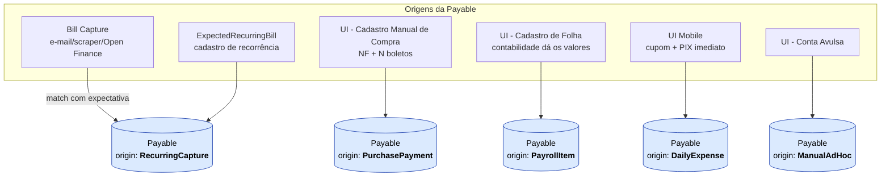

#### Características por origem

| Origin | Como nasce | Documentos obrigatórios | Timing default | Restrições |
|---|---|---|---|---|
| `RecurringCapture` | Bill Ingestion + match com expectativa, OU expectativa expirada + cadastro manual | Configurável no `ExpectedRecurringBill` (Boleto típico) + comprovante | Herdado do `ExpectedRecurringBill` | **Não aceita** `ManualDate` |
| `PurchasePayment` | Cadastro manual de Purchase (MVP) ou Procurement (futuro). 1 NF gera N Payables | NF + Boleto + comprovante | Vem do Procurement ou fallback `NearDueDate(-1)` | Aceita todas as 4 estratégias inclusive `ManualDate` |
| `PayrollItem` | Cadastro manual com dados da contabilidade. 1 item da folha = 1 Payable (salário João, VT João, FGTS mês) | Apenas comprovante | `NearDueDate(0)` ou `ManualDate` | Aceita `NearDueDate`, `WeeklyBatch`, `ManualDate` |
| `DailyExpense` | UI mobile: foto do cupom fiscal + classificação obrigatória | Cupom Fiscal + comprovante | `ImmediateOnApproval` (não-configurável) | Sempre PIX, sempre imediato. **Não aceita** `ManualDate` |
| `ManualAdHoc` | Cadastro avulso para casos não cobertos | Configurável + comprovante | Default do tenant | Aceita todas as 4 estratégias |

#### Atributos comuns vs. específicos

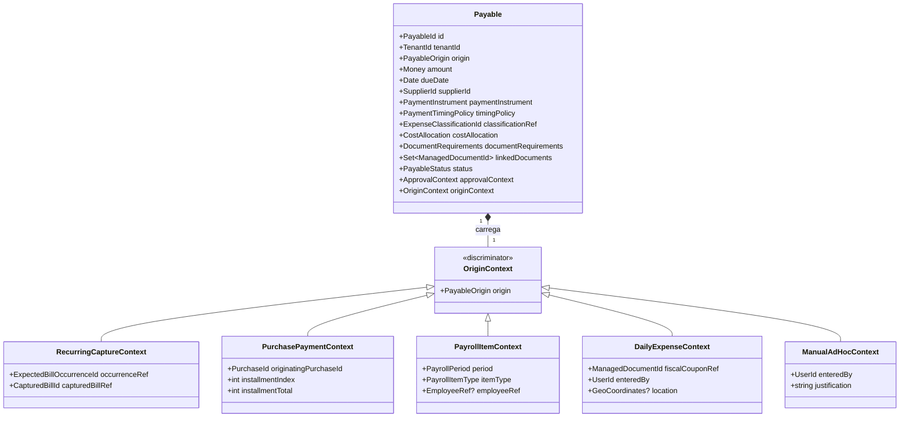

> **Por que um aggregate só com discriminador, em vez de 5 aggregates separados.** Preserva o ciclo único de obrigação financeira (Created → Approved → Scheduled → ... → Settled), mantém um único event stream A+ES por Payable, simplifica relatórios consolidados (DRE não precisa unir 5 tabelas) e reduz drasticamente o trabalho de modelagem. O custo é aceitar que `OriginContext` carrega campos opcionais por origem — vale a troca.

---

### 9.8 Política de Timing de Pagamento — `PaymentTimingPolicy`

Define **quando** uma Payable aprovada vai virar pagamento efetivo. É Value Object Strategy com 5 variantes (D-111).

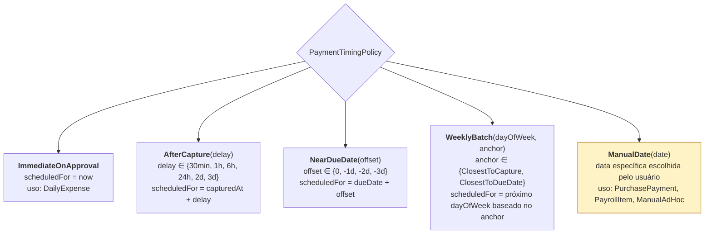

#### Compatibilidade com cada origem da Payable

| Origin | Immediate | AfterCapture | NearDueDate | WeeklyBatch | ManualDate |
|---|:-:|:-:|:-:|:-:|:-:|
| `RecurringCapture` | ❌ | ✅ | ✅ | ✅ | ❌ |
| `PurchasePayment` | — | ✅ | ✅ | ✅ | ✅ |
| `PayrollItem` | — | — | ✅ | ✅ | ✅ |
| `DailyExpense` | ✅ (forçado) | ❌ | ❌ | ❌ | ❌ |
| `ManualAdHoc` | — | ✅ | ✅ | ✅ | ✅ |

A restrição é invariante de domínio (D-111). Tentar criar Payable com origin/policy incompatível → falha na entrada.

#### Hierarquia de defaults

Quando uma Payable é criada, a política vem da primeira fonte que define (D-113):

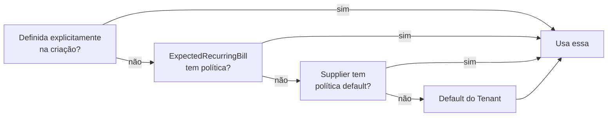

A política é **copiada** (não referenciada) para a Payable no momento da criação. Mudar a política do `ExpectedRecurringBill` depois afeta apenas próximas ocorrências — preserva auditoria histórica.

#### Invariante dura — `scheduledFor ≤ dueDate`

> Em **qualquer** estratégia, se o cálculo bater em data depois do vencimento, o sistema **ajusta automaticamente** para `dueDate` e **avisa** no dashboard ("agendamento ajustado por proximidade do vencimento") (D-112).

Para `ManualDate`, o ajuste é diferente: a entrada é **rejeitada** (o usuário escolheu uma data inválida — não cabe ajustar silenciosamente).

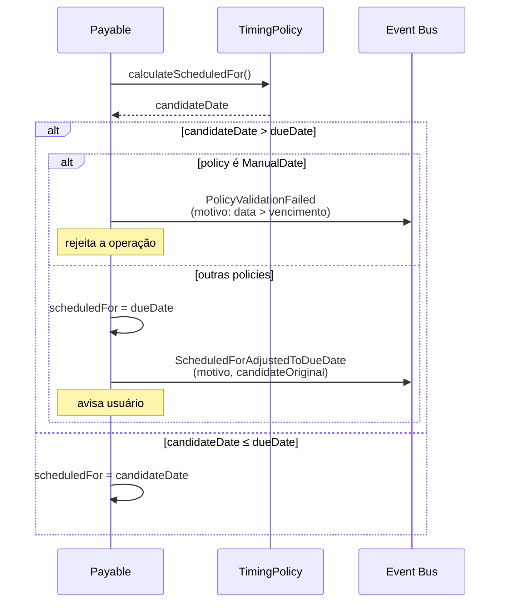

---

### 9.9 Camada de Aprovação de Pagamentos e Travas de Segurança

Esta camada é **opt-in por tenant** (D-121) e adiciona um segundo portão antes do pagamento efetivo. Não substitui a aprovação da captura (que continua em Bill Ingestion) — atua **depois** dela.

#### Visão geral dos dois portões

```mermaid
flowchart LR
    A[Captura] --> B{Portão 1<br/>Aprovação<br/>de Captura}
    B -->|aprovada| C[Payable<br/>Approved + Scheduled]
    C --> D{Portão 2<br/>Aprovação<br/>de Pagamento<br/>(opt-in)}
    D -->|aprovada<br/>OU isenta<br/>OU policy off| E[Pagamento]

    style B fill:#fef3c7,stroke:#a16207
    style D fill:#fef3c7,stroke:#a16207
```

#### `PaymentApprovalPolicy` — configuração por tenant

```
PaymentApprovalPolicy
├── enabled: bool                                    ← se false, fluxo passa direto
├── approvers: List<UserId>                          ← quem pode aprovar
├── exemptions:
│   ├── exemptIfScheduledWithin: Duration?           ← ex: 24h
│   ├── exemptIfImmediate: bool                      ← ex: DailyExpense isenta
│   └── exemptIfBelowAmount: Money?                  ← ex: < R$ 200
├── doubleApprovalThreshold: Money?                  ← T-05: acima exige 2 aprovadores
└── postApprovalCancellationWindow: Duration         ← T-07: ex: 5 min
```

#### Estado novo no ciclo da Payable

```mermaid
stateDiagram-v2
    [*] --> Created
    Created --> Approved: aprovação da Payable<br/>(humana ou auto)
    Approved --> Scheduled: scheduledFor calculado
    Scheduled --> AwaitingPaymentApproval: política exige<br/>e Payable não é isenta
    Scheduled --> ReadyToPay: policy off OU isenta
    AwaitingPaymentApproval --> AwaitingSecondApproval: T-05 disparou<br/>(valor alto)
    AwaitingSecondApproval --> ReadyToPay: 2º aprovador autoriza
    AwaitingPaymentApproval --> ReadyToPay: aprovador autoriza
    AwaitingPaymentApproval --> CancellationWindow: usuário cancela<br/>dentro de T-07
    CancellationWindow --> Cancelled: janela passa
    AwaitingPaymentApproval --> Cancelled: aprovador rejeita
    AwaitingPaymentApproval --> Expired: scheduledFor chegou<br/>sem aprovação
    ReadyToPay --> PaymentRequested: scheduledFor chega
    PaymentRequested --> Settled: PaymentExecuted
```

`Expired` por falta de aprovação **não tenta pagar** — segurança ganha de oportunidade. Sócio é notificado com urgência ("conta X vai vencer e não foi aprovada — decida").

#### Eventos novos publicados pela Payable

- `PaymentApprovalRequested(payableId, approverIds, deadline, amount)`
- `PaymentApproved(payableId, approverId, reason?)`
- `PaymentDoubleApprovalRequested(payableId, secondApproverIds)`
- `PaymentDoubleApproved(payableId, secondApproverId)`
- `PaymentRejected(payableId, approverId, reason)`
- `PaymentApprovalExpired(payableId)`
- `PaymentApprovalCancelled(payableId, cancellerId, reason)`

Tudo no event stream da Payable (que é A+ES). "Quem autorizou o pagamento de R$ X em DD/MM" sai natural da auditoria.

#### Travas de segurança do MVP

Oito travas modeladas. Cada uma é independente — todas valem simultaneamente, e qualquer uma exigindo aprovação extra dispara o portão.

| ID | Trava | Mecânica resumida |
|---|---|---|
| **T-01** | Limite individual por usuário | `User.maxPayableScheduleAmount` e `User.maxImmediatePaymentAmount`. Acima → exige aprovação extra (D-123) |
| **T-02** | Limite agregado por janela | `Tenant.maxDailyPaymentTotal`, `maxMonthlyPaymentTotal`, e versões por usuário. Atingido → fila de aprovação obrigatória mesmo se isenta (D-124) |
| **T-03** | Mudança de dados bancários | `paymentInstrument` diferente da última Payable paga do mesmo `Supplier` → força aprovação humana com `reason` obrigatório. Notificação destaca a mudança (D-125) |
| **T-04** | Whitelist de fornecedores | `Supplier.trustedForAutoPayment` (default false). Auto-pagamento só para `true`. Promoção manual pelo sócio depois de N pagamentos sem problema (D-126) |
| **T-05** | Two-person rule | Acima de `doubleApprovalThreshold` exige dois aprovadores diferentes em sequência (D-127) |
| **T-06** | Detecção de duplicata pré-pagamento | Antes do pagamento sair, verifica nos últimos N dias outras Payables com mesmo fornecedor + valor próximo + período próximo. Se sim, alerta (D-128) |
| **T-07** | Janela de cancelamento pós-aprovação | Após aprovação do pagamento, `postApprovalCancellationWindow` (default 5 min) onde ainda pode cancelar antes do gateway disparar (D-129) |
| **T-10** | Limite por categoria contábil | `maxMonthlyPerClassification` por tenant. Ex: "Marketing ≤ R$ 15.000/mês". Estouro → exige aprovação de override com justificativa (D-130) |

#### Qual trava dispara em qual cenário

```mermaid
flowchart TB
    P[Payable Scheduled<br/>chega no momento de pagar] --> Q1{Política de aprovação<br/>está ativa?}
    Q1 -->|não| GO[Pagamento direto]
    Q1 -->|sim| Q2{Isenta?<br/>< 24h OU<br/>< valor min OU<br/>imediata}
    Q2 -->|sim| Q3
    Q2 -->|não| AP[Exige aprovação humana]
    Q3{T-01<br/>excede limite<br/>individual?} -->|sim| AP
    Q3 -->|não| Q4{T-02<br/>excede limite<br/>agregado?}
    Q4 -->|sim| AP
    Q4 -->|não| Q5{T-03<br/>dados bancários<br/>mudaram?}
    Q5 -->|sim| AP
    Q5 -->|não| Q6{T-04<br/>fornecedor não<br/>está na whitelist?}
    Q6 -->|sim| AP
    Q6 -->|não| Q7{T-06<br/>possível duplicata?}
    Q7 -->|sim| AP
    Q7 -->|não| Q8{T-10<br/>estoura limite<br/>de categoria?}
    Q8 -->|sim| AP
    Q8 -->|não| GO

    AP --> Q9{T-05<br/>valor acima do<br/>double-approval?}
    Q9 -->|sim| AP2[Exige 2 aprovadores]
    Q9 -->|não| AP1[Aguarda 1 aprovador]
    AP1 --> CW[T-07: janela de cancelamento]
    AP2 --> CW
    CW --> GO
```

> Observação: a passagem por aprovação humana **acumula motivos**. Se T-03 + T-04 + T-10 disparam juntos, a notificação ao aprovador lista os três motivos para decisão informada.

---

### 9.10 Ciclo de vida da `Payable` — Substituição, Estorno e Falha de Gateway

Esta subseção fecha três cenários do ciclo de vida que o aggregate `Payable` precisa proteger: renegociação (qualquer mudança material), estorno (após pagamento), e falha de gateway (com transferência reativa de responsabilidade ao humano). As decisões D-131 a D-137 fixam o comportamento; aqui mostramos o desenho.

#### Padrão Substituição (D-134)

Aplica-se a **qualquer mudança material** em Payable não-paga: valor, vencimento, juros/multa, classificação relevante. **Nunca** edita-se in-place — sempre cancela a antiga e cria a nova com cadeia de rastreabilidade.

```mermaid
flowchart LR
    O["<b>Payable Original</b><br/>amount: R$ 500<br/>dueDate: 10/10<br/>status: Approved ou anterior"]
    O -->|"comando<br/>ReplacePayableWithSubstitution"| OC
    OC["<b>Payable Original</b><br/>status: <b>ReplacedBySubstitution</b><br/>replacedBy: → nova"]
    OC -.referencia.-> N["<b>Payable Nova</b><br/>originalAmount: R$ 500<br/>interest: R$ 20<br/>penalty: R$ 15<br/>effectiveAmount: R$ 535<br/>dueDate: 20/10<br/>substitutes: → original<br/>status: <b>Created</b><br/>substitutionType: LatePaymentAdjustment<br/>justificativa: 'atraso 10 dias'"]

    style OC fill:#fef3c7,stroke:#a16207
    style N fill:#dbeafe,stroke:#1e40af
```

**Por que `ReplacedBySubstitution` é distinto de `Cancelled`:** "cancelei porque desisti" e "substituí porque renegociei termos" são fatos diferentes. Métricas, relatórios e auditoria precisam separar.

**Por que a nova nasce em `Created`:** termos mudaram. Aprovação anterior valia para os termos antigos. Re-percorrer o ciclo é segurança contra "alguém troca a Payable já aprovada por outra com conta bancária diferente".

##### Tipos de substituição reconhecidos

| `substitutionType` | Quando |
|---|---|
| `ValueRenegotiation` | Fornecedor refez orçamento, valor mudou |
| `DueDateRenegotiation` | Acordo de adiar pagamento sem mudar valor |
| `LatePaymentAdjustment` | Boleto vencido, vem novo com juros/multa (manual) |
| `OtherRenegotiation` | Casos fora dos anteriores — exige justificativa robusta |

##### Evento publicado

```
PayableReplacedBySubstitution(
  originalPayableId,
  newPayableId,
  substitutionType,
  reason,           // texto livre obrigatório
  replacedBy,       // actorId — humano ou SystemActor
  occurredAt
)
```

##### Cadeia de substituição

A+ES (D-405) preserva a história inteira por construção. Read model derivado `PayableSubstitutionChain` reconstrói a linhagem para visualização:

```mermaid
flowchart LR
    P1["Payable 1<br/>R$ 500, dueDate 10/10<br/>ReplacedBySubstitution"]
    P2["Payable 2<br/>R$ 535 (com juros)<br/>dueDate 20/10<br/>ReplacedBySubstitution"]
    P3["Payable 3<br/>R$ 540 (juros maior)<br/>dueDate 25/10<br/>Settled ✅"]

    P1 -->|substituída por| P2
    P2 -->|substituída por| P3

    style P3 fill:#86efac,stroke:#15803d
```

Auditoria fiscal vê a história completa. Alguém perguntando "como esse boleto de R$ 540 surgiu" segue a linhagem até o R$ 500 original.

#### Estorno (D-133) — estado da existente

Estorno **não** segue o padrão de substituição. É continuação da história da mesma Payable, não uma Payable nova.

```mermaid
stateDiagram-v2
    Settled --> ReversalRequested: humano pede estorno<br/>(reason obrigatório)
    ReversalRequested --> Refunded: RefundReceived (Cash & Bank<br/>confirma dinheiro voltou)
    ReversalRequested --> Settled: estorno rejeitado pelo banco
    Refunded --> [*]
```

Lançamento contábil de estorno (débito/crédito reverso) é responsabilidade de **Accounting**, não da Payable. A Payable apenas publica `PayableRefunded` com enriquecimento — Accounting cuida do impacto contábil.

#### Falha de Gateway (D-137) — fallback reativo

Quando o gateway de pagamento falha repetidamente, a Payable não pode ficar presa em estado intermediário. A política é: **24h de retry automático ou até o vencimento (o que vier primeiro), depois transfere responsabilidade para o humano**.

```mermaid
stateDiagram-v2
    [*] --> ReadyToPay
    ReadyToPay --> PaymentRequested: scheduledFor chega
    PaymentRequested --> PaymentInProgress: gateway aceitou ordem
    PaymentInProgress --> Settled: PaymentExecuted (webhook)
    PaymentInProgress --> RetryPending: PaymentFailed (transitório)
    RetryPending --> PaymentInProgress: backoff:<br/>1min, 5min, 30min,<br/>1h, 2h, 4h, 8h, 12h
    RetryPending --> AwaitingExternalConfirmation: 24h sem sucesso<br/>OU vencimento chegou
    PaymentInProgress --> AwaitingExternalConfirmation: PaymentFailed permanente<br/>(gateway recusa)
    AwaitingExternalConfirmation --> Settled: ConfirmExternalPayment<br/>+ comprovante
    AwaitingExternalConfirmation --> Cancelled: humano cancela<br/>(reason obrigatório)
    Settled --> [*]
    Cancelled --> [*]
```

##### Backoff progressivo

```mermaid
flowchart LR
    F1["Falha 1<br/>00:00"] --> R1["Retry após 1min"]
    R1 --> F2["Falha 2"]
    F2 --> R2["Retry após 5min"]
    R2 --> F3["Falha 3"]
    F3 --> R3["Retry após 30min"]
    R3 --> Continue["...<br/>1h → 2h → 4h →<br/>8h → 12h"]
    Continue --> Stop{"24h passou<br/>OU vencimento<br/>chegou?"}
    Stop -->|sim| Trans["Transição para<br/>AwaitingExternalConfirmation"]
    Stop -->|não| RetryMore["Continua<br/>tentando"]
```

##### Invariante crítica: vencimento sempre vence

> Se a janela de retry de 24h ultrapassa `dueDate`, **a janela é truncada no `dueDate`** — o sistema interrompe os retries e dispara `AwaitingExternalConfirmation` antes do vencimento. Humano assume **antes** do prazo, não depois (D-112 + D-137).

Exemplo:
- `scheduledFor` = quinta-feira 14h
- `dueDate` = sexta-feira 23h59
- Gateway falha às 14h da quinta
- Janela completa de 24h iria até quinta-feira da semana seguinte? Não: trunca em sexta 23h59
- Por volta de sexta-feira tarde, sistema notifica sócio com urgência

##### Estado novo `AwaitingExternalConfirmation`

Comportamento neste estado:

| Aceita | Rejeita |
|---|---|
| `ConfirmExternalPayment(receiptDocument, paidAt, bankReference?)` | Retry automático (humano assumiu) |
| `CancelPayable(reason)` (decidiu não pagar, vai negociar) | `RequestPaymentApproval` (já está fora do fluxo automático) |
| `AttachDocument` (anexar mais comprovantes) | Edição de valor (caminho é substituição via D-134) |

##### Eventos publicados

- `PaymentAttempted(payableId, attemptNumber, error)` — interno, cada falha
- `PaymentRetryWindowExpired(payableId, totalAttempts, lastError, expiredReason: "24h" | "dueDate")` — interno, dispara transição
- `ExternalPaymentConfirmed(payableId, receiptDocument, paidAt, confirmedBy)` — publicado, vai para Accounting + Cash & Bank
- `ExternalPaymentDeclined(payableId, reason, decidedBy)` — publicado quando humano cancela em vez de pagar manual

#### Estados terminais consolidados

Depois das decisões D-131 a D-137, a `Payable` tem **quatro estados terminais distintos**:

| Estado | Significado | Como chega |
|---|---|---|
| `Settled` | Pagamento concluído (gateway OU manual confirmado) | PaymentExecuted ou ConfirmExternalPayment |
| `Cancelled` | Decidi não pagar | CancelPayable em qualquer estado pré-Settled |
| `ReplacedBySubstitution` | Termos mudaram, nova Payable assume | ReplacePayableWithSubstitution (D-134) |
| `Refunded` | Foi paga e foi estornada | PayableRefunded após RefundReceived (D-133) |

Métricas de relatório separam os quatro — agrupar `Cancelled` com `ReplacedBySubstitution` distorce análise.

---

### 9.11 Payment Execution — `PaymentOrder` e fluxos críticos

Esta subseção modela os fluxos centrais do bounded context Payment Execution, que estava "⚪ Apenas mencionado" até a sessão de decisões D-146 a D-154. O foco aqui é **estrutural** — o aggregate `PaymentOrder` em alto nível, seus estados, e três sequências críticas. Modelagem fina (atributos, comandos, eventos completos) vem na próxima rodada.

#### 9.11.1 Diagrama de estados de `PaymentOrder`

```mermaid
stateDiagram-v2
    [*] --> Created: PaymentRequested<br/>(de Accounts Payable)
    Created --> Sending: PE inicia chamada<br/>ao gateway
    Sending --> Sent: gateway respondeu ack
    Sending --> RetryPending: falha transitória<br/>(timeout, 5xx)
    Sending --> AwaitingExternalConfirmation: falha permanente<br/>(D-149)
    RetryPending --> Sending: backoff<br/>(D-149)
    RetryPending --> AwaitingExternalConfirmation: 24h ou vencimento<br/>(D-137)

    Sent --> Scheduled: gateway agenda<br/>para data futura (D-148)
    Scheduled --> Executed: webhook<br/>PaymentExecuted
    Sent --> Executed: pagamento imediato<br/>(scheduledFor = now)

    Scheduled --> CancellationPending: cancel solicitado<br/>(T-07 ou D-152)
    Sent --> CancellationPending: cancel solicitado
    CancellationPending --> Cancelled: gateway confirma<br/>cancelamento
    CancellationPending --> Executed: gateway recusa<br/>(já executou) → D-133
    CancellationPending --> CancellationFailed: not_supported<br/>(provedor não permite)

    Executed --> [*]
    Cancelled --> [*]
    AwaitingExternalConfirmation --> [*]
    CancellationFailed --> [*]
```

##### Notas sobre estados-chave

| Estado | Por que existe |
|---|---|
| `Sending` | **Estado da idempotência (D-151).** Significa "chamei o gateway, esperando resposta". Se PE crasha aqui, ao recuperar consulta gateway com Idempotency-Key e descobre se a chamada foi recebida. |
| `Sent` | Gateway respondeu ack mas pagamento ainda não executou (ou está agendado). |
| `Scheduled` | Provedor aceitou agendamento futuro (D-148). Cancelamento ainda possível via D-153. |
| `RetryPending` | Falha transitória — vai voltar para `Sending` após backoff (D-149). |
| `CancellationPending` | Cancelamento solicitado, esperando resposta do gateway (D-153). Bloqueante para D-152. |
| `AwaitingExternalConfirmation` | Esgotou retry de 24h ou erro permanente. Sócio assume — comportamento detalhado em §9.10. |

#### 9.11.2 Fluxo de obtenção do comprovante

```mermaid
stateDiagram-v2
    [*] --> NotApplicable: PaymentOrder<br/>antes de Executed
    NotApplicable --> PendingFromGateway: PaymentExecuted<br/>(D-150)
    PendingFromGateway --> Obtained: gateway entrega<br/>antes de 3 dias
    PendingFromGateway --> AwaitingUserUpload: timeout 3 dias
    AwaitingUserUpload --> ManuallyUploaded: usuário invoca<br/>AttachPaymentReceiptManually

    Obtained --> [*]: terminal
    ManuallyUploaded --> [*]: terminal

    note right of PendingFromGateway
        Retry com backoff:
        +1h, +6h, +24h, +48h, +72h
        Notificação informativa após 3ª falha
        Notificação acionável após timeout
    end note
```

##### Exclusividade dos estados terminais

`Obtained` e `ManuallyUploaded` são **mutuamente exclusivos** (D-150). A Payable carrega exatamente um `paymentReceipt: ManagedDocumentId?` — nunca dois. Sistema rejeita `AttachPaymentReceiptManually` enquanto estado é `PendingFromGateway` (a menos que usuário invoque `AbortReceiptRetryAndUploadManually(reason)` — exige justificativa).

##### Sequência completa do retry

```mermaid
sequenceDiagram
    autonumber
    participant PE as Payment Execution
    participant GW as Gateway
    participant DV as Document Vault
    participant Notif as Notifications
    participant UI as Sócio (UI)

    PE->>PE: PaymentExecuted recebido<br/>status: PendingFromGateway
    PE->>GW: getReceipt(orderId)
    GW-->>PE: erro/indisponível
    Note over PE: aguarda +1h
    PE->>GW: getReceipt(orderId)
    GW-->>PE: erro/indisponível
    Note over PE: aguarda +6h
    PE->>GW: getReceipt(orderId)
    GW-->>PE: erro/indisponível
    PE->>Notif: comprovante pendente
    Notif-->>UI: notificação informativa
    Note over PE: aguarda +24h
    PE->>GW: getReceipt(orderId)
    alt sucesso
        GW-->>PE: comprovante PDF
        PE->>DV: salva ManagedDocument<br/>tipo PaymentReceipt
        PE->>PE: status: Obtained ✅
    else falha continuada após 3 dias
        PE->>PE: status: AwaitingUserUpload
        PE->>Notif: timeout — usuário deve agir
        Notif-->>UI: notificação acionável
        UI->>PE: AttachPaymentReceiptManually(receipt)
        PE->>DV: salva ManagedDocument<br/>tipo PaymentReceipt<br/>source: manual
        PE->>PE: status: ManuallyUploaded ✅
    end
```

#### 9.11.3 Sequência de substituição com bloqueio síncrono (D-152)

Cenário crítico: usuário substitui Payable enquanto PE pode já ter enviado ordem ao gateway. AP **bloqueia** até confirmação.

```mermaid
sequenceDiagram
    autonumber
    participant UI as UI (Sócio)
    participant AP as Accounts Payable<br/>(aggregate Payable original)
    participant Bus as Event Bus
    participant PE as Payment Execution
    participant GW as Gateway

    UI->>AP: ReplacePayableWithSubstitution(originalId, newData, reason)
    AP->>AP: original.requestSubstitution()<br/>status: <b>AwaitingPaymentCancellation</b>
    AP->>Bus: PayableSubstitutionRequested(originalId)
    Bus->>PE: PayableSubstitutionRequested
    
    alt PaymentOrder em Created/Sending
        PE->>PE: cancela ordem local
        PE->>Bus: PaymentOrderCancelled(payableId)
    else PaymentOrder em Sent/Scheduled
        PE->>PE: status: CancellationPending
        PE->>GW: cancel(orderId)
        alt Gateway aceita
            GW-->>PE: cancelled
            PE->>PE: status: Cancelled
            PE->>Bus: PaymentOrderCancelled(payableId)
        else Gateway recusa (already_executed)
            GW-->>PE: declined
            PE->>PE: status: Executed (continua)
            PE->>Bus: PaymentOrderCancellationFailed<br/>(reason: already_executed)
        else not_supported
            PE->>Bus: PaymentOrderCancellationFailed<br/>(reason: not_supported)
        end
    else PaymentOrder em Executed
        PE->>Bus: PaymentOrderCancellationFailed<br/>(reason: already_paid)
    end
    
    Bus->>AP: resposta do PE
    
    alt Cancelamento confirmado
        AP->>AP: original.confirmSubstitution(newData)<br/>status: ReplacedBySubstitution<br/>cria nova Payable em Created
        AP->>Bus: PayableReplacedBySubstitution
        AP-->>UI: substituição completa ✅
    else Cancelamento falhou (executed/not_supported)
        AP->>AP: original.abortSubstitution(reason)<br/>volta ao status anterior
        AP->>Bus: PayableSubstitutionAborted
        AP-->>UI: ❌ não pôde substituir<br/>(encaminha para fluxo de estorno D-133<br/>se already_paid)
    end
```

##### Comportamento de `AwaitingPaymentCancellation`

Estado novo na Payable original durante substituição:

| Comando | Aceito? |
|---|---|
| `ReplacePayableWithSubstitution` (outra) | ❌ — uma substituição em curso por vez |
| `ApprovePayment` / `CancelPayable` (manual) | ❌ — fluxo dedicado em andamento |
| `EditAnything` | ❌ — congelado |
| `confirmSubstitution(newData)` (interno do subscriber) | ✅ |
| `abortSubstitution(reason)` (interno do subscriber) | ✅ |

UI mostra "Aguardando cancelamento do pagamento agendado..." — tipicamente segundos. Em demora >30s, mostra notificação informativa.

#### 9.11.4 Estrutura externa do `PaymentInstrument`

Conforme D-147 (retificado na Sprint 12.A), **quatro variantes seladas** no MVP, organizadas em uma hierarquia com um abstract intermediário `SupplierTransferInstrument` que carrega snapshot do fornecedor (`LegalName` + `TaxId`):

```mermaid
classDiagram
    class PaymentInstrument {
        <<abstract sealed VO>>
        +PaymentMethod Method
    }

    class SupplierTransferInstrument {
        <<abstract>>
        +LegalName SupplierLegalName
        +TaxId SupplierTaxId
    }

    class SupplierPixTransferInstrument {
        +PixKey PixKey
    }

    class SupplierBankTransferInstrument {
        +String BankCode
        +String Branch
        +String AccountNumber
        +BankAccountType AccountType
    }

    class DynamicPixInstrument {
        +EmvPayload Payload
    }

    class BankSlipInstrument {
        +BarcodeDigits Barcode
    }

    PaymentInstrument <|-- SupplierTransferInstrument
    SupplierTransferInstrument <|-- SupplierPixTransferInstrument
    SupplierTransferInstrument <|-- SupplierBankTransferInstrument
    PaymentInstrument <|-- DynamicPixInstrument
    PaymentInstrument <|-- BankSlipInstrument
```

`PaymentMethod` (Smart Enum, 3 valores): `SupplierTransfer` (cobre Pix e Bank variants — PSP decide canal); `DynamicPix`; `BankSlip`.

VOs auxiliares (todos em `AccountsPayable.Domain.Payables.ValueObjects`):
- `EmvPayload` — string EMV BR Code, valida CRC16-CCITT-FALSE + prefixo `000201`.
- `BarcodeDigits` — 44 dígitos do boleto + DV mod-11 na posição 5. **Forma canônica** do boleto no `BankSlipInstrument`; expõe `ToDigitableLine()` que deriva os 47 dígitos da linha digitável (3 DVs mod-10 nos campos 1–3).
- `DigitableLine` — 47 dígitos da linha digitável (representação humano-legível). Tipo standalone para parse de input do usuário; **não vive no `BankSlipInstrument`** (derivado do `BarcodeDigits` via método de instância — evita redundância de estado).

Snapshot bancário (LegalName, TaxId, BankCode/Branch/Account/Type ou PixKey) é **congelado na criação do Payable** e não relê o Supplier na execução. Para auditoria de divergência futura, o Domain Service `OutdatedInstrumentDetector` compara snapshot×Supplier atual e emite `PayableInstrumentOutdated` via `Payable.FlagInstrumentOutdated`.

Para Payables vindas de **captura** (origin `RecurringCapture` com Bill Ingestion), o `PaymentInstrument` vem da extração (D-139, com prioridade QR → boleto). Para outras origens, vem do cadastro manual.

---

## 10. Registro de decisões (ADRs)

Decisões tomadas em ordem cronológica, com numeração estável. Não revisitar sem motivo forte. Cada ADR captura a essência: o que foi decidido e **por que**.

### 10.1 Decisões estratégicas (D-001 a D-099)

| ID | Decisão | Por quê |
|---|---|---|
| **D-001** | Sistema dividido em 7 bounded contexts | Naturezas muito diferentes (operacional, transacional, analítico). Modelo único viraria Big Ball of Mud. Cada contexto tem sua linguagem e suas forças. |
| **D-002** | Bill Ingestion separado de Accounts Payable | Confiança/score da extração probabilística não pertence ao mundo da obrigação financeira auditável. |
| **D-003** | Payment Execution separado de Accounts Payable | Uma Payable pode ter N tentativas de pagamento (retry, falha de gateway). Modelar junto bagunçaria os dois ciclos de vida. |
| **D-004** | ExpectedRecurringBill mora em Accounts Payable | É decisão financeira (orçamento, fluxo projetado, DRE projetada). Bill Ingestion apenas consulta via OHS. |
| **D-005** | Monolito modular primeiro | Distribuído paga complexidade alta sem ganho. Extrai quando algum contexto precisar escalar diferente. |

### 10.2 Decisões de Bill Ingestion (D-100 a D-199)

| ID | Decisão | Por quê |
|---|---|---|
| **D-100** | Fontes do MVP: e-mail, upload, scraping, Open Finance. Excluído: WhatsApp | Cobre os canais reais do cliente. WhatsApp tem complexidade (API oficial cara, terceiros frágeis) sem ganho proporcional. ⚠️ **Retificado por D-138 (30/04/2026):** Open Finance saiu do MVP por custo de implementação. Fontes do MVP ficaram apenas: e-mail, upload e scraping. |
| **D-101** | Extração inicial: OCR + parser regex por fornecedor | Mais barato. Aceita-se fragilidade. Interface `ParserStrategy` permite trocar por LLM depois sem mexer no domain. |
| **D-102** | Auto-aprovação condicional | Automação total é arriscada (fatura fraudulenta, erro de parser, duplicidade). Revisão humana é o ponto de proteção. |
| **D-103** | Três aggregates: CapturedBill, SupplierProfile, AutoApprovalPolicy | Cada um tem ciclo de vida e razões de mudar diferentes. |
| **D-104** | SupplierProfile separado do Supplier oficial | São conceitos diferentes — um é aprendizado de captura, outro é cadastro mestre. |
| **D-105** | Adapters de captura ficam fora do domain | Hexagonal Architecture. Trocar de provedor não pode tocar no domain. |
| **D-106** | Hash SHA-256 do RawDocument como chave de idempotência | Primeira linha de defesa contra reentrega de e-mail, scraper rodando 2x, upload duplicado, webhook duplicado. |
| **D-107** | Janela de cancelamento pós auto-aprovação (sugerido 30min) | Proteção contra erro de regra sem precisar desfazer pagamento. |

### 10.3 Decisões de Expected Recurring Bills (D-200 a D-299)

| ID | Decisão | Por quê |
|---|---|---|
| **D-200** | Captura é sempre obrigatória — expectativa nunca gera Payable sozinha | Sem código de barras/PIX vindo da conta, não há como pagar. Simplifica enormemente o modelo: expectativa é sempre passiva. |
| **D-201** | Dois aggregates: ExpectedRecurringBill (regra) e ExpectedBillOccurrence (instância) | Cada ocorrência tem ciclo de vida próprio. Manter como entidade interna cresceria sem limite. |
| **D-202** | Expectativa expirada sem captura → notifica usuário | Pode ser falha real de captura. Usuário precisa saber para agir. |
| **D-203** | Tolerância configurada por expectativa | Energia varia muito mais que aluguel. Padrão global rígido não reflete realidade. |
| **D-204** | Match parcial é estado válido (não "sem match") | Esconder divergência sem destaque é fonte de erro. UI destaca o que divergiu para decisão informada. |
| **D-205** | Separar `match` de `satisfy` | Entre os dois pode haver revisão humana. Sequência rápida no automático, com delay no manual. |

### 10.4 Decisões de Classificação Contábil (D-300 a D-399)

| ID | Decisão | Por quê |
|---|---|---|
| **D-300** | ExpenseClassification é catálogo independente reutilizável | Evita duplicação, contador organiza catálogo, viabiliza relatórios consolidados. |
| **D-301** | Contas eventuais usam o mesmo catálogo | Universalidade simplifica modelo e UX. |
| **D-302** | Classificação separada de vínculo com contrato | Categoria contábil é uma dimensão; alocação a contrato é outra. Padrão de mercado em ERPs brasileiros. |
| **D-303** | Custo vs despesa é propriedade da Account, não da Payable | Reflete realidade contábil — definição é da conta, não do uso. |
| **D-304** | Regra derivada (Brasil): Payable com contrato → conta de Cost | Definição contábil brasileira: gasto associado a contrato gerador de receita = custo do serviço prestado. |
| **D-305** | DRE Gerencial e DRE Oficial coexistem | Dono opera no gerencial; contador opera no oficial. Não duplica lançamentos — duplica apresentação. |
| **D-306** | DRE Gerencial com 2 níveis fixos (categoria + subcategoria) | Cobre vasta maioria dos casos. Hierarquia recursiva fica como evolução futura. |
| **D-307** | Quatro modos de alocação coexistindo | Captura todos os cenários reais. Usuário escolhe por despesa. |
| **D-308** | Contract define política de rateio automático preferida | Política do contrato é estável; despesa muda toda hora. Evita decidir conta por conta. |
| **D-309** | Análise de margem por contrato é requisito de primeira classe | Responde a pergunta crítica do dono ("esse contrato dá lucro?"). Provavelmente o relatório mais consultado. |

### 10.5 Decisões transversais (D-400 a D-499)

| ID | Decisão | Por quê |
|---|---|---|
| **D-400** | Multi-tenancy lite (tenantId no DB) | Simplicidade adequada ao estágio. JWT carrega tenantId. Repositórios base filtram automático. |
| **D-401** | Validação cruzada no Application Service | Aggregates não devem conhecer outros contextos. Application Service é onde casos multi-contexto vivem legitimamente. |
| **D-402** | Eventual consistency entre contextos via Domain Events | Desacopla, permite resiliência, é o padrão recomendado por Vernon. |
| **D-403** | Open Host Services para queries cross-context | Published Language formaliza o contrato. Consumidores não tocam no modelo interno. |
| **D-404** | Camada Application acima dos contextos | Sistemas reais sempre têm casos multi-contexto. Application é onde eles vivem sem violar fronteiras. |
| **D-405** | A+ES seletivo: aplicado em `Payable`, `PaymentOrder`, `JournalEntry`, `CapturedBill` | Esses aggregates são o ciclo da obrigação financeira. Auditoria fiscal, disputa, fraude e regulação exigem reconstituir o estado em qualquer momento do tempo. Vernon (Apêndice A) recomenda A+ES para modelos complexos do Core onde a história tem valor de negócio — exatamente o caso. Nos demais (catálogos, configurações), snapshot + tabela de auditoria basta. |
| **D-406** | Auditoria universal com `actorId` obrigatório e justificativa em ações sensíveis | Sem ações anônimas. Schedulers e webhooks usam SystemActor com identidade própria. Cancelamento, estorno e mudanças de configuração exigem `reason`. Correlação entre contextos via `correlationId` permite rastrear cadeias de causa. Append-only — registros nunca editados. |

---

### 10.6 Decisões de Accounts Payable, Documentos e Compras (D-110 a D-199)

Esta faixa cobre as decisões tomadas para preparar o módulo Contas a Pagar do MVP — tipologia da Payable, política de timing, camada de aprovação, travas de segurança, arquivamento de documentos, contratos com vencimento e Procurement futuro.

> **Sobre a numeração:** D-100 a D-107 são de Bill Ingestion (já usados em §10.2). A partir de D-110, abrimos uma faixa para Accounts Payable e tópicos relacionados ao ciclo de pagamento.

| ID | Decisão | Por quê |
|---|---|---|
| **D-110** | Discriminador `PayableOrigin` em `Payable` com 5 variantes (`RecurringCapture`, `PurchasePayment`, `PayrollItem`, `DailyExpense`, `ManualAdHoc`) | Um aggregate só preserva o ciclo único de obrigação financeira (já é A+ES — D-405). Discriminador captura a faceta "de onde nasceu" sem fragmentar o aggregate. Relatórios consolidados ficam triviais. |
| **D-111** | `PaymentTimingPolicy` como Strategy com 5 variantes (`ImmediateOnApproval`, `AfterCapture(delay)`, `NearDueDate(offset)`, `WeeklyBatch(day, anchor)`, `ManualDate(date)`). Compatibilidade restrita por origin | Cobre as três famílias de comportamento que o cliente real usa (pagar logo, pagar perto do vencimento, lote semanal) mais data específica para casos manuais. Restrição por origin protege previsibilidade do fluxo de caixa de contas recorrentes. |
| **D-112** | Invariante dura: `scheduledFor ≤ dueDate` sempre. Outras estratégias ajustam silenciosamente; `ManualDate` rejeita entrada inválida | Pagar conta depois do vencimento gera juros e dano operacional. Sistema nunca pode atravessar essa linha sozinho. Diferença de comportamento entre estratégias: nas automáticas o ajuste é melhor que falhar; em `ManualDate` o usuário está escolhendo explicitamente — falhar é dar feedback. |
| **D-113** | Hierarquia de defaults de timing: Payable explícita → ExpectedRecurringBill → Supplier → Tenant | Permite configuração granular onde importa, com fallback sensato. Política copiada (não referenciada) na criação da Payable preserva auditoria histórica de mudanças. |
| **D-114** | Bounded Context novo `Document Vault` para arquivamento unificado | Boletos, NFs, NFS-e, contratos, comprovantes e cupons fiscais são capacidade transversal usada por todos os contextos. Modelar dentro de cada um geraria duplicação. Centralizar permite indexação, política de retenção única, busca consolidada. |
| **D-115** | `DocumentRequirements` por Payable com defaults por origin. Três fases: `requiredOnApproval`, `requiredAfterPayment`, `requiredAfterDelivery` | Diferentes tipos de Payable têm necessidades documentais diferentes. Defaults por origin reduzem cliques; configuração permite override. Comprovante de pagamento sempre obrigatório (auditoria). |
| **D-116** | Múltiplos boletos da mesma compra = N Payables independentes ligadas por `originatingPurchaseId`. Cancelar Purchase cancela apenas Payables não-pagas | Cada parcela tem seu vencimento, seu pagamento, seu eventual atraso. Modelar como entidades separadas reflete a realidade. Estorno de parcela já paga é problema operacional caso a caso (sistema não estorna sozinho). |
| **D-117** | Bounded Context `Procurement` registrado como futuro com interface conhecida (`PurchaseApproved` → AP). No MVP, "cadastro manual de Purchase" mora dentro de Accounts Payable | Permite começar sem o módulo completo de compras, sem refactor traumático quando ele existir. Interface estável reduz risco. |
| **D-118** | `Contract` com ciclo `Active → ExpiringSoon → Expired/Renewed/Terminated`. Renovação **não edita** o contrato; cria novo apontando `replacedBy` para o anterior | Preserva história contratual completa (auditoria, disputa). Notificação obrigatória ao entrar em `ExpiringSoon` (janela `renewalAlertDays`, default 60). Vencimento **só notifica**, nunca bloqueia novas Payables vinculadas (decisão explícita do cliente — operação não pode parar). |
| **D-119** | `RecurrencePattern` como Strategy com `WeeklyRecurrence`, `MonthlyRecurrence`, `SemiAnnualRecurrence`, `AnnualRecurrence`, `CustomRecurrence` | Cobre casos reais (semanal, mensal, semestral, anual). `Custom` para casos exóticos (IPVA, IPTU parcelado). Modelar como Strategy desde já evita refactor doloroso. |
| **D-120** | `ManagedDocument` em Document Vault referencia entidades por id (`linkedTo: List<DocumentLink>`). `RawDocument` em Bill Ingestion vira caso especial promovido para `ManagedDocument` quando aprovado | Mesma evidência (boleto) pode estar ligada à CapturedBill (origem) e à Payable (destino). Lista de links permite isso sem duplicar arquivo. Promoção evita duplicar storage. |
| **D-121** | Camada de Aprovação de Pagamentos via `PaymentApprovalPolicy` — opt-in por tenant | Segurança extra para clientes que querem dois portões (aprovar a captura E aprovar o pagamento). Quem não quer mantém fluxo atual sem fricção. |
| **D-122** | Estado novo `AwaitingPaymentApproval` no ciclo da Payable, mais `AwaitingSecondApproval` para casos de double approval | Modela explicitamente a pausa entre agendamento e pagamento. `Expired` por falta de aprovação não tenta pagar — segurança ganha de oportunidade. |
| **D-123** | T-01 — Limites individuais por usuário: `maxPayableScheduleAmount` e `maxImmediatePaymentAmount` | Defesa contra erro humano e contra conta comprometida. Cada usuário tem teto natural. Acima → exige aprovação extra mesmo se a política geral não exigiria. |
| **D-124** | T-02 — Limites agregados por janela: `maxDailyPaymentTotal` e `maxMonthlyPaymentTotal` por tenant e por usuário | Atacante pode fragmentar para fugir do limite individual (D-123). Limites agregados fecham essa porta. Atingido → próximas Payables vão para fila de aprovação obrigatória mesmo se isentas. |
| **D-125** | T-03 — Mudança de `paymentInstrument` em relação à última Payable paga do mesmo `Supplier` força aprovação humana com `reason` obrigatório | Cenário clássico de fraude: e-mail falso "novo PIX". Esta trava sozinha previne a maioria dos golpes de fatura falsa. Notificação destaca a mudança. |
| **D-126** | T-04 — `Supplier.trustedForAutoPayment` (default false). Auto-pagamento só para fornecedores promovidos manualmente pelo sócio | Whitelist explícita. Mais forte que `SupplierProfile.trustedSupplierProfiles` (D-102) que governa **aprovar a captura**; T-04 governa **disparar o pagamento**. |
| **D-127** | T-05 — Two-person rule acima de `doubleApprovalThreshold` (configurável por tenant) | Padrão em PMEs com sócio + responsável financeiro. Reduz risco de fraude interna em valores altos. Sequência: 1º aprova → notifica 2º → 2º confirma → pagamento sai. |
| **D-128** | T-06 — Detecção de duplicata pré-pagamento (mesmo fornecedor + valor próximo + período próximo nos últimos N dias) | Bill Ingestion já detecta duplicata na captura (D-106). T-06 detecta no pagamento — pega casos como conta cadastrada manual + capturada, ou boleto duplicado pelo fornecedor. Não bloqueia, alerta para confirmação. |
| **D-129** | T-07 — Janela de cancelamento pós-aprovação de pagamento (`postApprovalCancellationWindow`, default 5 min) | Análoga ao D-107 (janela de captura), aplicada agora ao pagamento. Permite reverter aprovação por engano antes do gateway efetivamente disparar. |
| **D-130** | T-10 — Limite por categoria contábil (`maxMonthlyPerClassification` por tenant) | Controle orçamentário no nível operacional. "Marketing ≤ R$ 15.000/mês" — estouro exige aprovação de override com justificativa registrada. |

> **Travas movidas para roadmap (não-MVP):** T-08 (horário comercial), T-09 (IP/dispositivo), T-11 (rate limiting humano), T-12 (fornecedor frio), T-13 (ML de padrão), T-14 (geofencing), T-15 (dryRun do gateway). Registradas em §12.3.

---

### 10.7 Decisões do ciclo de vida da `Payable` (D-131 a D-199)

Esta faixa cobre as decisões sobre o ciclo interno do aggregate `Payable`: o que pode mudar nele, quais estados terminais existem, como tratar renegociação, juros/multa, estorno, duplicatas e falha de gateway. Tomadas em sessão de 30/04/2026 antes de descer para a modelagem tática completa do aggregate.

| ID | Decisão | Por quê |
|---|---|---|
| **D-131** | **Pagamento parcial não no MVP.** Toda renegociação de valor segue o padrão de substituição (D-134), nunca pagamento parcial in-place | PMEs de serviços raramente fazem parcial real — quando acontece, é renegociação completa. Suportar parcial polui DRE, fluxo de caixa e conciliação com complexidade que paga pouco. Se o cliente real provar necessidade, adicionamos depois (A+ES facilita a evolução). |
| **D-132** | **`AdjustmentBreakdown` Value Object obrigatório quando há juros/multa/desconto, independente da fonte** (eletrônica via gateway ou manual via cadastro). Estrutura: `originalAmount`, `interest`, `penalty`, `discount`, `effectiveAmount` (derivado) | Lucro Real exige separação fiscal de juros pagos. Auditoria precisa explicar "por que pagamos R$ 580 num boleto de R$ 500". Permite relatório "quanto a empresa perdeu em juros e multas no mês". Cálculo fora do aggregate (Domain Service ou retorno do gateway) — Payable só carrega o breakdown. |
| **D-133** | **Estorno é estado da Payable existente** (`Refunded`), não Payable nova. Eventos: `PaymentReversalRequested(reason, requestedBy)` → `RefundReceived(amount, bankRef)` → `PayableRefunded`. Lançamento contábil de estorno é responsabilidade de Accounting (não da Payable) | Estorno é continuação da história da mesma obrigação, não obrigação nova. A+ES (D-405) preserva a narrativa unificada — replayar eventos da Payable conta tudo, incluindo o estorno. |
| **D-134** | **Padrão Substituição:** qualquer mudança material em Payable não-paga (valor, vencimento, juros, classificação relevante) segue fluxo de cancelar a antiga + criar nova com `replacedBy` e `substitutes` apontando entre si. Estado terminal **`ReplacedBySubstitution`** distinto de `Cancelled`. Justificativa obrigatória com `substitutionType ∈ {ValueRenegotiation, DueDateRenegotiation, LatePaymentAdjustment, OtherRenegotiation}`. **A nova substituta sempre nasce em `Created` e percorre o ciclo todo** — aprovação anterior não vale | Cada Payable é uma "promessa de pagamento" imutável depois de aprovada. Mudou termo material, vira nova promessa rastreável via cadeia de substituição. Distinguir `ReplacedBySubstitution` de `Cancelled` evita poluir métrica de cancelamento. Re-percorrer ciclo na nova garante que aprovações refletem termos atuais (segurança). |
| **D-135** | `ManualAdHoc` aceita duplicata candidata com **confirmação explícita** + flag `acknowledgedDuplicateOf: PayableId` registrada na Payable nova | `ManualAdHoc` é por definição "casos onde o usuário sabe o que faz". Bloquear é hostil; aceitar silencioso é descuidado. T-06 (D-128) ainda protege no momento do pagamento. |
| **D-136** | **MVP só aceita pagamento pelo app.** Detecção proativa de pagamento externo (matching automático com extrato bancário) fica no roadmap. Pagamento externo só entra reativamente via D-137 (fallback de gateway falho) | Reduz escopo do MVP. Cash & Bank ainda não está modelado em detalhe — quando for, detecção proativa entra naturalmente. |
| **D-137** | **Política de Falha do Gateway:** Payment Execution faz retry automático com backoff por **até 24h ou até o vencimento (o que ocorrer primeiro)**. Esgotada a janela sem sucesso → Payable transita para estado novo **`AwaitingExternalConfirmation`** → sócio assume responsabilidade via comando `ConfirmExternalPayment(receiptDocument, paidAt, bankReference?)` com comprovante obrigatório. Aceita também `CancelPayable` nesse estado | Gateway eventualmente falha (manutenção, instabilidade, problema do banco). Sem fallback, Payables ficam presas em estado intermediário. Janela de 24h dá tempo de transitório se resolver, mas invariante D-112 (`scheduledFor ≤ dueDate`) é dura — não atravessa vencimento. Acima do vencimento, humano assume com responsabilidade explícita e auditável. Distinto de D-136: D-137 é **fallback reativo** após falha; D-136 (futuro) seria **detecção proativa** de pagamento que rola fora do sistema. |

---

### 10.8 Decisões de escopo do MVP e Payment Execution (D-138 a D-152)

Esta faixa cobre as decisões tomadas em sessão de 30/04/2026 para fechar todas as pendências estratégicas dos três bounded contexts do MVP (Bill Ingestion, Accounts Payable, Payment Execution) antes de descer à modelagem fina.

#### Bill Ingestion (D-138 a D-141)

| ID | Decisão | Por quê |
|---|---|---|
| **D-138** | **Open Finance fora do MVP.** Captura no MVP fica restrita a três fontes: e-mail dedicado, upload manual e web scraping de portais. Open Finance entra como roadmap pós-MVP. **Retifica D-100** que listava OF como fonte do MVP | Custo de implementação alto (provedor + ACL complexa + manutenção de conexões bancárias) sem retorno proporcional no MVP. Cliente real é educado a cadastrar `ExpectedRecurringBill` para contas que chegam via DDA bancário; quando expectativa expira sem captura, sócio cadastra Payable manualmente como `ManualAdHoc`. Gap aceito conscientemente — entra OF quando o gap doer. |
| **D-139** | **Pipeline de extração com responsabilidades separadas:** Tesseract local extrai TEXTO (valor, fornecedor, pagador, vencimento — para conciliação e classificação); decoder gráfico extrai INSTRUMENTO DE PAGAMENTO com prioridade `QR Code → Boleto código de barras`. Os dois caminhos são **complementares e ambos obrigatórios** — sem texto não há classificação, sem instrumento não há pagamento | PIX (via QR) é mais rápido e mais barato que boleto — quando ambos disponíveis, prefere-se PIX. Tesseract é insuficiente para QR/código de barras (são símbolos gráficos, não texto). Decoder gráfico é gratuito e local (pyzbar/zxing). Extração que não obtém instrumento de pagamento gera `ExtractionFailed` com motivo `no_payment_instrument` — entra em fila de revisão humana. |
| **D-140** | **Tesseract local no MVP, com adapter pronto para OCR cloud futuro.** `OCRService` é interface pluggable (D-101); implementação concreta é `TesseractTextExtractor`. Threshold inicial de `minimumConfidenceScore = 0.85` (mais permissivo, com revisão humana abundante) | Tesseract dá 70-80% de extração boa para boletos brasileiros padrão. MVP precisa entregar barato. Quando volume escalar e frustração com erros bater certo limiar, troca por OCR cloud (AWS Textract, Google Document AI) — sem refactor do domain. |
| **D-141** | **Web scraping de portais: build próprio com Playwright, 3-5 portais no MVP.** Cada scraper implementa interface `WebPortalScraper`. Lista priorizada definida com cliente real | Scraping em Playwright é viável (1-2 dias/portal), controle total, zero custo recorrente. Risco de fornecedor mudar portal mitigado por testes E2E e retry "tenta de novo amanhã". Provedor terceiro de "concessionárias brasileiras" é mercado pequeno, dependência de fornecedor pequena — não vale. |

#### Accounts Payable — escopo dos aggregates (D-142 a D-145)

| ID | Decisão | Por quê |
|---|---|---|
| **D-142** | **`Purchase` é aggregate próprio dentro de Accounts Payable no MVP.** Atributos: `id`, `tenantId`, `invoiceNF: ManagedDocumentRef`, `supplierId`, `totalAmount`, `installments`, `status ∈ {Draft, Active, FullyPaid, PartiallyCancelled, Cancelled}`, `createdBy`. Aprovar a Purchase gera N Payables com `originatingPurchaseId`. Quando Procurement existir (D-117), o aggregate migra | Cancelar uma compra atomicamente (todas Payables não-pagas de uma vez) é caso de uso natural. Sem aggregate, vira coreografia de cancelamentos individuais — bagunça em caso de falha parcial. Custo de modelagem é pequeno; benefício de transação clara é alto. |
| **D-143** | **`Payroll` é aggregate-pai mensal.** Atributos: `id`, `tenantId`, `period: PayrollPeriod`, `status ∈ {Draft, Posted, FullyPaid}`, `totalAmount`, `items`, `createdBy`, `postedBy`, `postedAt`. Operação `postPayroll(items)` cria N Payables com origin `PayrollItem` atomicamente | "Lançar a folha de outubro" é unidade de trabalho mental do usuário. Modelar como aggregate reflete isso. Operações como "duplicar folha do mês passado" ficam triviais. Atomicidade do post protege contra folha parcial. |
| **D-144** | **Receivable fora do MVP.** MVP cobre só saídas (Payables). Margem por contrato (D-309) calculada com **receita declarada manualmente** no `Contract` (ex: "Contrato X tem receita mensal de R$ 30.000"); custo real vem das Payables alocadas. `Receivable` aggregate completo entra no roadmap pós-MVP | Reduz escopo do MVP. Coerente com a decisão de fazer apenas BI + AP + PE no MVP. Margem ainda funciona — só perde precisão da receita real (que vai aparecer pós-MVP via captura). |
| **D-145** | **`ExpectedRecurringBill` com matching automático completo no MVP.** Sem isso, é só captura genérica — perde o diferencial "te aviso quando sua conta de luz não chegou" | Detalhamento já existe em `02-expected-recurring-bills.md`. É o coração da automação que justifica o produto. |

#### Payment Execution (D-146 a D-152)

| ID | Decisão | Por quê |
|---|---|---|
| **D-146** | **PSP único no MVP: Asaas, agnóstico via ACL.** Aggregate `PaymentOrder` é agnóstico de provedor; ACL `PaymentGateway` define interface. Adapter concreto `AsaasPaymentGateway` implementa. Multi-provedor com fallback fica para V2 | PSP único é o caminho mais rápido para MVP. Asaas é PME-friendly no Brasil, suporta Boleto + PIX nativos, tem Idempotency-Key, suporta cancelamento de agendado, webhooks confiáveis com HMAC. PSPs são neutros bancariamente — cliente pode trocar de banco sem mexer no sistema. API bancária direta trava em um banco; multi-provedor é otimização prematura. |
| **D-147** | **Modos de pagamento no MVP: Boleto + PIX + Transferência genérica.** ⚠️ **Retificado em Sprint 12.A (2026-05-20)**: o `PaymentMethod` ficou com 3 valores no Domain — `SupplierTransfer` (transferência genérica para conta cadastrada do fornecedor — PSP escolhe entre PIX-via-DICT e TED conforme disponibilidade da `PixKey`), `DynamicPix` (EMV BR Code, unifica boleto-PIX, copia-e-cola e chave temporária) e `BankSlip` (boleto convencional). `PaymentInstrument` vive em `AccountsPayable.Domain.Payables.ValueObjects` por hora (até `PaymentExecution.Domain` materializar) com **4 variantes seladas**: `SupplierPixTransferInstrument(LegalName, TaxId, PixKey)`, `SupplierBankTransferInstrument(LegalName, TaxId, BankCode, Branch, AccountNumber, AccountType)`, `DynamicPixInstrument(EmvPayload)`, `BankSlipInstrument(BarcodeDigits, DigitableLine?)`. Snapshot do fornecedor é **congelado na criação do Payable** (não relê o Supplier na execução). Instrumento decidido na criação, não no `RequestPayment`. TED não fica mais "fora do MVP" — o PSP decide na hora. **Versão original**: Tipos `PaymentInstrument`: `BoletoPayment(linhaDigitavel, beneficiario)` e `PixPayment(chavePix \| copiaCola, beneficiario)`. Instrumento vem da extração (D-139) para Payables capturadas, ou do cadastro manual nas demais origens. TED/DOC, débito automático, dinheiro fora do MVP | Cobre 95% dos casos de PME de serviços brasileira. Cada modo a mais é uma ACL e fluxo de erro a mais. Decisão da retificação: usuário decidiu na fase de planejamento da Sprint 12 que o canal exato (PIX vs TED) é responsabilidade do PSP, não do Domain — simplifica o modelo e cobre o caso comum de "PF sem chave PIX cadastrada" que motivou o adiamento original. |
| **D-148** | **Provedor agenda (gateway mantém timing).** PE recebe `PaymentRequested` antes do `scheduledFor`, manda imediatamente para o provedor com data futura. Provedor cuida do timing efetivo. PE recebe webhook quando executa. `PaymentOrder` tem ciclo `Created → Sending → Sent → Scheduled → Executed` | Boletos e PIX programado no Brasil têm agendamento nativo nos provedores — usar essa feature reduz responsabilidade do PE. Cancelamento até último minuto via API do provedor (suportado por Asaas — D-146). |
| **D-149** | **Política de retry do pagamento: 8 níveis de backoff** (1m → 5m → 30m → 1h → 2h → 4h → 8h → 12h), truncados em 24h ou no `dueDate` (o que vier primeiro — D-137). Retry **só para falhas transitórias** (timeout, 5xx, erro de rede). Falhas permanentes (`INVALID_PIX_KEY`, `BARCODE_INVALID`, `BENEFICIARY_BLOCKED`) → direto para `AwaitingExternalConfirmation`. Saldo insuficiente: retry com backoff até 5x, depois `AwaitingExternalConfirmation` | Cobre cenários reais de transitório sem desperdiçar chamadas em erros permanentes. ACL classifica os erros do provedor em transitório/permanente. Saldo insuficiente é caso especial — alguém pode estar depositando, mas não retry infinito. |
| **D-150** | **Comprovante de pagamento exclusivamente do gateway, com retry de 3 dias e fallback humano.** PE tenta obter comprovante oficial após `PaymentExecuted` com backoff `+1h, +6h, +24h, +48h, +72h` (5 tentativas, 3 dias). Notificação informativa após 3ª falha (~7h); notificação acionável após timeout (3 dias). Após timeout, transita para `AwaitingUserUpload` — usuário **deve** fazer upload manual via `AttachPaymentReceiptManually(payableId, receipt, actor)`. **Comprovante é único — gateway OU manual, nunca ambos.** Estados terminais mutuamente exclusivos: `Obtained` (gateway entregou) ou `ManuallyUploaded` (usuário forneceu) | Comprovante do gateway tem validade fiscal mais forte (assinatura digital). Comprovante interno gerado tem peso questionável. 3 dias é janela razoável para gateway estabilizar. Exclusividade evita duplicação documental e ambiguidade fiscal. |
| **D-151** | **Idempotência via Idempotency Key + state machine local.** Toda chamada ao gateway carrega `Idempotency-Key: {paymentOrderId}-{attemptNumber}`. `PaymentOrder` tem estado `Sending` para "chamei o gateway, esperando resposta" — se PE crasha aqui, ao recuperar consulta gateway com a key e descobre se chamada foi recebida | Padrão da indústria. Combinação cobre todos os cenários: rede caiu, gateway processou mas resposta perdeu, PE crashou no meio. Asaas suporta Idempotency-Key (D-146). |
| **D-152** | **Substituição da Payable bloqueia até PE confirmar cancelamento (síncrono assíncrono).** Quando AP recebe `ReplacePayableWithSubstitution` (D-134), entra em estado novo **`AwaitingPaymentCancellation`**, publica `PayableSubstitutionRequested(originalPayableId)` e **espera** confirmação do PE. PE tenta cancelar (local ou via gateway — D-153) e responde com `PaymentOrderCancelled` (sucesso) ou `PaymentOrderCancellationFailed` (falha). AP só conclui ou aborta substituição após resposta. Se cancelamento falha porque PaymentOrder já em `Executed`, substituição é abortada — usuário é encaminhado para fluxo de estorno (D-133) | **Risco de pagamento duplicado é alto demais para deixar best-effort.** Bloqueio síncrono evita conciliação complexa e duplicatas de pagamento. Custo: usuário espera segundos (gateway responde rápido). Em troca, zero risco. Para sistema financeiro, é a troca certa. **Substitui a alternativa anterior** (que era best-effort com fallback estorno automático). |
| **D-153** | **Cancelamento assíncrono ao gateway via estado `CancellationPending`.** Quando T-07 (D-129) ou D-152 tentam cancelar `PaymentOrder` já em `Sent`/`Scheduled`, PE entra em `CancellationPending` e dispara `cancel(orderId)` ao gateway. Resposta: `Cancelled` (sucesso), `CancellationFailed: already_executed` (já executou — vai para D-133) ou `CancellationFailed: not_supported` (provedor não permite — alerta crítico ao usuário) | Cancelamento é assíncrono e pode falhar — modelar isso explicitamente é honesto. Asaas suporta cancelamento de pagamento agendado via API. Para provedores futuros que não suportarem, ACL retorna `not_supported` e usuário trata caso a caso. |
| **D-154** | **Webhooks: HMAC + IP whitelist + dedup por event_id + polling de fallback.** Autenticação via HMAC-SHA256 com secret compartilhado (header `X-Signature`). IP whitelist como defesa em profundidade. Idempotência via tabela `webhook_events_processed(event_id, received_at)`. Polling diário de fallback para `PaymentOrders` em estado intermediário há mais de N horas. **Keycloak explicitamente fora dessa via** — provedores não suportam OAuth/OIDC para webhooks (Asaas, Stripe, GitHub, Slack usam HMAC). Keycloak fica para autenticação de usuários humanos na UI | Padrão moderno. HMAC é o que todos os provedores grandes usam. Dedup por event_id é trivial. Polling de fallback resolve webhook perdido. Tentar usar Keycloak aqui seria contrário ao padrão da indústria — gateway não fala OIDC com nossa instância. |

---

### 10.9 Decisões de provedores fixadas (D-155 a D-157)

Provedores escolhidos em sessão de 06/05/2026, fechando as 3 últimas pendências de infraestrutura listadas em §12.1.

| ID | Decisão | Por quê |
|---|---|---|
| **D-155** | **PSP de pagamento: Asaas.** Fecha a escolha entre Asaas e Pagar.me que estava aberta em D-146. Adapter concreto `AsaasPaymentGateway` implementa `PaymentGateway` (ACL) | Asaas é PME-friendly no Brasil, suporta nativamente Boleto + PIX (D-147), tem Idempotency-Key (D-151), suporta cancelamento de pagamento agendado via API (D-153), entrega webhooks com HMAC (D-154), tem documentação madura e pricing previsível. Trocar para Pagar.me ou outro PSP no futuro = novo adapter, zero impacto em domain (D-105). |
| **D-156** | **Storage de documentos: AWS S3.** Usado para `RawDocument` (Bill Ingestion) e `ManagedDocument` (Document Vault). Encriptação em repouso obrigatória (SSE-S3 ou SSE-KMS). Bucket por tenant ou prefixo por tenant (a definir no tático). Acesso via SDK oficial atrás da interface `BlobStorage` | Padrão da indústria, durabilidade extrema (11 noves), encriptação nativa, controle de acesso granular via IAM, política de retenção configurável (LGPD + 5 anos fiscal). MinIO foi cogitado como self-hosted mas exige operar disco, backup e replicação — não vale a economia para o tamanho do MVP. Adapter atrás de interface permite migrar para MinIO futuramente sem mexer no domain. |
| **D-157** | **Mensageria: RabbitMQ.** Event Bus entre bounded contexts (Domain Events publicados — D-402) usa RabbitMQ. Padrão de uso: cada contexto tem exchange próprio (topic) e seus consumers; eventos cross-context publicados em exchange "shared". Mensagens duráveis, ack manual, dead-letter queue por consumer | RabbitMQ é maduro, operacionalmente simples para nosso volume (PMEs, baixa cardinalidade de eventos/segundo), AMQP é padrão estável, ferramentas de observabilidade boas. Kafka foi cogitado mas é overkill para o MVP — exige operar Zookeeper/KRaft, partições, e a semântica log-based não é necessária no nosso modelo (consumers não precisam re-processar histórico de eventos da mensageria — fonte da verdade é o Event Store dos aggregates A+ES, D-405). Filas in-process foram cogitadas mas atrapalham extração de contextos para serviços separados no futuro. |

---

## 11. Glossário

Termos técnicos e de domínio usados consistentemente neste documento.

### Termos de DDD

| Termo | Definição |
|---|---|
| **Bounded Context** | Fronteira explícita dentro da qual um modelo de domínio é coerente e sua linguagem ubíqua é consistente. Fora da fronteira, os mesmos termos podem significar coisas diferentes. |
| **Aggregate** | Cluster de objetos tratados como uma unidade transacional, com uma raiz que protege os invariantes. |
| **Aggregate Root** | A entidade externa única do aggregate. Quem está fora só conhece a raiz. |
| **Value Object** | Objeto definido por seus atributos, sem identidade própria. Imutável. Ex: `Money`, `Period`. |
| **Domain Event** | Fato relevante que aconteceu no domínio, no passado. Ex: `BillApproved`, `PaymentExecuted`. |
| **Domain Service** | Operação que não pertence naturalmente a nenhum aggregate. Ex: `DuplicationDetectionService`. |
| **Application Service** | Orquestra casos de uso. Coordena aggregates, transações, eventos. Não tem regras de domínio próprias. |
| **Open Host Service (OHS)** | Interface pública e estável que um contexto expõe para que outros possam consultá-lo. |
| **Published Language** | Contrato formal (ex: schema do evento) entre contextos. |
| **Anticorruption Layer (ACL)** | Camada de tradução que protege seu domain de modelos externos contaminantes. Ex: ACL com gateway de pagamento. |
| **Ubiquitous Language** | Vocabulário comum entre desenvolvedores e domain experts dentro de um bounded context. |
| **Event Sourcing** | Técnica em que o estado de um aggregate é representado e persistido como sequência de Domain Events. O estado atual é reconstruído replayando os eventos. Ver [Apêndice C](#apêndice-c--aggregates-and-event-sourcing-aes-vernon). |
| **A+ES** | "Aggregates and Event Sourcing" — abordagem combinada de modelar aggregates persistidos via Event Sourcing. |
| **Event Stream** | Sequência ordenada e append-only de Domain Events de um aggregate. |
| **Event Store** | Persistência especializada para Event Streams, organizada por aggregate id. |
| **Read Model Projection** | Subscriber de eventos que mantém uma view persistente otimizada para leitura. Como o sistema responde queries em arquitetura Event-Sourced. |
| **CQRS** | Command-Query Responsibility Segregation. Separação entre o lado de escrita (commands → aggregates → events) e o lado de leitura (queries → read models). |
| **Command** | Objeto serializável que representa a intenção de executar uma operação no domínio. Ex: `LockPayableCommand`. |
| **Command Handler** | Componente que recebe um Command e executa a operação no domínio. Tipicamente é um Application Service. |
| **Correlation ID** | Identificador propagado entre comandos e eventos para rastrear cadeias de causa atravessando contextos e atores. |

### Termos de domínio do sistema

| Termo | Significado |
|---|---|
| **CapturedBill** | Conta capturada do mundo real, em qualquer estado de processamento. Raiz em Bill Ingestion. |
| **RawDocument** | O artefato bruto (PDF, imagem, JSON). Imutável. Hash é a chave de idempotência. |
| **ExtractedFields** | Resultado estruturado da extração: valor, vencimento, código de barras, etc. Cada campo tem seu próprio score. |
| **ConfidenceScore** | 0.0 a 1.0 — agregado dos scores por campo da extração. |
| **SupplierProfile** | Perfil aprendido sobre como contas de um fornecedor são. Não é o cadastro oficial — é a "memória" de Bill Ingestion. |
| **ParserStrategy** | Estratégia de extração (regex específico ou LLM). Pluggable. |
| **ExpectedRecurringBill** | Cadastro pelo usuário declarando que uma conta recorrente vai chegar periodicamente. Raiz em Accounts Payable. |
| **ExpectedBillOccurrence** | Instância da expectativa para um período específico (ex: "Vivo, outubro/2026"). Aggregate separado. |
| **CaptureWindow** | Período em que a ocorrência está ativamente esperando captura. |
| **MatchResult** | Value Object descrevendo o casamento entre uma CapturedBill e uma ocorrência: campos que bateram, divergiram, score. |
| **Payable** | Obrigação financeira a pagar. Raiz em Accounts Payable. |
| **PaymentOrder** | Ordem de pagamento sendo executada. Raiz em Payment Execution. Pode ter retries. |
| **ExpenseClassification** | Catálogo reutilizável que combina categoria contábil + área sugerida + mapeamento DRE. |
| **Account** | Conta no plano de contas. Carrega `accountNature` (Cost, Expense, Revenue, Asset, etc.). |
| **CostCenter** | Centro de custo / área. Hierarquia opcional. |
| **CostAllocation** | Value Object com 4 variantes que define como o custo de uma despesa é alocado a contratos. |
| **PayableOrigin** | Discriminador da Payable (D-110): `RecurringCapture`, `PurchasePayment`, `PayrollItem`, `DailyExpense`, `ManualAdHoc`. |
| **OriginContext** | Bag de campos específicos por `PayableOrigin` (ex: `installmentIndex` para `PurchasePayment`, `payrollPeriod` para `PayrollItem`). |
| **PaymentTimingPolicy** | Value Object Strategy que define quando uma Payable aprovada vira pagamento (D-111). 5 variantes: `ImmediateOnApproval`, `AfterCapture`, `NearDueDate`, `WeeklyBatch`, `ManualDate`. |
| **PaymentApprovalPolicy** | Configuração opt-in por tenant (D-121) que adiciona um portão extra entre agendamento e pagamento efetivo. Define isenções (janela curta, valor mínimo, imediato), aprovadores e thresholds. |
| **DocumentRequirements** | Value Object que define quais documentos são obrigatórios em cada fase do ciclo da Payable (`onApproval`, `afterPayment`, `afterDelivery`). |
| **ManagedDocument** | Documento arquivado em Document Vault (boleto, NF, NFS-e, contrato, comprovante, cupom fiscal). Vinculado a uma ou mais entidades por id. |
| **Purchase** | Compra com 1 NF e N parcelas/boletos. No MVP é entidade simples dentro de Accounts Payable; no futuro será aggregate em Procurement. |
| **RecurrencePattern** | Value Object Strategy para periodicidade de `ExpectedRecurringBill` (D-119): `Weekly`, `Monthly`, `SemiAnnual`, `Annual`, `Custom`. |
| **Contract (com vencimento)** | Aggregate em Contract Management com ciclo `Active → ExpiringSoon → Expired/Renewed/Terminated`. Renovação cria novo contrato apontando `replacedBy` para o anterior (D-118). |
| **Padrão Substituição** | Padrão arquitetural (D-134) para mudanças materiais em Payable não-paga: cancela a antiga (estado `ReplacedBySubstitution`) e cria nova com `replacedBy`/`substitutes` apontando entre si. Justificativa obrigatória com `substitutionType`. Aplicado também no `Contract` (D-118). |
| **AdjustmentBreakdown** | Value Object que separa `originalAmount`, `interest`, `penalty`, `discount`, com `effectiveAmount` derivado (D-132). Existe em qualquer Payable com juros/multa, vindo de gateway eletrônico ou cadastro manual. Necessário para auditoria fiscal (Lucro Real). |
| **AwaitingExternalConfirmation** | Estado da Payable (D-137) após gateway falhar por 24h ou atingir vencimento. Humano assume responsabilidade via `ConfirmExternalPayment` com comprovante obrigatório, ou cancela via `CancelPayable`. |
| **PayableSubstitutionChain** | Read model derivado dos eventos `PayableReplacedBySubstitution` que mostra a linhagem completa de uma Payable (essa veio daquela que veio daquela). Útil para auditoria fiscal. |
| **Estado terminal** | Para Payable, qualquer um de quatro: `Settled`, `Cancelled`, `ReplacedBySubstitution`, `Refunded`. Métricas e relatórios separam os quatro porque significam coisas diferentes. |
| **PaymentOrder** | Aggregate de Payment Execution. Representa uma ordem de pagamento sendo executada via gateway. Estados: `Created → Sending → Sent → Scheduled → Executed`, com ramos para `RetryPending`, `CancellationPending`, `Cancelled`, `AwaitingExternalConfirmation`, `CancellationFailed`. Detalhamento em §9.11. |
| **PaymentInstrument** | Value Object selado polimórfico (D-147 retificado na Sprint 12.A) com **quatro variantes** no MVP: `SupplierPixTransferInstrument(LegalName, TaxId, PixKey)`, `SupplierBankTransferInstrument(LegalName, TaxId, BankCode, Branch, AccountNumber, AccountType)` (ambos herdam de `SupplierTransferInstrument` abstract), `DynamicPixInstrument(EmvPayload)` (cobre boleto-PIX/copia-cola/chave temporária), e `BankSlipInstrument(BarcodeDigits)` — só o código de barras como forma canônica; a linha digitável é derivável via `BarcodeDigits.ToDigitableLine()`. Cada variante expõe `Method` (propriedade derivada — `SupplierTransfer`/`DynamicPix`/`BankSlip`); o `PaymentMethod` **não é parâmetro nem estado separado** no `Payable` (Sprint 12.G — sempre derivado de `PaymentInstrument.Method`). Vive em `AccountsPayable.Domain.Payables.ValueObjects` por hora; migra para `PaymentExecution.Domain` (ou `Shared.Domain`) quando esse BC materializar. Snapshot do Supplier é congelado na criação do Payable. Para Payables capturadas, vem da extração (D-139). Para outras origens, vem do cadastro manual. |
| **SupplierBankAccount** | Value Object selado polimórfico (XOR — Sprint 12.0) com 2 variantes: `SupplierPixAccount(PixKey)` para chave PIX estática, e `SupplierBankTransferAccount(BankCode, Branch, AccountNumber, AccountType)` para conta tradicional. Não é mais Entity; sem identidade própria; igualdade estrutural por componentes. Aggregate Root `Supplier` mantém coleções duplas `ActiveBankAccounts` (sem duplicatas) e `InactiveBankAccounts` (pode ter duplicatas — histórico de add+deactivate+add+deactivate). Soft delete via `DeactivateBankAccount(vo, occurredAt)`. |
| **AwaitingPaymentCancellation** | Estado novo da Payable original durante substituição (D-152). Bloqueia entre solicitar substituição e PE confirmar cancelamento da `PaymentOrder`. Garante zero risco de pagamento duplicado. |
| **CancellationPending** | Estado de `PaymentOrder` quando cancelamento foi solicitado ao gateway e aguarda resposta (D-153). |
| **PSP (Payment Service Provider)** | Provedor de pagamento intermediário que abstrai múltiplos bancos. No MVP é **Asaas** (D-155), com ACL `PaymentGateway` permitindo troca futura ou multi-provedor (D-146). |
| **Idempotency-Key** | Cabeçalho HTTP padrão (`Idempotency-Key: {paymentOrderId}-{attemptNumber}`) usado em chamadas ao gateway para evitar pagamento duplicado em caso de falha de comunicação (D-151). |
| **paymentReceiptStatus** | Sub-estado da Payable, separado de `PayableStatus`, que rastreia obtenção do comprovante: `NotApplicable`, `PendingFromGateway`, `Obtained`, `AwaitingUserUpload`, `ManuallyUploaded` (D-150). Estados terminais `Obtained` e `ManuallyUploaded` são mutuamente exclusivos — comprovante é único. |
| **HMAC (webhook auth)** | HMAC-SHA256 com secret compartilhado, padrão da indústria para autenticar webhooks de gateways de pagamento (D-154). Alternativa cogitada e descartada: Keycloak (provedores não suportam OAuth/OIDC para webhooks). |
| **Asaas** | PSP escolhido para o MVP (D-155). Adapter `AsaasPaymentGateway` implementa a ACL `PaymentGateway`. Suporta nativamente Boleto + PIX, Idempotency-Key, cancelamento de agendado, webhooks HMAC. |
| **AWS S3** | Storage escolhido para o MVP (D-156). Usado por `RawDocument` (Bill Ingestion) e `ManagedDocument` (Document Vault). Atrás da interface `BlobStorage` para permitir migração futura. Encriptação em repouso obrigatória. |
| **RabbitMQ** | Mensageria escolhida para o MVP (D-157). Event Bus entre bounded contexts (Domain Events publicados — D-402). Mensagens duráveis, ack manual, dead-letter queue por consumer. |
| **Purchase** (aggregate) | Aggregate em Accounts Payable (D-142, MVP) que representa uma compra com 1 NF e N parcelas/boletos. Quando aprovada, gera N Payables com origin `PurchasePayment` ligadas por `originatingPurchaseId`. Migra para Procurement (D-117) quando esse contexto existir. |
| **Payroll** (aggregate) | Aggregate-pai mensal em Accounts Payable (D-143). Ao "postar" (`postPayroll(items)`), cria atomicamente N Payables com origin `PayrollItem`. Reflete a unidade de trabalho mental "lançar a folha do mês X". |

---

## 12. O que ainda está aberto

Pendências explícitas, organizadas por urgência. A regra é: pendências que **bloqueiam progresso** são resolvidas antes; pendências que afetam direção mas não bloqueiam podem rodar em paralelo; pendências para "pensar no futuro" ficam registradas mas não são priorizadas.

> **Atualização 29/04/2026.** Esta seção foi revisada após a sessão de decisões D-110 a D-130 (tipologia de Payables, política de timing, camada de aprovação, travas de segurança, documentos, contratos com vencimento, Procurement futuro). Vários itens antes "abertos" foram fechados.

### 12.1 🔴 Bloqueadores

#### Modelagem tática completa do aggregate `Payable`
**Decisões de domínio fechadas** (D-110 a D-137, cobrindo origens, timing, aprovação, travas, substituição, estorno, falha de gateway). **Falta agora a modelagem tática do aggregate em si**, no nível de detalhe que `Bill Ingestion` (`01-bill-ingestion.md`) atingiu. Itens explícitos:

- Atributos completos da raiz (com tipos exatos, incluindo Value Objects)
- Value Objects internos completos: `PaymentInstrument` (Boleto/PIX/TED/DébitoAutomático), `ApprovalContext`, `DocumentRequirements` detalhado, `AdjustmentBreakdown` detalhado, `PayableStatus`, `RetryPolicy`
- Lista numerada de invariantes (INV-PAY-01 a INV-PAY-NN)
- Diagrama de estados unificado (combina os estados de §9.9 e §9.10 num só)
- Matriz "estado × ações permitidas"
- Catálogo de Commands (cinco vias de criação + edição + aprovação + execução + substituição + estorno)
- Catálogo de Domain Events publicados (internos vs cross-context, com enriquecimento)
- Cinco fluxogramas de criação (um por `PayableOrigin`)
- Idempotência específica por via de criação
- Sequence diagrams das integrações (Bill Ingestion → AP, AP → Payment Execution, falha → AwaitingExternalConfirmation)
- Domain Services do contexto: `PaymentTimingCalculator`, `DuplicatePayableDetector`, `BankInstrumentChangeDetector`, `PaymentApprovalEvaluator`, `CategoryLimitChecker`, `AggregateLimitChecker`
- Read Model Projections alimentadas pela Payable
- `PayableApplicationService` completo (métodos, dependências, concurrency control)
- ~10 casos de teste Given-When-Expect canônicos

#### Detalhamento dos 8 mecanismos de trava de segurança (T-01 a T-07, T-10)
Decisões D-123 a D-130 fixam **o que** cada trava faz. Falta detalhar **como**: schemas de configuração, fluxos de notificação, integração com `PaymentApprovalPolicy`, cenários de teste.

#### Modelagem do Bounded Context `Document Vault`
D-114 e D-115 definiram a existência e o escopo. Falta o aggregate `ManagedDocument` em detalhe, ciclo de promoção de `RawDocument`, política de retenção por tipo, busca/indexação, integração com Storage.

#### Modelagem do `Contract` com vencimento
D-118 fixou o ciclo. Falta diagrama de estados completo, eventos publicados, integração com notificações, modelo de "contrato substituto" via `replacedBy`.

#### Modelagem do lado de Receitas
Hoje só modelamos saídas (Payables). Receitas de contratos seguem caminho análogo (`RevenueClassification`, `Receivable`) mas não foram detalhadas. **Margem por contrato no MVP usa receita declarada manualmente** (D-144) — `Receivable` aggregate completo entra no roadmap. Decisão pendente para o pós-MVP: novo bounded context "Revenues & Receivables" ou expansão de Contract Management?

#### Provedores de infraestrutura — todos resolvidos

Decisões fechadas:
- ✅ **OCR:** Tesseract local + decoder QR/código de barras (D-139, D-140)
- ✅ **Open Finance:** fora do MVP (D-138)
- ✅ **Gateway de pagamento:** Asaas (D-155, agnóstico via ACL D-146)
- ✅ **Storage:** AWS S3 (D-156)
- ✅ **Mensageria:** RabbitMQ (D-157)
- ✅ **Auth (UI):** Keycloak

Stack de infraestrutura do MVP fechada. Próximos pendentes não são de provedor — são de **modelagem fina** (próxima rodada).

#### Onboarding com templates
Define a primeira impressão do produto. Pacote inicial: plano de contas padrão Simples Nacional, 15-20 classificações comuns mapeadas para DRE Gerencial e Oficial, estrutura DRE padrão, defaults de `PaymentApprovalPolicy`, `PaymentTimingPolicy` por tipo, limites de segurança razoáveis.

### 12.2 🟡 Importantes mas adiáveis

| Pendência | Impacto |
|---|---|
| Escopo da DRE Oficial (quão fiel à norma?) | Inclui retenções? Apuração de impostos? SPED? Quanto mais fiel, mais complexo. |
| Detalhamento dos rateios automáticos no fechamento | Quando roda? Retroatividade? Lançamentos atrasados? |
| Permissões granulares por papel | Roles (sócio, contador, operacional) e suas capacidades. Especialmente relevante agora com `PaymentApprovalPolicy.approvers` (D-121). |
| Janela de cancelamento de auto-aprovação (D-107) | 30min é proposta — confirmar com cliente real ou tornar configurável. Mesma lógica vale para janela pós-aprovação de pagamento (D-129, default 5 min). |
| Modelagem completa de Cash & Bank | Conciliação bancária, saldo projetado. |
| Antecedência de criação de ocorrências de `ExpectedRecurringBill` | Default proposto: 30 dias. Confirmar com cliente. |
| Threshold inicial de auto-aprovação de captura | Hoje proposto 0.95 — pode afrouxar com feedback real. |

### 12.3 🟢 Marcados como "pensar no futuro" (decisão consciente de adiar)

#### Funcionalidades de domínio

Múltiplas classificações por Payable (split de uma conta entre categorias). Hierarquia profunda na DRE Gerencial (3+ níveis). Tributação detalhada (IRRF, INSS retido, ISS, PIS/COFINS). Cálculo trabalhista da folha (sistema só recebe valores prontos no MVP). Antecipação (pagar duas parcelas juntas). Pagamento parcial mais sofisticado (saldo remanescente vira nova Payable). Multimoeda.

#### Bounded Contexts inteiros marcados como futuro

- **`Procurement`** (D-117) — ciclo completo de compras (Draft → Quotation → Approval → Active → FullyPaid). Interface (`PurchaseApproved`) já definida.
- **`Card Spending`** — cartão de crédito corporativo, despesas classificadas/setorizadas/com cupom.

#### Travas de segurança movidas para roadmap (não-MVP)

Decididas como adiáveis em sessão de 29/04/2026:

| ID | Trava | Notas |
|---|---|---|
| **T-08** | Horário comercial obrigatório para pagamentos altos | Reduz risco de invasão noturna |
| **T-09** | IP/dispositivo conhecido para aprovações | Já é parcialmente coberto por Identity & Access |
| **T-11** | Velocidade anômala (rate limiting humano) | Defesa contra conta comprometida |
| **T-12** | Pagamento para fornecedor "frio" (sem histórico) | Primeiro pagamento sempre exige aprovação |
| **T-13** | Reconhecimento de padrão (ML leve) | Aprende padrão típico do tenant |
| **T-14** | Geofencing de aprovação | Aprovação só vale de geolocalização típica |
| **T-15** | Auditoria dupla do gateway via `dryRun` | Reduz erros operacionais (saldo, conta bloqueada) |

### 12.4 📝 Pendências que dependem do cliente real

Validações que precisam de input do cliente:

1. Lista de fornecedores recorrentes — define prioridade dos parsers e expectativas
2. Lista de portais que ele acessa hoje manualmente — define prioridade dos scrapers
3. Plano de contas atual (se existe) — base para configurar Accounting
4. Estrutura de áreas/centros de custo
5. Contratos ativos hoje (com vencimentos)
6. Limite aceitável para auto-aprovação de captura
7. Banco principal — define prioridade Open Finance
8. Quem opera o sistema — sócio, gestor financeiro, contador externo? (define perfis e `PaymentApprovalPolicy.approvers`)
9. **Quer ativar Camada de Aprovação de Pagamentos** (D-121)? Se sim, com quais isenções (24h, valor mínimo)?
10. **Limites de segurança razoáveis** para o caso dele: T-01 (limite individual), T-02 (limite agregado), T-05 (threshold de double approval), T-10 (limites por categoria).
11. **Política de timing default** para Payables: quer pagar perto do vencimento? Ter dia da semana fixo? Combinar?

---

## Apêndice A — Estado da modelagem por contexto

> **Foco do MVP:** Bill Ingestion, Accounts Payable e Payment Execution. Os demais contextos têm modelagem alto nível para preservar coerência arquitetural, mas implementação completa fica para pós-MVP.

| Bounded Context / Sub-tema | Estado | Escopo MVP? | Documento detalhado |
|---|---|---|---|
| Bill Ingestion — Pipeline geral | ✅ Detalhado | ✅ MVP | `01-bill-ingestion.md` |
| Bill Ingestion — Fontes do MVP (3 fontes) | ✅ Definido (D-138) | ✅ MVP | §10.8 deste doc |
| Bill Ingestion — Pipeline de extração (Tesseract + QR/barras) | ✅ Definido (D-139, D-140) | ✅ MVP | §10.8 deste doc |
| Bill Ingestion — Web scraping (Playwright) | ✅ Definido (D-141) | ✅ MVP | §10.8 deste doc |
| Accounts Payable — Expected Recurring Bills | ✅ Detalhado | ✅ MVP | `02-expected-recurring-bills.md` |
| Accounts Payable — Tipologia de Payables | ✅ Definido (D-110) | ✅ MVP | §9.7 deste doc |
| Accounts Payable — Política de Timing | ✅ Definido (D-111 a D-113) | ✅ MVP | §9.8 deste doc |
| Accounts Payable — Aprovação de Pagamentos + Travas | ✅ Definido (D-121 a D-130) | ✅ MVP | §9.9 deste doc |
| Accounts Payable — Ciclo de vida (Substituição, Estorno, Falha de Gateway) | ✅ Definido (D-131 a D-137) | ✅ MVP | §9.10 deste doc |
| Accounts Payable — Purchase aggregate (no MVP, dentro de AP) | ✅ Definido (D-142) | ✅ MVP | §10.8 deste doc |
| Accounts Payable — Payroll aggregate-pai mensal | ✅ Definido (D-143) | ✅ MVP | §10.8 deste doc |
| Accounts Payable — Aggregate Payable detalhado (atributos, comandos, eventos, fluxos) | 🟡 Decisões de domínio fechadas, falta tático | ✅ MVP | (próximo) |
| Payment Execution — PaymentOrder + estados + fluxos críticos | ✅ Definido (D-146 a D-154) | ✅ MVP | §9.11 deste doc |
| Payment Execution — Aggregate `PaymentOrder` detalhado | 🟡 Decisões fechadas, falta tático | ✅ MVP | (próximo) |
| Accounting & Reporting — Expense Classification | ✅ Detalhado | 🟡 Parcial (margem manual) | `03-expense-classification.md` |
| Accounting & Reporting — JournalEntry, Fechamento, Read Models | 🟡 Aggregates identificados | 🟡 Parcial | — |
| Contract Management — ciclo de vencimento e renovação | 🟡 Definido alto nível (D-118), falta tático | 🟡 Parcial | — |
| Contract Management — receitas | 🟡 Estrutura básica, falta detalhar | ❌ Pós-MVP (D-144) | — |
| Document Vault | 🟡 Definido alto nível (D-114, D-115, D-120), falta tático | 🟡 Parcial | — |
| Cash & Bank | ⚪ Apenas mencionado | ❌ Pós-MVP | — |
| Identity & Access | ⚪ Keycloak (comprado pronto) | ✅ MVP | — |
| Receivables — captura, matching, recebimentos | ⚪ Não modelado | ❌ Pós-MVP (D-144) | — |
| Open Finance — captura de boletos via DDA | ⚪ Não modelado | ❌ Pós-MVP (D-138) | — |
| Procurement (futuro) | 🔵 Interface conhecida (D-117), implementação fora MVP | ❌ Pós-MVP | — |
| Card Spending (futuro) | 🔵 Marcado roadmap (D-130 menção) | ❌ Pós-MVP | — |

---

## Apêndice B — Material de referência

Os três livros que fundamentam todas as decisões deste design:

- **Evans, E.** — *Domain-Driven Design: Tackling Complexity in the Heart of Software*
- **Vernon, V.** — *Implementing Domain-Driven Design*
- **Martin, R.** — *Clean Architecture: A Craftsman's Guide to Software Structure and Design*

A estrutura deste documento é inspirada em **arc42** (template de documentação de arquitetura), com decisões em formato **ADR** (Architecture Decision Records) e princípios de legibilidade do framework **Diátaxis** (modo "Explanation").

---

## Apêndice C — Aggregates and Event Sourcing (A+ES) [Vernon]

> Conteúdo adaptado e parafraseado do **Apêndice A** de *Implementing Domain-Driven Design* (Vernon, 2013), originalmente contribuído por Rinat Abdullin. Este apêndice é a referência técnica para a estratégia de A+ES seletivo definida em [D-405](#105-decisões-transversais-d-400-a-d-499) e detalhada em [§ 8.3](#83-auditoria-e-event-sourcing-seletivo). Onde o livro usa "Customer" como exemplo, mantemos a notação original e indicamos em cada seção como o conceito se aplica aos nossos aggregates Event-Sourced (`Payable`, `PaymentOrder`, `JournalEntry`, `CapturedBill`).

### C.1 O conceito central

Event Sourcing é uma técnica que representa o estado completo de um Aggregate como uma **sequência de Domain Events** que ocorreram desde sua criação. Os eventos são usados para reconstruir o estado replayando-os na ordem em que aconteceram. A premissa é que essa abordagem simplifica persistência e permite capturar conceitos com propriedades comportamentais complexas.

O conjunto de eventos que representa o estado de cada Aggregate é capturado em um **Event Stream append-only**. O estado do Aggregate evolui por operações sucessivas que adicionam novos eventos ao final do stream.

```mermaid
flowchart LR
    E1[Evento 1<br/>PayableCreated] --> E2[Evento 2<br/>PayableApproved]
    E2 --> E3[Evento 3<br/>PaymentRequested]
    E3 --> E4[Evento 4<br/>PaymentExecuted]
    E4 --> EN[. . . Evento N]

    style E1 fill:#e5e7eb,stroke:#374151
    style E2 fill:#e5e7eb,stroke:#374151
    style E3 fill:#e5e7eb,stroke:#374151
    style E4 fill:#e5e7eb,stroke:#374151
    style EN fill:#e5e7eb,stroke:#374151
```

O Event Stream de cada Aggregate é persistido em um **Event Store**, onde cada stream é unicamente identificado pela identidade da entidade-raiz. Daqui em diante, referimo-nos a essa abordagem combinada como **A+ES**.

### C.2 Benefícios principais

Os benefícios que justificam adotar A+ES nos nossos aggregates Event-Sourced:

**Razão de cada mudança nunca é perdida.** Na abordagem tradicional, ao serializar o estado atual para o banco, o estado anterior é sobrescrito e perdido para sempre. Com A+ES, manter a razão de cada mudança ao longo de todo o ciclo de vida do Aggregate é inestimável: confiabilidade, *business intelligence* histórico e prospectivo, descobertas analíticas, log de auditoria completo, capacidade de "voltar no tempo" para depurar.

**Performance e replicação.** A natureza append-only de Event Streams tem desempenho excelente e suporta múltiplas opções de replicação. Empresas como LMAX usam essa abordagem para sistemas de trading com latência muito baixa.

**Foco em comportamento, não em estado.** A abordagem centrada em eventos permite que desenvolvedores foquem nos comportamentos expressos pela linguagem ubíqua, evitando o *impedance mismatch* do mapeamento objeto-relacional. Sistemas resultantes tendem a ser mais robustos e tolerantes a mudança.

### C.3 Cuidados — quando A+ES **não** é a escolha certa

Vernon é explícito: A+ES não é bala de prata. As contrapartidas reais:

- **Definir Events para A+ES exige entendimento profundo do domínio.** O nível de esforço só se justifica para modelos complexos dos quais a organização derive vantagem competitiva. (É exatamente o nosso caso para os 4 aggregates escolhidos.)
- **Tooling e corpo de conhecimento ainda são limitados.** Aumenta custo e risco para times inexperientes.
- **Número de desenvolvedores experientes é limitado.**
- **Implementar A+ES quase certamente exige alguma forma de CQRS** (Command-Query Responsibility Segregation), pois Event Streams são difíceis de consultar diretamente. Aumenta carga cognitiva e curva de aprendizado.

> **Decisão correlata neste projeto:** por essas razões, A+ES é seletivo (D-405) — só onde a história importa para o negócio. Nos catálogos e configurações, mantemos persistência tradicional + tabela de auditoria.

### C.4 Dentro de um Application Service

A+ES dentro de um Application Service mostra o quadro maior. É comum que Aggregates vivam dentro de um modelo de domínio atrás de Application Services, que são os clientes diretos do modelo.

A sequência típica de execução de uma operação:

```mermaid
sequenceDiagram
    autonumber
    participant Client as Cliente<br/>(API/UI/Cmd)
    participant AS as Application Service
    participant ES as Event Store
    participant Agg as Aggregate
    participant DS as Domain Services
    participant Bus as Event Bus

    Client->>AS: invoca método com identidade do Aggregate
    AS->>DS: obtém Domain Services necessários
    AS->>ES: LoadEventStream(aggregateId)
    ES-->>AS: stream com eventos
    AS->>Agg: new Aggregate(stream.Events)
    Note over Agg: reconstitui estado<br/>aplicando todos eventos
    AS->>Agg: executa operação de negócio
    Agg->>DS: pode usar double-dispatch
    Agg-->>AS: novos eventos gerados
    AS->>ES: AppendToStream(id, version, novos eventos)
    Note over ES: version usado contra<br/>conflito de concorrência
    ES->>Bus: publica eventos para subscribers
```

Em pseudocódigo (estilo Vernon, traduzido para o nosso domínio):

```
class PayableApplicationService:
    def execute(LockPayableCommand cmd):
        eventStream = eventStore.loadEventStream(cmd.payableId)
        payable = new Payable(eventStream.events)   // reconstitui estado
        payable.lock(cmd.reason, cmd.actorId)        // executa
        eventStore.appendToStream(
            cmd.payableId, eventStream.version, payable.changes
        )
```

### C.5 Command Handlers

Vernon defende encapsular cada operação do Application Service como um **Command** serializável (uma classe com nome da operação + parâmetros). Isso traz vantagens:

```mermaid
flowchart LR
    Client[Cliente] --> Q[Cmd Message Queue]
    Q --> S1[Server 1<br/>Command Handler]
    Q --> S2[Server 2<br/>Command Handler]
    Q --> S3[Server N<br/>Command Handler]

    style Q fill:#fbbf24,stroke:#a16207
```

- **Distribuição de carga** — múltiplos servidores podem rodar o mesmo Command Handler. Mensagens vão para qualquer um disponível.
- **Desacoplamento temporal** — cliente não fica bloqueado se o serviço estiver em manutenção. Comandos ficam na fila persistente até o serviço voltar.
- **Aspectos transversais facilmente plugáveis** — logging, autorização, validação, retry com backoff são plugados antes/depois do handler sem tocar no domínio.
- **Auditoria natural** — o Command serializado já é o registro do que foi pedido. Combinado com os Events emitidos, dá rastreabilidade completa.

```
// Comando serializável
class LockPayableCommand:
    payableId: PayableId
    reason: String
    actorId: ActorId

// Application Service como Command Handler
class PayableApplicationService implements IApplicationService:
    def execute(ICommand cmd):
        ((dynamic) this).when((dynamic) cmd)

    def when(LockPayableCommand cmd):
        eventStream = eventStore.loadEventStream(cmd.payableId)
        payable = new Payable(eventStream.events)
        payable.lock(cmd.reason, cmd.actorId)
        eventStore.appendToStream(
            cmd.payableId, eventStream.version, payable.changes
        )
```

### C.6 Controle de concorrência

Event Streams podem ser acessados e lidos por múltiplas threads simultaneamente. Sem controle, há risco real de estados inválidos do Aggregate.

```mermaid
sequenceDiagram
    participant T1 as Thread 1
    participant ES as Event Store
    participant T2 as Thread 2

    T1->>ES: load stream (Evt1, Evt2, Evt3)
    ES-->>T1: events + version=3
    T2->>ES: load stream (Evt1, Evt2, Evt3)
    ES-->>T2: events + version=3
    T1->>ES: append Evt4, Evt5 (after version=3)
    ES-->>T1: ✓ ok, agora version=5
    T2->>ES: append Evt4, Evt5 (after version=3)
    ES-->>T2: ✗ EventStoreConcurrencyException
    Note over T2: thread 2 detecta conflito<br/>e precisa decidir o que fazer
```

A solução mais simples é o Event Store lançar `EventStoreConcurrencyException` no append quando a versão do stream divergiu. O cliente decide o que fazer.

A estratégia padrão recomendada por Vernon é **retry com reaplicação do comportamento**:

```
def update(payableId, action):
    while true:
        eventStream = eventStore.loadEventStream(payableId)
        payable = new Payable(eventStream.events)
        try:
            action(payable)
            eventStore.appendToStream(
                payableId, eventStream.version, payable.changes
            )
            return
        catch EventStoreConcurrencyException:
            // recarrega e tenta de novo
            // opcional: backoff exponencial
            continue
```

Quando reaplicar é caro (envolve integração externa cara, como debitar cartão), pode-se usar **conflict resolution** — analisar se os eventos conflitantes são compatíveis (ex: dois threads adicionaram comentários diferentes — não há conflito real) e mesclar.

### C.7 Implementação de um Event Store

Vernon discute duas estratégias principais:

#### Persistência relacional

Tabelas simples no PostgreSQL:

```mermaid
erDiagram
    EventStream ||--o{ Event : contém
    EventStream {
        UUID streamId
        string aggregateType
        long currentVersion
    }
    Event {
        UUID eventId
        UUID streamId
        long version
        string eventType
        jsonb payload
        timestamp occurredAt
        UUID correlationId
        string actorId
        string actorType
    }
```

Vantagens: ferramental maduro, ACID nativo, fácil debugar com SQL. Para o nosso volume (PMEs), é a escolha pragmática para o MVP.

#### Persistência BLOB (append-only files)

Para volumes muito altos, Vernon descreve estratégia de um arquivo binário por Aggregate, com prefixo de tamanho variável e CRC para integridade. Útil em escala que não é nossa realidade — anotamos como evolução possível, não como decisão atual.

### C.8 Focused Aggregates

Quando A+ES está em uso, criar novos Aggregates fica barato (não há schema migration, não há mapper novo). Isso muda o viés natural: tendemos a criar Aggregates **menores e mais focados** em vez de inflar os existentes.

> **Aplicação no nosso projeto:** essa observação reforça nossa decisão de separar `ExpectedRecurringBill` de `ExpectedBillOccurrence` como aggregates distintos (D-201). Cada ocorrência tem ciclo de vida próprio, e ter aggregates pequenos com responsabilidade clara compensa o "custo" de criar mais um — especialmente quando o custo é baixo, como é em A+ES.

### C.9 Read Model Projections

Event Sourcing não responde diretamente a perguntas como "qual o total de Payables vencidas no mês passado?". Carregar todos os Aggregates e enumerar seria absurdamente ineficiente.

**Read Model Projections** resolvem isso. Um Projection é um conjunto de Domain Event subscribers que mantêm um modelo de leitura persistente. Conforme eventos chegam, o Projection atualiza o Read Model que é consultado depois.

```mermaid
flowchart LR
    subgraph ES["Event Streams"]
        E1[PayableCreated]
        E2[PayableApproved]
        E3[PaymentExecuted]
        E4[PayableCanceled]
    end

    subgraph Proj["Projection Processors"]
        P1[OverduePayablesProjection]
        P2[CashFlowProjection]
        P3[ContractMarginProjection]
    end

    subgraph RM["Read Models (queryáveis)"]
        RM1[(OverduePayablesView)]
        RM2[(CashFlowForecastView)]
        RM3[(ContractMarginView)]
    end

    ES --> Proj
    P1 --> RM1
    P2 --> RM2
    P3 --> RM3
```

**Características importantes dos Read Models:**

- **Descartáveis.** Se a estrutura do read model muda, descarta tudo e regenera replayando o Event Stream inteiro. Pode ser automatizado, sem downtime.
- **Múltiplas tecnologias.** Read Model pode estar em PostgreSQL, em memória (Redis), em CDN, em search engine — escolha por necessidade de leitura, não por necessidade de escrita.
- **Naturalmente CQRS.** O lado de escrita (Aggregates + Events) é separado do lado de leitura (Read Models). É o padrão **Command-Query Responsibility Segregation**.

> **Aplicação no nosso projeto:** os relatórios do sistema (DRE Gerencial, DRE Oficial, Balanço Patrimonial, Análise de Margem por Contrato — D-309) são naturalmente Read Model Projections construídas a partir dos eventos de `JournalEntry`, `Payable` e `PaymentOrder`. Isso é o que torna a análise de margem por contrato tecnicamente viável — ela é projetada continuamente, não calculada sob demanda.

### C.10 Events Enrichment

Um problema comum em A+ES vem do duplo propósito dos events: persistência do Aggregate **e** comunicação de fatos do domínio para o resto do sistema.

Considere um evento minimalista, suficiente para reconstituir o estado:

```
class PayableApproved:
    payableId: PayableId
    approverActorId: ActorId
    approvedAt: DateTime
    reason: String?
```

Esse evento é "rico o suficiente" para reconstituir o estado do `Payable`. Mas projeções e outros bounded contexts que consomem o evento precisariam de informação extra: nome do fornecedor, valor, vencimento, contrato vinculado. Sem essa informação no evento, eles teriam que consultar o Aggregate de novo — caro e acoplante.

Solução: **enriquecer o evento** com informação útil para consumidores, mesmo que não estritamente necessária para reconstituição.

```
class PayableApproved:
    payableId: PayableId
    approverActorId: ActorId
    approvedAt: DateTime
    reason: String?
    // enrichment para consumidores:
    supplierId: SupplierId
    supplierName: String
    amount: Money
    dueDate: Date
    contractId: ContractId?
    contractName: String?
```

Regra de bolso de Vernon: enriqueça eventos com informação que satisfaça **80% dos subscribers**. Tipicamente:

- Identificadores de entidades relacionadas (ex: `supplierId`, `contractId`)
- Nomes e propriedades usadas para exibição (ex: `supplierName`, `contractName`)

### C.11 Event Serializers — versionamento

Para A+ES funcionar bem em projetos que evoluem, escolher serializador que suporte **versionamento e renomeação** é essencial. Eventos persistidos vivem para sempre — mesmo que a estrutura mude depois.

Vernon recomenda **Protocol Buffers** ou similar (que rastreia campos por tags numéricas, não por nome). JSON puro com nome de campo é arriscado: renomear `Closed` para `ClosedUtc` quebra deserialização de eventos antigos.

Estratégia alternativa que funciona bem: JSON + **upcast** explícito de eventos antigos para a versão atual ao carregar. Cada versão do evento é uma classe; o Event Store carrega a versão antiga e roda upcast para a nova. Mais código, mais controle.

### C.12 Imutabilidade e Value Objects

Eventos, uma vez persistidos, são **imutáveis**. Em código, isso significa:

- Sem setters
- Construtor é a única forma de criar
- Properties readonly/final
- Coleções dentro de eventos são ImmutableList/UnmodifiableList

Na mesma linha, atributos complexos dentro de eventos devem ser **Value Objects** imutáveis (`Money`, `Period`, `DateRange`). Não passe entidades dentro de eventos — passe ids ou snapshots.

### C.13 Unit Testing — Given/When/Then

Um benefício prático poderoso de A+ES é o estilo de teste:

```
Given:
    PayableCreated(id=P1, valor=R$ 500, vencimento=15/10)
    PayableApproved(actorId=user-42, reason="dentro do orçamento")
When:
    cancelPayable(actorId=user-42, reason="duplicidade detectada")
Then expect:
    PayableCanceled(actorId=user-42, reason="duplicidade detectada")
```

O teste descreve o **comportamento de domínio em linguagem ubíqua**, sem se acoplar à estrutura interna do Aggregate. Refatorar a implementação não quebra os testes — só quebra se o comportamento observável mudar.

Esses testes podem ser exportados como casos de uso legíveis pelo domain expert, virando documentação executável.

### C.14 Tradução para o nosso projeto — resumo prático

Aplicação concreta do que foi descrito acima nos 4 aggregates Event-Sourced (D-405):

| Aggregate | Stream típico | Read Models que projeta |
|---|---|---|
| `Payable` | `PayableCreated` → `PayableApproved` → `PaymentRequested` → `PaymentExecuted` → `PayableSettled` | OverduePayablesView, CashFlowForecastView, PayablesByContractView |
| `PaymentOrder` | `PaymentOrderCreated` → `PaymentAttempted` → `PaymentFailed` → `PaymentRetried` → `PaymentExecuted` | PaymentSuccessRateView, FailedPaymentsView |
| `JournalEntry` | `JournalEntryPosted` → `JournalEntryReversed` (estorno é novo entry, nunca edição) | DREView (gerencial e oficial), BalanceSheetView, ContractMarginView |
| `CapturedBill` | `BillCaptured` → `BillExtracted` → `BillReviewed` → `BillApproved` (ou `BillRejected`) | CapturedBillsByStatusView, SupplierExtractionAccuracyView |

**Stack proposto para o Event Store:**
- **MVP:** PostgreSQL com tabela `event_store` (streamId, version, eventType, payload jsonb, ocurredAt, actorId, correlationId). ACID nativo, queries SQL para auditoria, ferramental maduro.
- **Evolução:** se algum aggregate específico precisar de altíssimo throughput (improvável no nosso domínio), migrar **só ele** para EventStoreDB ou Kafka — sem mexer nos outros, graças à decisão de monolito modular (D-005).

**Stack proposto para Read Models:**
- **MVP:** mesmas tabelas relacionais, populadas por subscribers de eventos. Queryáveis com SQL para a UI.
- **Evolução:** mover read models de leitura intensa (DRE, margem por contrato) para cache em memória (Redis) ou search engine (OpenSearch) se a performance exigir.

**Correlation ID e Actor ID:**
- Todo comando recebido (de UI, scheduler, webhook) gera `correlationId` único
- `correlationId` propaga em todos os eventos resultantes do comando
- `actorId` identifica origem real (humano com UserId, ou SystemActor para schedulers/webhooks com identidade própria)
- Permite reconstruir cadeias de causa atravessando contextos: "o pagamento falhou → veio do PaymentOrder X → veio da Payable Y → veio da CapturedBill Z → veio do e-mail W capturado em 14/10 09:23"

Esse é o nível de auditabilidade que o sistema entrega por construção, não como feature adicional.

---

*Última atualização: 06/05/2026. Este documento é vivo — quando uma decisão muda, atualizamos aqui (com novo ADR), não criamos versão paralela.*
