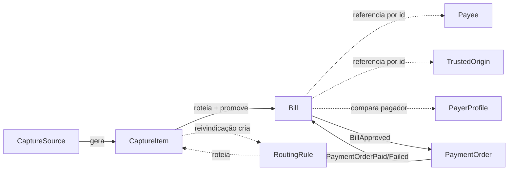
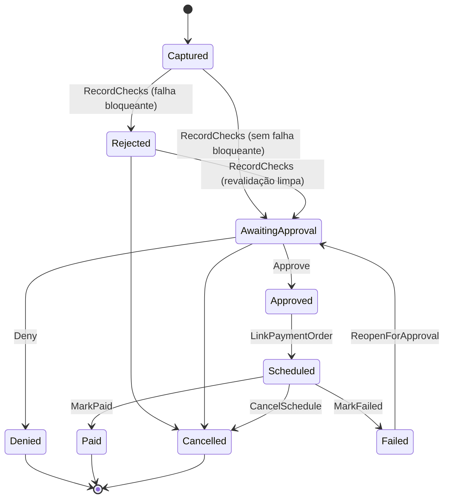

# 02 — Modelo de domínio

Aggregates, Value Objects, eventos e invariantes do BC. Convenções gerais (strongly-typed ids, Smart Enums, `ValueObject`, prefixos de erro) vêm do `CLAUDE.md` do BC e das skills `domain-codegen-ddd-dotnet` / `application-codegen-ddd-dotnet`.

## Mapa dos Aggregates

| Aggregate Root | Sigla de erro | Responsabilidade | Fase |
|---|---|---|---|
| `Bill` | `BLP.BIL` | O boleto: origem, snapshot da consulta oficial, checagens, decisão humana, status espelhado do pagamento | 1 |
| `PayerProfile` | `BLP.PRF` | Identidade fiscal do tenant (PF ou PJ): CPF/CNPJ próprios, filiais, referência da subconta Asaas | 1 |
| `Payee` | `BLP.PYE` | Beneficiário esperado: identidade fiscal, bancos recebedores aceitos, política de valor | 1 |
| `TrustedOrigin` | `BLP.ORG` | Allowlist/blocklist de remetentes e domínios por tenant | 1 |
| `RoutingRule` | `BLP.RTR` | Regra aprendida que liga (beneficiário, referência de conta) a um tenant | 2 |
| `BillExpectation` | `BLP.EXP` | O que o tenant **espera** receber e quando; ciclos, lembretes e alerta de ausência | 2 |
| `CaptureSource` | `BLP.CPS` | Caixa de e-mail ou portal monitorado + cursor de sincronização | 2 |
| `CaptureItem` | `BLP.CPI` | Item bruto ingerido (mensagem/anexo), inclusive os que não viraram Bill | 2 |
| `PaymentOrder` | `BLP.PMO` | Ordem de pagamento no provedor; fonte de verdade da execução | 3 |

**Regra de fronteira:** uma transação muta **um** Aggregate. Efeito cruzado viaja por Domain Event + Outbox. Não existe navegação entre Aggregates — referências são por ID.

**Multi-tenancy não é detalhe de infraestrutura neste BC.** Uma fonte pode servir a vários tenants, o pagador é chave de roteamento, e o isolamento tem três exceções deliberadas. Tudo isso está em [`07-multitenancy-and-routing.md`](07-multitenancy-and-routing.md), que define `PayerProfile`, `RoutingRule`, a escada de roteamento e a quarentena — leia junto com este documento.

**Dois trilhos de pagamento.** Um documento pode trazer código de barras, QR Code Pix ou os dois. O `Bill` modela uma coleção de `PaymentInstrument` e escolhe o `Rail` — Pix quando disponível ([`adr/ADR-010`](adr/ADR-010-pix-preferido-sobre-boleto.md)). Os canais de entrada (PDF com senha, link com navegação, portal) estão em [`09-capture-channels.md`](09-capture-channels.md).

**O que não chega também é fato do domínio.** `BillExpectation` modela o que o tenant espera receber e alerta quando não recebeu — sem ela, toda falha de captura é silenciosa. Modelo em [`11-bill-expectations.md`](11-bill-expectations.md), racional em [`adr/ADR-014`](adr/ADR-014-expectativa-e-lembretes.md).

---

## `Bill` — Aggregate Root

O boleto e toda a sua história. Central do BC.

### Estado

| Campo | Tipo | Nota |
|---|---|---|
| `Id` | `BillId` | |
| `TenantId` | `TenantId` | |
| `Instruments` | `IReadOnlyCollection<PaymentInstrument>` | VO discriminado: `Barcode(DigitableLine)` \| `PixQr(PixPayload)`. **Pelo menos um** obrigatório (`BLP.BIL08`) |
| `Rail` | `PaymentRail` (Smart Enum) | `Pix` \| `Boleto`. Decidido pelo agregado, nunca pelo handler — ver [`adr/ADR-010`](adr/ADR-010-pix-preferido-sobre-boleto.md) |
| `Kind` | `BillKind` (Smart Enum) | `BankSlip` \| `Utility` |
| `Origin` | `BillOrigin` (VO) | De onde veio, com evidência |
| `Lookup` | `LookupSnapshot?` (VO) | Retrato da consulta oficial. `null` até a consulta rodar |
| `ExtractedPayer` | `PartyInfo?` (VO) | Pagador lido do PDF (não autoritativo) |
| `PayeeId` | `PayeeId?` | Beneficiário cadastrado resolvido pela consulta |
| `Status` | `BillStatus` (Smart Enum) | Ver máquina de estados |
| `Checks` | `IReadOnlyCollection<BillCheck>` | Entidade interna, uma por `CheckType` |
| `Approval` | `ApprovalRecord?` (VO) | Quem aprovou/recusou, quando, com que observação |
| `ScheduledFor` | `DateOnly?` | Data pedida no agendamento |
| `PaymentOrderId` | `PaymentOrderId?` | Preenchido na fase 3 |
| `CreatedAt` / `UpdatedAt` | `DateTimeOffset` | |

### Máquina de estados (`BillStatus`)

- **Transições de revalidação acrescentadas na 1.4**: `AwaitingApproval → Rejected` (revalidação encontrou bloqueio) e `Approved → AwaitingApproval`/`Rejected`. **Revalidar um boleto já aprovado derruba a aprovação incondicionalmente** — o doc 03 condiciona isso a "quando o valor muda", e a implementação é mais rígida de propósito: o consentimento foi dado contra um retrato que acabou de ser substituído, e reconfirmar é barato perto de pagar o valor errado por causa de uma comparação de snapshot que silenciosamente não pegou a diferença. `BillStatus.AcceptsValidation` fecha a porta a partir de `Scheduled`, quando a verdade da execução já é da `PaymentOrder`.
- `Approved` → `Scheduled` é comandado pelo handler do evento `BillApprovedDomainEvent`, que cria a `PaymentOrder` e devolve o id.
- `Scheduled` → `Paid`/`Failed` **só** acontece por reflexo de evento da `PaymentOrder`. `Bill.Status` é espelho; a verdade da execução é a `PaymentOrder` (ver [`adr/ADR-002-bill-e-paymentorder-separados.md`](adr/ADR-002-bill-e-paymentorder-separados.md)).
- Um Bill `Paid` é imutável. Qualquer método rico que tente mutá-lo lança `BLP.BIL07`.

### Métodos ricos

| Método | Contrato |
|---|---|
| `Bill.Capture(tenantId, instruments, origin, extractedPayer?)` | Factory. Exige ≥ 1 instrumento, valida DV/CRC de cada um, deriva `Kind`, **escolhe o `Rail`** (Pix se houver QR válido, senão Boleto), nasce `Captured`. |
| `AttachLookups(BillLookupResult?, PixLookupResult?, occurredAt)` | Guarda os retratos e registra **toda** tentativa em `LookupHistory`. Consulta que não resolveu **não apaga** o retrato anterior — apagar deixaria o boleto sem evidência justamente quando a rede falhou. |
| `ResolvePayee(PayeeId?, occurredAt)` | Vincula (ou desvincula) o beneficiário cadastrado. |
| `RecordChecks(IReadOnlyCollection<CheckResult>, occurredAt)` | Substitui o conjunto de checks e **decide o próximo status** (`AwaitingApproval` ou `Rejected`) a partir da severidade. Único ponto que muda status por validação. Exige o catálogo completo (`BLP.BIL19`) e devolve `ValidationOutcome` — o handler nunca lê `bill.Checks` para montar resposta. |
| `Approve(UserId, DateOnly scheduleFor, string? note, ApprovalPolicy, DateOnly today, DateTime occurredAt)` | Exige `AwaitingApproval`. Grava `ApprovalRecord` + `ScheduledFor`. Emite `BillApprovedDomainEvent`. As seis guardas na ordem em que ajudam quem está na tela: situação → cobertura de checks → bloqueio → validade do retrato → data → alçada. |
| `Deny(UserId, string reason, DateTime occurredAt)` | Exige `AwaitingApproval`. Motivo obrigatório (`BLP.BIL23`). |
| `LinkPaymentOrder(PaymentOrderId, DateOnly effectiveScheduleDate)` | `Approved` → `Scheduled`. |
| `MarkPaid(DateOnly paidAt, Money paidAmount, Money fee, string? receiptUrl)` | `Scheduled` → `Paid`. |
| `MarkFailed(IReadOnlyCollection<string> reasons)` | `Scheduled` → `Failed`. |
| `Cancel(UserId, string reason)` | Proibido a partir de `Paid`. |
| `ReopenForApproval()` | `Failed` → `AwaitingApproval` para nova tentativa. |

**O handler nunca decide status.** Ele carrega o agregado, chama **um** método rico e salva. Toda transição vive no `Bill`.

### Invariantes

1. Linha digitável com DV inválido não vira `Bill` — `Capture` lança `BLP.BIL01`.
2. Não existem duas `Bill` ativas com a mesma **chave natural de instrumento** — linha digitável *ou* hash do payload Pix — **globalmente, não por tenant** (índice único parcial sem `TenantId` na chave: status ≠ `Cancelled`/`Denied`). Um compromisso é pago uma vez, e uma caixa compartilhada torna a colisão entre tenants provável. Violação → `BLP.BIL02`, apresentada ao outro tenant como aviso genérico sem identificar quem. Ver [`adr/ADR-008`](adr/ADR-008-fontes-compartilhadas-e-isolamento.md).

   **A dedup precisa cobrir os dois trilhos**: o mesmo compromisso pode chegar duas vezes, uma como boleto e outra como Pix, com chaves naturais diferentes. Além da chave de instrumento, a checagem cobre `(beneficiário, valor, vencimento)` — senão o pagamento duplica pelo outro trilho.

   **Nem todo instrumento serve de chave** (refinamento da implementação, sprint 1.2). `PaymentInstrument.IsSingleUse` decide quem entra na unicidade global: código de barras e **QR Pix dinâmico** sim, **QR Pix estático não**. O payload estático é reutilizável por natureza — é comum o fornecedor mandar todo mês a conta com o mesmo QR —, e deduplicar por ele bloquearia a conta de fevereiro porque a de janeiro existiu. Documento que só traz QR estático nasce **sem `DedupKey`** e depende inteiramente da checagem por `(beneficiário, valor, vencimento)`.
3. `Approve` exige que **todos** os `CheckType` obrigatórios da fase tenham sido executados. Falta de check → `BLP.BIL03`.
4. `Approve` é proibido se existe check `Failed` com severidade `Blocking` — `BLP.BIL04`.
5. `ScheduleFor` não pode ser anterior a hoje nem à data mínima do provedor gravada no `LookupSnapshot` — `BLP.BIL05`.
6. `Approve` exige `UserId` diferente de quem capturou manualmente? **Não** nesta fase (segregação de funções fica para a fase 6, ADR próprio).
7. `Bill` em estado terminal (`Paid`, `Denied`, `Cancelled`) não aceita mutação — `BLP.BIL07`.

### Entidade interna `BillCheck`

Uma por `CheckType`. Nunca emite evento (só o Root emite).

| Campo | Tipo |
|---|---|
> **Implementado na 1.4 como Value Object**, não Entity: um check não tem ciclo de vida — `RecordChecks` substitui o conjunto inteiro. A persistência continua sendo a tabela filha `bill_checks` (`OwnsMany`), com chave `(bill_id, type)`. Ver o refinamento no [`ADR-003`](adr/ADR-003-checks-materializados.md).

| `Type` | `CheckType` (Smart Enum) |
| `Outcome` | `CheckOutcome` — `Passed` \| `Failed` \| `Warning` \| `Inconclusive` \| `Skipped` |
| `Severity` | `CheckSeverity` — `Blocking` \| `Advisory` |
| `ReasonCode` | `string` — código estável para a UI traduzir |
| `Evidence` | `string` — texto curto com os dois lados da comparação ("esperado 341, boleto 237") |
| `EvaluatedAt` | `DateTimeOffset` |

Detalhe de cada `CheckType` em [`03-bill-validation.md`](03-bill-validation.md).

### Eventos

| Evento | Quando | Consumidor |
|---|---|---|
| `BillCapturedDomainEvent` | após `Capture` | dispara a consulta oficial + validação (fase 1) |
| `BillValidatedDomainEvent` | `RecordChecks` sem bloqueio | notificação ao aprovador (fase 4) |
| `BillRejectedDomainEvent` | `RecordChecks` com bloqueio | alerta / fila de exceção |
| `BillApprovedDomainEvent` | `Approve` | cria a `PaymentOrder` (fase 3) |
| `BillDeniedDomainEvent` | `Deny` | trilha de auditoria |
| `BillCancelledDomainEvent` | `Cancel` | cancela a `PaymentOrder` se existir |

---

## `Payee` — Aggregate Root

O "condiz com o quê" das checagens de beneficiário, banco e valor.

| Campo | Tipo | Nota |
|---|---|---|
| `Id` / `TenantId` | | |
| `LegalName` | `string` | Razão social esperada |
| `TaxId` | `TaxId` (SharedKernel) | CNPJ/CPF — **o sinal forte**. Único por tenant |
| `Aliases` | `IReadOnlyCollection<string>` | Variações de nome vistas em consultas, para reduzir falso alarme na comparação textual |
| `AcceptedBanks` | `IReadOnlyCollection<BankCode>` | Bancos recebedores aceitos. Vazio = qualquer banco (check vira `Inconclusive`) |
| `AmountPolicy` | `AmountPolicy` (VO) | `Fixed(Money, tolerance%)` \| `Range(min, max)` \| `Unbounded` |
| `IsActive` | `bool` | Beneficiário inativo derruba o check de beneficiário |

Métodos: `Register`, `Rename`, `SetAmountPolicy`, `AllowBank`/`DisallowBank`, `LearnAlias`, `Activate`/`Deactivate`.

Invariantes: `TaxId` válido (já garantido pelo VO do SharedKernel); `Fixed` exige valor positivo e tolerância em `[0, 100]`; `Range` exige `min <= max` — `BLP.PYE01..03`.

---

## `TrustedOrigin` — Aggregate Root

| Campo | Tipo |
|---|---|
| `Id` / `TenantId` | |
| `Kind` | `OriginKind` — `EmailAddress` \| `EmailDomain` \| `WebDomain` |
| `Value` | `string` normalizado (lowercase, sem espaços) |
| `Decision` | `TrustDecision` — `Trusted` \| `Blocked` |
| `DecidedBy` / `DecidedAt` | `UserId` / `DateTimeOffset` |
| `Note` | `string?` |

Resolução: casa primeiro por `EmailAddress`, depois por `EmailDomain`. Sem match → origem **desconhecida** (não é um registro; é a ausência dele). Único por `(TenantId, Kind, Value)` — `BLP.ORG01`.

Racional em [`adr/ADR-005-confianca-de-origem.md`](adr/ADR-005-confianca-de-origem.md).

---

## `CaptureSource` — Aggregate Root (fase 2)

| Campo | Tipo |
|---|---|
| `Kind` | `CaptureSourceKind` — `MicrosoftGraphMailbox` \| `Portal` \| `ManualUpload`. Gmail entra por encaminhamento, sem adapter ([`adr/ADR-006`](adr/ADR-006-captura-email-oauth.md)) |
| `DisplayName` | `string` |
| `Address` | `string` — endereço da caixa ou URL do portal |
| `CredentialRef` | `string` — **ponteiro** para o cofre, nunca o segredo |
| `SyncCursor` | `string?` — `deltaLink` do Graph |
| `LastSyncAt` / `LastSyncError` | | |
| `IsEnabled` | `bool` | |

Invariante: o Domain **nunca** guarda segredo; só a referência — `BLP.CPS01` se `CredentialRef` vier vazio.

## `CaptureItem` — Aggregate Root (fase 2)

Registro bruto de cada mensagem/anexo ingerido, incluindo os que não viraram Bill.

| Campo | Tipo |
|---|---|
| `SourceId` | `CaptureSourceId` |
| `ExternalMessageId` | `string` — id da mensagem no provedor. Único por `(TenantId, SourceId)` → idempotência da ingestão |
| `Sender` / `Subject` / `ReceivedAt` | | |
| `ContentHash` | `string` — SHA-256 do anexo, dedup de reenvio |
| `StorageKey` | `string` — onde o PDF original está |
| `Status` | `CaptureItemStatus` — `Received` \| `Parsed` \| `Promoted` \| `ForeignPayer` \| `Unrouted` \| `Unrecognized` \| `Locked` \| `LinkPending` \| `LinkFailed` \| `Discarded` |
| `RoutingConfidence` | `RoutingConfidence?` — `PasswordDerived` \| `Strong` \| `Learned` \| `Weak` \| `Claimed` |
| `SourceUrl` | `string?` — quando o artefato veio de link |
| `UnlockedBy` | `string?` — **qual campo** do `PayerProfile` derivou a senha; nunca a senha |
| `ExtractionMethod` | `ExtractionMethod?` — `EmbeddedText` \| `Vision` \| `Manual` |
| `BillId` | `BillId?` |
| `ClaimedBy` / `ClaimedAt` | `UserId?` / `DateTimeOffset?` |

`ForeignPayer` e `Unrouted` têm **visibilidade diferente** no read model: o primeiro não expõe valor, beneficiário nem linha digitável (o sistema sabe que não é do usuário); o segundo expõe o suficiente para o usuário decidir se reivindica. É regra de projeção, não de UI. Métodos: `Promote(BillId, RoutingConfidence)`, `MarkForeign(reason)`, `MarkUnrouted()`, `Claim(UserId)` — `Claim` é recusado quando o pagador extraído contradiz o tenant (`BLP.CPI04`).

---

## `PaymentOrder` — Aggregate Root (fase 3)

Fonte de verdade da execução financeira.

| Campo | Tipo |
|---|---|
| `BillId` | `BillId` |
| `ProviderOrderId` | `string?` — id no Asaas |
| `ExternalReference` | `string` — o `PaymentOrderId` enviado ao provedor; chave de idempotência |
| `Status` | `PaymentOrderStatus` — `Draft` \| `Submitted` \| `Pending` \| `BankProcessing` \| `Paid` \| `Failed` \| `Cancelled` \| `Refunded` |
| `RequestedScheduleDate` / `EffectiveScheduleDate` | `DateOnly` |
| `Amount` / `Fee` | `Money` |
| `PaidAt` / `ReceiptUrl` | | |
| `FailReasons` | `IReadOnlyCollection<string>` |
| `LastProviderSyncAt` | `DateTimeOffset` |

Métodos: `Draft`, `MarkSubmitted(providerOrderId)`, `ApplyProviderStatus(status, payload)` (idempotente e **monotônica** — não regride de `Paid`), `Cancel`.

Invariante: transição de status vinda de webhook fora de ordem é ignorada, não lançada — `ApplyProviderStatus` compara o instante do evento com `LastProviderSyncAt` (`BLP.PMO03` só quando o payload é incoerente, ex.: `Paid` sem `paymentDate`).

Eventos: `PaymentOrderScheduledDomainEvent`, `PaymentOrderPaidDomainEvent`, `PaymentOrderFailedDomainEvent`, `PaymentOrderCancelledDomainEvent` — todos consumidos por handlers que atualizam o `Bill`.

---

## Value Objects

| VO | Conteúdo | Regras |
|---|---|---|
| `PaymentInstrument` | discriminado: `Barcode(DigitableLine)` \| `PixQr(PixPayload)` | Expõe `NaturalKey` (linha digitável ou hash do payload) para a dedup global |
| `DigitableLine` | string normalizada (só dígitos) | 47 dígitos (cobrança) ou 48 (arrecadação). Valida DV por campo. Expõe `ToBarcode()`, `BankCode`, `Amount`, `DueDate`, `Kind` |
| `Barcode` | 44 dígitos | DV geral mod 11 (cobrança) / mod 10 ou 11 (arrecadação) |
| `PixPayload` | BR Code (EMV MPM) normalizado | Valida o **CRC16** do payload. Expõe `Kind` (`Static` \| `Dynamic`), `MerchantName`, `MerchantCity`, `Key?`, `TxId?`, `Amount?`. Estático não carrega valor nem vencimento — os checks correspondentes saem `Skipped` com motivo |
| `PixLookupSnapshot` | retrato do `POST /v3/pix/qrCodes/decode` | `Receiver` (`LookupParty`), `ReceiverIspb`/`ReceiverIspbName`/`ReceiverKind`, `Amount`, `TotalAmount`, `Interest`, `Fine`, `Discount`, `ChangeAmount`, `DueDate`, `ExpirationDate`, `CanBePaidWithDifferentValue`, **`CanBePaid`/`CannotBePaidReason`**, `IsDynamic`, `ConciliationIdentifier`, `Payer` (`MaskedParty`), `ConsultedAt`. Imutável, como o `LookupSnapshot` do boleto |
| `LookupParty` | beneficiário/recebedor como a fonte oficial o devolve | `Name?`, `TradingName?`, `TaxId?` — **os três opcionais**, ao menos um preenchido. Documento é opcional porque a medição da sprint 1.0 mostrou 0% em arrecadação; documento ilegível vira ausência via `TaxId.TryParse`, nunca exceção |
| `MaskedParty` | pagador mascarado do decode Pix | `Name?`, `MaskedTaxId?` (só dígitos e `*`). `IsCompatibleWith(TaxId)` erra para o lado de **não concluir**: só devolve `false` quando compara posição a posição e um dígito visível difere. Máscara de comprimento diferente é inconclusiva, não contradição |
| `LookupResult` (`BillLookupResult` / `PixLookupResult`) | resultado de uma tentativa de consulta | `Status` (`LookupStatus`), `Snapshot?`, `ReasonCode?`, `ProviderMessage?`, `AttemptedAt`. **Não é persistido** — é o veículo entre o adapter e a verificação |
| `BankCode` | 3 dígitos | Só existe para `BillKind.BankSlip` |
| `BillOrigin` | `SourceKind`, `SourceId?`, `SenderAddress?`, `ExternalMessageId?`, `ReceivedAt`, `ContentHash?`, `StorageKey?` | Ao menos um identificador de origem |
| `LookupSnapshot` | `BeneficiaryName`, `BeneficiaryTaxId?`, `BankCode?`, `Amount`, `OriginalAmount`, `MinAmount?`, `MaxAmount?`, `AllowChangeValue`, `DueDate`, `IsOverdue`, `Fee`, `MinimumScheduleDate`, `ConsultedAt` | Imutável. Nunca é atualizado — uma nova consulta gera um novo snapshot |
| `PartyInfo` | `Name?`, `TaxId?` | Ao menos um preenchido |
| `AmountPolicy` | discriminada: `Fixed` \| `Range` \| `Unbounded` | `Matches(Money) → bool` |
| `ApprovalRecord` | `DecidedBy` (`UserId`), `Decision` (`ApprovalDecision`), `DecidedAt`, `Note?` | Observação **obrigatória** em recusa e cancelamento, opcional na aprovação: aprovar é o caminho esperado e explicar o óbvio vira ritual vazio; recusar é o desvio |
| `ApprovalPolicy` | `MaxSnapshotAge`, `Limit?` | Parâmetro de `Approve`, não estado do boleto — a mesma conta pode ser aprovável por uma pessoa e não por outra. `Limit` nulo = sem teto, **não** zero |
| `CheckResult` | `CheckType`, `CheckOutcome`, `CheckSeverity`, `ReasonCode`, `Evidence` | Produzido pelo Domain Service, consumido por `Bill.RecordChecks` |

`Money`, `Currency`, `TaxId`, `TenantId`, `UserId`, `DateRange` já existem no `SharedKernel` e são reaproveitados.

### Nota de implementação — fator de vencimento

O vencimento embutido no código de barras é o *fator de vencimento* (4 dígitos, dias desde 07/10/1997). A faixa estourou em 21/02/2025 e **reiniciou em 1000 a partir de 22/02/2025**. O parser precisa da regra de rollover, senão todo boleto emitido depois dessa data cai ~27 anos no passado. Fator `0000` significa "sem vencimento" e não deve virar data.

**Confirmado empiricamente**: 100% dos boletos de cobrança do corpus real caem na faixa reiniciada — fator 1493 → 2026-06-30, fator 1337 → 2026-01-25. Interpretados com a base antiga sairiam em 2001. Use esses dois fatores como `[InlineData]` do teste obrigatório do `DigitableLine`. Ver [`08-boleto-corpus-findings.md`](08-boleto-corpus-findings.md).

### Nota de implementação — DV é necessário, e não é suficiente

`DigitableLine` nunca aceita "o primeiro match do regex". A extração correta é: achatar o texto, gerar **todas** as janelas de 47 e 48 dígitos, validar cada uma, e aceitar só as que passam no DV. Idem para `TaxId` extraído.

E o DV sozinho não fecha o caso. Uma linha de cobrança tem ~4 dígitos de verificação — **1 em ~10.000 por candidato** — e uma string longa de lixo gera milhares de candidatos. No corpus real isso aconteceu: um boleto de telefonia renderiza a fonte do código de barras como texto, e uma janela daquele lixo passou nos três mod 10 e no mod 11, produzindo `banco=000 valor=4.411.000,00`.

Por isso `DigitableLine` aplica **filtros de plausibilidade** depois do DV: banco tem que existir na tabela COMPE, valor `> 0` e abaixo de um teto sanitário, vencimento dentro de uma janela em torno de hoje, e preferência por candidatos próximos de rótulos conhecidos no texto. Sobrando mais de um candidato plausível, quem desempata é a consulta oficial — não heurística. Ver [`08-boleto-corpus-findings.md`](08-boleto-corpus-findings.md).

---

## Domain Services

| Serviço | Por que é serviço |
|---|---|
| `BillValidationService` | Cruza `Bill` + `Payee` + `TrustedOrigin` + `PayerProfile` — quatro Aggregates. Recebe os roots carregados, produz `IReadOnlyCollection<CheckResult>` (valores), e o handler passa esses valores para `bill.RecordChecks(...)`. **Nunca** passa a entidade `Payee` para dentro do `Bill`. |
| `BillRoutingService` | Decide de qual tenant é um `CaptureItem`, percorrendo a escada de cinco degraus de [`07-multitenancy-and-routing.md`](07-multitenancy-and-routing.md). Cruza `CaptureItem` + `PayerProfile` + `RoutingRule` + `Payee`. Devolve `RoutingDecision` (valor), nunca muta nada. |
| `PayeeResolutionService` | Resolve o `beneficiaryCpfCnpj` do `LookupSnapshot` para um `PayeeId` cadastrado, com fallback por nome normalizado. |
| `PaymentSchedulingService` | Decide a data efetiva de agendamento a partir da data pedida, do calendário de dias úteis, do horário de corte e do `MinimumScheduleDate` do snapshot. |
| `ExpectationMatchingService` | Casa `Bill` com o ciclo aberto de uma `BillExpectation` — dois Aggregates. Devolve `ExpectationMatch` (valor); quem muta é `expectation.Fulfill(...)`. |
| `ExpectationLearningService` | Propõe expectativas a partir do histórico de `Bill` + `Payee` + `RoutingRule`. Devolve candidatas, nunca persiste. |

## Portas (implementadas na Infra)

Vivem em `BillPayment.Domain/Ports/` — pasta nova, irmã de `SeedWork/`. Motivo: `Infra → Application` não existe (seria ciclo), então tudo que a Infra implementa precisa estar no Domain. Trafegam apenas tipos do Domain — nenhum DTO de provedor cruza a fronteira.

| Porta | Assinatura essencial | Fase |
|---|---|---|
| `IBillLookupService` | `Task<BillLookupResult> SimulateAsync(DigitableLine, CancellationToken)` | 1 ✅ |
| `IPixLookupService` | `Task<PixLookupResult> DecodeAsync(PixPayload, DateOnly? expectedPaymentDate, CancellationToken)` | 1 ✅ |
| `IBillPaymentGateway` | `ScheduleAsync(PaymentOrder…) / CancelAsync / GetAsync` | 3 |
| `IPixPaymentGateway` | idem, sobre `POST /v3/pix/qrCodes/pay` (aceita `scheduleDate`) | 3 |
| `IBoletoDocumentParser` | `Task<ParsedDocument> ParseAsync(Stream, IReadOnlyList<string> passwordCandidates, CancellationToken)` — texto embutido + derivação de senha | 2 |
| `IDocumentIntelligence` | `ExtractAsync(payload, hints, ct)` / `TriageAsync(message, ct)` — extrator de visão; saída é **candidato** ([`adr/ADR-011`](adr/ADR-011-llm-propoe-codigo-dispoe.md)); provedor invisível ao BC ([`adr/ADR-013`](adr/ADR-013-gemini-atras-de-porta-agnostica.md)) | 2 |
| `ILinkResolver` | `Task<ResolvedArtifact> ResolveAsync(Uri, ResolutionPolicy, CancellationToken)` — escada de 5 degraus (GET → um salto → receita → agente → quarentena), allowlist, anti-SSRF, egresso isolado | 2 |
| `INotificationSender` | `Task SendAsync(TenantId, NotificationKind, NotificationPayload, CancellationToken)` — lembretes de expectativa | 2 |
| `IMailboxReader` | `Task<MailboxPage> FetchAsync(cursor, CancellationToken)` | 2 |
| `IAttachmentStorage` | `SaveAsync / OpenReadAsync` | 2 |
| `IWorkingDayCalendar` | `bool IsWorkingDay(DateOnly)` / `DateOnly NextWorkingDay(DateOnly)` | 3 |
| `ISecretVault` | `ResolveAsync(CredentialRef)` / `StoreAsync(TenantId, SecretKind, secret)` / `ReplaceAsync` / `RemoveAsync` | 1 ✅ (usado a partir da 2) |

## Repositórios

`IBillRepository`, `IPayerProfileRepository`, `IPayeeRepository`, `ITrustedOriginRepository`, `IRoutingRuleRepository`, `IBillExpectationRepository`, `ICaptureSourceRepository`, `ICaptureItemRepository`, `IPaymentOrderRepository` — todos com busca *tracked* filtrando por `TenantId` e `ExistsAsync` para validação de ids externos. Sem `Update()`: change tracking + `SaveEntitiesAsync`.

**Três métodos são as únicas travessias autorizadas de tenant** e devolvem `bool` ou aviso genérico, nunca conteúdo (ver [`adr/ADR-008`](adr/ADR-008-fontes-compartilhadas-e-isolamento.md)): `ICaptureSourceRepository.IsAddressMonitoredByAnyTenantAsync(address)`, `IBillRepository.ExistsActiveByDigitableLineAsync(line)` (global), `IRoutingRuleRepository.ExistsForPairInAnyTenantAsync(payeeTaxId, accountRef)`. Qualquer outro método sem `TenantId` é violação.

## Read side (CQRS)

Fora do mediator, em `Application/Queries/`, com `AsNoTracking` — exceção autorizada de dependência `Application → Infra` já documentada no `CLAUDE.md`.

- `IBillQueries` — listagem com filtro (status, período, payee, origem), detalhe com checks e evidências.
- `IPaymentReportQueries` — histórico e relatórios (fase 4), detalhado em [`05-use-cases.md`](05-use-cases.md).

## Prefixos de erro reservados

`BLP.BIL##` (Bill), `BLP.PRF##` (PayerProfile), `BLP.PYE##` (Payee), `BLP.ORG##` (TrustedOrigin), `BLP.LKP##` (Lookups — VOs de consulta oficial), `BLP.SEC##` (Secrets — `CredentialRef` e cofre), `BLP.RTR##` (RoutingRule), `BLP.EXP##` (BillExpectation), `BLP.CPS##` (CaptureSource), `BLP.CPI##` (CaptureItem), `BLP.PMO##` (PaymentOrder). Registrar cada novo código no `CLAUDE.md` do BC ao criá-lo.
