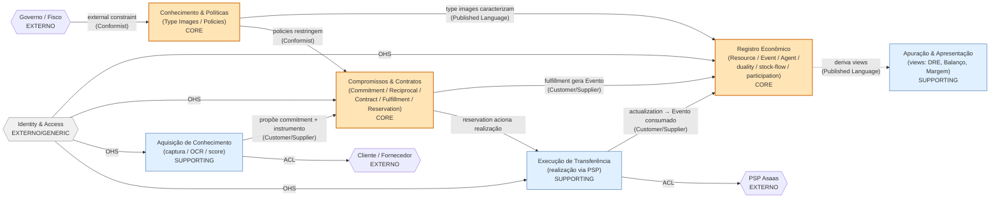
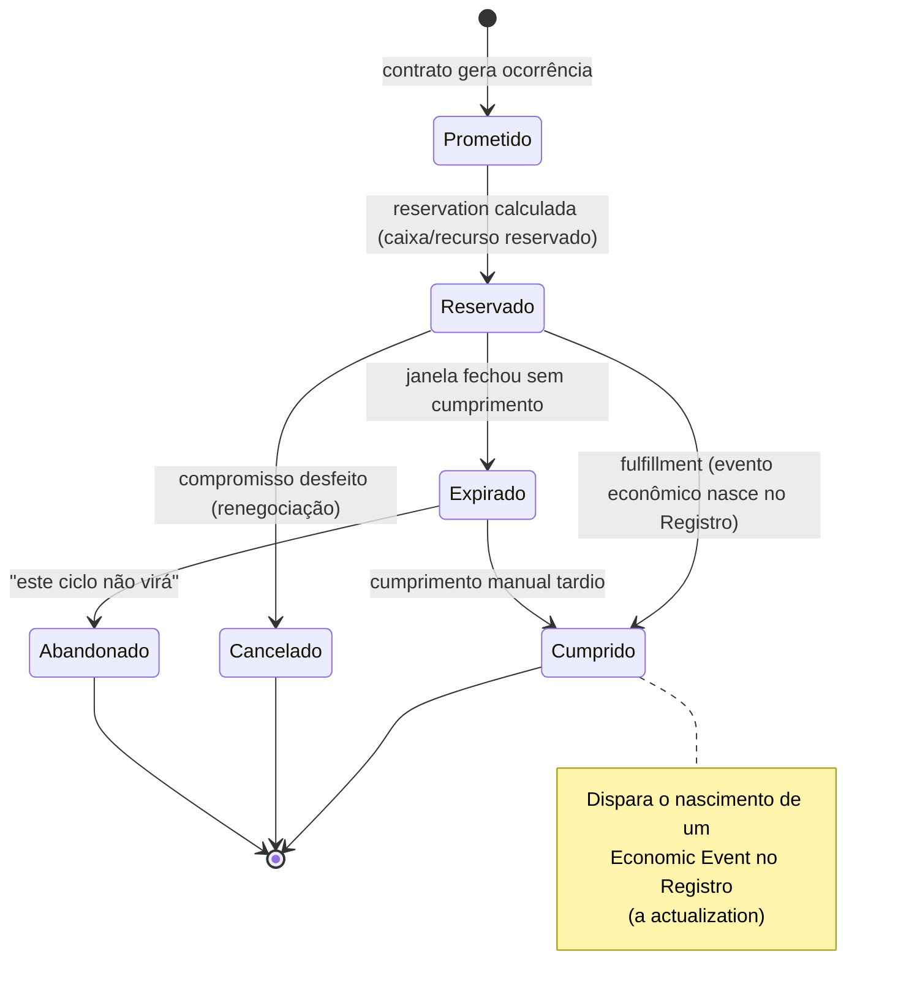
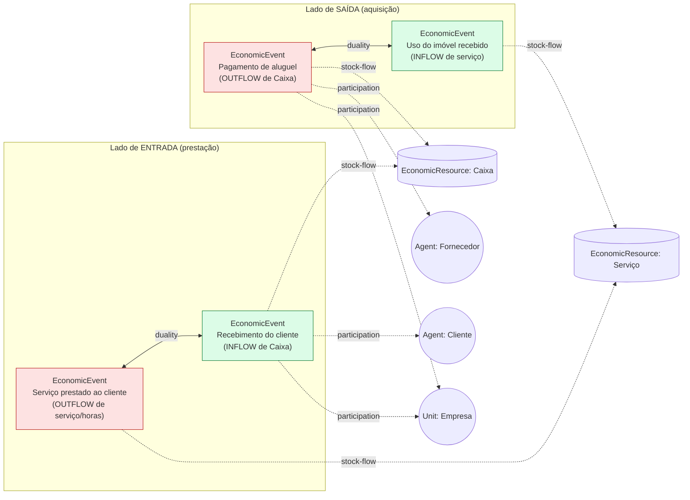
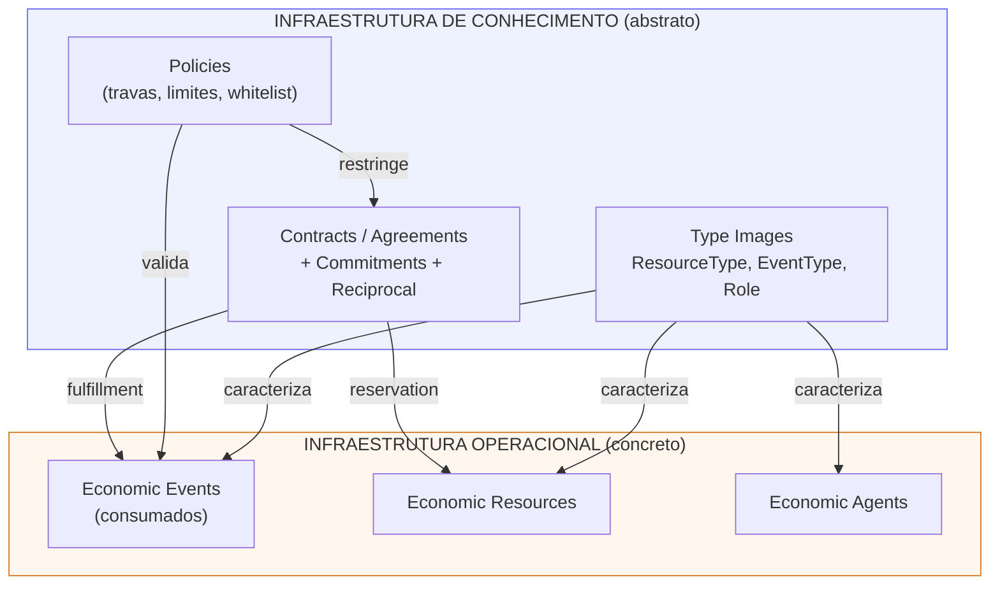
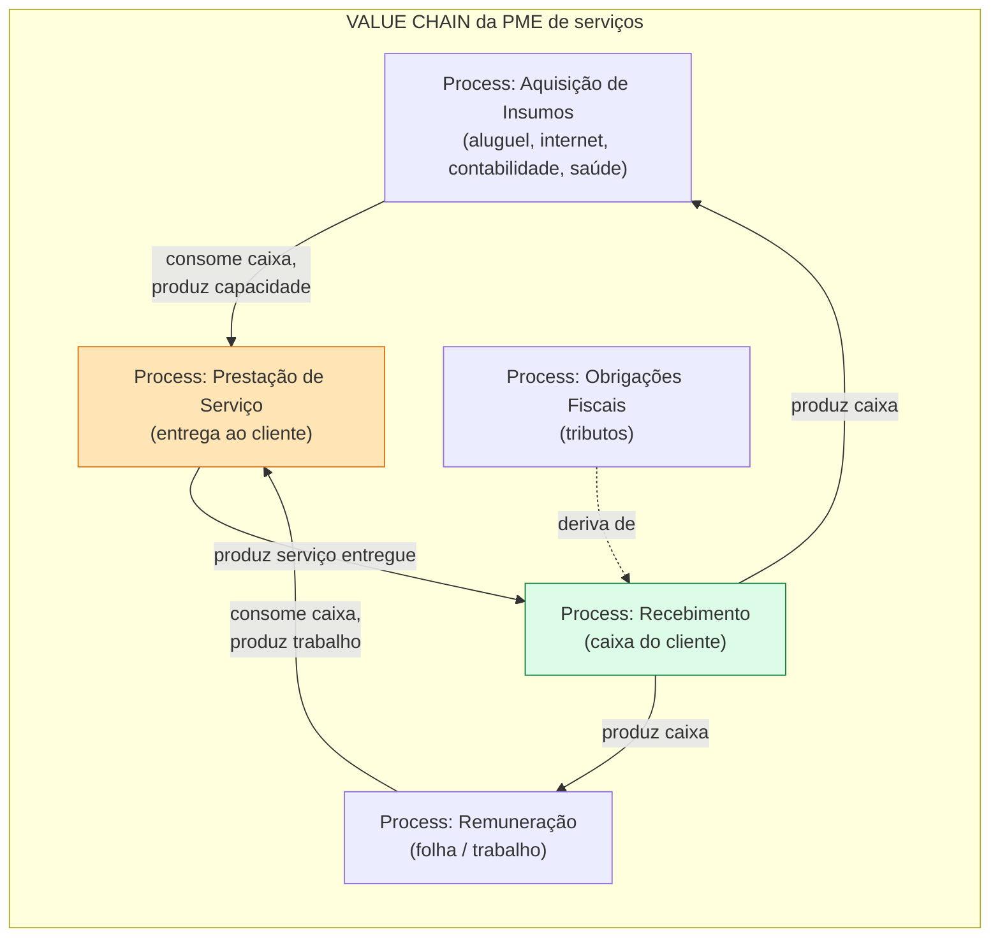
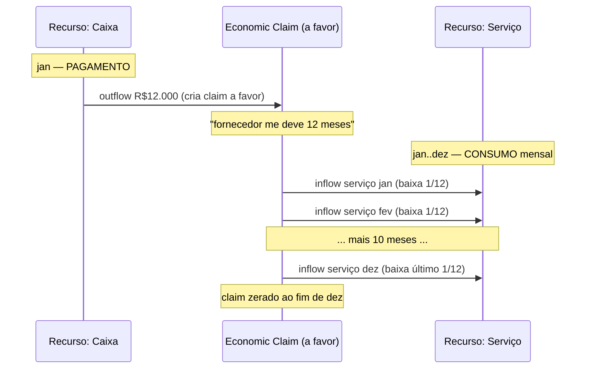
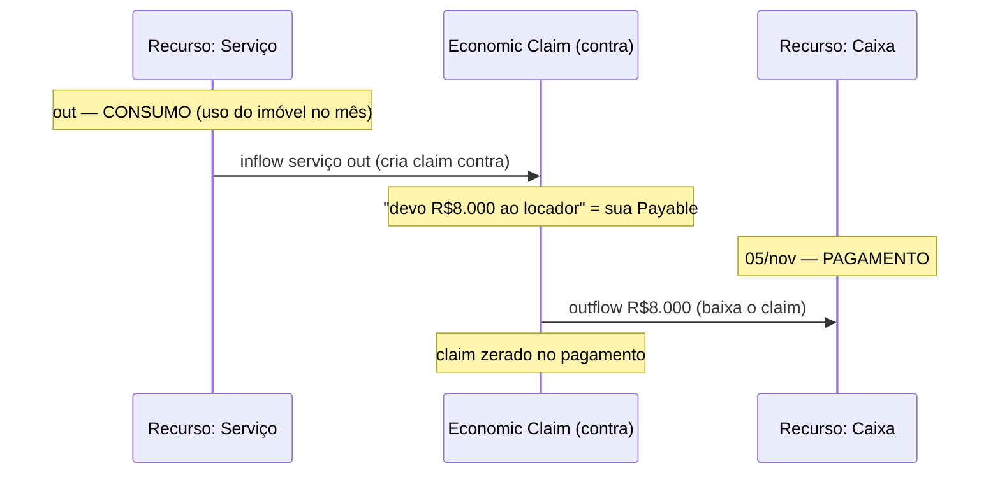
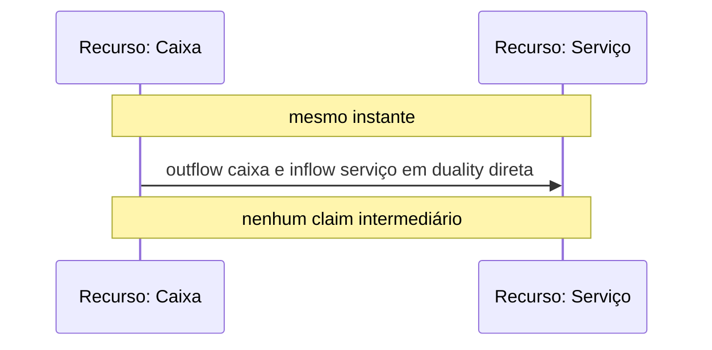
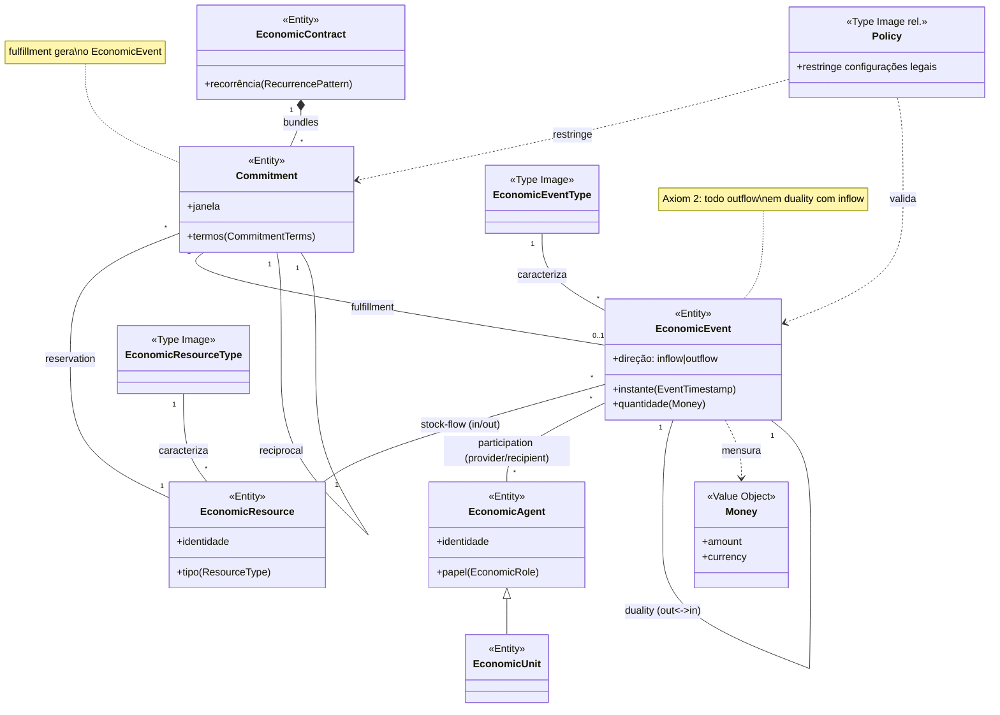

# Modelagem de Domínio — Sistema Financeiro de PME de Serviços sob a Ontologia REA (modelo conceitual canônico)

> **O que este documento é.** Uma remodelagem do mesmo domínio do `Consolidado.md` (SaaS financeiro para PMEs de serviços), porém **do zero, na ontologia REA pura** — fiel a McCarthy (1982), Geerts & McCarthy (2000) e à norma ISO/IEC 15944-4:2015. Não parte da estrutura `Payable`/`PaymentOrder`; parte dos primitivos REA (Resource, Event, Agent, Commitment, Contract, Type, Policy) e deixa o sistema **emergir** da ontologia.
>
> **O que este documento NÃO é.** Não é um modelo DDD tático. Não há aggregates, IDs tipados, `TenantId`, eventos de domínio .NET, nem convenções de stack. Esta é a **camada conceitual** (a profundidade "B1" combinada): a ontologia que um pesquisador REA reconheceria como correta, servindo de espelho para confrontar com o seu modelo atual.
>
> **Recorte.** Ciclo de troca **completo**: lado de saída (aquisição de serviços + desembolso de caixa) **e** lado de entrada (prestação de serviços + recebimento). É deliberado: o conceito que define o REA — a **dualidade** (todo *outflow* pareia com um *inflow*) — só fecha com os dois lados. Modelar só o desembolso reproduziria o vício de "contas a pagar isolado" que McCarthy critica em 1982.
>
> **Fontes primárias** (lidas e fichadas): McCarthy, W. E. (1982), *The REA Accounting Model: A Generalized Framework for Accounting Systems in a Shared Data Environment*, The Accounting Review LVI(3); Geerts, G. & McCarthy, W. E. (2000), *The Ontological Foundation of REA Enterprise Information Systems*; ISO/IEC 15944-4:2015, *Information technology — Business Operational View — Part 4: Business transaction scenarios — Accounting and economic ontology*.

---

## Índice

1. Propósito e visão geral
2. Premissas assumidas
3. Linguagem Ubíqua (ontologia REA)
4. Subdomínios (Core / Supporting / Generic) sob a ótica REA
5. Bounded Contexts e Context Map
6. Design conceitual por contexto
7. As três camadas do REA (operacional, conhecimento, valor)
7-bis. Padrões temporais (pré-pago, pós-pago, simultâneo) e DRE por competência
8. Os axiomas REA e o que eles forçam no sistema
9. Diagramas
10. Decisões tomadas (com justificativa)
11. Pontos abertos
12. Roadmap faseado de modelagem
13. Apêndice — Mapa de equivalência REA ↔ `Consolidado.md`

---

## 1. Propósito e visão geral

O sistema modela, registra e governa os **fenômenos econômicos** de uma PME brasileira de serviços: o que ela possui de valor (recursos), o que acontece com esses recursos ao longo do tempo (eventos econômicos de entrada e saída), quem participa (agentes), o que foi prometido antes de acontecer (compromissos e contratos), e quais regras restringem tudo isso (políticas).

A diferença fundamental em relação a um sistema contábil tradicional — e a razão de adotar REA — é **não modelar débito/crédito/contas como conceitos de primeira classe**. McCarthy (1982) é explícito: débitos, créditos e contas são *artefatos de diários e razões* — mecanismos manuais de armazenamento e transmissão de dados, não aspectos essenciais de um sistema contábil. O REA modela diretamente os fenômenos econômicos no esquema conceitual; qualquer manipulação de partida dobrada desejada por um usuário específico é derivada depois, no esquema externo apresentado a esse usuário.

> **Por que isso importa para o seu sistema.** O seu objetivo de qualidade nº 1 é *confiabilidade financeira / auditabilidade total*. O REA entrega isso por construção: o registro primário é o **fato econômico** (este serviço foi recebido, este caixa saiu), não o lançamento. A partida dobrada — e a DRE, e o balanço — viram **views derivadas** dos mesmos fatos, impossíveis de divergir do que de fato aconteceu.

**Atores (na linguagem REA — ver §3):**
- **Agentes internos** (`economic units`): o sócio, o operador financeiro, o contador externo. São partes que trabalham para ou são parte da empresa contabilizada.
- **Agentes externos** (`outside agents` / `partners`): fornecedores (de aluguel, internet, contabilidade, plano de saúde), colaboradores enquanto recebedores de remuneração, o governo enquanto recebedor de tributos, e os clientes da PME.

---

## 2. Premissas assumidas

Onde a ontologia exige uma decisão e o domínio concreto (do `Consolidado.md`) não a fixa conceitualmente, declaro a suposição aqui — nunca como fato disfarçado.

- **P1 — Uma empresa contabilizada por tenant.** Cada tenant é uma `enterprise` REA distinta cujo *value chain* é modelado isoladamente. A multi-tenancy é uma questão de infraestrutura (fora do escopo conceitual B1), mas conceitualmente: dois tenants são dois universos REA sem `duality` cruzada.
- **P2 — Moeda única (BRL) no nível conceitual.** `Money` é tratado como recurso econômico mensurável em BRL. Multimoeda exigiria um recurso econômico "moeda estrangeira" distinto e eventos de câmbio — fora do recorte.
- **P3 — Colaborador é tratado como agente externo na relação de remuneração.** No REA, a folha é uma **aquisição de serviço de trabalho**: o colaborador (agente externo nessa troca) presta o recurso "trabalho/serviço laboral" (inflow) e a empresa desembolsa caixa (outflow). O cálculo trabalhista (INSS/FGTS/IRRF) permanece fora do escopo, como no `Consolidado.md` — o sistema registra os eventos econômicos com valores já apurados.
- **P4 — Tributos são modelados como recurso econômico "direito/obrigação fiscal" consumido.** O pagamento de imposto é um `economic event` de saída de caixa cuja contraparte (inflow) é a extinção de uma obrigação fiscal (um `economic claim` a favor do governo). Ver §6.4.
- **P5 — O lado de entrada (receitas) é modelado conceitualmente completo**, embora no `Consolidado.md` o MVP só implemente saídas (D-144). Em REA puro isso é obrigatório: sem o inflow de caixa proveniente da prestação de serviço, a dualidade do lado de entrada não existe.
- **P6 — "Captura de boleto" e "OCR/score" não são fenômenos econômicos.** São atividades de **aquisição de conhecimento sobre um compromisso pré-existente**. No REA conceitual, vivem como `tasks` dentro de um `process` (camada de workflow, §7), não como entidades econômicas. Isso muda radicalmente onde a Bill Ingestion se encaixa — ver §6.1 e Decisão D-R09.

---

## 3. Linguagem Ubíqua (ontologia REA)

O glossário **é** a ontologia. Cada termo segue a definição canônica dos papers / ISO, com a diferenciação explícita de termos parecidos (o ponto mais escorregadio do REA) e um exemplo do seu domínio concreto de PME de serviços.

### 3.1 Infraestrutura operacional — os fenômenos que de fato aconteceram

| Termo (REA) | Definição canônica | Diferente de | Exemplo no seu domínio |
|---|---|---|---|
| **Economic Resource** (Recurso Econômico) | Bem, direito ou serviço de valor, sob controle de um agente (ISO 3.28). Para Ijiri: escasso, com utilidade, sob controle da empresa. | **Não é** "ativo contábil" — recursos econômicos no esquema **não** incluem automaticamente direitos como contas a receber; esses são `economic claims`, derivados. | Caixa/saldo bancário; horas de serviço prestado ao cliente; o serviço de internet consumido; a força de trabalho do colaborador. |
| **Economic Event** (Evento Econômico) | Ocorrência no tempo em que a propriedade de um recurso econômico é transferida de um agente para outro (ISO 3.25). Reflete mudança em recursos escassos por produção, troca, consumo ou distribuição. | **Não é** lançamento contábil. **Não é** comando ("pagar"). É o **fato consumado**: "o caixa saiu", "o serviço foi recebido". | "Pagamento do aluguel executado"; "serviço de contabilidade recebido (competência out/2026)"; "serviço prestado ao Cliente X"; "recebimento do Cliente X". |
| **Economic Agent** (Agente Econômico) | Pessoa ou agência que participa dos eventos econômicos, ou é responsável pela participação de subordinados (McCarthy 1982). Parte identificável com poder discricionário sobre recursos. | **Não é** "usuário do sistema" (isso é Identity, genérico). É a parte econômica: quem dá, quem recebe. | Fornecedor de aluguel; o colaborador; o governo (recebedor de tributo); o cliente; a própria empresa (via seus `economic units`). |
| **Economic Unit** (Unidade Econômica) | Subconjunto dos agentes: os participantes **internos** — agentes que trabalham para ou são parte da empresa contabilizada (McCarthy 1982). | Diferente de agente externo: a unidade é "de dentro". | O sócio; o departamento financeiro; o operador que lança a folha. |
| **Stock-Flow** (relação estoque-fluxo) | Relação que conecta um recurso econômico a um evento econômico que o aumenta (*inflow*) ou diminui (*outflow*). | Diferente de `participation` (que liga evento a agente). Stock-flow liga evento a **recurso**. | "Pagamento do aluguel" tem stock-flow de *outflow* sobre o recurso Caixa; "serviço de internet recebido" tem stock-flow de *inflow* sobre o recurso "serviço consumido". |
| **Duality** (Dualidade) | Associação entre eventos econômicos em que um é a consideração (legal ou econômica) do outro numa troca (ISO 3.18). É o análogo conceitual da partida dobrada. | **Não é** débito=crédito. É "este outflow existe **porque** aquele inflow existe". A partida dobrada é uma *view* derivada da dualidade. | A saída de R$ 8.000 de caixa (outflow) está em dualidade com o recebimento do direito de uso do imóvel no mês (inflow). |
| **Participation** (Participação) | Relação que liga um evento econômico aos agentes que dele participam (o que dá, o que recebe). | Diferente de stock-flow (evento↔recurso). Participação é evento↔agente. | No "pagamento do aluguel": a empresa (provider do caixa) e o locador (recipient). |
| **Economic Exchange** (Troca Econômica) | Tipo de transação de negócio cujo objetivo é trocar recursos entre dois agentes, ambos derivando maior utilidade ao fim (ISO 3.27). Geralmente dois eventos com recursos de tipos diferentes fluindo em direções opostas. | Diferente de **transformação** (interna, sem segundo agente). Troca é entre **duas partes**. | Pagar internet: caixa sai, serviço entra, dois agentes. |
| **Transfer / Transformation** | Subtipos de evento na troca congruente (Geerts & McCarthy): *transfer* muda a posse entre agentes; *transformation* converte recursos internamente. | Uma PME de serviços é quase toda **transfer**; *transformation* aparece pouco (ex.: transformar horas de colaborador no serviço entregue ao cliente — produção do serviço). | Pagamentos e recebimentos = transfers. Produzir o serviço (consumir trabalho → gerar entrega) = transformation. |

### 3.2 Relações de dependência (Geerts & McCarthy)

| Termo | Definição | No seu domínio |
|---|---|---|
| **Association** (entre agentes) | Dependência agente↔agente. Subtipos: *responsibility* (hierarquia interna), *assignment* (interno↔externo, ex. comprador↔fornecedor), *cooperation* (externo↔externo). | *responsibility*: sócio responde pelo operador. *assignment*: operador financeiro designado a um conjunto de fornecedores. |
| **Linkage** (entre recursos) | Dependência recurso↔recurso. Inclui *composite* (parte-todo) e não-agregacional (ex. substituto). | Plano de saúde como composto de coberturas; serviço-pacote como composição de horas. |
| **Custody** (recurso↔agente) | Agente interno responsável pela guarda/controle de um recurso (ISO 3.15: controle físico/de acesso, **não** controle econômico). | O tesoureiro tem *custody* do caixa/conta bancária; **ter custódia ≠ ter controle econômico**. |

### 3.3 Infraestrutura de conhecimento — o que caracteriza os fenômenos (antes/independente de acontecerem)

| Termo (REA) | Definição canônica | Diferente de | Exemplo no seu domínio |
|---|---|---|---|
| **Commitment** (Compromisso) | Acordo de executar um evento econômico num futuro bem definido, que resultará em aumento ou diminuição de recursos (Ijiri, via Geerts & McCarthy; ISO 3.22). Liga-se ao evento futuro pela relação **fulfillment** ("executes"). | **Não é** o evento. É a **promessa** do evento. O `ExpectedRecurringBill` do seu sistema é exatamente isto. | "Compromisso de pagar o aluguel de novembro" (commitment de outflow). "Compromisso de entregar 40h de serviço ao Cliente X em out" (commitment de inflow de caixa futura). |
| **Reciprocal** (Reciprocidade) | A relação entre dois compromissos requitados, análoga à dualidade entre eventos. Pareia o que prometo dar com o que prometo receber. | Dualidade pareia **eventos consumados**; reciprocity pareia **compromissos**. | "Prometo pagar R$ 8.000" recíproco a "prometem me dar o uso do imóvel em nov". |
| **Economic Agreement** (Acordo Econômico) | Arranjo de compromissos recíprocos entre dois partners cuja especificação de termos é incompleta e **não** sujeita a execução legal (ISO 3.19). Reificação de um conjunto de reciprocidades. | Diferente de **contract** (que é juridicamente exigível). Agreement é o guarda-chuva; contract é a forma exigível. | Um "acordo de fornecimento" informal recorrente. |
| **Economic Contract** (Contrato Econômico) | Acordo econômico que vincula os compromissos a dois partners e é juridicamente exigível; *bundle* dos compromissos (ISO 3.20, 3.23). Um *transfer* executa um **contract**; uma *transformation* executa um **schedule**. | Diferente de agreement: contract é exigível. Diferente de commitment: contract **agrupa** commitments. | O contrato de aluguel; o contrato com o cliente; o contrato de prestação contábil. |
| **Schedule** (Cronograma) | O análogo do contract para o lado da **transformação** (produção interna). Uma transformation executa um schedule. | Contract ⇄ transfer; Schedule ⇄ transformation. | Cronograma de produção/entrega do serviço ao cliente. |
| **Fulfillment** (Cumprimento) | Associação entre um compromisso e o evento econômico que executa o fluxo de recurso prometido (ISO 3.34). | É o elo **commitment → event**. O que no seu sistema é "a expectativa foi satisfeita pela Payable / pelo pagamento". | "A entrega ao cliente cumpriu o compromisso de serviço de out." "O pagamento cumpriu o compromisso de aluguel de nov." |
| **Reservation** (Reserva) | Tipo especial de stock-flow que descreve o inflow/outflow **agendado** de recursos por um compromisso (Geerts & McCarthy). | Stock-flow liga evento↔recurso (consumado); reservation liga commitment↔recurso (agendado). | O compromisso de aluguel **reserva** a saída futura de R$ 8.000 do caixa. |
| **Type Image** (Imagem de Tipo) | Estrutura de informação abstrata que caracteriza fenômenos: `Economic Resource Type`, `Economic Event Type`, `Economic Agent Type` / `Economic Role` (ISO 3.26, 3.29, 3.30). Define propriedades agrupadas sem vínculo a uma ocorrência específica. | Diferente da instância: `Economic Event Type` "pagamento de aluguel" vs. a ocorrência "pagamento do aluguel de nov/2026". | Tipo de recurso "serviço de internet"; tipo de evento "desembolso recorrente"; papel econômico "fornecedor recorrente confiável". |
| **Policy** (Política) | Type-image relationship que **restringe as configurações legais** dos fenômenos reais (Geerts & McCarthy). | Diferente de *prototype* (blueprint, ex. BOM) e de *characterization* (informativa). Policy **proíbe/exige**. | Suas 8 travas de segurança; a regra "só fornecedor experiente atende cliente grande"; "Marketing ≤ R$ 15.000/mês". |

### 3.4 Conceitos da ISO 15944-4 que refinam o modelo

| Termo | Definição (ISO) | Uso no modelo |
|---|---|---|
| **Economic Claim** (3.21) | Posição que representa um direito a um evento futuro ainda não pareado. É o que "conta a pagar"/"conta a receber" **são** em REA: não recursos, mas claims derivados de um outflow/inflow ainda não requitado. | Uma obrigação de pagar fornecedor (claim contra a empresa) e um direito de receber do cliente (claim a favor) são `economic claims` — derivados, não primitivos. |
| **Economic Bundle** (3.20) | Associação que agrupa os compromissos de um contrato e os vincula aos dois partners. | O contrato de aluguel agrupa os 12 compromissos mensais. |
| **Business Transaction Phases** (Open-edi) | planning → identification → negotiation → actualization → post-actualization. | Estrutura o ciclo de vida de uma troca: do planejar comprar até a conciliação pós-pagamento. Ver §7.3. |
| **External / Internal Constraint** (3.33, 3.38) | Restrições externas (lei, regulação — ex.: só médico emite receita controlada) prevalecem sobre internas (acordadas entre as partes). | Tributação e retenções fiscais são *external constraints*; suas travas e limites são *internal constraints*. |

> **Cuidado terminológico nº 1.** "Recurso" no REA é mais estreito que "ativo" contábil. Contas a receber **não** são recurso — são `economic claim`. Modelá-las como recurso é o erro clássico que o próprio McCarthy alerta.
>
> **Cuidado terminológico nº 2.** O `ExpectedRecurringBill` do seu `Consolidado.md` está nomeado como se fosse uma "conta esperada". Em REA ele é um **commitment de outflow** sob um **contract**. A diferença não é cosmética: como commitment, ele tem reciprocidade (o que recebo em troca), fulfillment (o evento que o cumpre) e reservation (o caixa que ele reserva) — três relações que o nome "conta esperada" esconde.

---

## 4. Subdomínios (Core / Supporting / Generic) sob a ótica REA

A classificação muda em relação ao `Consolidado.md`, porque o REA reorganiza o que é "núcleo". No seu modelo atual, o Core é *Bill Ingestion + Accounts Payable + Payment Execution + Accounting*. Sob REA, o núcleo competitivo é **o registro fiel do grafo REA e a governança por políticas** — captura e execução de pagamento descem para subdomínios de suporte/genérico.

| Subdomínio (REA) | Tipo | Justificativa |
|---|---|---|
| **Registro Econômico** (eventos, recursos, agentes, dualidade, stock-flow, participation) | **Core** | É o coração do REA e o que entrega a auditabilidade total. Modelagem rica obrigatória. Se isto falhar, o sistema deixa de ser REA e vira um CRUD de contas. |
| **Compromissos e Contratos** (commitment, reciprocity, contract, schedule, fulfillment, reservation) | **Core** | A automação que justifica o produto ("te aviso quando sua conta não chegou") **é** governança de fulfillment de compromissos. É vantagem competitiva. |
| **Conhecimento e Políticas** (type images, policies) | **Core** | As 8 travas, os limites por categoria, a whitelist de fornecedor — tudo isso são `policies` REA. É onde mora a "confiabilidade financeira" como diferencial. |
| **Aquisição de Conhecimento sobre Compromissos** (captura: e-mail, OCR, scraping, score) | Supporting | No REA, captura **não é fenômeno econômico** — é *task* que descobre/instancia um compromisso e propõe o instrumento de pagamento. Importante, mas não é o núcleo ontológico. (Era Core no seu modelo; o REA a rebaixa — Decisão D-R09.) |
| **Execução de Transferência** (ordenar o pagamento via PSP, retries, comprovante) | Supporting | É a *actualization* de um evento já comprometido. A mecânica de gateway é detalhe de realização, não de ontologia. |
| **Apuração e Apresentação** (DRE, balanço, margem) | Supporting | São **views derivadas** do grafo REA (McCarthy: partida dobrada vive no esquema externo). Importante, mas não competitivo — é projeção. |
| **Identidade e Acesso** | Generic | Keycloak. Comprar pronto. |
| **PSP / Gateway, Storage, Mensageria, OCR engine** | Generic | Asaas, S3, RabbitMQ, Tesseract. Integra-se via ACL, não se constrói. |

> **A inversão de Core mais importante deste documento.** No `Consolidado.md`, o diferencial está em *capturar e pagar com pouco toque humano*. Sob REA, o diferencial está em *manter o grafo econômico íntegro e governado por políticas*; capturar e pagar são meios. Isto não é só filosofia: muda onde você investe modelagem rica e onde aceita simplicidade. Ver Decisão D-R01.

---

## 5. Bounded Contexts e Context Map

Em REA conceitual, os bounded contexts não são "módulos de software" — são **regiões do grafo econômico onde um conjunto de termos tem significado único**. O critério de corte (Evans/Vernon) continua: separa-se onde o mesmo termo significaria coisas diferentes, ou onde as forças do modelo divergem.

O grafo REA inteiro poderia ser um único modelo (e os papers o tratam assim). Mas para uma PME de serviços, há quatro regiões com forças genuinamente diferentes:

### 5.1 Por que esses cortes (e não os do `Consolidado.md`)

| Separação | Por quê (em linguagem REA) |
|---|---|
| **Registro Econômico ≠ Compromissos** | A infraestrutura **operacional** (o que aconteceu) e a de **conhecimento sobre o futuro** (o que foi prometido) têm forças opostas: o evento consumado é imutável e auditável; o compromisso é negociável, cancelável, renovável até virar evento. Geerts & McCarthy separam exatamente nessas duas infraestruturas. |
| **Conhecimento & Políticas ≠ tudo o mais** | *Type images* e *policies* são, por definição, a camada que **caracteriza e restringe** as outras. Misturá-las com o operacional contaminaria o registro de fatos com regras mutáveis. É a separação horizontal de Geerts & McCarthy (operational ⟂ knowledge). |
| **Aquisição de Conhecimento (captura) é Supporting, não Core** | Captura não produz fenômeno econômico — produz *conhecimento* sobre um compromisso que já existe (o aluguel já foi contratado; o boleto só revela o instrumento de pagamento). É *task* num *process*, não entidade econômica. **Esta é a maior divergência do seu modelo.** |
| **Execução de Transferência é Supporting** | Ordenar o PSP é a fase de *actualization* da transação Open-edi. A mecânica (retry, idempotency, webhook) é realização, não ontologia. O fato econômico relevante — "caixa saiu" — pertence ao Registro Econômico. |
| **Apuração & Apresentação é Supporting** | DRE, balanço e margem são *views derivadas*. McCarthy: a partida dobrada vive no esquema externo, derivada dos fenômenos. Não há vantagem competitiva em modelá-las como núcleo. |

### 5.2 Padrões de relacionamento (Context Map)

- **Conhecimento → Registro: Published Language.** Os *type images* publicam o vocabulário (tipos de recurso, tipos de evento, papéis) que o operacional usa para classificar instâncias.
- **Conhecimento → Compromissos: Conformist.** As *policies* restringem as configurações legais de compromissos; o contexto de compromissos se conforma às políticas vigentes.
- **Compromissos → Registro: Customer/Supplier (via fulfillment).** Quando um compromisso é cumprido, nasce um evento econômico. Compromissos é upstream; Registro consome o fato.
- **Captura → Compromissos: Customer/Supplier.** A captura *propõe* a instância de compromisso (ocorrência) e o instrumento de pagamento; Compromissos decide se aceita.
- **Execução → Registro: Customer/Supplier.** A *actualization* bem-sucedida vira evento consumado no Registro.
- **Registro → Apuração: Published Language.** As views consomem o fluxo de fatos do Registro.
- **Execução → PSP: ACL.** O vocabulário do Asaas (cobrança, charge, status) jamais entra no domínio.
- **Captura → Cliente/Fornecedor (e-mail/portal): ACL.** Formatos de boleto, layout de portal, formato de e-mail são traduzidos antes de virar conhecimento.
- **Governo → Conhecimento: Conformist (external constraint).** A empresa se conforma às regras fiscais; não as negocia.

---

## 6. Design conceitual por contexto

Aqui descrevo, **em REA puro**, as entidades e relações de cada contexto. Sem aggregates: o REA conceitual é um grafo de entidades (resource/event/agent) e relações nomeadas (stock-flow/duality/participation/fulfillment/...). Onde útil, distingo Entity de Value Object pelo *teste de identidade* — porque essa distinção sobrevive à passagem para qualquer implementação.

### 6.1 Bounded Context: Aquisição de Conhecimento (captura) — Supporting

**Natureza REA.** Este contexto **não contém entidades econômicas**. Contém *tasks* de um *process* (camada de workflow, §7) cujo produto é: (a) **descobrir/instanciar** um compromisso recorrente que já existe sob um contrato, e (b) **extrair o instrumento de pagamento** (QR/código de barras) necessário para a futura *actualization*.

**Entidades (todas de conhecimento/workflow, não econômicas):**
- `CaptureTask` (Entity) — uma tentativa de aquisição de conhecimento a partir de uma fonte (e-mail, portal, upload). Tem identidade própria (duas capturas do mesmo boleto são duas tasks distintas → Entity). Ciclo: `Recebida → Extraída → {Casada com compromisso | Em revisão | Falha}`.
- `RawArtifact` (Value Object) — o documento bruto. Imutável; igualdade por hash. Não tem identidade de negócio própria além do conteúdo → VO. (É o seu `RawDocument`.)
- `ExtractedFields` (Value Object) — resultado estruturado (valor, vencimento, instrumento). Imutável.
- `PaymentInstrument` (Value Object) — QR/código de barras/linha digitável extraídos. **Atenção REA:** o instrumento não é um recurso econômico; é um *dado* que habilita a futura transferência. Igualdade estrutural → VO.
- `SupplierFingerprint` / `SupplierProfile` (Entity de conhecimento) — memória aprendida sobre como as contas de um fornecedor se parecem. É *characterization* (type-image relationship informativo), não cadastro mestre.

**Relação com o resto:** uma `CaptureTask` bem-sucedida **propõe** a satisfação de um `Commitment` (ocorrência) no contexto de Compromissos — relação de *fulfillment proposto*. Não cria evento econômico.

> **Por que isto é tão diferente do seu modelo.** No `Consolidado.md`, `CapturedBill` é um aggregate Core, event-sourced, com `BillApproved` virando `Payable`. No REA, a captura é workflow de suporte que apenas **revela conhecimento sobre um compromisso pré-existente**. O fato econômico só nasce quando o pagamento é executado (no Registro). Ver Decisão D-R09 e o Apêndice.

### 6.2 Bounded Context: Compromissos & Contratos — Core

Este é o contexto que governa **o que foi prometido, antes de virar fato**. É a infraestrutura de conhecimento "prospectiva" de Geerts & McCarthy.

**Entidades e Value Objects:**

| Elemento | Tipo | Teste de identidade / justificativa | No seu domínio |
|---|---|---|---|
| `EconomicContract` | Entity | Dois contratos com termos idênticos mas partes/datas diferentes são contratos diferentes → identidade própria. | Contrato de aluguel; contrato com cliente; contrato de contabilidade. |
| `Commitment` | Entity | Cada promessa de evento futuro é única (a promessa de pagar aluguel de nov ≠ a de dez) → Entity. | "Pagar aluguel nov/2026"; "entregar 40h ao Cliente X out/2026". |
| `Reciprocal` (relação) | — | Liga dois commitments requitados. Não é entidade; é a relação que pareia outflow-prometido com inflow-prometido. | "Pagar R$ 8.000" ⇄ "receber uso do imóvel nov". |
| `Reservation` (relação) | — | Stock-flow agendado: liga o commitment ao recurso que ele reservará. | O commitment de aluguel reserva a saída futura de caixa. |
| `Fulfillment` (relação) | — | Liga commitment → economic event que o cumpre (no Registro). | "O pagamento de 05/nov cumpriu o commitment de aluguel de nov". |
| `RecurrencePattern` | Value Object | Imutável; definido por seus campos (periodicidade, âncora). | Mensal/semanal/anual. (É o seu `RecurrencePattern`.) |
| `CommitmentTerms` | Value Object | Valor esperado, tolerância, janela de cumprimento. Imutável; nova versão = novo VO. | Valor esperado do aluguel + tolerância. |

**A separação definição ⇄ ocorrência (que o seu modelo já tem, e o REA confirma):** um `EconomicContract` recorrente **gera** `Commitments` periódicos. O contrato é a definição (vive anos); cada commitment é a ocorrência (vive um ciclo). Isto é exatamente o par `ExpectedRecurringBill` / `ExpectedBillOccurrence` do `Consolidado.md` — e o REA dá o nome canônico: contract/agreement gerando commitments, com *reservation* e *fulfillment*.

**Ciclo de vida do `Commitment`:**

> **Invariante de reciprocidade (do Axiom 2, ver §8).** Todo `Commitment` de outflow **deve** ter um `Reciprocal` apontando para um `Commitment` de inflow (e vice-versa). Um compromisso de pagar que não promete nada em troca é, em REA, malformado. No seu domínio: prometer pagar o aluguel pressupõe o compromisso recíproco do locador de ceder o imóvel. **O seu `ExpectedRecurringBill` hoje não modela esse recíproco** — é a lacuna nº 1 do Apêndice.

### 6.3 Bounded Context: Registro Econômico — Core

O coração. Aqui vivem os **fatos consumados** e suas três relações estruturais.

**Entidades e Value Objects:**

| Elemento | Tipo | Teste de identidade / justificativa | No seu domínio |
|---|---|---|---|
| `EconomicEvent` | Entity | Cada ocorrência no tempo é única e imutável → Entity. Dois pagamentos de mesmo valor são eventos diferentes. | "Pagamento aluguel executado 05/nov"; "serviço prestado ao Cliente X"; "recebimento do Cliente X". |
| `EconomicResource` | Entity | Um recurso identificável (a conta bancária, o serviço-contrato) persiste através de mudanças de saldo → Entity. | Caixa/conta bancária; serviço consumido; trabalho recebido. |
| `EconomicAgent` | Entity | Identidade persiste (o fornecedor 42 continua o mesmo se mudar endereço) → Entity. | Fornecedor, colaborador, governo, cliente, a empresa. |
| `EconomicUnit` | Entity (subtipo de Agent) | Subconjunto interno dos agentes. | Sócio, financeiro, operador. |
| `StockFlow` (relação) | — | Liga `EconomicEvent` ↔ `EconomicResource` com direção (inflow/outflow). | Pagamento → outflow sobre Caixa. |
| `Duality` (relação) | — | Pareia `EconomicEvent` outflow ↔ `EconomicEvent` inflow. | Saída de caixa ⇄ serviço recebido. |
| `Participation` (relação) | — | Liga `EconomicEvent` ↔ `EconomicAgent` com papel (provider/recipient). | Pagamento: empresa=provider do caixa, fornecedor=recipient. |
| `Money` | Value Object | Imutável, comparado por valor; aritmética só entre mesma moeda. | Todo valor monetário. (É o seu `Money`.) |
| `EventTimestamp` | Value Object | Ocorrência no tempo (ISO 8601, conforme ISO 15944-4 nota a 3.25). | Momento do fato. |
| `EconomicClaim` | Entity **derivada** | Um outflow/inflow ainda não pareado em duality gera um claim (a pagar / a receber). **Não é recurso.** | "A pagar ao fornecedor"; "a receber do cliente" — derivados, não primitivos. |

**A dualidade como invariante constitutiva (o coração do REA):**

> **Por que isto é o ganho central de adotar REA.** No seu modelo atual, uma `Payable` é paga e vira `Settled` — mas o sistema **não registra como evento econômico o serviço recebido em troca**. A partida dobrada do `JournalEntry` faz isso contabilmente, mas o *fato econômico do inflow* não é entidade de primeira classe. Em REA, ele é — e a `duality` garante (Axiom 2) que nenhum desembolso existe sem o inflow correspondente registrado. Isso fecha a auditoria de um jeito que partida dobrada sozinha não fecha: você consegue responder não só "saiu R$ 8.000" mas "saiu R$ 8.000 **em troca de** o uso do imóvel em nov, prometido no contrato Y, cumprindo o commitment Z".

### 6.4 Tratamento dos quatro tipos de obrigação do seu domínio, em REA

O coração que você descreveu — colaboradores, aluguel, impostos, saúde, contabilidade, internet — mapeia assim:

| Sua obrigação | Outflow (evento de saída) | Inflow recíproco (evento de entrada) | Recurso inflow | Contract/Commitment |
|---|---|---|---|---|
| **Aluguel** | Pagamento de caixa | Uso do imóvel no período recebido | Direito de uso (serviço) | Contrato de locação → commitment mensal |
| **Internet / Contabilidade** | Pagamento de caixa | Serviço consumido no período | Serviço | Contrato de prestação → commitment mensal |
| **Plano de saúde** | Pagamento de caixa | Cobertura do período (benefício) | Direito/serviço | Contrato → commitment mensal |
| **Colaborador (folha)** | Pagamento de caixa | Trabalho/serviço laboral recebido | Serviço laboral | Contrato de trabalho → commitment mensal (P3) |
| **Imposto** | Pagamento de caixa | Extinção da obrigação fiscal | `Economic claim` fiscal (P4) | *External constraint* fiscal, não contrato negociado |

> Note que **tributo é o caso especial**: não há contrato bilateral negociado, e o "inflow" é a extinção de um `economic claim` que o governo tem contra a empresa (uma obrigação que nasceu de um fato gerador anterior). Em REA isso é modelado como o pareamento do outflow de caixa com a baixa do claim fiscal — e o fato gerador (ex.: faturamento que gerou o imposto) é o evento que originou o claim. Para o MVP, a apuração do imposto fica fora (P3/P4), mas a **estrutura** REA já acomoda quando entrar.

### 6.5 Bounded Context: Conhecimento & Políticas — Core

Aqui vivem os *type images* e as *policies*. É a infraestrutura de conhecimento "abstrata" de Geerts & McCarthy.

**Type Images (Entities de conhecimento):**
- `EconomicResourceType` — "serviço de internet", "trabalho laboral", "caixa BRL".
- `EconomicEventType` — "desembolso recorrente", "recebimento de cliente", com atributos de tipo (ex.: duração esperada, percentual de precificação padrão — exemplos da própria ISO 3.26).
- `EconomicAgentType` / `EconomicRole` — "fornecedor recorrente confiável", "cliente grande", "aprovador".

**Policies (relações type-image que restringem):** todas as suas travas e limites **são policies REA**. Listadas aqui na linguagem REA:

| Sua trava (`Consolidado.md`) | Policy REA | O que restringe |
|---|---|---|
| T-01 limite individual | Policy sobre `participation` de um `EconomicUnit` | Restringe o valor de outflow que uma unidade interna pode iniciar. |
| T-02 limite agregado | Policy sobre soma de outflows por janela | Restringe a configuração legal do conjunto de eventos. |
| T-03 mudança de dados bancários | Policy sobre `PaymentInstrument` vs. histórico do agent | Exige revisão quando o instrumento diverge. |
| T-04 whitelist de fornecedor | Policy sobre `EconomicRole` "fornecedor confiável" | Só agentes com o papel podem ter outflow automático. |
| T-05 two-person rule | Policy sobre `participation` (exige 2 units aprovadoras) | Restringe quantos agentes internos autorizam. |
| T-06 duplicata pré-pagamento | Policy sobre unicidade de fulfillment | Impede dois eventos cumprindo o mesmo commitment. |
| T-07 janela de cancelamento | Policy temporal sobre a actualization | Permite reverter antes da realização. |
| T-10 limite por categoria | Policy sobre soma de outflows por `EconomicEventType`/classificação | Restringe configuração por categoria. |
| Two gates de aprovação | Policy de governança sobre transição commitment→event | Insere autorização humana entre reserva e cumprimento. |

> **Por que tratar travas como policies (e não como código espalhado) é um ganho.** Geerts & McCarthy definem policy como *"abstrações que restringem as configurações legais dos fenômenos reais"* e mostram que a policy **pode ser usada para validar os fenômenos reais**. Modeladas como policies de primeira classe, suas 8 travas viram um catálogo declarativo, versionável e auditável — e a pergunta "por que este pagamento exigiu aprovação?" é respondida apontando a(s) policy(ies) que dispararam, não relendo lógica imperativa.

### 6.6 Bounded Context: Execução de Transferência — Supporting

A *actualization* (fase Open-edi) de um commitment reservado. Recebe a ordem de realizar a transferência, conversa com o PSP via ACL, e — ao confirmar — **dispara o nascimento do `EconomicEvent`** de outflow no Registro (com sua duality e stock-flow).

Conceitualmente, este contexto não tem entidade econômica própria: ele é o *task* de realização. O que o seu `Consolidado.md` chama de `PaymentOrder` (com estados `Sending/Sent/Scheduled/Executed`, retries, idempotency) é, em REA, a **mecânica da actualization** — um *task* num *process*, não um primitivo econômico. O fato econômico é o `EconomicEvent` resultante.

### 6.7 Bounded Context: Apuração & Apresentação — Supporting

Views derivadas do grafo REA. Nenhuma entidade econômica nova — apenas projeções:
- **DRE / Balanço** — derivados percorrendo `EconomicEvents` + `StockFlows` + `Duality`. A partida dobrada é gerada aqui (esquema externo de McCarthy), não armazenada como verdade primária.
- **Margem por contrato** — derivada agrupando outflows (custos) e inflows (receitas) por `EconomicContract`.
- **Posição de claims** — "a pagar" e "a receber" são a soma dos `EconomicClaims` abertos (outflows/inflows ainda não requitados em duality).

> McCarthy (1982): manipulações de partida dobrada desejadas por usuários específicos são efetuadas **apenas nos esquemas externos** apresentados a esses usuários. A DRE oficial e a gerencial do seu sistema são dois esquemas externos sobre o mesmo grafo de fatos — exatamente o D-305 do seu documento, agora com fundamento ontológico.

---

## 7. As três camadas do REA (operacional, conhecimento, valor)

Geerts & McCarthy estendem o REA em duas direções: **horizontal** (operacional ⟂ conhecimento) e **vertical** (task → process → value chain). Ambas se aplicam ao seu domínio.

### 7.1 Camada horizontal — operacional ⟂ conhecimento

A leitura: o **conhecimento** (tipos, políticas, contratos/compromissos) caracteriza e restringe o **operacional** (eventos, recursos, agentes). Compromisso cumprido (fulfillment) vira evento; política valida o evento; tipo classifica recurso/evento/agente.

### 7.2 Camada vertical — task → process → value chain

Geerts & McCarthy decompõem a empresa de cima para baixo: o *enterprise script* (value chain) é uma série de *processes*; cada *process* é uma troca (exchange) mais as *tasks* necessárias para executá-la; cada *task* tem ordenação (recipe).

Para a sua PME de serviços, o *value chain* mínimo:

> A *captura* (e-mail/OCR/scraping) e a *execução de pagamento* (PSP) são **tasks** dentro dos processes P1/P2/P3 — não processes próprios, e muito menos entidades econômicas. É a tradução vertical do que a §5 afirmou: captura e execução são meios.

### 7.3 Fases da transação de negócio (Open-edi / ISO 15944-4)

Cada troca atravessa cinco fases. Mapeadas ao seu fluxo:

| Fase Open-edi | No lado de saída (aquisição) | No lado de entrada (prestação) |
|---|---|---|
| **Planning** | Decidir contratar o serviço recorrente | Decidir ofertar o serviço |
| **Identification** | Identificar o fornecedor / capturar a conta | Identificar o cliente |
| **Negotiation** | Firmar o contrato → gerar commitments | Firmar o contrato com o cliente |
| **Actualization** | Executar o pagamento (PSP) + receber o serviço | Entregar o serviço + receber o caixa |
| **Post-actualization** | Conciliar, obter comprovante, registrar duality | Conciliar recebimento |

> A "janela de cancelamento" (D-107/D-129) e a obtenção de comprovante (D-150) do seu sistema são fenômenos de **post-actualization** — a norma ISO já reserva essa fase exatamente para isso.

---

## 7-bis. Padrões temporais — o descasamento entre pagar e consumir

> Esta seção existe porque a DRE é **por competência** (Decisão D-R11). Em regime de competência, a despesa pertence ao período em que o serviço é **consumido**, não àquele em que o caixa sai. O REA modela isso sem nenhuma estrutura especial: como `pagamento` e `consumo do serviço` são dois `EconomicEvents` distintos, cada um com seu próprio `EventTimestamp`, o sistema simplesmente registra os dois fatos quando ocorrem. O que **preenche o intervalo** entre eles é o `economic claim`. A DRE por competência é então derivada dos eventos de **consumo** (inflow do serviço), e o fluxo de caixa, dos eventos de **pagamento** (outflow de caixa) — duas views sobre o mesmo grafo, nunca divergentes.

A regra-mãe que rege todos os padrões:

> **O caixa sai/entra no evento de pagamento. A despesa/receita é reconhecida no evento de consumo/prestação. O `economic claim` é a ponte temporal entre os dois.**

Há três posições temporais possíveis entre o pagamento e o consumo. Financiamento (uma quarta, com trocas sobrepostas) está fora do escopo por ora (D-R12).

### 7-bis.1 Padrão PRÉ-PAGO — paga primeiro, consome depois

O outflow de caixa precede o(s) inflow(s) de serviço. Clássico de anuidades, seguros anuais, licenças de software pagas adiantadas, serviço contábil pago no início do exercício.

- **Eventos:** 1 `EconomicEvent` de outflow (caixa, em jan) + 12 `EconomicEvents` de inflow (serviço consumido, jan a dez).
- **Claim:** nasce **a favor da empresa** no pagamento ("o fornecedor me deve serviço"); decai 1/12 a cada consumo mensal; zera em dez.
- **Duality:** o outflow único pareia com os 12 inflows (duality 1-para-N).
- **Na DRE de competência:** aparece **R$ 1.000 de despesa em cada mês** (o consumo), não R$ 12.000 em janeiro. O caixa de R$ 12.000 sai em janeiro no fluxo de caixa.
- **Equivalente contábil tradicional:** isto *é* "despesa antecipada" (ativo) sendo apropriada mensalmente — mas no REA você não cria conta de despesa antecipada; o claim a favor **é** a despesa antecipada, e a apropriação é o registro natural de cada inflow.

### 7-bis.2 Padrão PÓS-PAGO — consome primeiro, paga depois

O inflow de serviço precede o outflow de caixa. **É o caso dominante da sua PME**: aluguel pago no dia 5 do mês seguinte, internet pós-paga, contabilidade do mês paga depois, salário do mês trabalhado pago no quinto dia útil seguinte.

- **Eventos:** 1 `EconomicEvent` de inflow (serviço consumido, em out) + 1 de outflow (caixa, em 05/nov).
- **Claim:** nasce **contra a empresa** no consumo ("devo o aluguel de out"); baixa no pagamento. **Esse claim é exatamente o que sua `Payable` representa** — só que aqui ele nasce do *consumo do serviço*, não do recebimento do boleto.
- **Na DRE de competência:** despesa de R$ 8.000 em **outubro** (mês do uso), mesmo que o pagamento seja em novembro. O caixa sai em novembro no fluxo de caixa.
- **Ponto fino que a competência expõe:** o claim "a pagar" deveria nascer no **fim de outubro** (competência do serviço), independentemente de o boleto ter chegado. Hoje, no `Consolidado.md`, a obrigação só "existe" no sistema quando capturada/cadastrada. Em competência estrita, há um intervalo em que você já deve mas o sistema ainda não sabe — ver Ponto Aberto nº 8.

### 7-bis.3 Padrão SIMULTÂNEO (À VISTA E IMEDIATO) — paga e consome no mesmo ato

Pagamento e consumo coincidem no tempo. Compra de material de escritório consumido na hora, serviço avulso pago e prestado no ato.

- **Eventos:** outflow de caixa + inflow de serviço, **mesmo timestamp**.
- **Claim:** nenhum — a duality fecha imediatamente, sem ponte temporal.
- **Na DRE de competência:** despesa e saída de caixa no mesmo mês. É o único caso em que competência e caixa coincidem para aquele item.
- **Observação:** este é o caso que a partida dobrada tradicional trata "bem" sem esforço — e é justamente por isso que sistemas que só pensam nesse caso (debita despesa, credita caixa, na mesma data) **quebram** nos casos pré-pago e pós-pago, que exigem reconhecer a despesa numa data diferente da do caixa. O REA trata os três uniformemente.

### 7-bis.4 Síntese — os três padrões lado a lado

| Padrão | Ordem temporal | Claim gerado | Despesa na DRE (competência) | Caixa no fluxo | Exemplo seu |
|---|---|---|---|---|---|
| **Pré-pago** | pagamento → consumo | a favor (decai) | no(s) mês(es) de **consumo** | mês do pagamento | seguro anual, licença anual |
| **Pós-pago** | consumo → pagamento | contra (= Payable) | no mês de **consumo** | mês do pagamento | aluguel, internet, folha, contabilidade |
| **Simultâneo** | mesmo instante | nenhum | mês do ato | mês do ato | material consumido na hora |

> **O que isto prova sobre o modelo.** Os três padrões usam **exatamente os mesmos primitivos** (dois `EconomicEvents`, uma `duality`, um `economic claim` opcional). Não há "tipo de Payable pré-paga" vs. "tipo pós-paga" — há só eventos com timestamps diferentes. Essa é a economia conceitual do REA: a complexidade do regime de competência **não vira complexidade de modelo**; ela emerge de quando cada fato é registrado. Um sistema que modela `Payable` como entidade central precisa de campos/flags para distinguir os regimes; um sistema REA não, porque a distinção *é* a posição temporal dos eventos.

### 7-bis.5 Consequência para a derivação da DRE

Com os eventos de consumo separados dos de pagamento, as duas demonstrações saem do mesmo grafo sem risco de divergir:

- **DRE por competência** = soma dos `EconomicEvents` de **consumo/prestação** (inflows de serviço recebido e outflows de serviço prestado), agrupados pelo período do `EventTimestamp` do consumo.
- **Fluxo de caixa** = soma dos `EconomicEvents` de **pagamento/recebimento** (out/inflows de Caixa), agrupados pelo período do pagamento.
- **A conciliação entre as duas** = a soma dos `economic claims` abertos em cada data de corte (o que foi consumido mas não pago, e o que foi pago mas não consumido). Isso é, em essência, a *ponte competência↔caixa* que todo controller monta na mão — aqui ela é derivada, não montada.

---

## 8. Os axiomas REA e o que eles forçam no sistema

Geerts & McCarthy definem três axiomas; a ISO os formaliza. Eles **não são opcionais** — são o que faz um modelo ser REA e não um CRUD com nomes bonitos. Para cada um, registro a invariante que ele impõe ao seu sistema e se o `Consolidado.md` a satisfaz hoje.

### Axiom 1 — todo recurso tem inflow e outflow
> *"At least one inflow event and one outflow event exist for each economic resource; conversely inflow and outflow events must affect identifiable resources."*

**Impõe:** todo `EconomicEvent` deve ter `stock-flow` para um `EconomicResource` identificável, e todo recurso participa de pelo menos um inflow e um outflow ao longo da vida. O caixa entra (recebimentos) e sai (pagamentos); o serviço entra (recebido do fornecedor) e é consumido.

**Status no `Consolidado.md`:** parcialmente. O outflow de caixa está modelado (Payable→pagamento). O **inflow do recurso recebido** (o serviço/trabalho/uso) não é evento de primeira classe. Lacuna nº 2.

### Axiom 2 — todo outflow pareia com um inflow (dualidade)
> *"All events effecting an outflow must be eventually paired in duality relationships with events effecting an inflow and vice-versa."*

**Impõe:** nenhum desembolso existe isolado. Todo `EconomicEvent` de outflow **deve** eventualmente ter `duality` com um inflow (e vice-versa). "Eventually" admite consistência temporal: o pagamento pode ocorrer antes ou depois do serviço, mas a dualidade tem de fechar.

**Status no `Consolidado.md`:** não satisfeito como entidade. A dualidade existe **implicitamente** na partida dobrada do `JournalEntry`, mas não como relação REA entre dois eventos econômicos. Esta é **a lacuna nº 1 e a razão mais forte para considerar REA**: é o que permite responder "pagamos isto *em troca de quê*", e o que impede um pagamento órfão (sem contrapartida econômica registrada) de passar despercebido.

### Axiom 3 — toda troca tem agente interno e externo
> *"Each exchange needs an instance of both the inside and outside subsets."*

**Impõe:** todo `EconomicEvent` de troca tem `participation` com pelo menos um `EconomicUnit` (interno) e um agente externo. Um pagamento sem fornecedor identificado, ou um recebimento sem cliente, é malformado.

**Status no `Consolidado.md`:** satisfeito do lado externo (Supplier) e interno (actor/SystemActor), embora a *participation* não seja relação explícita — está embutida em campos. Adequado.

> **Síntese.** Dos três axiomas, o seu modelo atual satisfaz plenamente o Axiom 3, parcialmente o Axiom 1, e **não** o Axiom 2 como entidade. Adotar REA é, na prática, **elevar a dualidade a cidadã de primeira classe** — o resto você já faz.

---

## 9. Diagramas

Os diagramas centrais já apareceram inline (Context Map §5; ciclo do Commitment §6.2; grafo de dualidade §6.3; camadas §7). Aqui consolido o **diagrama de classes REA canônico** do domínio completo — o que um leitor compara diretamente com a Figura 4/5 de Geerts & McCarthy.

---

## 10. Decisões tomadas (com justificativa)

Decisões de modelagem **conceitual** deste documento. Numeradas `D-Rxx` (R de REA) para não colidir com os `D-xxx` do seu `Consolidado.md`.

| ID | Decisão | Por quê |
|---|---|---|
| **D-R01** | O Core do sistema sob REA é **Registro Econômico + Compromissos + Conhecimento/Políticas**; captura e execução de pagamento descem para Supporting. | O diferencial ontológico do REA é a integridade do grafo econômico e a governança por políticas, não a mecânica de capturar/pagar (que são *tasks*). Inverte o Core do `Consolidado.md` conscientemente. |
| **D-R02** | A **dualidade** é elevada a relação de primeira classe entre dois `EconomicEvents`, não derivada da partida dobrada. | Axiom 2. É o ganho central de auditabilidade: responder "pagamos X em troca de quê". A partida dobrada passa a ser *view* derivada. |
| **D-R03** | "Conta a pagar" e "conta a receber" são **`economic claims` derivados**, não recursos nem entidades primárias. | McCarthy é explícito: recursos econômicos no esquema não incluem automaticamente claims; modelá-los como recurso é erro clássico. |
| **D-R04** | `ExpectedRecurringBill` é remodelado como **`Commitment` sob `EconomicContract`**, com `reciprocal`, `reservation` e `fulfillment`. | Dá ao conceito as três relações que o nome "conta esperada" esconde, e o conecta ao Axiom 2. |
| **D-R05** | As 8 travas + os dois gates de aprovação são **`policies`** (type-image relationships que restringem configurações legais). | Geerts & McCarthy: policy valida fenômenos reais. Torna o controle declarativo, versionável e auditável por construção. |
| **D-R06** | O lado de **entrada (receitas)** é modelado conceitualmente, mesmo fora do MVP de implementação. | Em REA puro, sem o inflow de caixa da prestação a dualidade do lado de entrada não existe. Modelar só saída reproduz o "contas a pagar isolado" que McCarthy critica. |
| **D-R07** | **Tributo** é modelado como outflow de caixa pareado à baixa de um `economic claim` fiscal (external constraint), não como contrato bilateral. | Não há negociação com o fisco; a obrigação nasce de fato gerador anterior. ISO trata regras fiscais como external constraints que prevalecem. |
| **D-R08** | Persistência (event sourcing, event store) **não é decidida aqui**. | B1 é conceitual. Em REA, os `EconomicEvents` já são naturalmente um log de fatos — mas se isso vira event-sourced é decisão de implementação (B2/Caminho C). |
| **D-R09** | `CapturedBill`/OCR/score são **tasks de aquisição de conhecimento**, não fenômeno econômico nem aggregate Core. | Captura revela conhecimento sobre um compromisso pré-existente e extrai o instrumento de pagamento; não transfere posse de recurso. O fato econômico nasce só na actualization. |
| **D-R10** | `PaymentInstrument` (QR/boleto) é **dado habilitador**, não recurso econômico. | Não tem valor econômico em si; é o meio técnico de realizar a transferência. VO de conhecimento. |
| **D-R11** | O **inflow de consumo do serviço é `EconomicEvent` obrigatório de primeira classe**, com timestamp próprio, separado do evento de pagamento. Fecha o Ponto Aberto nº 1 a favor da opção REA-fiel. | DRE por competência exige reconhecer a despesa no período do consumo, não do caixa. Sem o evento de consumo, não há de onde derivar a competência. Eleva a lacuna nº 2 do apêndice de "opcional" a requisito. |
| **D-R12** | **Financiamento/empréstimo está fora do escopo** por ora. As trocas sobrepostas (aquisição + crédito + quitação de parcelas, com juro como inflow de serviço de crédito) não são modeladas nesta versão. | Não é prioridade da PME de serviços no momento. A estrutura REA acomoda quando entrar (são pares de eventos adicionais), sem mudar os primitivos. |

---

## 11. Pontos abertos (perguntas para decisão antes de qualquer implementação)

Formulados como perguntas concretas. Vários surgem da própria tensão entre o REA puro e o seu modelo pragmático.

1. **Granularidade do inflow recebido.** Para satisfazer o Axiom 2, todo pagamento precisa registrar o evento de inflow recíproco (serviço/uso recebido). Você quer registrar isso **por competência** (um evento "serviço de internet de out recebido") ou aceitar um inflow sintético no momento do pagamento? A primeira opção é REA-fiel e alimenta DRE por competência; a segunda é mais barata mas enfraquece a dualidade.
2. **Reciprocidade dos compromissos.** Modelar o `reciprocal` de cada commitment exige declarar "o que recebo em troca" de cada conta recorrente. Para aluguel/internet é trivial (o serviço). Vale o custo de cadastrar isso, ou tratamos o recíproco como implícito (= abrir mão de parte do Axiom 2)?
3. **Tributos no escopo.** O claim fiscal (D-R07) pressupõe registrar o fato gerador (ex.: faturamento → imposto devido). Isso entra ou o imposto continua sendo um outflow "avulso" sem inflow recíproco modelado (violando Axiom 2 para tributos)?
4. **Folha como troca laboral.** Tratar o colaborador como agente externo numa troca (P3) é REA-canônico, mas estranho para um operador de PME ("colaborador não é fornecedor"). Mantemos a fidelidade REA ou adotamos um vocabulário de fronteira ("remuneração") que mascara a estrutura?
5. **Transformação vs. transfer na prestação.** Produzir o serviço ao cliente (consumir horas → gerar entrega) é uma *transformation* REA, que executa um *schedule*, não um *contract*. Vale modelar a transformação interna, ou tratamos a prestação só como o *transfer* final ao cliente?
6. **Profundidade do value chain.** Modelar os 5 processes do §7.2 com tasks/recipes (camada vertical completa) agrega muito a um sistema de PME, ou é complexidade ontológica que não paga? (Geerts & McCarthy admitem que a camada vertical é opcional.)
7. **Onde a partida dobrada é gerada.** Confirmado que DRE/balanço são views derivadas (esquema externo) — mas o contador externo aceita um sistema cuja verdade primária **não é** o lançamento contábil? Há risco de fricção cultural com a profissão contábil.
8. **Nascimento do claim por competência (consequência da DRE por competência, D-R11).** No padrão pós-pago (§7-bis.2), em regime de competência estrita o `economic claim` "a pagar" deveria nascer no **fim do período de consumo** (ex.: fim de outubro, para o aluguel de outubro), independentemente de o boleto ter sido capturado. Hoje o `Consolidado.md` só "conhece" a obrigação quando ela é capturada/cadastrada. Como reconciliar: (a) gerar o evento de consumo automaticamente a partir do `Commitment` recorrente no fim de cada período (o contrato "sabe" que o serviço foi consumido), ou (b) aceitar que a competência só é reconhecida na captura, tolerando defasagem? A opção (a) é REA-fiel e exige que o `Commitment` dispare o inflow de consumo por agendamento; a (b) é mais simples mas pode subreconhecer despesa no fechamento de um mês cujo boleto ainda não chegou.

---

## 12. Roadmap faseado de modelagem

> **Adaptação ao contexto B1.** A skill exige roadmap Walking Skeleton "ponta a ponta". Como este é um modelo **conceitual** (sem código), o roadmap é de **adoção/validação do modelo REA**, não de implementação de software. Cada fase entrega um artefato conceitual *utilizável para decidir*: se você parar em qualquer fase, tem um modelo coerente e aplicável até ali. (Para um roadmap de implementação real, seria o Caminho B2/C — outro documento.)

### Fase 1 — Núcleo da dualidade de saída ⭐ MVP

**O que entrega:** o grafo REA mínimo que registra um desembolso **com sua contrapartida** — `EconomicEvent` (outflow caixa) em `duality` com `EconomicEvent` (inflow serviço), `stock-flow` para `EconomicResource` (Caixa, Serviço), `participation` com agente externo (fornecedor) e interno (empresa). Resolve o coração que você descreveu (aluguel, internet, contabilidade, saúde) com auditabilidade REA real.

**Conceitos cobertos:** EconomicEvent, EconomicResource, EconomicAgent/Unit, StockFlow, Duality, Participation, Money. Axioms 1 e 3 plenos; Axiom 2 para o lado de saída.

**Critério de "pronto":**
- Todo desembolso modelado tem inflow recíproco e duality fechada.
- Toda troca tem agente interno e externo (Axiom 3).
- DRE de despesas é derivável percorrendo os eventos (não armazenada).
- "Pagamos X em troca de quê" é respondível pelo grafo.

**O que NÃO entra:** compromissos/contratos (Fase 2); captura (Fase 4); receitas (Fase 3). **Risco principal:** decidir o ponto aberto nº 1 (granularidade do inflow) — define se Axiom 2 é fiel ou sintético.

### Fase 2 — Compromissos e contratos (a infraestrutura prospectiva)

**O que entrega:** o lado de conhecimento futuro — `EconomicContract` gerando `Commitments` recorrentes, com `reciprocal`, `reservation` e `fulfillment` ligando o compromisso ao evento da Fase 1. É a automação "te aviso quando a conta não chegou" com fundamento REA (commitment não cumprido na janela = `Expirado`).

**Conceitos:** EconomicContract, Commitment, Reciprocal, Reservation, Fulfillment, RecurrencePattern, CommitmentTerms. **Critério de pronto:** contrato gera commitments; commitment expira sem fulfillment; fulfillment dispara o evento da Fase 1. **Não entra:** policies (Fase 5). **Risco:** ponto aberto nº 2 (reciprocidade explícita).

### Fase 3 — Lado de entrada (prestação + recebimento)

**O que entrega:** o ciclo de troca completo — `EconomicEvent` de prestação (outflow de serviço/horas) em duality com recebimento (inflow caixa), fechando o value chain. Habilita margem por contrato REA-fiel (receita real, não declarada).

**Conceitos:** os mesmos da Fase 1 aplicados ao lado de entrada; opcionalmente a *transformation* interna (ponto aberto nº 5). **Critério:** recebimento do cliente tem duality com prestação; margem por contrato derivável. **Risco:** ponto aberto nº 5 (transformation vs transfer).

### Fase 4 — Aquisição de conhecimento (captura como task)

**O que entrega:** modelagem das *tasks* de captura (e-mail/OCR/scraping) que **propõem** o fulfillment de um commitment e extraem o `PaymentInstrument`. Posiciona a captura corretamente como suporte, não como Core.

**Conceitos:** CaptureTask, RawArtifact, ExtractedFields, PaymentInstrument, SupplierProfile (characterization). **Critério:** captura propõe satisfação de commitment sem criar evento econômico. **Risco:** garantir que o vocabulário de score/OCR não vaze para o Registro (ACL).

### Fase 5 — Conhecimento e políticas (governança)

**O que entrega:** os `type images` e as `policies` (suas 8 travas + 2 gates) como catálogo declarativo que valida os fenômenos das fases anteriores.

**Conceitos:** EconomicResourceType/EventType/Role, Policy. **Critério:** cada trava expressa como policy que valida configuração de evento/commitment; "por que exigiu aprovação" responde apontando policies. **Risco:** modelar policy genérica o suficiente para as 8 travas sem virar motor de regras ad-hoc.

### Fase 6 — Value chain vertical (opcional)

**O que entrega:** a decomposição task→process→value chain (§7.2) e as fases Open-edi (§7.3), se o ponto aberto nº 6 indicar que paga.

### Cobertura modelo → fases

| Conceito REA | Fase | Justificativa |
|---|---|---|
| EconomicEvent, Resource, Agent, Unit | 1 | Núcleo operacional |
| StockFlow, Participation | 1 | Relações operacionais básicas |
| Duality (saída) | 1 | Axiom 2 lado de saída |
| Money, EventTimestamp | 1 | VOs fundamentais |
| EconomicClaim (derivado) | 1 | A pagar emerge dos outflows |
| EconomicContract, Commitment | 2 | Infraestrutura prospectiva |
| Reciprocal, Reservation, Fulfillment | 2 | Relações de compromisso |
| RecurrencePattern, CommitmentTerms | 2 | VOs de compromisso |
| Duality (entrada), prestação/recebimento | 3 | Ciclo completo |
| Transformation/Schedule | 3 (opc.) | Produção do serviço |
| CaptureTask, RawArtifact, PaymentInstrument | 4 | Aquisição de conhecimento |
| SupplierProfile (characterization) | 4 | Type-image informativo |
| Type Images (Resource/Event/Role) | 5 | Conhecimento abstrato |
| Policies (travas, gates) | 5 | Governança |
| Tasks, Processes, Value Chain | 6 | Camada vertical opcional |

### Premissas do faseamento

- Fase 1 começa pelo **lado de saída** porque é o coração que você descreveu — mas já com a duality, senão não é REA.
- Receitas (Fase 3) vêm antes de captura (Fase 4) **conceitualmente**, porque fecham os axiomas; numa implementação real (B2) a ordem poderia inverter conforme valor de negócio.
- Policies (Fase 5) vêm tarde porque restringem fenômenos que precisam existir primeiro — mas o **catálogo** de policies pode ser esboçado desde a Fase 1.

---

## 13. Apêndice — Mapa de equivalência REA ↔ `Consolidado.md`

A razão de ser deste documento (Caminho B): confrontar a ontologia REA pura com o seu modelo atual. Onde se alinham, onde divergem, e onde o REA aponta uma lacuna.

### 13.1 Equivalências diretas (você já faz, só muda o nome)

| `Consolidado.md` | Conceito REA canônico | Observação |
|---|---|---|
| `ExpectedRecurringBill` | `Commitment` sob `EconomicContract` | Você já separou definição (ERB) de ocorrência (Occurrence) — é exatamente contract→commitment. |
| `ExpectedBillOccurrence` | `Commitment` (instância periódica) | Idem. |
| `Contract` (Contract Management) | `EconomicContract` / `Economic Agreement` | Alinhado. Seu ciclo de renovação = novo bundle de commitments. |
| `Supplier` | `EconomicAgent` (outside) | Alinhado. |
| sócio / operador / SystemActor | `EconomicUnit` (inside agent) | Alinhado; o SystemActor é uma unit não-humana. |
| `Money` (VO) | `Money` (VO) | Idêntico. |
| As 8 travas + 2 gates | `Policies` | Alinhado em função, falta o status de primeira classe. |
| `ExpenseClassification` / `ChartOfAccounts` | `Type Images` (knowledge infra) | Alinhado; são caracterizações abstratas. |
| `SupplierProfile` | *characterization* (type-image rel.) | Alinhado; aprendizado, não cadastro. |
| DRE Gerencial / Oficial (D-305) | dois *external schemas* sobre o grafo | Alinhado; McCarthy fundamenta. |
| `correlationId` / auditoria universal | rastro do grafo de eventos | REA dá isso por construção. |
| satisfy/match (D-205) | `fulfillment` proposto vs. confirmado | Alinhado. |

### 13.2 Divergências (o REA modela diferente)

| `Consolidado.md` | REA | Natureza da divergência |
|---|---|---|
| `Payable` é aggregate Core central | Em REA, "a pagar" é `economic claim` **derivado**; o central é o `EconomicEvent` | Inversão de centro de gravidade. |
| `CapturedBill` é aggregate Core event-sourced | Captura é *task* Supporting; não é fenômeno econômico | Rebaixamento de Core para Supporting (D-R09). |
| `PaymentOrder` é aggregate Core | É a mecânica da *actualization* (task); o fato é o `EconomicEvent` resultante | A ordem é meio; o evento é fim. |
| `JournalEntry` é aggregate event-sourced (verdade contábil) | Partida dobrada é *view derivada*; a verdade é o grafo de eventos | A verdade primária muda de lugar. |
| Core = BI + AP + PE + Accounting | Core = Registro + Compromissos + Políticas | Reorganização estratégica (D-R01). |

### 13.3 Lacunas que o REA revela no modelo atual

| # | Lacuna | Axioma/fonte | Impacto |
|---|---|---|---|
| **1** | **Dualidade não é entidade.** O inflow recíproco de cada pagamento não é registrado como evento econômico; a contrapartida só existe na partida dobrada. | Axiom 2 | Impede responder "pagamos X *em troca de quê*" sem recorrer ao lançamento. É o ganho central de adotar REA. |
| **2** | **Inflow de recurso recebido ausente.** O serviço/trabalho/uso recebido não é `EconomicEvent` de inflow. | Axiom 1 | DRE por competência fica dependente de lançamento manual, não derivada do fato. |
| **3** | **Reciprocidade de compromissos ausente.** `ExpectedRecurringBill` não declara o que se recebe em troca. | reciprocal | Compromissos são "promessas de pagar" sem a promessa recíproca — meia-dualidade no nível do conhecimento. |
| **4** | **Tributo sem inflow recíproco.** Imposto é outflow avulso. | Axiom 2 + external constraint | Viola dualidade para tributos; sem o claim fiscal, não há "em troca de quê". |
| **5** | **Receitas fora do modelo (D-144).** Sem o lado de entrada, metade do value chain e da dualidade não existe. | Axioms 1, 2 | Margem por contrato usa receita declarada, não real. |

### 13.4 Veredito honesto

O seu `Consolidado.md` é um modelo DDD **excelente** e **estruturalmente REA-compatível**: você descobriu sozinho a separação contract→commitment, tratou políticas como conceito, e separou apuração de registro. As cinco lacunas não são erros — são **escolhas pragmáticas** (especialmente cortar receitas e dualidade explícita para caber no MVP).

A pergunta que este documento devolve para você é: **a auditabilidade que o REA dá pela dualidade de primeira classe (responder "em troca de quê") vale o custo de modelar o inflow recíproco de cada evento?** Se sim, o caminho não é jogar fora o `Consolidado.md` — é **enxertar a dualidade** (lacuna nº 1) e o inflow recíproco (nº 2) no modelo que você já tem. Se não, o seu modelo atual já entrega 80% do valor REA usando partida dobrada como proxy da dualidade — e isso é uma decisão legítima, desde que consciente.

---

*Documento de modelagem conceitual REA (B1). Fiel a McCarthy 1982, Geerts & McCarthy 2000 e ISO/IEC 15944-4:2015. Não é modelo tático nem especificação de implementação — é a ontologia que serve de espelho ao `Consolidado.md`.*
