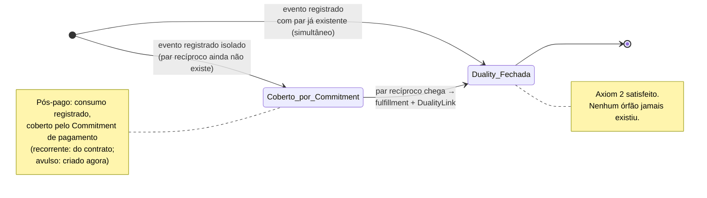
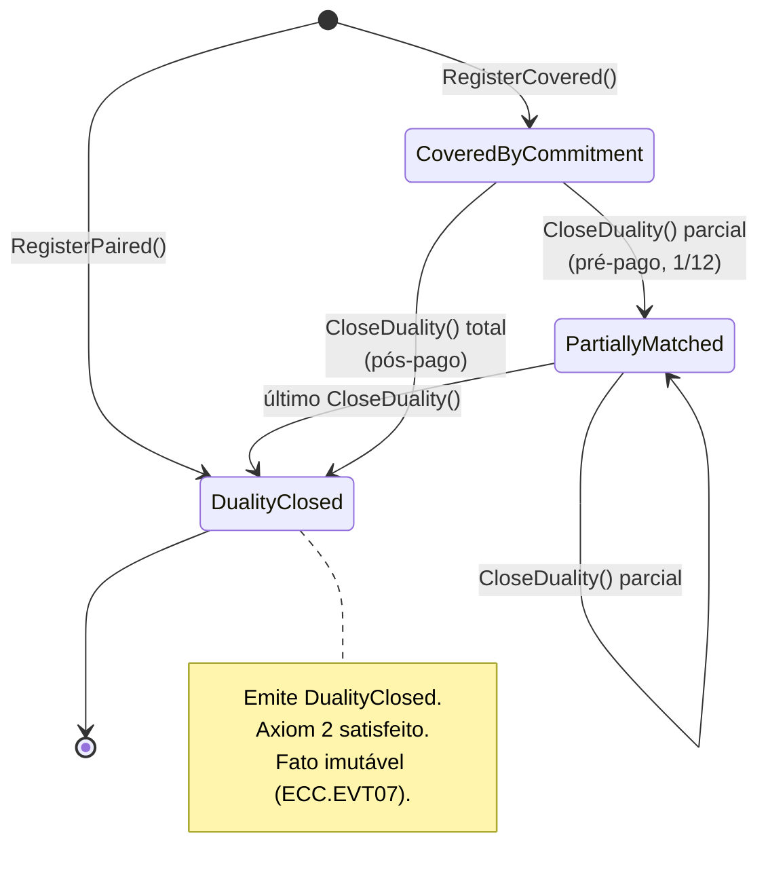
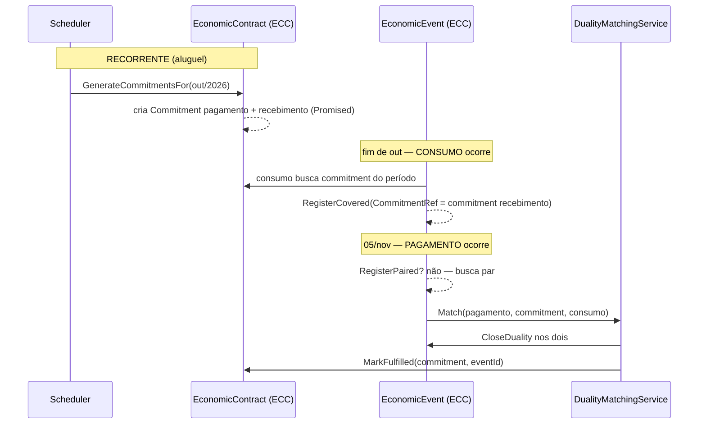

# Modelagem Tática REA → DDD/.NET — Aterrissagem do modelo conceitual

> **O que este documento é.** A camada que faltava entre a ontologia REA (documento `Modelo-REA-Conceitual.md`) e o código C#. Aqui o grafo REA é **cortado em aggregates** com fronteiras de consistência reais, value objects, smart enums, invariantes com código de erro, domain events e strongly-typed IDs — exatamente no formato que o codegen `.NET` espera consumir.
>
> **Decisões de arquitetura já fechadas com você** (viram premissas aqui):
> - Modelo **REA puro** governa o código (não a estrutura `Payable`-cêntrica do `Consolidado.md`).
> - Dualidade por **consistência eventual** (D-R13).
> - **Anti-orfandade via `Commitment`**, não via "evento pendente": todo `EconomicEvent` registrado isolado tem, na mesma transação, ou uma `duality` fechada **ou** um `Commitment` recíproco em aberto que o cubra.
> - **Recorrente:** o `EconomicContract` cria o `Commitment` de pagamento antecipadamente; o consumo se associa a ele. **Avulso:** o consumo cria o `Commitment`.
> - DRE **por competência** (D-R11): o evento de consumo é cidadão de primeira classe, com timestamp próprio, separado do pagamento.
> - Financiamento **fora de escopo** (D-R12).
> - Walking Skeleton = **pós-pago do aluguel**.
> - **Um único bounded context** no início: `EconomicCore.Domain` reúne registro operacional (eventos, recursos, agentes) **e** infraestrutura prospectiva (contratos, commitments). Decisão D-R14, justificada em §3.1. `Knowledge.Domain` (type-images + policies) é **extração planejada para a Fase 5**, não um BC desde já. Sigla de erro única: **`ECC`**.
> - Stack: **.NET 8+, DDD tático, Clean Architecture, EF Core + PostgreSQL, mediator próprio, multi-tenant por `TenantId` em linha**.
>
> **Convenções de código** seguem `domain-codegen-ddd-dotnet`: aggregate root `sealed`, IDs strongly-typed (`record struct : IEntityId<TSelf>`), VO herdando de `ValueObject` (não record), smart enum herdando de `Enumeration` (não enum nativo), erros via factory `<Aggregate>Errors` com ID `<BC>.<AGG>##`, eventos `sealed record : IDomainEvent`, sem `DateTime.UtcNow` inline.

---

## Índice

1. O problema de cortar o grafo REA em aggregates
2. Decisão de fronteiras — o teste do "mesmo instante" aplicado ao REA
3. Mapa de aggregates e a decisão de bounded context único
4. A invariante de anti-orfandade (o coração da Fase 1)
5. EconomicCore — design tático completo (registro operacional)
6. EconomicCore — design tático completo (contratos e commitments)
7. Strongly-typed IDs, Value Objects e Smart Enums compartilhados
8. Domain Events e o fluxo eventual de fechamento da dualidade
9. Recorte da Fase 1 (Walking Skeleton do aluguel pós-pago)
10. Decisão de persistência: event sourcing nos EconomicEvents?
11. Mapa modelo conceitual → tático (rastreabilidade)
12. Pontos a confirmar antes do codegen
13. SeedWork — bases canônicas do `EconomicCore.Domain`

---

## 1. O problema de cortar o grafo REA em aggregates

O REA conceitual é um grafo onde tudo se liga: `EconomicEvent` ↔ `EconomicResource` (stock-flow), ↔ `EconomicAgent` (participation), ↔ outro `EconomicEvent` (duality), ↔ `Commitment` (fulfillment). Traduzir isso ingenuamente para DDD produz um **aggregate gigante** — o anti-padrão nº 1 de Vernon: carregar um pagamento puxaria recurso, dois agentes, o evento recíproco e o compromisso, tudo numa transação.

A saída é a regra 2 de Vernon: **referenciar outros aggregates por identidade (id), não por objeto**, e aceitar consistência eventual entre eles. O REA combina surpreendentemente bem com isso, porque suas relações já são quase todas *associações entre coisas com identidade própria* — exatamente o que vira "referência por id entre aggregates".

A pergunta-mãe que decide cada fronteira (da skill de codegen): **"esses objetos PRECISAM mudar juntos na MESMA transação para manter alguma regra consistente?"** Se sim, mesmo aggregate. Se podem ficar consistentes depois, aggregates separados ligados por id + domain event.

---

## 2. Decisão de fronteiras — o teste do "mesmo instante" aplicado ao REA

Aplico o teste a cada relação REA:

| Relação REA | Precisa de atomicidade? | Decisão de fronteira |
|---|---|---|
| `EconomicEvent` ↔ `EconomicResource` (stock-flow) | **Sim** — um evento sem o recurso que ele move é malformado; a direção (in/out) e o recurso afetado têm que ser válidos no instante do registro. | O **stock-flow é interno** ao aggregate `EconomicEvent`: o evento referencia `EconomicResourceId` + direção + quantidade como VO interno. O recurso em si é **outro aggregate** (referência por id). |
| `EconomicEvent` ↔ `EconomicAgent` (participation) | **Sim** — Axiom 3: todo evento de troca tem um provider e um recipient válidos no registro. | A **participation é interna** ao `EconomicEvent` (VOs `Participation` com `AgentId` + papel). Os agentes são **outros aggregates** (referência por id). |
| `EconomicEvent` (out) ↔ `EconomicEvent` (in) (duality) | **NÃO** — você escolheu consistência eventual (D-R13). Os dois eventos ocorrem em momentos diferentes (pós-pago: consumo em out, pagamento em nov). | **Aggregates separados.** A duality é uma **referência por id** entre dois `EconomicEvent`, fechada por domain event. Esta é a decisão central. |
| `Commitment` ↔ `EconomicEvent` (fulfillment) | **NÃO** — o commitment nasce antes (no contrato/consumo), o evento que o cumpre vem depois. | **Aggregates separados.** Fulfillment é referência por id, fechada por domain event. |
| `Commitment` ↔ `Commitment` (reciprocal) | **Sim** — a reciprocidade define o commitment; um commitment de outflow sem o recíproco de inflow é malformado (no nível do conhecimento). | **Interno** ao aggregate `EconomicContract` (que agrupa os commitments recíprocos como `bundle`). |
| `EconomicContract` ↔ `Commitment` (bundle) | **Sim** — o contrato é a fronteira de consistência dos seus commitments; gerar/cancelar commitments recorrentes é regra do contrato. | `Commitment` é **Entity interna** do aggregate `EconomicContract`. |
| `EconomicResourceType` ↔ `EconomicResource` (caracteriza) | **NÃO** — o tipo é conhecimento estável, o recurso é instância. | **Aggregates separados** (o tipo vive no BC de Conhecimento). |

> **A decisão que tudo gira em torno:** a **duality é inter-aggregate, eventual**. Dois `EconomicEvent` são aggregates independentes; o pareamento é uma referência (`DualityLink`) preenchida por um domain event quando o segundo evento chega. É exatamente o que você pediu — e a anti-orfandade (§4) é o que impede que isso vire um buraco.

---

## 3. Mapa de aggregates e a decisão de bounded context único

### 3.1 Por que um único bounded context agora (D-R14)

A versão anterior deste documento propunha três BCs (EconomicRegistry, Commitments, Knowledge). Reavaliando pelo critério estrito de Evans/Vernon — e não pela pureza ontológica — isso era **supersegmentação**. Os três sintomas de exagero que Vernon lista estavam todos presentes:

- **BC vazio:** `Knowledge` não teria nenhum aggregate até a Fase 5 — uma pasta reservada, não um contexto.
- **BC magrelo:** `Commitments` teria 1–2 aggregates.
- **Operação central cruzando fronteiras:** o fechamento da dualidade — a operação mais frequente do sistema — lê o commitment, fecha a duality e chama `MarkFulfilled`, atravessando EconomicRegistry↔Commitments em quase toda execução. É exatamente o "toda mudança real exige mexer em 2 BCs" que Vernon manda evitar.

**Decisão:** **um único BC `EconomicCore.Domain`** reúne registro operacional e infraestrutura prospectiva. O eixo horizontal de Geerts & McCarthy (operacional ⟂ conhecimento) é real, mas no início ele separa coisas que **conversam demais** (evento e commitment via fulfillment). Onde o eixo *realmente* representa forças divergentes é entre o operacional e as **type-images/policies** — que são configuração quase-estática, mexida por um perfil diferente (admin), com cadência diferente (raramente). Essa é a separação que vale — **mais tarde**.

**Plano de extração:** `Knowledge.Domain` (type-images + policies) será extraído na **Fase 5**, *quando* doer (Conway + ciclo de vida divergentes justificam aí). Princípio de Vernon: comece com poucos contextos, extraia quando a fricção justificar — nunca antes. Em resumo: **1 BC agora, 2 na Fase 5, nunca 3.**

> Os contextos de **Supporting** (`KnowledgeAcquisition` = captura, `TransferExecution` = PSP) permanecem candidatos a BC próprio nas Fases 3–4, porque ali a divergência de força é genuína (dados sujos de captura, vocabulário externo do PSP via ACL) — e eles **não** estão no caminho crítico do matching. A consolidação D-R14 vale para o núcleo (registro + commitments), não para os supporting.

### 3.2 Aggregates do `EconomicCore.Domain` (Core, BC único)

Um projeto `.NET`: `EconomicCore.Domain/`. Aggregates direto na raiz. Sigla de erro: **`ECC`**. Internamente, organizo em duas regiões de pasta (`Operational/` e `Prospective/`) só para legibilidade — **não** são sub-BCs, e nada impede um referenciar o outro por id dentro do mesmo contexto.

**Região operacional** (o que aconteceu):

| Aggregate Root | Papel REA | Entities internas | Fase |
|---|---|---|---|
| `EconomicEvent` | Fato consumado (inflow ou outflow). Contém stock-flow e participations. | — (VOs internos) | **1** |
| `EconomicResource` | Recurso sob controle (Caixa, Serviço-consumido). | — | **1** |
| `EconomicAgent` | Parte econômica (fornecedor, cliente, governo, unidade interna). | — | **1** |

**Região prospectiva** (o que foi prometido):

| Aggregate Root | Papel REA | Entities internas | Fase |
|---|---|---|---|
| `EconomicContract` | Acordo que agrupa (bundle) compromissos recíprocos recorrentes. Fonte da promessa. | `Commitment` (ocorrência periódica) | **1 (mínimo)** |
| `StandaloneCommitment` | Compromisso avulso (despesa pós-paga sem contrato recorrente). | — | **2** |

> `EconomicClaim` (a pagar / a receber) **não é aggregate** — é **read model derivado** (§5.5): a soma dos eventos sem duality fechada. McCarthy: claim é derivado, não primitivo (D-R03).

### 3.3 Bounded contexts futuros (extração planejada, não criados agora)

| BC futuro | Conteúdo | Quando extrair | Por quê é BC próprio (e não parte do Core) |
|---|---|---|---|
| `Knowledge.Domain` (Core) | `EconomicResourceType`, `EconomicEventType`, `EconomicRole`, `Policy` (8 travas + 2 gates) | Fase 5 | Configuração quase-estática, perfil/cadência diferentes (admin, raro) — força divergente real. |
| `KnowledgeAcquisition.Domain` (Supporting) | `CaptureTask` (e-mail/OCR/score) | Fase 4 | Dados sujos não podem contaminar o Core; ACL por fonte. Fora do caminho crítico. |
| `TransferExecution.Domain` (Supporting) | `TransferOrder` (PSP, retry, idempotência) | Fase 3–4 | Vocabulário externo do PSP via ACL; mecânica de realização, não ontologia. |

> **Apuração & Apresentação** (DRE, balanço, margem) não tem aggregate — são **read models** derivados do stream de eventos do `EconomicCore` (§5.5).

---

## 4. A invariante de anti-orfandade (o coração da Fase 1)

Esta é a tradução exata da sua ideia (corrigida e generalizada). Em consistência eventual, a dualidade não fecha na mesma transação — mas você não quer órfãos. A garantia:

> **INV-ANTIORPHAN.** Todo `EconomicEvent` registrado deve ter, no instante do commit, **uma de duas coberturas**:
> (a) uma `DualityLink` apontando para o `EconomicEvent` recíproco já existente, **ou**
> (b) um `CommitmentRef` apontando para um `Commitment` em aberto que promete o evento recíproco.
>
> Um evento sem (a) e sem (b) é **órfão** e é **proibido** — o registro falha com erro de domínio.

Como isso cobre os três padrões temporais sem nenhum "evento pendente":



| Padrão | 1º evento a chegar | Cobertura no registro do 1º | Fechamento |
|---|---|---|---|
| **Pós-pago** (aluguel) | consumo (out) | `CommitmentRef` → commitment de pagamento (recorrente: já existe no contrato; avulso: criado agora) | pagamento (nov) chega → fulfillment → `DualityLink` |
| **Pré-pago** (seguro anual) | pagamento (jan) | `CommitmentRef` → commitments de consumo futuros (do contrato) | cada consumo mensal → fulfillment → `DualityLink` parcial |
| **Simultâneo** (material) | ambos juntos | `DualityLink` direta — sem commitment | já fechado no registro |

> **Por que isto é melhor que "evento de pagamento pendente":** um `Commitment` é ontologicamente uma promessa (não entra em caixa nem na DRE de competência); um "evento pendente" seria um `EconomicEvent` que precisaria ser filtrado de toda derivação financeira — um campo `status` à espera de ser esquecido. Aqui a separação é estrutural: eventos são fatos, commitments são promessas, e a anti-orfandade é uma invariante verificável, não uma convenção.

---

## 5. EconomicCore — design tático completo (registro operacional)

A região operacional do BC `EconomicCore`. Três aggregates pequenos. Sigla de erro do BC: **`ECC`**.

### 5.1 Aggregate Root: `EconomicEvent`

**Representa** um fato econômico consumado: uma transferência de posse de um recurso, num instante, entre agentes. **Imutável após registro** (um fato não muda) — a única mutação permitida é o **fechamento da dualidade** (preencher a `DualityLink`), que é a chegada da informação do par recíproco, não uma alteração do fato em si.

**Identidade:** `EconomicEventId` (strongly-typed). Carrega `TenantId` na identidade.

**Estrutura (campos):**
- `EconomicEventId Id`
- `TenantId TenantId`
- `FlowDirection Direction` — smart enum: `Inflow | Outflow`
- `EconomicResourceId ResourceId` — referência ao recurso afetado (outro aggregate)
- `Money Amount` — quantidade movida
- `EventTimestamp OccurredAt` — quando o fato ocorreu (não quando foi registrado)
- `EconomicEventTypeId TypeId` — referência ao type image (nullable até Fase 5)
- `IReadOnlyCollection<Participation> Participations` — provider e recipient (VO interno)
- `DualityLink? Duality` — referência ao evento recíproco (null enquanto coberto por commitment)
- `CommitmentRef? CoveringCommitment` — referência ao commitment que cobre, enquanto a duality não fecha
- `CompetencePeriod Competence` — período de competência (para DRE); no consumo = período do serviço
- auditoria: `CreatedAt`, `CreatedBy`

**Value Objects internos:**
- `Participation` — `{ EconomicAgentId AgentId, ParticipationRole Role }` onde `Role` é smart enum `Provider | Recipient`.
- `DualityLink` — `{ EconomicEventId CounterpartEventId, Money MatchedAmount }` (MatchedAmount permite duality parcial no pré-pago: 1/12 por vez).
- `CommitmentRef` — `{ CommitmentId CommitmentId }` (referência intra-BC, por id — agregados distintos no mesmo contexto).
- `CompetencePeriod` — `{ int Year, int Month }` (ou DateRange).

**Comportamentos (métodos do Root):**
- `static EconomicEvent RegisterCovered(...)` — factory: registra um evento isolado **coberto por um commitment** (pós-pago/pré-pago, 1º a chegar). Exige `CommitmentRef`. Valida Axiom 1 (resource) e Axiom 3 (participations).
- `static EconomicEvent RegisterPaired(...)` — factory: registra um evento **já pareado** com o recíproco (simultâneo, ou o 2º a chegar). Exige par válido. Cria `DualityLink` em ambos.
- `CloseDuality(EconomicEventId counterpart, Money matchedAmount, DateTime occurredAt)` — fecha (ou fecha parcialmente) a dualidade quando o par recíproco chega. Move de "coberto por commitment" para "duality fechada". Emite `DualityClosed`.

**Invariantes (com código de erro):**

| ID | Invariante | Erro |
|---|---|---|
| `ECC.EVT01` | Todo evento tem ao menos um `Provider` e um `Recipient` distintos (Axiom 3). | `EconomicEventErrors.MissingParticipants()` |
| `ECC.EVT02` | `Amount` > 0 e moeda única (BRL no MVP). | `EconomicEventErrors.InvalidAmount()` |
| `ECC.EVT03` | `ResourceId` obrigatório — todo evento afeta um recurso identificável (Axiom 1). | `EconomicEventErrors.MissingResource()` |
| `ECC.EVT04` | No registro, exatamente uma cobertura: `Duality` **xor** `CoveringCommitment`. Nenhuma das duas = órfão (INV-ANTIORPHAN). | `EconomicEventErrors.OrphanEvent()` |
| `ECC.EVT05` | `CloseDuality` só é válido se o evento estava coberto por commitment (não pode re-parear um já pareado além do saldo). | `EconomicEventErrors.DualityAlreadyClosed()` |
| `ECC.EVT06` | `MatchedAmount` no fechamento ≤ saldo não pareado do evento (permite parcial no pré-pago, proíbe excesso). | `EconomicEventErrors.MatchExceedsBalance()` |
| `ECC.EVT07` | Fato é imutável: nenhum método altera `Amount`, `Direction`, `ResourceId`, `OccurredAt` após criação. | (garantido por ausência de setter público) |

**Domain Events emitidos:**
- `EconomicEventRegistered { EventId, TenantId, Direction, ResourceId, Amount, OccurredAt, Competence, CoveringCommitmentId? }`
- `DualityClosed { EventId, CounterpartEventId, MatchedAmount, OccurredAt }`

**Ciclo de vida:**



### 5.2 Aggregate Root: `EconomicResource`

**Representa** um recurso sob controle (Caixa/conta bancária, ou um "serviço-consumido" que registra o que foi recebido). **Identidade** persiste através de mudanças de saldo → Entity/Aggregate.

**Estrutura:**
- `EconomicResourceId Id`, `TenantId TenantId`
- `EconomicResourceTypeId TypeId` — referência ao tipo (nullable até Fase 5)
- `ResourceKind Kind` — smart enum: `Cash | Service | LaborService | FiscalObligation` (cobre os casos do §6.4 do conceitual)
- `string Name`
- `EconomicAgentId? CustodianId` — agente interno com custódia (ISO 3.15: controle físico, não econômico)

> **Decisão de saldo:** o `EconomicResource` **não** mantém saldo como campo mutável transacional. O saldo é **derivado** dos `EconomicEvents` (soma de inflows − outflows) num read model. Razão REA: o saldo é uma consequência dos fatos, não um fato em si; mantê-lo no aggregate criaria contenção de lock e duplicaria a verdade. (Confirmar no Ponto nº 12.3 — alternativa é saldo materializado com consistência eventual.)

**Invariantes:**

| ID | Invariante | Erro |
|---|---|---|
| `ECC.RES01` | `Name` não vazio, `MAX_LENGTH` 200. | `EconomicResourceErrors.InvalidName()` |
| `ECC.RES02` | `Kind` obrigatório. | `EconomicResourceErrors.MissingKind()` |
| `ECC.RES03` | `CustodianId`, se presente, refere agente interno (validado via domain service na criação — envolve 2 aggregates). | `EconomicResourceErrors.CustodianMustBeInternal()` |

**Domain Events:** `EconomicResourceRegistered`.

### 5.3 Aggregate Root: `EconomicAgent`

**Representa** uma parte econômica. Subtipo interno (`EconomicUnit`) é distinguido por flag, não por herança (mais simples para EF e suficiente).

**Estrutura:**
- `EconomicAgentId Id`, `TenantId TenantId`
- `AgentScope Scope` — smart enum: `Inside | Outside` (Axiom 3 depende disto)
- `string Name`
- `IReadOnlyCollection<EconomicRoleId> Roles` — papéis (Fase 5; vazio antes)
- dados de contato/identificação (CNPJ/CPF como VO `TaxId`, nullable)

**Invariantes:**

| ID | Invariante | Erro |
|---|---|---|
| `ECC.AGT01` | `Name` não vazio, `MAX_LENGTH` 200. | `EconomicAgentErrors.InvalidName()` |
| `ECC.AGT02` | `Scope` obrigatório. | `EconomicAgentErrors.MissingScope()` |
| `ECC.AGT03` | `TaxId`, se presente, válido (CPF/CNPJ). | `EconomicAgentErrors.InvalidTaxId()` |

**Domain Events:** `EconomicAgentRegistered`.

### 5.4 Domain Service: `DualityMatchingService`

A regra de **encontrar e fechar a dualidade** envolve **dois aggregates `EconomicEvent`** → é Domain Service (stateless, em `Services/`), não método de um aggregate. Sigla: **`ECC.DMS`**.

**Responsabilidade:** dado um evento recém-chegado (o pagamento, no pós-pago) e o commitment que ele cumpre, localizar o evento de consumo coberto por aquele commitment e chamar `CloseDuality` em ambos. Não emite eventos — os aggregates emitem `DualityClosed`.

```
DualityMatchingService.Match(paymentEvent, coveringCommitmentId, consumptionEvent, occurredAt):
  - valida que consumptionEvent estava coberto pelo mesmo commitment
  - paymentEvent.CloseDuality(consumptionEvent.Id, amount, occurredAt)
  - consumptionEvent.CloseDuality(paymentEvent.Id, amount, occurredAt)
  - (Application Service persiste os dois — exceção à regra "1 aggregate por transação",
     justificada: o fechamento simétrico da duality é a regra de consistência;
     alternativa eventual descrita no Ponto nº 12.2)
```

> **Atenção à regra de Vernon "1 transação = 1 aggregate".** Fechar a duality toca dois `EconomicEvent`. Duas opções (Ponto nº 12.2): **(a)** fechar os dois na mesma transação (viola a regra estrita, mas a duality é uma invariante de par — defensável); **(b)** fechar um, emitir `DualityClosed`, e um handler fecha o outro por consistência eventual (fiel à regra, mas a duality fica "meio-fechada" por milissegundos). Recomendo (a) para a duality, por ser uma invariante de par genuína — mas é decisão sua.

### 5.5 Read Models derivados (não são aggregates)

- **`EconomicClaimView`** — a pagar / a receber: eventos com `CoveringCommitment` mas sem `Duality` fechada. Soma por agente. **É o que sua `Payable` era**, agora derivada.
- **`ResourceBalanceView`** — saldo de cada recurso: Σ inflows − Σ outflows.
- **`CompetenceDREView`** — DRE por competência: eventos de consumo/prestação agrupados por `CompetencePeriod`.
- **`CashFlowView`** — fluxo de caixa: eventos sobre recurso `Cash` agrupados por período do pagamento.

Todos construídos por handlers que consomem `EconomicEventRegistered` e `DualityClosed`.

---

## 6. EconomicCore — design tático completo (contratos e commitments)

A região prospectiva do mesmo BC `EconomicCore`. Mesma sigla de erro: **`ECC`**.

### 6.1 Aggregate Root: `EconomicContract`

**Representa** o acordo recorrente que **agrupa (bundle)** os compromissos recíprocos e os **gera periodicamente**. É a fonte da promessa (sua decisão: recorrente → contrato cria o commitment antes). O contrato é a fronteira de consistência dos seus commitments → `Commitment` é **Entity interna**.

**Estrutura:**
- `EconomicContractId Id`, `TenantId TenantId`
- `EconomicAgentId CounterpartyId` — a outra parte (fornecedor/cliente; referência por id)
- `ContractDirection Direction` — smart enum: `Acquisition` (eu pago) | `Provision` (eu recebo)
- `RecurrencePattern Recurrence` — VO (periodicidade + âncora)
- `CommitmentTerms DefaultTerms` — VO (valor esperado, tolerância, janela)
- `ContractStatus Status` — smart enum: `Active | Suspended | Terminated`
- `IReadOnlyCollection<Commitment> Commitments` — as ocorrências geradas (Entity interna)

**Entity interna: `Commitment`**
- `CommitmentId Id` (identidade própria — cada ocorrência é única)
- `CommitmentDirection Direction` — `OutflowPromise | InflowPromise`
- `CompetencePeriod Period` — a qual período se refere (out/2026)
- `Money ExpectedAmount`
- `DateRange FulfillmentWindow` — janela em que deve ser cumprido
- `CommitmentStatus Status` — smart enum: `Promised | Reserved | Fulfilled | Expired | Cancelled`
- `ReciprocalLink Reciprocal` — VO: aponta o `CommitmentId` recíproco (o que recebo em troca)
- `EconomicEventId? FulfillingEventId` — preenchido quando cumprido (referência por id, intra-BC)

**Comportamentos do Root:**
- `static EconomicContract Create(...)` — factory.
- `GenerateCommitmentsFor(CompetencePeriod period, DateTime occurredAt)` — gera o par recíproco de commitments do período (o de pagamento **e** o de recebimento-do-serviço), em `Promised`. Emite `CommitmentsGenerated`.
- `MarkFulfilled(CommitmentId, EconomicEventId, DateTime occurredAt)` — liga o commitment ao evento que o cumpre. Emite `CommitmentFulfilled`.
- `Expire(CommitmentId, DateTime occurredAt)` — janela fechou sem cumprimento. Emite `CommitmentExpired`.
- `Terminate(...)`, `Suspend(...)`.

**Invariantes:**

| ID | Invariante | Erro |
|---|---|---|
| `ECC.CTR01` | Todo `Commitment` de outflow tem `ReciprocalLink` para um de inflow (reciprocidade — nível de conhecimento do Axiom 2). | `EconomicContractErrors.MissingReciprocal()` |
| `ECC.CTR02` | Não gerar dois commitments para o mesmo `Period` + `Direction` (idempotência de geração). | `EconomicContractErrors.DuplicateCommitmentForPeriod()` |
| `ECC.CTR03` | `MarkFulfilled` só de `Promised`/`Reserved`; não de `Cancelled`/`Expired` (salvo cumprimento tardio explícito). | `EconomicContractErrors.CannotFulfillInStatus()` |
| `ECC.CTR04` | `ExpectedAmount` > 0; divergência além da tolerância de `DefaultTerms` no fulfillment exige sinalização (não bloqueia, mas marca). | `EconomicContractErrors.AmountOutsideTolerance()` |
| `ECC.CTR05` | Contrato `Terminated` não gera novos commitments. | `EconomicContractErrors.ContractNotActive()` |

**Domain Events:** `EconomicContractCreated`, `CommitmentsGenerated`, `CommitmentFulfilled`, `CommitmentExpired`, `CommitmentCancelled`.

### 6.2 Aggregate Root: `StandaloneCommitment`

Para a **despesa avulsa pós-paga sem contrato recorrente** (sua decisão: avulso → o consumo cria o commitment). Mesma forma do `Commitment` interno, mas como aggregate próprio porque não tem contrato-pai. Status idêntico. Sigla: **`ECC.STD`**.

> Modelado separado (não como `EconomicContract` de uma ocorrência só) para não forçar a criação de um contrato fantasma a cada despesa avulsa — seria ruído. Confirmar no Ponto nº 12.4.

### 6.3 O fluxo recorrente vs. avulso (a sua decisão, em código)



Para o **avulso**, o primeiro passo (`GenerateCommitmentsFor`) não existe: o consumo cria um `StandaloneCommitment` na hora e se cobre com ele.

---

## 7. Strongly-typed IDs, Value Objects e Smart Enums compartilhados

### 7.1 Strongly-typed IDs (cada um `record struct : IEntityId<TSelf>`, sem `implicit operator`)

`EconomicEventId`, `EconomicResourceId`, `EconomicAgentId`, `EconomicContractId`, `CommitmentId`, `StandaloneCommitmentId`, `EconomicResourceTypeId`, `EconomicEventTypeId`, `EconomicRoleId`, `TenantId`, `UserId`.

### 7.2 Value Objects (herdam de `ValueObject`, igualdade por `GetEqualityComponents()`)

| VO | Componentes | BC |
|---|---|---|
| `Money` | `decimal Amount`, `Currency Currency` | shared kernel |
| `EventTimestamp` | `DateTime InstantUtc` | ECC |
| `CompetencePeriod` | `int Year`, `int Month` | shared kernel |
| `Participation` | `EconomicAgentId AgentId`, `ParticipationRole Role` | ECC |
| `DualityLink` | `EconomicEventId CounterpartEventId`, `Money MatchedAmount` | ECC |
| `CommitmentRef` | `CommitmentId CommitmentId` | ECC |
| `RecurrencePattern` | `Periodicity Periodicity`, `int AnchorDay` | ECC |
| `CommitmentTerms` | `Money ExpectedAmount`, `decimal TolerancePercent`, `int WindowDays` | ECC |
| `ReciprocalLink` | `CommitmentId ReciprocalCommitmentId` | ECC |
| `DateRange` | `DateOnly From`, `DateOnly To` | shared kernel |
| `TaxId` | `string Value`, `TaxIdKind Kind` (CPF/CNPJ) | shared kernel |

> **Shared kernel** (`Money`, `CompetencePeriod`, `DateRange`, `TaxId`) — pequeno e genuinamente universal, conforme Vernon permite. Em projeto separado `SharedKernel/`.

### 7.3 Smart Enums (herdam de `Enumeration`, instâncias `public static readonly`)

`FlowDirection (Inflow|Outflow)`, `ParticipationRole (Provider|Recipient)`, `ResourceKind (Cash|Service|LaborService|FiscalObligation)`, `AgentScope (Inside|Outside)`, `ContractDirection (Acquisition|Provision)`, `CommitmentDirection (OutflowPromise|InflowPromise)`, `CommitmentStatus (Promised|Reserved|Fulfilled|Expired|Cancelled)`, `ContractStatus (Active|Suspended|Terminated)`, `Currency (BRL)`, `Periodicity (Monthly|Weekly|Yearly)`, `TaxIdKind (CPF|CNPJ)`.

---

## 8. Domain Events e o fluxo eventual de fechamento da dualidade

Os eventos que cruzam bounded contexts (Published Language), drenados via `PullDomainEvents()` e despachados após persistir:

| Evento | Emitido por | Consumido por | Efeito |
|---|---|---|---|
| `CommitmentsGenerated` | `EconomicContract` (ECC) | read model de previsão | mostra gastos futuros (o que você queria: "prever gastos futuros") |
| `EconomicEventRegistered` | `EconomicEvent` (ECC) | read models (claim, saldo, DRE, caixa); `DualityMatchingService` | atualiza projeções; dispara busca de par |
| `DualityClosed` | `EconomicEvent` (ECC) | read model de claim (baixa); DRE | claim some quando duality fecha |
| `CommitmentFulfilled` | `EconomicContract` (ECC) | read model de previsão | tira da previsão (virou fato) |
| `CommitmentExpired` | `EconomicContract` (ECC) | alertas ("sua conta não chegou") | a automação que justifica o produto |

> **"Prever gastos futuros" (parte da sua ideia) está resolvido aqui:** os `Commitment` em `Promised`/`Reserved` **são** a previsão de gastos. Um read model que soma os commitments de outflow não-cumpridos por período futuro dá exatamente a projeção de desembolsos — sem precisar de "eventos pendentes". Promessa é promessa; fato é fato.

---

## 9. Recorte da Fase 1 (Walking Skeleton do aluguel pós-pago)

**O que entrega ao usuário:** registrar o consumo do aluguel (fim do mês), registrar o pagamento (mês seguinte), o sistema fecha a dualidade automaticamente, e a despesa aparece na DRE no **mês da competência** (consumo), enquanto o caixa aparece no mês do pagamento. Sem órfãos. Substitui a planilha com competência correta.

**Bounded context:** `EconomicCore` (regiões operacional completa + prospectiva mínima: contrato + geração + fulfillment) + Identity (genérico, externo).

**Aggregates implementados:**
- `EconomicEvent` (ECC) — `RegisterCovered`, `RegisterPaired`, `CloseDuality`.
- `EconomicResource` (ECC) — `Create` (Caixa e Serviço-aluguel).
- `EconomicAgent` (ECC) — `Create` (a empresa = Inside; o locador = Outside).
- `EconomicContract` (ECC) — `Create`, `GenerateCommitmentsFor`, `MarkFulfilled`, `Expire`.
- `DualityMatchingService` (ECC).

**Commands/Queries (mediator próprio):**
- `RegisterEconomicContractCommand`
- `GenerateCommitmentsCommand` (chamado por scheduler)
- `RegisterConsumptionEventCommand` (o consumo, coberto pelo commitment)
- `RegisterPaymentEventCommand` (o pagamento, dispara matching)
- `ListClaimsQuery` (a pagar), `GetCompetenceDREQuery`, `GetCashFlowQuery`, `ListUpcomingCommitmentsQuery` (previsão)

**Domain Events ativos:** `EconomicContractCreated`, `CommitmentsGenerated`, `EconomicEventRegistered`, `DualityClosed`, `CommitmentFulfilled`, `CommitmentExpired`.

**Read models:** `EconomicClaimView`, `CompetenceDREView`, `CashFlowView`, `ResourceBalanceView`, `UpcomingCommitmentsView`.

**Critério de pronto:**
1. Consumo do aluguel de out registrado, coberto pelo commitment do contrato — **sem órfão** (INV-ANTIORPHAN testada).
2. Pagamento em nov fecha a duality automaticamente (`DualityClosed` emitido).
3. DRE de **outubro** mostra a despesa; fluxo de caixa de **novembro** mostra a saída. As duas não divergem.
4. Multi-tenant: tenant A não vê dado de B (teste explícito).
5. Previsão lista o commitment de nov antes de ele virar fato.

**O que NÃO entra:** captura de boleto (Fase 4); execução via PSP (Fase 3-4 — no MVP o pagamento é registrado manualmente após pagar fora); policies/travas (Fase 5); pré-pago e prestação ao cliente (Fases 2-3); avulso (`StandaloneCommitment`, Fase 2).

**Risco principal:** a decisão de persistência (§10) e a do matching transacional (§12.2) precisam estar resolvidas — refatorar depois é caro.

---

## 10. Decisão de persistência: event sourcing nos EconomicEvents?

Esta decisão **não pode ser adiada** porque a skill de codegen alerta: o padrão Event-Sourced (A+ES) é **incompatível** com os templates tradicionais — não dá para misturar depois sem reescrever.

**O argumento a favor de A+ES no `EconomicEvent`:** o registro econômico REA **já é**, por natureza, um log append-only de fatos imutáveis. `EconomicEvent` nunca muda (ECC.EVT07) exceto pelo fechamento da duality. Isso é praticamente a definição de um event store. E a auditabilidade total (seu objetivo nº 1) é o que A+ES entrega de graça.

**O argumento contra (e por que recomendo tradicional no MVP):**
- O `EconomicEvent` tem mutação real (CloseDuality), então não é puramente append.
- A skill gera **tradicional** por padrão; A+ES exige consultar `references/event-sourcing-overview.md` e tem estrutura própria.
- Para o Walking Skeleton, persistência tradicional (snapshot via EF Core) com os domain events indo para um **Outbox** já dá auditabilidade suficiente e é mais rápida de prototipar.

**Recomendação:** **tradicional (EF Core + Outbox) no MVP**, com o modelo desenhado de forma que os domain events já existentes (`EconomicEventRegistered`, `DualityClosed`) sejam o stream natural caso você migre para A+ES depois. Como o `EconomicEvent` é quase-imutável, a migração futura é viável. **Confirmar no Ponto nº 12.1** — se você quiser A+ES desde já, eu modelo diferente (e o codegen segue outro template).

---

## 11. Mapa modelo conceitual → tático (rastreabilidade)

| Conceito REA (documento conceitual) | Elemento tático |
|---|---|
| `EconomicEvent` (Entity) | Aggregate Root `EconomicEvent` (ECC) |
| `EconomicResource` (Entity) | Aggregate Root `EconomicResource` (ECC) |
| `EconomicAgent` / `EconomicUnit` | Aggregate Root `EconomicAgent` + `AgentScope` |
| `StockFlow` (relação) | VO interno: `Direction` + `ResourceId` + `Amount` no `EconomicEvent` |
| `Participation` (relação) | VO interno `Participation` no `EconomicEvent` |
| `Duality` (relação) | VO `DualityLink` (inter-aggregate, eventual) + `DualityMatchingService` |
| `EconomicClaim` (derivado) | Read model `EconomicClaimView` |
| `Commitment` (Entity) | Entity interna `Commitment` do `EconomicContract`; ou `StandaloneCommitment` (avulso) |
| `EconomicContract` / `Agreement` | Aggregate Root `EconomicContract` (ECC) |
| `Reciprocal` (relação) | VO `ReciprocalLink` |
| `Reservation` (relação) | `CommitmentStatus.Reserved` + `CommitmentRef` no evento |
| `Fulfillment` (relação) | `MarkFulfilled` + `FulfillingEventId` + `CommitmentFulfilled` |
| `RecurrencePattern`, `CommitmentTerms` | VOs homônimos |
| Type Images | Aggregates do `Knowledge.Domain` (Fase 5) |
| Policies (8 travas) | Aggregate `Policy` (Fase 5) |
| Captura (tasks) | Aggregate `CaptureTask` (Fase 4) |
| Actualization | Aggregate `TransferOrder` (Fase 3-4) |
| DRE/Balanço (views) | Read models `CompetenceDREView`, etc. |
| Axiom 2 (dualidade) | INV-ANTIORPHAN (`ECC.EVT04`) + `DualityLink` |
| Axiom 1 (recurso) | `ECC.EVT03` |
| Axiom 3 (in/out agent) | `ECC.EVT01` + `AgentScope` |

---

## 12. Pontos a confirmar antes do codegen

1. **Persistência (§10):** tradicional EF Core + Outbox no MVP (recomendado), ou A+ES desde já nos `EconomicEvents`?
2. **Matching transacional (§5.4):** fechar a duality nos dois eventos na mesma transação (recomendado, invariante de par) ou por consistência eventual (um evento + handler fecha o outro)?
3. **Saldo do recurso (§5.2):** derivado por read model (recomendado) ou materializado no aggregate com consistência eventual?
4. **Avulso (§6.2):** `StandaloneCommitment` como aggregate próprio (recomendado) ou `EconomicContract` de ocorrência única?
5. **Siglas de erro:** ✅ decidido — sigla única **`ECC`** (EconomicCore) para todos os aggregates do núcleo (`ECC.EVT##`, `ECC.RES##`, `ECC.AGT##`, `ECC.CTR##`, `ECC.STD##`, `ECC.DMS##`).
6. **Namespaces/projetos:** ✅ decidido — **`EconomicCore.Domain`** (BC único do núcleo) + **`SharedKernel`** (Money, CompetencePeriod, DateRange, TaxId). `Knowledge.Domain` só na Fase 5.

> Resolvidos esses seis, o próximo passo é o **codegen do domínio da Fase 1** — começando pelo SeedWork (se não existir), depois IDs, smart enums, VOs, domain events, e os aggregates `EconomicEvent` → `EconomicResource` → `EconomicAgent` → `EconomicContract`, mais o `DualityMatchingService`. Application Services, repositories, EF config e testes vêm depois, por pedido explícito.

---

*Modelagem tática REA → DDD/.NET. Aterrissa o `Modelo-REA-Conceitual.md` no formato consumível pelo codegen `domain-codegen-ddd-dotnet`. Bounded context único `EconomicCore.Domain` (D-R14); `Knowledge` extraído na Fase 5. Escopo de detalhe fino: Fase 1 (aluguel pós-pago). Demais contextos mapeados, detalhamento tático fino sob demanda por fase.*

---

## 13. SeedWork — bases canônicas do `EconomicCore.Domain`

> Reproduzidas **exatamente** conforme `domain-codegen-ddd-dotnet` (templates canônicos). Não substituir por records, não simplificar. Namespace: `EconomicCore.Domain.SeedWork`. A sigla de erro `SWK` é **reservada** para o SeedWork.
>
> **Nota de stack (.NET 8+):** os strongly-typed IDs usam `Guid.CreateVersion7()` (ordenação temporal, ideal para índice clusterizado). Isso requer **.NET 9+**. Em **.NET 8**, troque por `Guid.NewGuid()` ou use o package `UUIDNext`. Decida no setup do projeto.

### 13.1 `IEntityId.cs`

```csharp
// EconomicCore.Domain/SeedWork/IEntityId.cs
namespace EconomicCore.Domain.SeedWork;

/// <summary>
/// Contrato comum para todos os strongly-typed Ids do domínio.
/// Cada Aggregate/Entity define seu próprio record struct (EconomicEventId, etc.)
/// que implementa este contrato. Permite que Entity&lt;TId&gt; construa novos Ids sem reflexão.
/// </summary>
public interface IEntityId<TSelf> where TSelf : struct, IEntityId<TSelf>
{
    Guid Value { get; }
    static abstract TSelf New();
    static abstract TSelf From(Guid value);
    static abstract TSelf Empty { get; }
}
```

### 13.2 `Entity.cs`

```csharp
// EconomicCore.Domain/SeedWork/Entity.cs
namespace EconomicCore.Domain.SeedWork;

public abstract class Entity<TId> where TId : struct, IEntityId<TId>
{
    private int? _requestedHashCode;
    private TId _Id;

    public DateTime CreatedAt { get; protected set; }
    public DateTime UpdatedAt { get; protected set; }

    protected Entity()
    {
        _Id = TId.New();
    }

    protected Entity(TId id)
    {
        if (id.Equals(TId.Empty))
            throw SeedWorkErrors.EmptyId(this.GetType().Name);
        _Id = id;
    }

    public virtual TId Id
    {
        get => _Id;
        protected set
        {
            if (value.Equals(TId.Empty))
                throw SeedWorkErrors.EmptyId(this.GetType().Name);
            _Id = value;
        }
    }

    public bool IsTransient() => this.Id.Equals(TId.Empty);

    public override bool Equals(object? obj)
    {
        if (obj == null || obj is not Entity<TId>)
            return false;
        if (Object.ReferenceEquals(this, obj))
            return true;
        if (this.GetType() != obj.GetType())
            return false;

        Entity<TId> item = (Entity<TId>)obj;
        if (item.IsTransient() || this.IsTransient())
            return false;
        return item.Id.Equals(this.Id);
    }

    public override int GetHashCode()
    {
        if (!IsTransient())
        {
            if (!_requestedHashCode.HasValue)
                _requestedHashCode = this.Id.GetHashCode() ^ 31;
            return _requestedHashCode.Value;
        }
        return base.GetHashCode();
    }

    public static bool operator ==(Entity<TId> left, Entity<TId> right)
    {
        if (Object.Equals(left, null))
            return Object.Equals(right, null);
        return left.Equals(right);
    }

    public static bool operator !=(Entity<TId> left, Entity<TId> right) => !(left == right);
}
```

### 13.3 `AggregateRoot.cs`

```csharp
// EconomicCore.Domain/SeedWork/AggregateRoot.cs
namespace EconomicCore.Domain.SeedWork;

public abstract class AggregateRoot<TId> : Entity<TId> where TId : struct, IEntityId<TId>
{
    private readonly List<IDomainEvent> _domainEvents = [];
    public IReadOnlyCollection<IDomainEvent> DomainEvents => _domainEvents.AsReadOnly();

    protected AggregateRoot() : base() { }
    protected AggregateRoot(TId id) : base(id) { }

    protected void AddDomainEvent(IDomainEvent eventItem) => _domainEvents.Add(eventItem);
    protected void RemoveDomainEvent(IDomainEvent eventItem) => _domainEvents.Remove(eventItem);
    public void ClearDomainEvents() => _domainEvents.Clear();

    /// <summary>Drains accumulated events. Called by the repository/UoW after persisting, to forward to the Outbox.</summary>
    public IReadOnlyList<IDomainEvent> PullDomainEvents()
    {
        var events = _domainEvents.ToList();
        _domainEvents.Clear();
        return events;
    }
}
```

### 13.4 `ValueObject.cs`

```csharp
// EconomicCore.Domain/SeedWork/ValueObject.cs
namespace EconomicCore.Domain.SeedWork;

using System.Reflection;

public abstract class ValueObject
{
    protected static bool EqualOperator(ValueObject left, ValueObject right)
    {
        if (left is null ^ right is null)
            return false;
        return left is null || left.Equals(right);
    }

    protected static bool NotEqualOperator(ValueObject left, ValueObject right)
        => !(EqualOperator(left, right));

    protected abstract IEnumerable<object?> GetEqualityComponents();

    public override bool Equals(object? obj)
    {
        if (obj == null)
            return false;
        try
        {
            var other = (ValueObject)obj;
            return this.GetEqualityComponents().SequenceEqual(other.GetEqualityComponents());
        }
        catch
        {
            return false;
        }
    }

    public override int GetHashCode()
        => GetEqualityComponents()
            .Select(x => x != null ? x.GetHashCode() : 0)
            .Aggregate((x, y) => x ^ y);

    public ValueObject GetCopy()
        => this.MemberwiseClone() as ValueObject ?? throw new NullReferenceException();
}
```

> A versão canônica inclui um `ToString()` por reflexão (omitido aqui por brevidade — copiar do template da skill ao gerar). O contrato essencial é `GetEqualityComponents()`.

### 13.5 `Enumeration.cs`

```csharp
// EconomicCore.Domain/SeedWork/Enumeration.cs
namespace EconomicCore.Domain.SeedWork;

using System.Reflection;

public abstract class Enumeration : IComparable
{
    public string Name { get; private set; }
    public int Id { get; private set; }

    protected Enumeration(int id, string name) => (Id, Name) = (id, name);

    public override string ToString() => Name;

    public static IEnumerable<T> GetAll<T>() where T : Enumeration =>
        typeof(T).GetFields(BindingFlags.Public | BindingFlags.Static | BindingFlags.DeclaredOnly)
                 .Select(f => f.GetValue(null))
                 .Cast<T>();

    public override bool Equals(object? obj)
    {
        if (obj is not Enumeration otherValue)
            return false;
        var typeMatches = GetType().Equals(obj.GetType());
        var valueMatches = Id.Equals(otherValue.Id);
        return typeMatches && valueMatches;
    }

    public override int GetHashCode() => Id.GetHashCode();

    public static T FromValue<T>(int value) where T : Enumeration
        => Parse<T, int>(value, "value", item => item.Id == value);

    public static T FromDisplayName<T>(string displayName) where T : Enumeration
        => Parse<T, string>(displayName, "display name",
            item => item.Name.Equals(displayName, StringComparison.CurrentCultureIgnoreCase));

    private static T Parse<T, K>(K value, string description, Func<T, bool> predicate) where T : Enumeration
        => GetAll<T>().FirstOrDefault(predicate)
           ?? throw new InvalidOperationException($"'{value}' is not a valid {description} in {typeof(T)}");

    public int CompareTo(object? other) => Id.CompareTo(((Enumeration?)other)?.Id);
}
```

> Métodos auxiliares completos (`TryFromValue`, `TryFromDisplayName`, `AbsoluteDifference`) no template da skill — copiar ao gerar.

### 13.6 `IDomainEvent.cs`

```csharp
// EconomicCore.Domain/SeedWork/IDomainEvent.cs
namespace EconomicCore.Domain.SeedWork;

public interface IDomainEvent
{
    Guid EventId { get; }
    DateTime OccurredAt { get; }
}
```

### 13.7 `DomainException.cs`

```csharp
// EconomicCore.Domain/SeedWork/DomainException.cs
namespace EconomicCore.Domain.SeedWork;

using System.Text.RegularExpressions;

public sealed class DomainException : Exception
{
    // aceita XXX## (ex.: SWK01) e XXX.YYY## (ex.: ECC.EVT04)
    private static readonly Regex ID_PATTERN =
        new(@"^[A-Z]{3}(\.[A-Z]{3})?\d+$", RegexOptions.Compiled);

    public string Id { get; }
    public string MessageTemplate { get; }
    public IReadOnlyList<object> Parameters { get; }
    public string SourcePath { get; }

    public DomainException(
        string id,
        string messageTemplate,
        IReadOnlyList<object> parameters,
        string sourcePath)
        : base(BuildMessage(messageTemplate, parameters))
    {
        if (string.IsNullOrWhiteSpace(id))
            throw new ArgumentException("Id is required.", nameof(id));
        if (!ID_PATTERN.IsMatch(id))
            throw new ArgumentException($"Id '{id}' does not match pattern XXX## or XXX.YYY##.", nameof(id));
        if (string.IsNullOrWhiteSpace(messageTemplate))
            throw new ArgumentException("MessageTemplate is required.", nameof(messageTemplate));
        if (parameters is null)
            throw new ArgumentNullException(nameof(parameters));
        if (parameters.Any(p => p is null))
            throw new ArgumentException("Parameters cannot contain null values.", nameof(parameters));
        if (string.IsNullOrWhiteSpace(sourcePath))
            throw new ArgumentException("SourcePath is required.", nameof(sourcePath));

        Id = id;
        MessageTemplate = messageTemplate;
        Parameters = parameters;
        SourcePath = sourcePath;
    }

    private static string BuildMessage(string template, IReadOnlyList<object> parameters)
    {
        if (string.IsNullOrWhiteSpace(template))
            return template ?? string.Empty;
        if (parameters is null || parameters.Count == 0)
            return template;
        return string.Format(template, parameters.ToArray());
    }

    public override string ToString() => $"[{Id}] {Message} | at {SourcePath}";
}
```

### 13.8 `SeedWorkErrors.cs`

```csharp
// EconomicCore.Domain/SeedWork/SeedWorkErrors.cs
namespace EconomicCore.Domain.SeedWork;

using System.IO;
using System.Runtime.CompilerServices;

// SeedWork (SWK) — erros transversais lançados pelas classes-base
public static class SeedWorkErrors
{
    private const string BC_PREFIX = "SWK";

    public static DomainException EmptyId(
        string entityTypeName,
        [CallerFilePath] string filePath = "",
        [CallerMemberName] string memberName = "",
        [CallerLineNumber] int lineNumber = 0)
        => new(
            id: $"{BC_PREFIX}01",
            messageTemplate: "Id de {0} não pode ser Guid.Empty.",
            parameters: new object[] { entityTypeName },
            sourcePath: BuildSourcePath(filePath, memberName, lineNumber));

    private static string BuildSourcePath(string filePath, string memberName, int lineNumber)
        => $"{Path.GetFileName(filePath)}:{lineNumber} ({memberName})";
}
```

### 13.9 `EconomicCoreErrors.cs` (erros transversais do BC)

```csharp
// EconomicCore.Domain/EconomicCoreErrors.cs
namespace EconomicCore.Domain;

using System.IO;
using System.Runtime.CompilerServices;
using EconomicCore.Domain.SeedWork;

// BC: ECC (EconomicCore) — erros transversais (ex.: multi-tenant)
internal static class EconomicCoreErrors
{
    private const string BC_PREFIX = "ECC";

    public static DomainException TenantMismatch(
        string expectedTenantId,
        string actualTenantId,
        [CallerFilePath] string filePath = "",
        [CallerMemberName] string memberName = "",
        [CallerLineNumber] int lineNumber = 0)
        => new(
            id: $"{BC_PREFIX}01",
            messageTemplate: "Operação não permitida: tenant {0} não pode acessar recurso de {1}.",
            parameters: new object[] { actualTenantId, expectedTenantId },
            sourcePath: BuildSourcePath(filePath, memberName, lineNumber));

    private static string BuildSourcePath(string filePath, string memberName, int lineNumber)
        => $"{Path.GetFileName(filePath)}:{lineNumber} ({memberName})";
}
```

### 13.10 Estrutura de pastas resultante do `EconomicCore.Domain`

```
EconomicCore.Domain/
├── SeedWork/
│   ├── IEntityId.cs
│   ├── Entity.cs
│   ├── AggregateRoot.cs
│   ├── ValueObject.cs
│   ├── Enumeration.cs
│   ├── IDomainEvent.cs
│   ├── DomainException.cs
│   └── SeedWorkErrors.cs
├── EconomicCoreErrors.cs
├── Services/
│   ├── DualityMatchingService.cs
│   └── DualityMatchingErrors.cs        ← ECC.DMS##
├── Operational/
│   ├── EconomicEvents/
│   │   ├── EconomicEvent.cs            ← AggregateRoot<EconomicEventId>
│   │   ├── EconomicEventId.cs
│   │   ├── EconomicEventErrors.cs      ← ECC.EVT##
│   │   ├── ValueObjects/  { Participation, DualityLink, CommitmentRef, CompetencePeriod, EventTimestamp }
│   │   ├── Enumerations/  { FlowDirection, ParticipationRole }
│   │   └── Events/        { EconomicEventRegistered, DualityClosed }
│   ├── EconomicResources/
│   │   ├── EconomicResource.cs         ← AggregateRoot<EconomicResourceId>
│   │   ├── EconomicResourceId.cs
│   │   ├── EconomicResourceErrors.cs   ← ECC.RES##
│   │   ├── Enumerations/  { ResourceKind }
│   │   └── Events/        { EconomicResourceRegistered }
│   └── EconomicAgents/
│       ├── EconomicAgent.cs            ← AggregateRoot<EconomicAgentId>
│       ├── EconomicAgentId.cs
│       ├── EconomicAgentErrors.cs      ← ECC.AGT##
│       ├── ValueObjects/  { TaxId }
│       ├── Enumerations/  { AgentScope }
│       └── Events/        { EconomicAgentRegistered }
└── Prospective/
    ├── EconomicContracts/
    │   ├── EconomicContract.cs         ← AggregateRoot<EconomicContractId>
    │   ├── EconomicContractId.cs
    │   ├── EconomicContractErrors.cs   ← ECC.CTR##
    │   ├── Entities/      { Commitment.cs, CommitmentId.cs }
    │   ├── ValueObjects/  { RecurrencePattern, CommitmentTerms, ReciprocalLink }
    │   ├── Enumerations/  { ContractDirection, ContractStatus, CommitmentDirection, CommitmentStatus, Periodicity }
    │   └── Events/        { EconomicContractCreated, CommitmentsGenerated, CommitmentFulfilled, CommitmentExpired, CommitmentCancelled }
    └── StandaloneCommitments/
        ├── StandaloneCommitment.cs     ← AggregateRoot<StandaloneCommitmentId>
        ├── StandaloneCommitmentId.cs
        └── StandaloneCommitmentErrors.cs ← ECC.STD##
```

> `Money`, `CompetencePeriod`, `DateRange`, `TaxId` vivem no projeto `SharedKernel/` (ver §7.2). Se preferir não ter projeto compartilhado no início, replique-os dentro de `EconomicCore.Domain/Shared/` e extraia depois.

---

*Modelagem tática REA concluída. SeedWork canônico (§13) pronto para servir de base ao codegen. Próximo artefato: instruções de geração de código via Claude Code (documento separado).*
