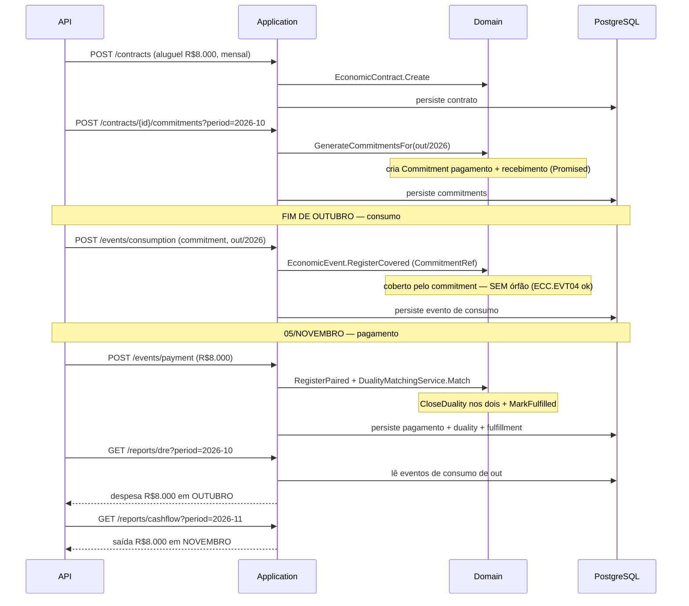

# Teste de Integração — Contrato de Aluguel (pós-pago, ponta a ponta)

> Especificação do teste de integração do **Walking Skeleton da Fase 1**: o ciclo completo do aluguel pós-pago, exercitando **HTTP → Application → Domain → EF Core → PostgreSQL real**. Escrito no padrão da skill `tests-integration-ddd-dotnet` (xUnit + Testcontainers + Respawn + WebApplicationFactory + Object Mother).
>
> **Leia antes de tudo — pré-condição honesta:** teste de integração exercita as camadas Application, Infrastructure e API. No estado atual do projeto **só o domínio (Fase 1) foi modelado**. Este documento descreve o teste que se tornará executável **depois** que essas camadas existirem (passos 2–4 da §6 das `Instrucoes-Claude-Code.md`). Até lá, ele serve como: (a) critério de aceite da Fase 1, e (b) especificação que a skill de integração consome quando for gerar o código.

---

## Índice

1. O que este teste prova (e o que não prova)
2. Pré-requisitos antes de poder rodar
3. O cenário de negócio testado, em REA
4. Infraestrutura do teste (factory, base, collection)
5. Passo a passo do teste principal (caminho feliz)
6. Resultado esperado — asserções exatas
7. Casos de erro a cobrir
8. Verificação de estado (ler o banco, não o GET)
9. Verificação de eventos (dualidade fechada, competência)
10. Multi-tenant — teste dedicado
11. Checklist de pronto
12. Exemplo concreto na idiom da skill (alvo de compilação)

---

## 1. O que este teste prova (e o que não prova)

**Prova:**
- Que o ciclo pós-pago do aluguel funciona de ponta a ponta com banco real: criar contrato → gerar commitment → registrar consumo (coberto, sem órfão) → registrar pagamento → dualidade fecha sozinha.
- Que a **competência** está correta: a despesa cai no mês do **consumo**, o caixa no mês do **pagamento**, e as duas projeções não divergem.
- Que o mapeamento EF dos Value Objects (`Money`, `CompetencePeriod`, `Participation`, `DualityLink`) achata nas colunas certas — bug que só integração pega.
- Que o isolamento **multi-tenant** segura: tenant A não enxerga dado de B.
- Que a anti-orfandade (`ECC.EVT04`) é honrada pela borda HTTP (não só pelo domínio).

**Não prova** (fora de escopo desta skill): comportamento de domínio puro isolado (isso é `tests-domain-ddd-dotnet`), performance, concorrência sob carga, integração com PSP real (a execução de pagamento é Fase 3-4; aqui o pagamento é registrado manualmente).

---

## 2. Pré-requisitos antes de poder rodar

Estes artefatos precisam existir (gerados pelas skills de Application/Infra/API):

| Camada | Artefato necessário | Skill |
|---|---|---|
| Application | Commands+Handlers: `RegisterEconomicContract`, `GenerateCommitments`, `RegisterConsumptionEvent`, `RegisterPaymentEvent`; Queries: `GetCompetenceDRE`, `GetCashFlow`, `ListClaims`, `ListUpcomingCommitments` | `application-codegen-ddd-dotnet` |
| Infrastructure | `EconomicCoreDbContext`, mapeamentos EF dos aggregates e VOs, migrations, Outbox, filtro de `TenantId` | `infra-codegen-ddd-dotnet` |
| API | Endpoints REST dos commands/queries acima; filtro que traduz `DomainException` → HTTP (400/409); autenticação | `api-codegen-ddd-dotnet` |
| Host | `public partial class Program {}` (para `WebApplicationFactory<Program>` com top-level statements) | — |

**Connection string assumida:** `ConnectionStrings:EconomicCore` (ajuste ao nome real no `Program.cs`).
**Imagem do Postgres:** `postgres:17` (pinada, nunca `latest`).

Pacotes do projeto `EconomicCore.Api.IntegrationTests`:

```xml
<PackageReference Include="Microsoft.AspNetCore.Mvc.Testing" Version="..." />
<PackageReference Include="Testcontainers.PostgreSql" Version="..." />
<PackageReference Include="Respawn" Version="..." />
<PackageReference Include="Npgsql" Version="..." />
<PackageReference Include="xunit" Version="..." />
<PackageReference Include="xunit.runner.visualstudio" Version="..."><PrivateAssets>all</PrivateAssets></PackageReference>
```

---

## 3. O cenário de negócio testado, em REA

O caso do `Modelo-REA-Tatico.md` (§7-bis.2, padrão pós-pago), com números concretos:

- **Tenant:** uma PME de serviços (TenantId fixo no teste, ex.: `TENANT_A`).
- **Agentes:** a empresa (`EconomicAgent`, `Inside`) e o locador "Imobiliária Silva" (`EconomicAgent`, `Outside`).
- **Recursos:** `Cash` (conta bancária) e `Service` (uso do imóvel).
- **Contrato:** aluguel mensal de **R$ 8.000,00**, recorrência `Monthly`, âncora dia 5, direção `Acquisition`.
- **Competência testada:** outubro/2026.

A sequência temporal (o que o teste encena):



---

## 4. Infraestrutura do teste

Três arquivos em `Infrastructure/`, conforme a skill. Esqueleto (a skill gera o conteúdo completo):

**`IntegrationTestWebAppFactory.cs`** — sobe `postgres:17` via Testcontainers, sobrescreve a connection string via `UseSetting`, roda `MigrateAsync()` na inicialização, configura Respawn. Implementa `IAsyncLifetime`.

**`BaseIntegrationTest.cs`** — expõe `HttpClient`, helper `ExecuteDbContextAsync<T>` (scope novo + `AsNoTracking()`), e faz `Respawner.ResetAsync()` no `DisposeAsync` (limpa **depois** de cada teste).

**`IntegrationTestCollection.cs`** — `ICollectionFixture` para compartilhar **um** container em toda a suíte.

**`Contracts/RentContracts.cs`** — DTOs de request/response **duplicados** (não reusar os da Application): `CreateContractRequest`, `GenerateCommitmentsRequest`, `RegisterConsumptionRequest`, `RegisterPaymentRequest`, `ContractResponse`, `DREResponse`, `CashFlowResponse`.

**`Mothers/RentContractMother.cs`** — Object Mother que monta o estado de seed (contrato de aluguel padrão, agentes, recursos) pela porta do domínio.

---

## 5. Passo a passo do teste principal (caminho feliz)

Nome: `RentPostPaidCycle_WhenConsumptionThenPayment_ShouldCloseDualityAndReportByCompetence`.

**Arrange** (seed pela porta do domínio, via Mother + DbContext, ou via os próprios endpoints de setup):
1. Semear os dois `EconomicAgent` (empresa `Inside`, locador `Outside`) e os dois `EconomicResource` (`Cash`, `Service`) do `TENANT_A`. Datas e IDs **fixos** (sem `Guid.NewGuid()`/`UtcNow` soltos).

**Act** (a sequência via `HttpClient`, datas fixas):
2. `POST /contracts` com aluguel R$ 8.000, mensal, âncora 5, `Acquisition`. Guardar `contractId` do response.
3. `POST /contracts/{contractId}/commitments` com `period = 2026-10`, `occurredAt = 2026-09-30T00:00:00Z`.
4. `POST /events/consumption` com `{ contractId, period: 2026-10, occurredAt: 2026-10-31T23:59:59Z }` — o consumo do uso do imóvel em outubro.
5. `POST /events/payment` com `{ contractId, amount: 8000.00, currency: "BRL", occurredAt: 2026-11-05T10:00:00Z }` — o pagamento.

**Assert** (status, corpo, e estado persistido — ver §6).

> **Observação de design do teste:** se os endpoints de setup (agentes/recursos) ainda não existirem, semear via DbContext na fase Arrange usando as factories do domínio (`EconomicAgent.Create(...)`), conforme princípio #8 da skill. O contrato e os eventos **passam pela API** porque é o fluxo sob teste.

---

## 6. Resultado esperado — asserções exatas

| # | Passo | Status HTTP | Asserção no corpo | Asserção no banco (scope novo, `AsNoTracking`) |
|---|---|---|---|---|
| 2 | criar contrato | `201 Created` | `ContractResponse.Status == "ACTIVE"`, `Direction == "ACQUISITION"` | 1 linha em `economic_contracts` com `tenant_id = TENANT_A`, `expected_amount = 8000.00` |
| 3 | gerar commitments | `200 OK` ou `201` | 2 commitments retornados, ambos `PROMISED` | 2 linhas em `commitments` (1 `OUTFLOW_PROMISE`, 1 `INFLOW_PROMISE`), `period = 2026-10`, com `ReciprocalLink` cruzado |
| 4 | registrar consumo | `201 Created` | evento `Direction == "INFLOW"`, recurso = `Service` | 1 linha em `economic_events`: `direction = INFLOW`, `covering_commitment_id` preenchido, `duality_*` **NULL** (coberto, ainda não pareado), `competence_year=2026, competence_month=10` |
| 5 | registrar pagamento | `201 Created` | evento `Direction == "OUTFLOW"`, recurso = `Cash` | 2 eventos agora têm `duality` preenchida (apontando um ao outro), `matched_amount = 8000.00`; o `Commitment` de pagamento está `FULFILLED` com `fulfilling_event_id` |
| — | DRE outubro | `200 OK` | `DREResponse.Period == "2026-10"`, `TotalExpense == 8000.00` | (derivado dos eventos de consumo de out) |
| — | DRE novembro | `200 OK` | `TotalExpense == 0.00` (nada consumido em nov) | — |
| — | Cash flow novembro | `200 OK` | `CashFlowResponse.TotalOutflow == 8000.00` | (derivado dos eventos sobre `Cash` em nov) |
| — | Cash flow outubro | `200 OK` | `TotalOutflow == 0.00` (nada pago em out) | — |

> **A asserção que dá sentido a tudo:** despesa em **outubro** (competência do consumo) **e** caixa em **novembro** (mês do pagamento), simultaneamente. É a prova de que o regime de competência funciona — o que um sistema baseado só em "data do pagamento" erraria.

---

## 7. Casos de erro a cobrir

Um teste por caminho (princípio #10 da skill — cubra os status que o endpoint retorna de propósito):

| Teste | Cenário | Status esperado | Erro de domínio subjacente |
|---|---|---|---|
| `RegisterConsumption_WhenNoCoveringCommitment_ShouldReturnConflict` | registrar consumo sem commitment que o cubra e sem par | `409 Conflict` | `ECC.EVT04` (OrphanEvent) — a anti-orfandade na borda HTTP |
| `RegisterPayment_WhenAmountExceedsUnmatchedBalance_ShouldReturnConflict` | pagar valor acima do saldo não pareado | `409 Conflict` | `ECC.EVT06` (MatchExceedsBalance) |
| `RegisterConsumption_WhenEventMissingParticipants_ShouldReturnBadRequest` | evento sem provider+recipient | `400 Bad Request` | `ECC.EVT01` (MissingParticipants) |
| `GenerateCommitments_WhenContractTerminated_ShouldReturnConflict` | gerar commitment de contrato encerrado | `409 Conflict` | `ECC.CTR05` (ContractNotActive) |
| `GenerateCommitments_WhenPeriodAlreadyGenerated_ShouldReturnConflict` | gerar duas vezes o mesmo período | `409 Conflict` | `ECC.CTR02` (DuplicateCommitmentForPeriod) |
| `CreateContract_WhenAmountIsZeroOrNegative_ShouldReturnBadRequest` | contrato com valor ≤ 0 | `400 Bad Request` | `ECC.CTR04` (AmountOutsideTolerance / invalid) |

> O teste verifica o **status HTTP e o `Id` do erro** (ex.: corpo contém `ECC.EVT04`), nunca a mensagem em português — a mensagem pode mudar, o `Id` é o contrato.

---

## 8. Verificação de estado (ler o banco, não o GET)

Para os passos 4 e 5, a prova de persistência lê o banco em **scope novo** com `AsNoTracking()` (princípio #5), porque o foco é "gravou e mapeou certo?". Pontos sensíveis a checar com SQL/DbContext direto:

- **`CompetencePeriod`** achatou em duas colunas (`competence_year`, `competence_month`)?
- **`Participation`** (coleção de VO) gravou na tabela/owned-collection certa, com `agent_id` + `role`?
- **`DualityLink`** gravou `counterpart_event_id` e `matched_amount` nos dois eventos após o matching?
- **`Money`** gravou `amount` (decimal 2 casas) + `currency` sem perder precisão?
- **`tenant_id`** está em todas as linhas e bate com `TENANT_A`?

Para colunas cruas (owned types), a skill sugere Dapper com SQL direto — útil aqui para conferir que o `DualityLink` não virou JSON serializado por engano.

---

## 9. Verificação de eventos (dualidade e competência)

Se a Outbox/mensageria estiver ativa (MassTransit Test Harness, in-memory), um teste separado `RentPostPaidCycle_ShouldPublishDualityClosed`:

- Após o passo 5, `harness.Published.Any<DualityClosed>()` é `true`, com payload apontando os dois `EconomicEventId` corretos e `MatchedAmount == 8000.00`.
- `harness.Published.Any<CommitmentFulfilled>()` é `true` para o commitment de pagamento de out/2026.
- **Nunca** asserte que um evento *não* foi publicado via harness (congela o teste — princípio da skill). Para "não publicou", verifique o efeito colateral ausente.

> Se a Fase 1 usar Outbox sem broker (só grava `OutboxMessage`), o teste verifica a **linha na tabela `outbox_messages`** com `event_type` = `DualityClosed`, em vez do harness.

---

## 10. Multi-tenant — teste dedicado

`RentReports_WhenQueryingAsOtherTenant_ShouldNotSeeOtherTenantData`:

- Arrange: rodar o ciclo completo como `TENANT_A`.
- Act: consultar `GET /reports/dre?period=2026-10` autenticado como `TENANT_B`.
- Assert: `TotalExpense == 0.00` — `TENANT_B` não vê a despesa de `TENANT_A`. (E o inverso, para garantir que não é só "banco vazio".)

---

## 11. Checklist de pronto

- [ ] Container `postgres:17` sobe e migrations rodam (`MigrateAsync`).
- [ ] Caminho feliz: consumo coberto sem órfão → pagamento → `DualityClosed`.
- [ ] DRE de **outubro** = R$ 8.000 **e** cash flow de **novembro** = R$ 8.000, no mesmo teste.
- [ ] DRE de novembro = 0 e cash flow de outubro = 0 (competência ≠ caixa comprovada).
- [ ] Cada caso de erro retorna o status e o `Id` de erro esperado (`ECC.*`).
- [ ] Estado verificado em scope novo com `AsNoTracking()`; VOs achatados nas colunas certas.
- [ ] `DualityLink` preenchido nos dois eventos após o matching.
- [ ] Multi-tenant: `TENANT_B` não vê dado de `TENANT_A`.
- [ ] Respawn reseta no `DisposeAsync`; cada teste semeia o próprio estado.
- [ ] DTOs de request/response duplicados no projeto de teste (não reusados da app).

---

## 12. Exemplo concreto na idiom da skill (alvo de compilação)

> Esta seção transforma a especificação acima num **alvo concreto** que a skill `tests-integration-ddd-dotnet` reproduz com fidelidade. Segue os templates de `references/` da skill: `KnownIds` + datas fixas (test-conventions), seed pela porta do domínio (seeding-data), `ExecuteDbContextAsync` em scope novo + `AsNoTracking()` (state-verification), Dapper para owned types, AAA sem comentários, nome `Endpoint_StateUnderTest_ExpectedBehavior`. Trechos marcados `// AJUSTAR` dependem dos nomes reais de rota/coluna da API e Infra (passos 2–4 da §6 das Instruções).

### 12.1 IDs e datas determinísticos

```csharp
// Infrastructure/KnownIds.cs
namespace EconomicCore.Api.IntegrationTests.Infrastructure;

public static class KnownIds
{
    public static readonly Guid TenantA    = new("aaaaaaaa-0000-0000-0000-000000000001");
    public static readonly Guid TenantB    = new("bbbbbbbb-0000-0000-0000-000000000002");
    public static readonly Guid Company    = new("11111111-1111-1111-1111-111111111111"); // agente Inside
    public static readonly Guid Landlord   = new("22222222-2222-2222-2222-222222222222"); // agente Outside
    public static readonly Guid CashRes    = new("33333333-3333-3333-3333-333333333333"); // recurso Cash
    public static readonly Guid ServiceRes = new("44444444-4444-4444-4444-444444444444"); // recurso Service
}

public static class KnownDates
{
    public static readonly DateTime CommitmentGen = new(2026, 9, 30, 0, 0, 0, DateTimeKind.Utc);
    public static readonly DateTime Consumption   = new(2026, 10, 31, 23, 59, 59, DateTimeKind.Utc);
    public static readonly DateTime Payment       = new(2026, 11, 5, 10, 0, 0, DateTimeKind.Utc);
}
```

### 12.2 Object Mother — seed pela porta do domínio

```csharp
// Mothers/RentScenarioMother.cs
namespace EconomicCore.Api.IntegrationTests.Mothers;

using EconomicCore.Domain.Operational.EconomicAgents;
using EconomicCore.Domain.Operational.EconomicAgents.Enumerations;
using EconomicCore.Domain.Operational.EconomicResources;
using EconomicCore.Domain.Operational.EconomicResources.Enumerations;
using EconomicCore.Domain.SeedWork;

public static class RentScenarioMother
{
    private static readonly DateTime SeededAt = new(2026, 9, 1, 0, 0, 0, DateTimeKind.Utc);

    public static EconomicAgent Company() => EconomicAgent.Create(
        EconomicAgentId.From(KnownIds.Company),
        TenantId.From(KnownIds.TenantA),
        AgentScope.Inside, name: "Minha PME Ltda", occurredAt: SeededAt);

    public static EconomicAgent Landlord() => EconomicAgent.Create(
        EconomicAgentId.From(KnownIds.Landlord),
        TenantId.From(KnownIds.TenantA),
        AgentScope.Outside, name: "Imobiliária Silva", occurredAt: SeededAt);

    public static EconomicResource Cash() => EconomicResource.Create(
        EconomicResourceId.From(KnownIds.CashRes),
        TenantId.From(KnownIds.TenantA),
        ResourceKind.Cash, name: "Conta Corrente", occurredAt: SeededAt);

    public static EconomicResource RentService() => EconomicResource.Create(
        EconomicResourceId.From(KnownIds.ServiceRes),
        TenantId.From(KnownIds.TenantA),
        ResourceKind.Service, name: "Uso do imóvel", occurredAt: SeededAt);
}
```

### 12.3 Contratos duplicados (cópias — não reusar os da app)

```csharp
// Contracts/RentContracts.cs
namespace EconomicCore.Api.IntegrationTests.Contracts;

// AJUSTAR aos DTOs reais da API quando existirem.
public sealed record CreateContractRequest(
    Guid CounterpartyId, decimal ExpectedAmount, string Currency,
    string Direction, string Periodicity, int AnchorDay);
public sealed record ContractResponse(Guid Id, string Status, string Direction);
public sealed record GenerateCommitmentsRequest(int Year, int Month, DateTime OccurredAt);
public sealed record RegisterConsumptionRequest(Guid ContractId, int Year, int Month, DateTime OccurredAt);
public sealed record RegisterPaymentRequest(Guid ContractId, decimal Amount, string Currency, DateTime OccurredAt);
public sealed record DREResponse(string Period, decimal TotalExpense);
public sealed record CashFlowResponse(string Period, decimal TotalOutflow);
public sealed record ErrorResponse(string Id, string Message); // expõe o ECC.### no corpo
```

### 12.4 A classe de teste do caminho feliz

```csharp
// Rent/RentPostPaidCycleTests.cs
using System.Net;
using System.Net.Http.Json;
using EconomicCore.Api.IntegrationTests.Contracts;
using EconomicCore.Api.IntegrationTests.Infrastructure;
using EconomicCore.Api.IntegrationTests.Mothers;
using Xunit;

namespace EconomicCore.Api.IntegrationTests.Rent;

[Collection(nameof(IntegrationTestCollection))]
public class RentPostPaidCycleTests : BaseIntegrationTest
{
    public RentPostPaidCycleTests(IntegrationTestWebAppFactory factory) : base(factory) { }

    [Fact]
    public async Task RentCycle_WhenConsumptionThenPayment_ShouldCloseDualityAndReportByCompetence()
    {
        await Factory.ExecuteDbContextAsync(async db =>
        {
            db.Add(RentScenarioMother.Company());
            db.Add(RentScenarioMother.Landlord());
            db.Add(RentScenarioMother.Cash());
            db.Add(RentScenarioMother.RentService());
            await db.SaveChangesAsync();
        });

        var createResp = await Client.PostAsJsonAsync("/api/contracts",            // AJUSTAR rota
            new CreateContractRequest(KnownIds.Landlord, 8000.00m, "BRL",
                "ACQUISITION", "MONTHLY", AnchorDay: 5));
        Assert.Equal(HttpStatusCode.Created, createResp.StatusCode);
        var contract = await createResp.Content.ReadFromJsonAsync<ContractResponse>();
        Assert.NotNull(contract);
        Assert.Equal("ACTIVE", contract!.Status);

        var genResp = await Client.PostAsJsonAsync(
            $"/api/contracts/{contract.Id}/commitments",                           // AJUSTAR rota
            new GenerateCommitmentsRequest(2026, 10, KnownDates.CommitmentGen));
        Assert.Equal(HttpStatusCode.Created, genResp.StatusCode);

        var consResp = await Client.PostAsJsonAsync("/api/events/consumption",      // AJUSTAR rota
            new RegisterConsumptionRequest(contract.Id, 2026, 10, KnownDates.Consumption));
        Assert.Equal(HttpStatusCode.Created, consResp.StatusCode);

        var payResp = await Client.PostAsJsonAsync("/api/events/payment",           // AJUSTAR rota
            new RegisterPaymentRequest(contract.Id, 8000.00m, "BRL", KnownDates.Payment));
        Assert.Equal(HttpStatusCode.Created, payResp.StatusCode);

        var dreOct = await (await Client.GetAsync("/api/reports/dre?year=2026&month=10"))
            .Content.ReadFromJsonAsync<DREResponse>();
        Assert.Equal(8000.00m, dreOct!.TotalExpense);

        var dreNov = await (await Client.GetAsync("/api/reports/dre?year=2026&month=11"))
            .Content.ReadFromJsonAsync<DREResponse>();
        Assert.Equal(0.00m, dreNov!.TotalExpense);

        var cashNov = await (await Client.GetAsync("/api/reports/cashflow?year=2026&month=11"))
            .Content.ReadFromJsonAsync<CashFlowResponse>();
        Assert.Equal(8000.00m, cashNov!.TotalOutflow);

        var cashOct = await (await Client.GetAsync("/api/reports/cashflow?year=2026&month=10"))
            .Content.ReadFromJsonAsync<CashFlowResponse>();
        Assert.Equal(0.00m, cashOct!.TotalOutflow);
    }
}
```

### 12.5 Verificação do achatamento do `DualityLink` (Dapper, owned type)

A dualidade fechada é onde o mapeamento EF mais esconde bug. Verifique as colunas cruas após o pagamento:

```csharp
[Fact]
public async Task RentCycle_AfterPayment_ShouldPersistDualityOnBothEvents()
{
    // (arrange + act idênticos ao caminho feliz, até o pagamento)

    var rows = await Factory.QueryAsync<DualityRow>(
        @"SELECT direction AS Direction,
                 duality_matched_amount AS MatchedAmount,
                 duality_counterpart_event_id AS Counterpart
          FROM economic_events
          WHERE tenant_id = @tenant",                                              // AJUSTAR colunas
        new { tenant = KnownIds.TenantA });

    Assert.Equal(2, rows.Count());
    Assert.All(rows, r => Assert.Equal(8000.00m, r.MatchedAmount));
    Assert.All(rows, r => Assert.NotNull(r.Counterpart)); // os dois apontam um ao outro
}

private sealed record DualityRow(string Direction, decimal? MatchedAmount, Guid? Counterpart);
```

### 12.6 Teste de erro — anti-orfandade na borda HTTP

```csharp
[Fact]
public async Task RegisterConsumption_WhenNoCoveringCommitment_ShouldReturnConflictWithOrphanError()
{
    await Factory.ExecuteDbContextAsync(async db =>
    {
        db.Add(RentScenarioMother.Company());
        db.Add(RentScenarioMother.Landlord());
        db.Add(RentScenarioMother.RentService());
        await db.SaveChangesAsync();
    });

    var createResp = await Client.PostAsJsonAsync("/api/contracts",
        new CreateContractRequest(KnownIds.Landlord, 8000.00m, "BRL",
            "ACQUISITION", "MONTHLY", AnchorDay: 5));
    var contract = await createResp.Content.ReadFromJsonAsync<ContractResponse>();

    var consResp = await Client.PostAsJsonAsync("/api/events/consumption",
        new RegisterConsumptionRequest(contract!.Id, 2026, 10, KnownDates.Consumption));

    Assert.Equal(HttpStatusCode.Conflict, consResp.StatusCode);
    var error = await consResp.Content.ReadFromJsonAsync<ErrorResponse>();
    Assert.Equal("ECC.EVT04", error!.Id); // checa o Id do erro, nunca a mensagem PT
}
```

> **Helpers que faltam na base da skill:** `QueryAsync<T>` (Dapper) e `ExecuteSqlAsync` (seed cru) **não** vêm na `IntegrationTestWebAppFactory` padrão — peça à skill para adicioná-los (os templates estão em `state-verification.md` e `seeding-data.md` da própria skill). `ExecuteDbContextAsync` e `ResetDatabaseAsync` já vêm da base. Isso é a única extensão de infra que este teste exige além do template padrão.

---

## Como gerar com o Claude Code

Quando as camadas Application/Infra/API da Fase 1 existirem, abra este arquivo + o `Program.cs` no Claude Code e peça, na ordem:

```
1) "Monta a infra de teste de integração (WebApplicationFactory + Testcontainers postgres:17
    + Respawn) para EconomicCore.Api, conforme tests-integration-ddd-dotnet. Connection string:
    ConnectionStrings:EconomicCore."

2) "Gera o teste de integração do ciclo de aluguel pós-pago conforme este documento (§5–§6):
    criar contrato → gerar commitments → consumo coberto → pagamento → duality fechada,
    com DRE de outubro e cash flow de novembro. Duplica os DTOs."

3) "Gera os testes de erro da §7 (um por caminho: ECC.EVT04, EVT06, EVT01, CTR05, CTR02)."

4) "Gera o teste multi-tenant da §10 e, se houver Outbox/MassTransit, o de eventos da §9."
```

> A skill pedirá os nomes reais de endpoints/DTOs/eventos se divergirem do assumido aqui — confirme com o código gerado nas fases anteriores, não com este documento (que é a intenção, não a implementação final).

---

*Especificação de teste de integração do contrato de aluguel (Fase 1, pós-pago). Pareia com `Modelo-REA-Tatico.md` (§5, §6, §7-bis.2, §9) e a skill `tests-integration-ddd-dotnet`. Torna-se executável após as camadas Application/Infra/API existirem.*
