# Especificação de API — Controle de Locação (modelo REA)

> Sistema **do locatário**, para acompanhamento de gastos com aluguel.
> O locador é um agente externo apenas cadastrado; ele não interage com o sistema.
> Modelagem baseada na ontologia REA (Resources, Events, Agents) e nas fases de transação
> de negócio do ISO/IEC 15944-4 (*planning, identification, negotiation, actualization, post-actualization*).

---

## Índice

1. [Convenções](#1-convenções)
2. [Modelo de dados REA](#2-modelo-de-dados-rea)
3. [Máquina de estados](#3-máquina-de-estados)
4. [Mapa de dependências entre recursos](#4-mapa-de-dependências-entre-recursos)
5. [Endpoints](#5-endpoints)
   - [5.1 `POST /properties` — cadastrar imóvel](#51-post-properties--cadastrar-imóvel)
   - [5.2 `POST /landlords` — cadastrar locador](#52-post-landlords--cadastrar-locador)
   - [5.3 `POST /contracts` — criar contrato (draft)](#53-post-contracts--criar-contrato-draft)
   - [5.4 `POST /contracts/{id}/activate` — ativar e gerar commitments](#54-post-contractsidactivate--ativar-e-gerar-commitments)
   - [5.5 `POST /contracts/{id}/payments` — confirmar pagamento](#55-post-contractsidpayments--confirmar-pagamento)
   - [5.6 `POST /contracts/{id}/occupancies` — registrar ocupação](#56-post-contractsidoccupancies--registrar-ocupação)
   - [5.7 `POST /contracts/{id}/renew` — renovar contrato](#57-post-contractsidrenew--renovar-contrato)
   - [5.8 `POST /contracts/{id}/terminate` — encerrar contrato](#58-post-contractsidterminate--encerrar-contrato)
6. [Catálogo de erros](#6-catálogo-de-erros)

---

## 1. Convenções

| Item | Convenção |
|---|---|
| Formato | JSON em request e response. |
| Datas | ISO 8601 (`YYYY-MM-DD` para datas, `YYYY-MM-DDThh:mm:ssZ` para timestamps). |
| Dinheiro | Inteiro em centavos (`amountCents`) + `currency` (ex.: `"BRL"`). Evita erro de ponto flutuante. |
| IDs | UUID v4, prefixado por tipo na documentação (ex.: `ctr_…`, `pay_…`) apenas para leitura. |
| Idempotência | Endpoints de escrita aceitam header `Idempotency-Key`. Repetição com a mesma chave devolve a resposta original. |
| Multi-tenant | Toda entidade pertence a um `userId` (o locatário dono da conta). Nenhum dado cruza usuários. |
| Autorização | Header `Authorization: Bearer <token>`. O `userId` é extraído do token, nunca do body. |

Códigos HTTP usados: `201` (criado), `200` (ok), `409` (conflito de estado / regra de negócio), `422` (validação de payload), `404` (não encontrado), `403` (não pertence ao usuário).

---

## 2. Modelo de dados REA

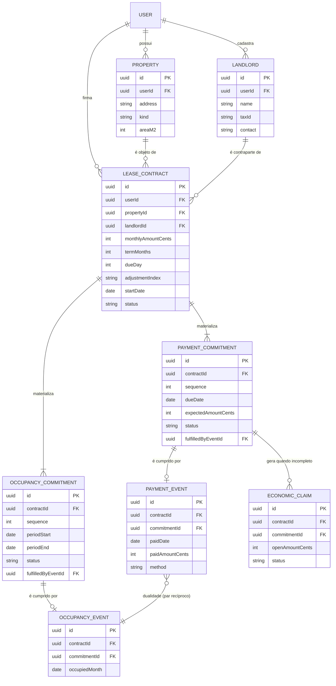

### Papel de cada tabela na ontologia REA

| Tabela | Conceito REA | Significado no app do locatário |
|---|---|---|
| `PROPERTY` | Resource (Real Estate) | O imóvel cujo **uso** é consumido. |
| `LANDLORD` | Agent (externo) | Quem recebe o aluguel. |
| `LEASE_CONTRACT` | Economic Contract | Bundle de commitments recíprocos. |
| `PAYMENT_COMMITMENT` | Economic Commitment (decremento futuro) | Promessa de pagar uma mensalidade. |
| `OCCUPANCY_COMMITMENT` | Economic Commitment (incremento futuro) | Direito de ocupar o imóvel num mês. |
| `PAYMENT_EVENT` | Economic Event (outflow) | Pagamento que **de fato** saiu. |
| `OCCUPANCY_EVENT` | Economic Event (inflow de uso) | Mês **de fato** ocupado. |
| `ECONOMIC_CLAIM` | Claim | Pendência: troca econômica ainda incompleta. |

---

## 3. Máquina de estados

### Contrato

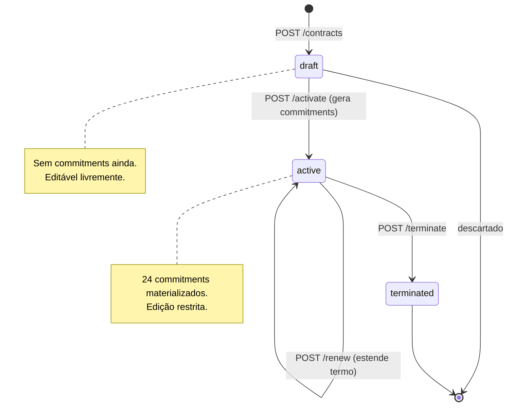

### Commitment (pagamento ou ocupação)

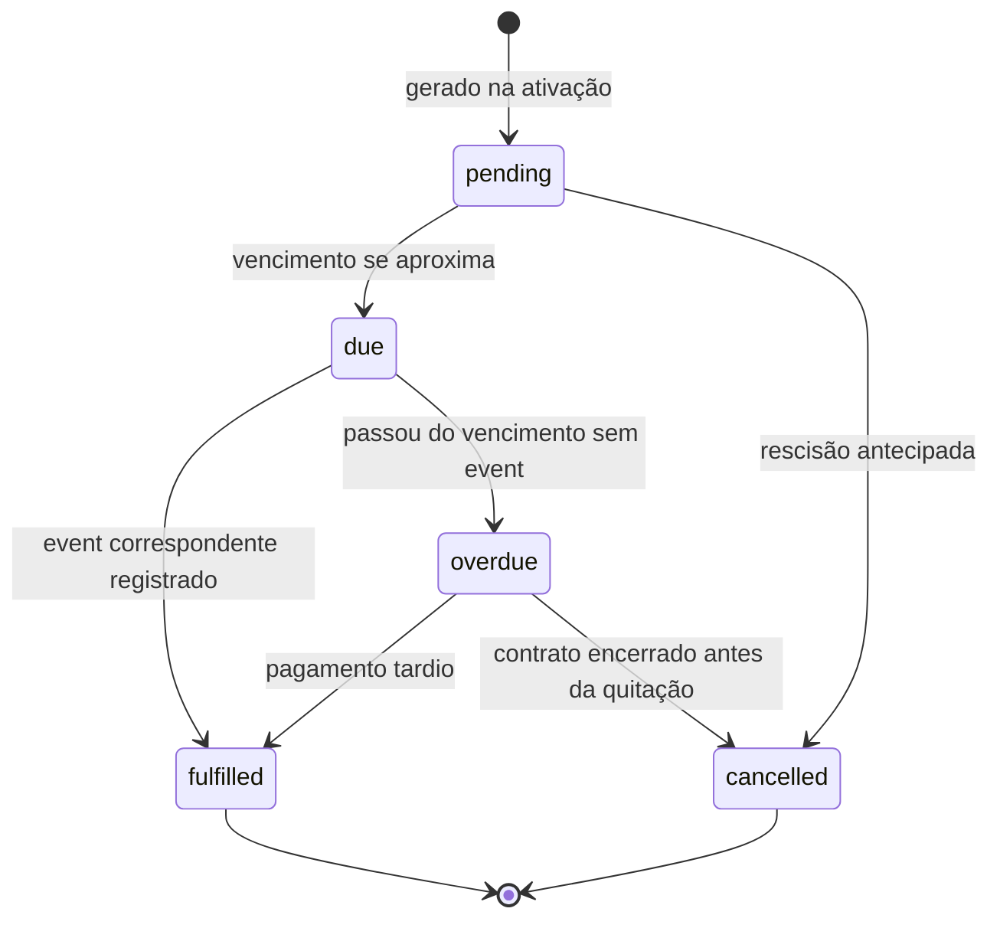

### Claim

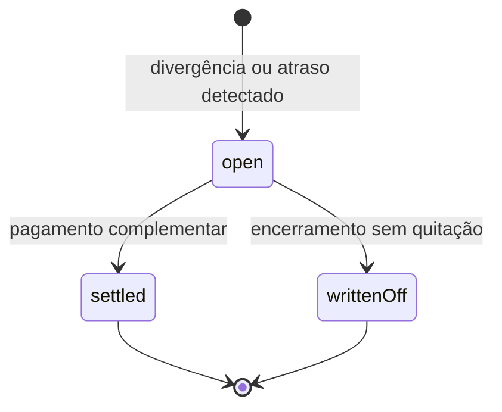

---

## 4. Mapa de dependências entre recursos

Esta é a **regra de ouro** do sistema: nada pode ser criado fora de ordem. Um evento de consumo
exige um commitment, que exige um contrato ativo, que exige imóvel e locador cadastrados.

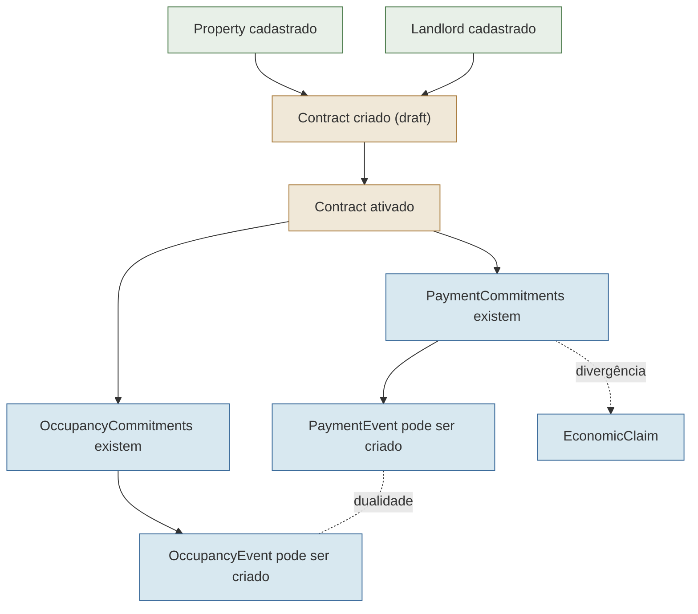

**Pré-condições resumidas:**

| Para criar… | É obrigatório que exista… |
|---|---|
| Contrato (`draft`) | Property **e** Landlord do mesmo usuário. |
| Commitments | Contrato em transição `draft → active`. |
| PaymentEvent | PaymentCommitment em `pending`/`due`/`overdue` **e** contrato `active`. |
| OccupancyEvent | OccupancyCommitment correspondente **e** mês já iniciado. |
| Claim | PaymentCommitment com valor pago menor que o esperado. |

---

## 5. Endpoints

Cada endpoint abaixo segue a mesma estrutura: **entrada → validações → lógica → alterações de estado → resposta**, acompanhada de um fluxograma.

---

### 5.1 `POST /properties` — cadastrar imóvel

Cria o **Resource** (imóvel) que será consumido. Pré-requisito de qualquer contrato.

#### Entrada

```json
{
  "address": "Rua das Acácias, 120, apto 42 - São Paulo/SP",
  "kind": "apartment",
  "areaM2": 68
}
```

| Campo | Tipo | Obrigatório | Regra |
|---|---|---|---|
| `address` | string | sim | 5–200 caracteres. |
| `kind` | enum | sim | `apartment` \| `house` \| `commercial` \| `other`. |
| `areaM2` | int | não | > 0 se informado. |

#### Validações

1. `address` não vazio e dentro do tamanho.
2. `kind` pertence ao enum.
3. (Opcional) Alerta — não erro — se já existe imóvel com endereço idêntico para o mesmo usuário.

#### Lógica

Persiste o imóvel vinculado ao `userId` do token. Não há efeito colateral em outras entidades.

#### Alterações esperadas

- Insere 1 linha em `PROPERTY`.

#### Resposta — `201 Created`

```json
{
  "id": "prop_a1b2c3",
  "address": "Rua das Acácias, 120, apto 42 - São Paulo/SP",
  "kind": "apartment",
  "areaM2": 68,
  "createdAt": "2026-05-28T14:00:00Z"
}
```

#### Fluxograma

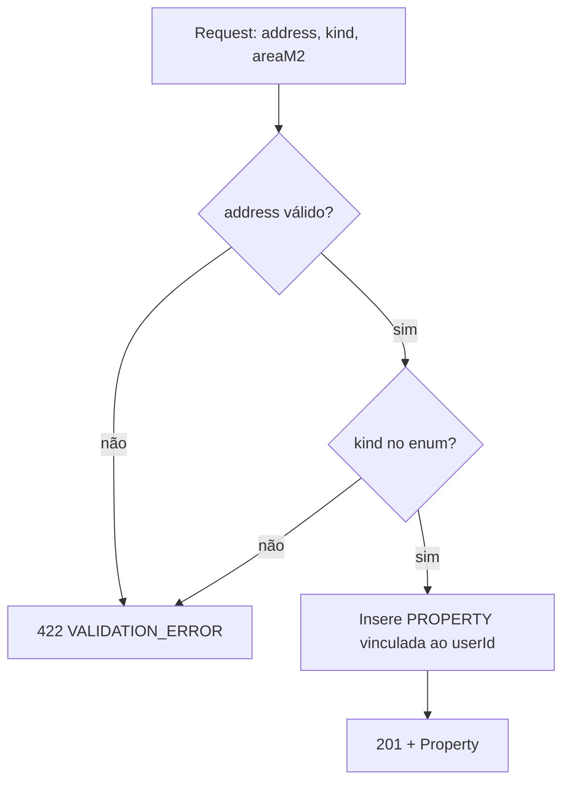

---

### 5.2 `POST /landlords` — cadastrar locador

Cria o **Agent externo** (locador). Não cria conta de acesso; é só um registro de contraparte.

#### Entrada

```json
{
  "name": "Imobiliária Horizonte Ltda",
  "taxId": "12.345.678/0001-90",
  "contact": "contato@horizonte.com.br"
}
```

| Campo | Tipo | Obrigatório | Regra |
|---|---|---|---|
| `name` | string | sim | 2–120 caracteres. |
| `taxId` | string | não | CPF ou CNPJ válido se informado. |
| `contact` | string | não | e-mail ou telefone. |

#### Validações

1. `name` não vazio.
2. `taxId`, se presente, passa em validação de dígito verificador (CPF/CNPJ).

#### Lógica

Persiste o locador vinculado ao `userId`. **Nunca** cria credenciais nem envia convite — o locador não é usuário do sistema.

#### Alterações esperadas

- Insere 1 linha em `LANDLORD`.

#### Resposta — `201 Created`

```json
{
  "id": "lord_d4e5f6",
  "name": "Imobiliária Horizonte Ltda",
  "taxId": "12.345.678/0001-90",
  "contact": "contato@horizonte.com.br",
  "createdAt": "2026-05-28T14:01:00Z"
}
```

#### Fluxograma

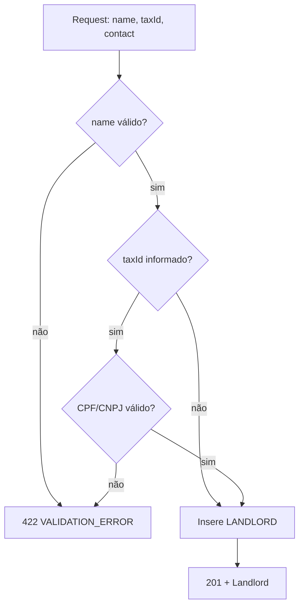

---

### 5.3 `POST /contracts` — criar contrato (draft)

Cria o **Economic Contract** em estado `draft`. Ainda **não** gera commitments — isso permite revisar
os termos antes de comprometer o calendário. Conecta um Property e um Landlord já existentes.

#### Entrada

```json
{
  "propertyId": "prop_a1b2c3",
  "landlordId": "lord_d4e5f6",
  "monthlyAmountCents": 300000,
  "currency": "BRL",
  "termMonths": 12,
  "dueDay": 10,
  "adjustmentIndex": "IGPM",
  "startDate": "2026-06-01"
}
```

| Campo | Tipo | Obrigatório | Regra |
|---|---|---|---|
| `propertyId` | uuid | sim | Deve existir e pertencer ao usuário. |
| `landlordId` | uuid | sim | Deve existir e pertencer ao usuário. |
| `monthlyAmountCents` | int | sim | > 0. |
| `currency` | string | sim | ISO 4217. |
| `termMonths` | int | sim | 1–120. |
| `dueDay` | int | sim | 1–28 (evita meses curtos). |
| `adjustmentIndex` | enum | não | `IGPM` \| `IPCA` \| `none`. Default `none`. |
| `startDate` | date | sim | Não pode ser mais de 1 ano no passado. |

#### Validações

1. **Propriedade existe e é do usuário** → senão `404 PROPERTY_NOT_FOUND` / `403`.
2. **Locador existe e é do usuário** → senão `404 LANDLORD_NOT_FOUND` / `403`.
3. Valores numéricos dentro das faixas.
4. `dueDay` entre 1 e 28.
5. **Regra anti-duplicidade**: não pode haver outro contrato `active` para o mesmo `propertyId`
   com período sobreposto → `409 OVERLAPPING_CONTRACT`.

#### Lógica

Cria o contrato com `status = "draft"`. Calcula nada ainda; apenas guarda os parâmetros que
servirão de molde para os commitments na ativação.

#### Alterações esperadas

- Insere 1 linha em `LEASE_CONTRACT` com `status = draft`.
- **Nenhum** commitment é criado neste passo.

#### Resposta — `201 Created`

```json
{
  "id": "ctr_99aa88",
  "status": "draft",
  "propertyId": "prop_a1b2c3",
  "landlordId": "lord_d4e5f6",
  "monthlyAmountCents": 300000,
  "currency": "BRL",
  "termMonths": 12,
  "dueDay": 10,
  "adjustmentIndex": "IGPM",
  "startDate": "2026-06-01",
  "commitmentsGenerated": false
}
```

#### Fluxograma

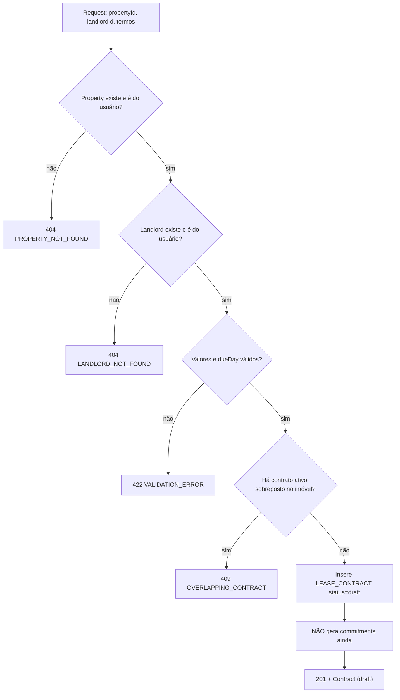

---

### 5.4 `POST /contracts/{id}/activate` — ativar e gerar commitments

O passo central do REA. Transforma o contrato em `active` e **materializa automaticamente**
`termMonths` PaymentCommitments + `termMonths` OccupancyCommitments, emparelhados por dualidade.

#### Entrada

Sem body (ou body vazio). O `id` vem na URL.

#### Validações

1. Contrato existe e é do usuário → senão `404` / `403`.
2. Contrato está em `draft` → senão `409 CONTRACT_NOT_DRAFT` (não se ativa duas vezes).

#### Lógica (passo a passo)

```
para N de 1 até termMonths:
    dueDate      = startDate + (N-1) meses, ajustando para o dueDay
    periodStart  = startDate + (N-1) meses
    periodEnd    = periodStart + 1 mês - 1 dia

    cria PaymentCommitment(sequence=N, dueDate, expectedAmount=monthlyAmount, status=pending)
    cria OccupancyCommitment(sequence=N, periodStart, periodEnd, status=pending)
    vincula os dois como par recíproco (dualidade)

contrato.status = active
emite domain event ContractActivated
```

> A geração é **transacional**: ou os 2*termMonths commitments são criados, ou nenhum é
> (rollback completo em caso de falha).

#### Alterações esperadas

- `LEASE_CONTRACT.status`: `draft → active`.
- Insere `termMonths` linhas em `PAYMENT_COMMITMENT` (todas `pending`).
- Insere `termMonths` linhas em `OCCUPANCY_COMMITMENT` (todas `pending`).
- Opcional: agenda job mensal de materialização de OccupancyEvents.

#### Resposta — `200 OK`

```json
{
  "id": "ctr_99aa88",
  "status": "active",
  "commitmentsGenerated": true,
  "paymentCommitments": [
    { "id": "pc_001", "sequence": 1, "dueDate": "2026-06-10", "expectedAmountCents": 300000, "status": "pending" },
    { "id": "pc_002", "sequence": 2, "dueDate": "2026-07-10", "expectedAmountCents": 300000, "status": "pending" }
  ],
  "occupancyCommitments": [
    { "id": "oc_001", "sequence": 1, "periodStart": "2026-06-01", "periodEnd": "2026-06-30", "status": "pending" },
    { "id": "oc_002", "sequence": 2, "periodStart": "2026-07-01", "periodEnd": "2026-07-31", "status": "pending" }
  ],
  "projection": {
    "totalExpectedCents": 3600000,
    "currency": "BRL"
  }
}
```

#### Fluxograma

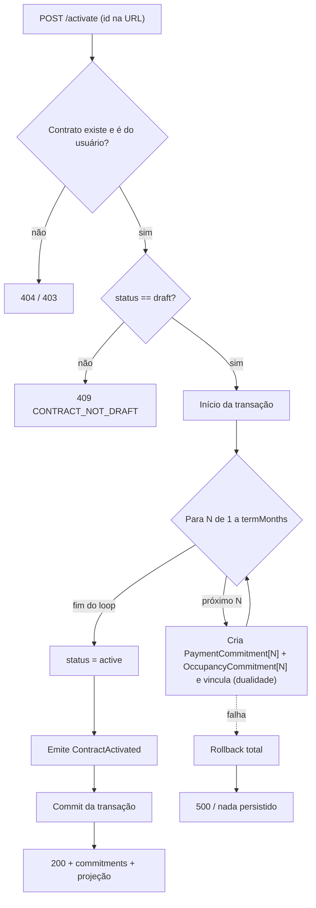


---

### 5.5 `POST /contracts/{id}/payments` — confirmar pagamento

Cria o **PaymentEvent** que cumpre um PaymentCommitment. Este é o ponto de confirmação manual:
o sistema nunca presume que você pagou; você declara que pagou.

> **Interligação crítica:** só é possível criar um PaymentEvent se existir um PaymentCommitment
> em aberto. O commitment, por sua vez, só existe se o contrato foi ativado. Logo:
> **contrato draft → 0 commitments → 0 pagamentos possíveis**. A cadeia de pré-condições é rígida.

#### Entrada

```json
{
  "commitmentId": "pc_002",
  "paidDate": "2026-07-08",
  "paidAmountCents": 300000,
  "method": "pix",
  "receiptUrl": "https://.../comprovante.pdf"
}
```

| Campo | Tipo | Obrigatório | Regra |
|---|---|---|---|
| `commitmentId` | uuid | sim | PaymentCommitment do mesmo contrato. |
| `paidDate` | date | sim | Não futura. |
| `paidAmountCents` | int | sim | > 0. |
| `method` | enum | sim | `pix` \| `boleto` \| `ted` \| `cash` \| `other`. |
| `receiptUrl` | string | não | URL de comprovante. |

#### Validações (em ordem — esta ordem é a interligação que você pediu)

1. **Contrato existe, é do usuário e está `active`** → senão `404`/`403`/`409 CONTRACT_NOT_ACTIVE`.
2. **Commitment existe e pertence a este contrato** → senão `404 COMMITMENT_NOT_FOUND` / `409 COMMITMENT_WRONG_CONTRACT`.
3. **Commitment ainda não está `fulfilled`** → senão `409 COMMITMENT_ALREADY_FULFILLED` (sem pagamento duplo).
4. `paidDate` não é futura; `paidAmountCents > 0`.

#### Lógica

```
diff = paidAmountCents - commitment.expectedAmountCents

cria PaymentEvent(commitmentId, paidDate, paidAmountCents, method)
commitment.fulfilledByEventId = event.id

se diff == 0:
    commitment.status = fulfilled
senão se diff < 0:                      # pagou a menos
    commitment.status = fulfilled       # cumprido parcialmente
    cria EconomicClaim(openAmount = -diff, status=open)
senão:                                  # pagou a mais
    commitment.status = fulfilled
    registra crédito (saldo a favor — informativo)

se paidDate > commitment.dueDate:
    marca atraso no event (para estatística de pontualidade)
```

#### Alterações esperadas

- Insere 1 linha em `PAYMENT_EVENT`.
- `PAYMENT_COMMITMENT.status` → `fulfilled`; `fulfilledByEventId` preenchido.
- Se pagamento parcial: insere 1 `ECONOMIC_CLAIM` com `status = open`.
- Atualiza estatísticas agregadas do contrato (total pago, pontualidade).

#### Resposta — `201 Created`

```json
{
  "paymentEvent": {
    "id": "pay_777",
    "commitmentId": "pc_002",
    "paidDate": "2026-07-08",
    "paidAmountCents": 300000,
    "method": "pix",
    "onTime": true
  },
  "commitment": { "id": "pc_002", "status": "fulfilled" },
  "claim": null,
  "contractStats": {
    "totalPaidCents": 600000,
    "remainingExpectedCents": 3000000,
    "onTimeRatio": 1.0
  }
}
```

#### Fluxograma

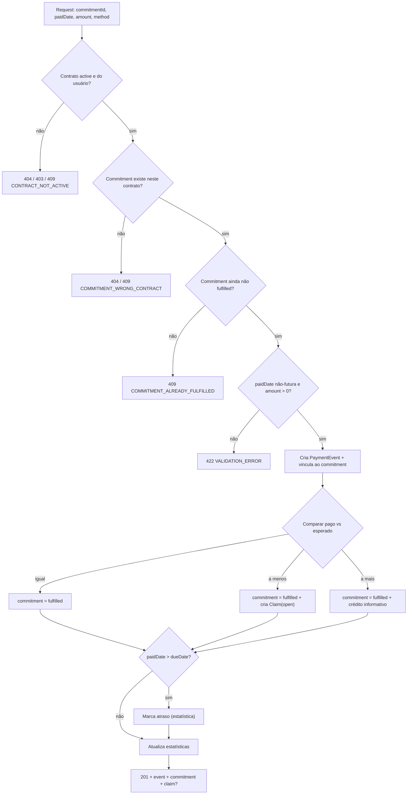

---

### 5.6 `POST /contracts/{id}/occupancies` — registrar ocupação

Cria o **OccupancyEvent** que cumpre um OccupancyCommitment. Normalmente disparado por **job
automático** na virada do mês (você não precisa confirmar que morou no imóvel), mas exposto como
endpoint para correções manuais ou backfill.

> **Interligação:** o OccupancyEvent é o **dual** do PaymentEvent. Juntos formam o par de dualidade
> REA do mês — o equivalente conceitual da partida dobrada. Um não invalida o outro, mas o modelo
> espera que ambos existam para um mês "completo".

#### Entrada

```json
{
  "commitmentId": "oc_001",
  "occupiedMonth": "2026-06-01"
}
```

| Campo | Tipo | Obrigatório | Regra |
|---|---|---|---|
| `commitmentId` | uuid | sim | OccupancyCommitment do contrato. |
| `occupiedMonth` | date | sim | Primeiro dia do mês ocupado; mês já iniciado. |

#### Validações

1. Contrato existe, é do usuário e está `active` → senão `404`/`403`/`409`.
2. Commitment existe e pertence ao contrato → senão `404`/`409`.
3. Commitment ainda não `fulfilled` → senão `409 COMMITMENT_ALREADY_FULFILLED`.
4. **O mês já começou** (`occupiedMonth.periodStart <= hoje`) → senão `409 OCCUPANCY_IN_FUTURE`
   (não se "ocupa" um mês que ainda não chegou).

#### Lógica

```
cria OccupancyEvent(commitmentId, occupiedMonth)
commitment.fulfilledByEventId = event.id
commitment.status = fulfilled
```

#### Alterações esperadas

- Insere 1 linha em `OCCUPANCY_EVENT`.
- `OCCUPANCY_COMMITMENT.status` → `fulfilled`.

#### Resposta — `201 Created`

```json
{
  "occupancyEvent": { "id": "occ_111", "commitmentId": "oc_001", "occupiedMonth": "2026-06-01" },
  "commitment": { "id": "oc_001", "status": "fulfilled" },
  "dualityPair": { "paymentCommitmentId": "pc_001", "paymentStatus": "pending" }
}
```

#### Fluxograma

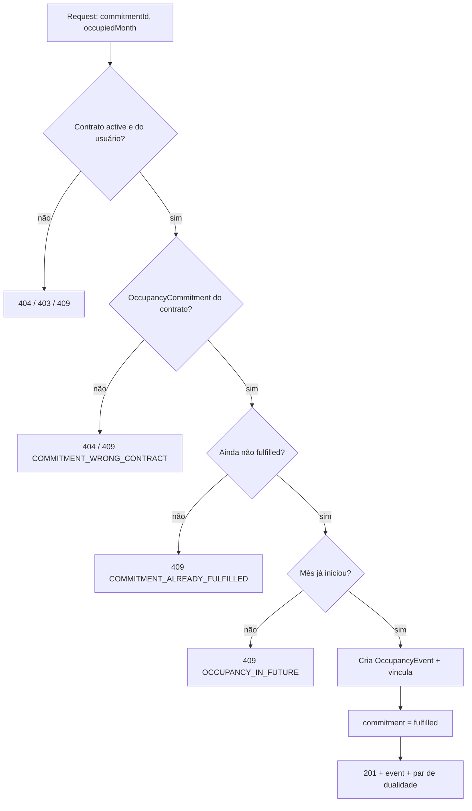

---

### 5.7 `POST /contracts/{id}/renew` — renovar contrato

Estende o termo do contrato, aplicando reajuste. Modela o **novo Agreement que regula o Contract**
original (REA: agreements podem regular outros agreements). Gera novos commitments para o período estendido.

#### Entrada

```json
{
  "additionalMonths": 12,
  "newMonthlyAmountCents": 318000,
  "appliedIndex": "IGPM",
  "indexRate": 0.06
}
```

| Campo | Tipo | Obrigatório | Regra |
|---|---|---|---|
| `additionalMonths` | int | sim | 1–120. |
| `newMonthlyAmountCents` | int | sim* | Informe este **ou** `indexRate`. |
| `indexRate` | float | sim* | Reajuste a aplicar sobre o valor atual. |
| `appliedIndex` | enum | não | Para registro histórico. |

\* Exatamente um dos dois deve ser informado.

#### Validações

1. Contrato existe, é do usuário, está `active` → senão `404`/`403`/`409`.
2. Exatamente um entre `newMonthlyAmountCents` e `indexRate` → senão `422 AMBIGUOUS_AMOUNT`.
3. `additionalMonths` na faixa.

#### Lógica

```
novoValor = newMonthlyAmountCents OU (monthlyAmount * (1 + indexRate))
ultimaSeq = maior sequence atual dos commitments
para K de 1 até additionalMonths:
    N = ultimaSeq + K
    cria PaymentCommitment[N] com expectedAmount = novoValor
    cria OccupancyCommitment[N]
    vincula par recíproco
contrato.termMonths += additionalMonths
contrato.monthlyAmountCents = novoValor
registra Agreement de reajuste (histórico)
```

#### Alterações esperadas

- `LEASE_CONTRACT.termMonths` e `monthlyAmountCents` atualizados.
- Insere `additionalMonths` novos `PAYMENT_COMMITMENT` (valor reajustado) e o mesmo tanto de `OCCUPANCY_COMMITMENT`.
- Commitments antigos permanecem inalterados.

#### Resposta — `200 OK`

```json
{
  "id": "ctr_99aa88",
  "termMonths": 24,
  "monthlyAmountCents": 318000,
  "newCommitments": { "payment": 12, "occupancy": 12 },
  "appliedIndex": "IGPM",
  "indexRate": 0.06
}
```

#### Fluxograma

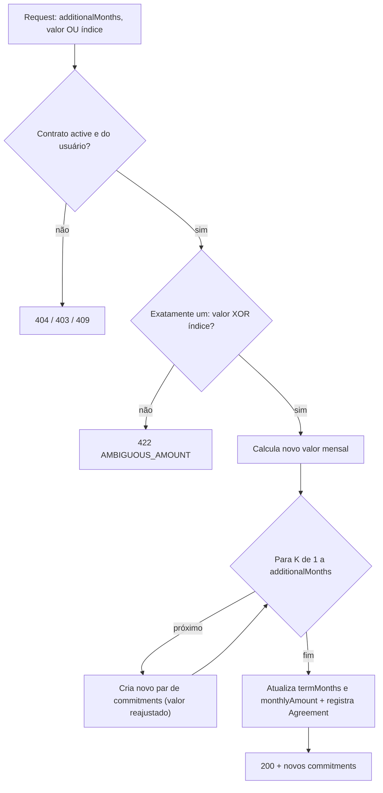

---

### 5.8 `POST /contracts/{id}/terminate` — encerrar contrato

Fecha o contrato (fase **post-actualization** do REA). Cancela commitments futuros não cumpridos,
trata claims abertos e, em rescisão antecipada, registra a multa.

#### Entrada

```json
{
  "reason": "early_termination",
  "terminationDate": "2026-10-31",
  "penaltyAmountCents": 90000
}
```

| Campo | Tipo | Obrigatório | Regra |
|---|---|---|---|
| `reason` | enum | sim | `term_ended` \| `early_termination` \| `breach`. |
| `terminationDate` | date | sim | Não anterior à última ocupação registrada. |
| `penaltyAmountCents` | int | não | Obrigatório se `reason = early_termination`. |

#### Validações

1. Contrato existe, é do usuário, está `active` → senão `404`/`403`/`409 CONTRACT_NOT_ACTIVE`.
2. Se `reason = early_termination`, `penaltyAmountCents` presente → senão `422 PENALTY_REQUIRED`.
3. `terminationDate` ≥ data da última ocupação registrada.

#### Lógica

```
para cada commitment com periodStart/dueDate > terminationDate:
    se status in (pending, due, overdue): status = cancelled

para cada Claim aberto:
    se reason == breach: status = writtenOff
    senão: mantém open (você ainda deve)   # decisão informativa

se reason == early_termination:
    cria PaymentCommitment de multa (sequence especial) status=pending
    # o usuário confirmará o pagamento da multa como qualquer outro

contrato.status = terminated
emite domain event ContractTerminated
```

#### Alterações esperadas

- `LEASE_CONTRACT.status`: `active → terminated`.
- Commitments futuros: `→ cancelled`.
- Claims: mantidos `open` ou `writtenOff` conforme o motivo.
- Multa (se houver): novo `PAYMENT_COMMITMENT` `pending`.

#### Resposta — `200 OK`

```json
{
  "id": "ctr_99aa88",
  "status": "terminated",
  "reason": "early_termination",
  "terminationDate": "2026-10-31",
  "cancelledCommitments": { "payment": 8, "occupancy": 8 },
  "openClaims": 0,
  "penaltyCommitmentId": "pc_penalty_01",
  "finalStats": {
    "totalPaidCents": 1500000,
    "monthsOccupied": 5
  }
}
```

#### Fluxograma

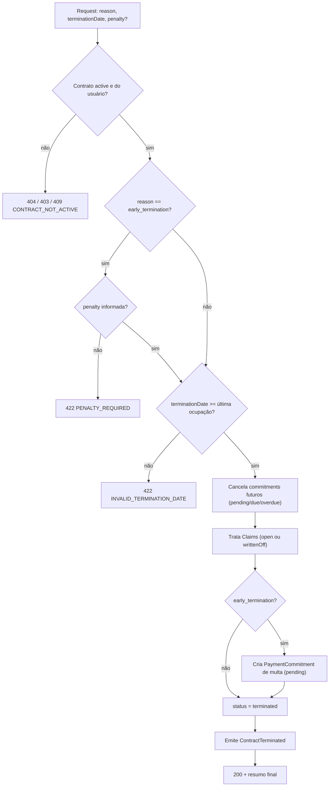

---

## 6. Catálogo de erros

| Código HTTP | `errorCode` | Quando ocorre |
|---|---|---|
| 422 | `VALIDATION_ERROR` | Campo obrigatório ausente ou fora de faixa. |
| 404 | `PROPERTY_NOT_FOUND` | `propertyId` inexistente. |
| 404 | `LANDLORD_NOT_FOUND` | `landlordId` inexistente. |
| 404 | `CONTRACT_NOT_FOUND` | `id` de contrato inexistente. |
| 404 | `COMMITMENT_NOT_FOUND` | `commitmentId` inexistente. |
| 403 | `FORBIDDEN_RESOURCE` | Entidade pertence a outro usuário. |
| 409 | `OVERLAPPING_CONTRACT` | Já há contrato ativo sobreposto no imóvel. |
| 409 | `CONTRACT_NOT_DRAFT` | Tentou ativar contrato que não está em draft. |
| 409 | `CONTRACT_NOT_ACTIVE` | Operação exige contrato ativo. |
| 409 | `COMMITMENT_WRONG_CONTRACT` | Commitment não pertence ao contrato da URL. |
| 409 | `COMMITMENT_ALREADY_FULFILLED` | Tentou cumprir commitment já cumprido. |
| 409 | `OCCUPANCY_IN_FUTURE` | Tentou registrar ocupação de mês não iniciado. |
| 422 | `AMBIGUOUS_AMOUNT` | Renovação com valor e índice ao mesmo tempo (ou nenhum). |
| 422 | `PENALTY_REQUIRED` | Rescisão antecipada sem multa informada. |
| 422 | `INVALID_TERMINATION_DATE` | Data de encerramento anterior à última ocupação. |

---

## Apêndice — sequência completa de uma vida de contrato

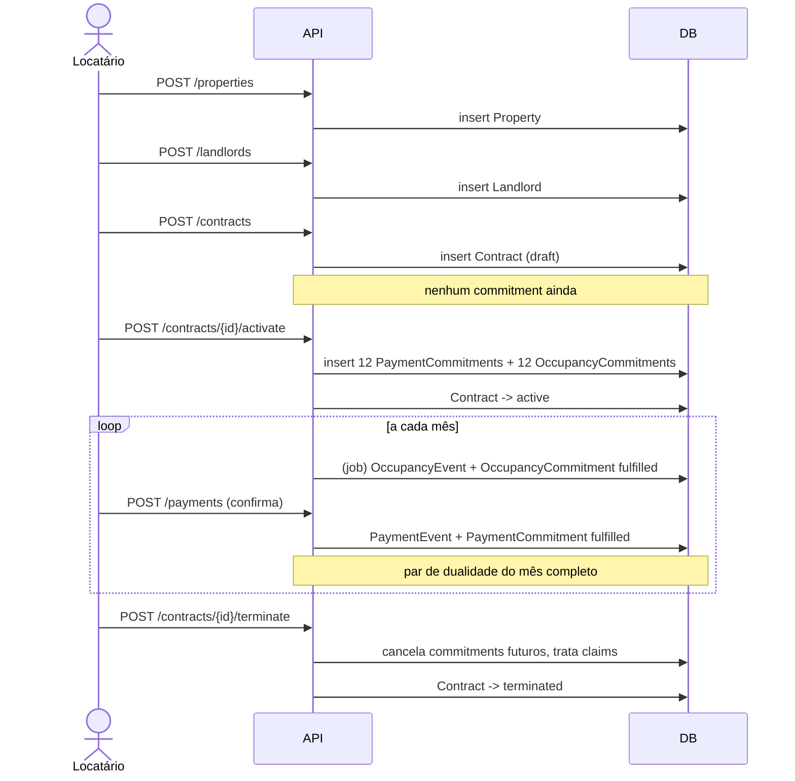

---

# 7. Testes de integração — ciclo de vida completo do contrato

Esta seção especifica a suíte de testes de integração de ponta a ponta (HTTP → Application → Domain → EF Core → **PostgreSQL real em container**) que percorre a vida inteira de um contrato: cadastro → criação → ativação → execução mensal → encerramento.

**Stack:** xUnit + `Assert` nativo + Testcontainers (Postgres 17) + Respawn + `Mvc.Testing` + Object Mother manual. Sem mocks nas dependências testadas; o teste grava no Postgres de verdade.

**Estratégia de cobertura.** Dois grupos:

- **Caminho 100% (`ContractLifecycleTests`)** — uma única jornada longa onde toda hipótese se confirma: imóvel e locador válidos, contrato ativado gerando 24 commitments, 12 pagamentos pontuais e exatos, 12 ocupações registradas, encerramento normal sem claims em aberto. Prova que o fluxo feliz fecha com estado consistente.
- **Exceções por etapa (`...ExceptionTests`)** — um teste por caminho de erro que cada endpoint retorna explicitamente, validando que a cadeia de pré-condições REA é realmente imposta pelo backend (não dá para criar evento sem commitment, nem ativar duas vezes, etc.).

## 7.1 Estrutura de arquivos da suíte

```
Leasing.Api.IntegrationTests/
├── Infrastructure/
│   ├── IntegrationTestWebAppFactory.cs
│   ├── BaseIntegrationTest.cs
│   └── IntegrationTestCollection.cs
├── Contracts/
│   └── LeaseContracts.cs               ← DTOs request/response DUPLICADOS
├── Mothers/
│   ├── PropertyMother.cs
│   └── LandlordMother.cs
├── KnownIds.cs
└── Lease/
    ├── ContractLifecycleTests.cs       ← jornada 100% (happy path completo)
    ├── CreateContractExceptionTests.cs
    ├── ActivateContractExceptionTests.cs
    ├── RegisterPaymentExceptionTests.cs
    ├── RegisterOccupancyExceptionTests.cs
    └── TerminateContractExceptionTests.cs
```

## 7.2 Matriz de cobertura

A tabela cruza cada etapa do ciclo com a hipótese de sucesso e as exceções testadas.

| Etapa | Hipótese 100% (happy) | Exceções cobertas |
|---|---|---|
| Cadastro imóvel | `201`, persiste Property | `422` address vazio; `422` kind inválido |
| Cadastro locador | `201`, persiste Landlord | `422` name vazio; `422` CPF/CNPJ inválido |
| Criar contrato | `201`, status `draft`, **0 commitments** | `404` property/landlord inexistente; `403` de outro usuário; `409` contrato sobreposto; `422` dueDay fora de 1–28 |
| Ativar | `200`, status `active`, **24 commitments** `pending` | `409` ativar contrato já ativo; `409` ativar contrato terminado; `404` contrato inexistente |
| Pagar | `201`, PaymentEvent, commitment `fulfilled` | `409` contrato ainda em draft (sem commitments); `409` commitment já cumprido; `409` commitment de outro contrato; `422` valor ≤ 0 / data futura |
| Pagar parcial | — (coberto na variante) | `201` + Claim `open` criado |
| Ocupar | `201`, OccupancyEvent, commitment `fulfilled` | `409` ocupação de mês futuro; `409` commitment já cumprido |
| Renovar | `200`, +12 commitments reajustados | `422` valor e índice juntos; `422` nenhum dos dois |
| Encerrar | `200`, status `terminated`, futuros `cancelled` | `409` encerrar contrato não-ativo; `422` rescisão sem multa; `422` data anterior à última ocupação |

## 7.3 Infraestrutura

### `Infrastructure/IntegrationTestWebAppFactory.cs`

```csharp
// Infrastructure/IntegrationTestWebAppFactory.cs
using Microsoft.AspNetCore.Hosting;
using Microsoft.AspNetCore.Mvc.Testing;
using Microsoft.EntityFrameworkCore;
using Microsoft.Extensions.DependencyInjection;
using Npgsql;
using Respawn;
using System.Data.Common;
using Testcontainers.PostgreSql;
using Xunit;

namespace Leasing.Api.IntegrationTests.Infrastructure;

public sealed class IntegrationTestWebAppFactory
    : WebApplicationFactory<Program>, IAsyncLifetime
{
    private readonly PostgreSqlContainer _postgres = new PostgreSqlBuilder()
        .WithImage("postgres:17")            // pin: nunca 'latest'
        .WithDatabase("leasing_test")
        .WithUsername("postgres")
        .WithPassword("postgres")
        .Build();

    private DbConnection _dbConnection = null!;
    private Respawner _respawner = null!;

    protected override void ConfigureWebHost(IWebHostBuilder builder)
    {
        builder.UseSetting(
            "ConnectionStrings:Database",        // <- nome lido no Program.cs (confirmar)
            _postgres.GetConnectionString());
    }

    public async Task InitializeAsync()
    {
        await _postgres.StartAsync();

        using (var scope = Services.CreateScope())
        {
            var db = scope.ServiceProvider.GetRequiredService<LeasingDbContext>();
            await db.Database.MigrateAsync();
        }

        _dbConnection = new NpgsqlConnection(_postgres.GetConnectionString());
        await _dbConnection.OpenAsync();

        _respawner = await Respawner.CreateAsync(_dbConnection, new RespawnerOptions
        {
            DbAdapter = DbAdapter.Postgres,
            SchemasToInclude = ["public"],
        });
    }

    public async Task ResetDatabaseAsync() => await _respawner.ResetAsync(_dbConnection);

    public async Task ExecuteDbContextAsync(Func<LeasingDbContext, Task> action)
    {
        using var scope = Services.CreateScope();
        var db = scope.ServiceProvider.GetRequiredService<LeasingDbContext>();
        await action(db);
    }

    public async Task<T> ExecuteDbContextAsync<T>(Func<LeasingDbContext, Task<T>> action)
    {
        using var scope = Services.CreateScope();
        var db = scope.ServiceProvider.GetRequiredService<LeasingDbContext>();
        return await action(db);
    }

    public new async Task DisposeAsync()
    {
        await _dbConnection.DisposeAsync();
        await _postgres.StopAsync();
    }
}
```

### `Infrastructure/BaseIntegrationTest.cs`

```csharp
// Infrastructure/BaseIntegrationTest.cs
using Xunit;

namespace Leasing.Api.IntegrationTests.Infrastructure;

[Collection(nameof(IntegrationTestCollection))]
public abstract class BaseIntegrationTest : IAsyncLifetime
{
    protected readonly IntegrationTestWebAppFactory Factory;
    protected readonly HttpClient Client;

    protected BaseIntegrationTest(IntegrationTestWebAppFactory factory)
    {
        Factory = factory;
        Client = factory.CreateClient();
    }

    public virtual Task InitializeAsync() => Task.CompletedTask;

    // Respawn limpa DEPOIS de cada teste: cada teste começa limpo e semeia o seu.
    public Task DisposeAsync() => Factory.ResetDatabaseAsync();
}
```

### `Infrastructure/IntegrationTestCollection.cs`

```csharp
// Infrastructure/IntegrationTestCollection.cs
using Xunit;

namespace Leasing.Api.IntegrationTests.Infrastructure;

[CollectionDefinition(nameof(IntegrationTestCollection))]
public sealed class IntegrationTestCollection
    : ICollectionFixture<IntegrationTestWebAppFactory>;
```

### `KnownIds.cs`

```csharp
// KnownIds.cs
namespace Leasing.Api.IntegrationTests;

public static class KnownIds
{
    public static readonly Guid Property = new("11111111-1111-1111-1111-111111111111");
    public static readonly Guid Landlord = new("22222222-2222-2222-2222-222222222222");
}

public static class FixedClock
{
    // Início do contrato fixado: torna dueDates e períodos determinísticos.
    public static readonly DateOnly ContractStart = new(2026, 6, 1);
}
```

### `Contracts/LeaseContracts.cs` (DTOs duplicados)

```csharp
// Contracts/LeaseContracts.cs — CÓPIAS dos DTOs da aplicação (princípio: proteger o contrato HTTP)
namespace Leasing.Api.IntegrationTests.Contracts;

public sealed record CreatePropertyRequest(string Address, string Kind, int? AreaM2);
public sealed record PropertyResponse(Guid Id, string Address, string Kind);

public sealed record CreateLandlordRequest(string Name, string? TaxId, string? Contact);
public sealed record LandlordResponse(Guid Id, string Name);

public sealed record CreateContractRequest(
    Guid PropertyId, Guid LandlordId, int MonthlyAmountCents, string Currency,
    int TermMonths, int DueDay, string? AdjustmentIndex, DateOnly StartDate);

public sealed record ContractResponse(
    Guid Id, string Status, int TermMonths, int MonthlyAmountCents, bool CommitmentsGenerated);

public sealed record CommitmentDto(Guid Id, int Sequence, string Status);

public sealed record ActivateContractResponse(
    Guid Id, string Status, bool CommitmentsGenerated,
    IReadOnlyList<CommitmentDto> PaymentCommitments,
    IReadOnlyList<CommitmentDto> OccupancyCommitments);

public sealed record RegisterPaymentRequest(
    Guid CommitmentId, DateOnly PaidDate, int PaidAmountCents, string Method);

public sealed record RegisterPaymentResponse(
    Guid PaymentEventId, string CommitmentStatus, Guid? ClaimId, bool OnTime);

public sealed record RegisterOccupancyRequest(Guid CommitmentId, DateOnly OccupiedMonth);
public sealed record RegisterOccupancyResponse(Guid OccupancyEventId, string CommitmentStatus);

public sealed record TerminateContractRequest(
    string Reason, DateOnly TerminationDate, int? PenaltyAmountCents);

public sealed record TerminateContractResponse(
    Guid Id, string Status, int CancelledPaymentCommitments, int OpenClaims);
```

### `Mothers/PropertyMother.cs` e `Mothers/LandlordMother.cs`

```csharp
// Mothers/PropertyMother.cs — seed pela porta do domínio (factory real do agregado)
using Leasing.Domain.Properties;

namespace Leasing.Api.IntegrationTests.Mothers;

public static class PropertyMother
{
    public static Property Default() =>
        Property.Create(
            id: PropertyId.From(KnownIds.Property),
            address: "Rua das Acácias, 120, apto 42 - São Paulo/SP",
            kind: PropertyKind.Apartment,
            areaM2: 68);
}
```

```csharp
// Mothers/LandlordMother.cs
using Leasing.Domain.Landlords;

namespace Leasing.Api.IntegrationTests.Mothers;

public static class LandlordMother
{
    public static Landlord Default() =>
        Landlord.Create(
            id: LandlordId.From(KnownIds.Landlord),
            name: "Imobiliária Horizonte Ltda",
            taxId: "12345678000190",
            contact: "contato@horizonte.com.br");
}
```

## 7.4 Teste de jornada completa — caminho 100%

Um único teste longo que prova a vida inteira de um contrato quando **toda hipótese se confirma**. A ordem das chamadas é a própria cadeia de dependências REA: não há como pular etapas. Cada bloco verifica o estado persistido lendo o banco em scope novo (`AsNoTracking`), nunca o cache do change tracker.

### Fluxograma do teste

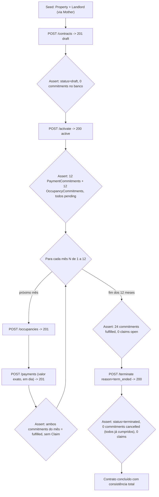

### `Lease/ContractLifecycleTests.cs`

```csharp
// Lease/ContractLifecycleTests.cs
using System.Net;
using System.Net.Http.Json;
using Microsoft.EntityFrameworkCore;
using Leasing.Api.IntegrationTests.Contracts;
using Leasing.Api.IntegrationTests.Infrastructure;
using Leasing.Api.IntegrationTests.Mothers;
using Leasing.Domain.Contracts;
using Xunit;

namespace Leasing.Api.IntegrationTests.Lease;

[Collection(nameof(IntegrationTestCollection))]
public class ContractLifecycleTests : BaseIntegrationTest
{
    public ContractLifecycleTests(IntegrationTestWebAppFactory factory) : base(factory) { }

    [Fact]
    public async Task FullLifecycle_WhenEveryStepSucceeds_ShouldEndConsistent()
    {
        // ---- Arrange: imóvel e locador válidos, semeados pela porta do domínio ----
        await Factory.ExecuteDbContextAsync(async db =>
        {
            db.Properties.Add(PropertyMother.Default());
            db.Landlords.Add(LandlordMother.Default());
            await db.SaveChangesAsync();
        });

        // ---- 1. Criar contrato (deve nascer draft, SEM commitments) ----
        var createRequest = new CreateContractRequest(
            PropertyId: KnownIds.Property,
            LandlordId: KnownIds.Landlord,
            MonthlyAmountCents: 300_000,
            Currency: "BRL",
            TermMonths: 12,
            DueDay: 10,
            AdjustmentIndex: "IGPM",
            StartDate: FixedClock.ContractStart);

        var createResp = await Client.PostAsJsonAsync("/contracts", createRequest);
        Assert.Equal(HttpStatusCode.Created, createResp.StatusCode);
        var contract = await createResp.Content.ReadFromJsonAsync<ContractResponse>();
        Assert.NotNull(contract);
        Assert.Equal("draft", contract!.Status);
        Assert.False(contract.CommitmentsGenerated);

        var commitmentsAtDraft = await Factory.ExecuteDbContextAsync(db =>
            db.PaymentCommitments.AsNoTracking()
              .CountAsync(c => c.ContractId == contract.Id));
        Assert.Equal(0, commitmentsAtDraft);   // hipótese central: draft não materializa nada

        // ---- 2. Ativar (deve gerar 12 + 12 commitments pending) ----
        var activateResp = await Client.PostAsync($"/contracts/{contract.Id}/activate", null);
        Assert.Equal(HttpStatusCode.OK, activateResp.StatusCode);
        var activated = await activateResp.Content.ReadFromJsonAsync<ActivateContractResponse>();
        Assert.NotNull(activated);
        Assert.Equal("active", activated!.Status);
        Assert.Equal(12, activated.PaymentCommitments.Count);
        Assert.Equal(12, activated.OccupancyCommitments.Count);
        Assert.All(activated.PaymentCommitments, c => Assert.Equal("pending", c.Status));
        Assert.All(activated.OccupancyCommitments, c => Assert.Equal("pending", c.Status));

        var (payIds, occIds) = await Factory.ExecuteDbContextAsync(async db =>
        {
            var pays = await db.PaymentCommitments.AsNoTracking()
                .Where(c => c.ContractId == contract.Id)
                .OrderBy(c => c.Sequence).Select(c => c.Id).ToListAsync();
            var occs = await db.OccupancyCommitments.AsNoTracking()
                .Where(c => c.ContractId == contract.Id)
                .OrderBy(c => c.Sequence).Select(c => c.Id).ToListAsync();
            return (pays, occs);
        });
        Assert.Equal(12, payIds.Count);
        Assert.Equal(12, occIds.Count);

        // ---- 3. Executar os 12 meses: ocupar + pagar, exato e em dia ----
        for (var n = 0; n < 12; n++)
        {
            var occupiedMonth = FixedClock.ContractStart.AddMonths(n);

            var occResp = await Client.PostAsJsonAsync(
                $"/contracts/{contract.Id}/occupancies",
                new RegisterOccupancyRequest(occIds[n], occupiedMonth));
            Assert.Equal(HttpStatusCode.Created, occResp.StatusCode);

            var dueDate = new DateOnly(occupiedMonth.Year, occupiedMonth.Month, 10);
            var payResp = await Client.PostAsJsonAsync(
                $"/contracts/{contract.Id}/payments",
                new RegisterPaymentRequest(
                    CommitmentId: payIds[n],
                    PaidDate: dueDate.AddDays(-2),     // dois dias antes: em dia
                    PaidAmountCents: 300_000,          // valor exato: sem claim
                    Method: "pix"));
            Assert.Equal(HttpStatusCode.Created, payResp.StatusCode);
            var pay = await payResp.Content.ReadFromJsonAsync<RegisterPaymentResponse>();
            Assert.Equal("fulfilled", pay!.CommitmentStatus);
            Assert.True(pay.OnTime);
            Assert.Null(pay.ClaimId);                  // pagamento exato não gera claim
        }

        // ---- 4. Estado após 12 meses: tudo fulfilled, nenhum claim aberto ----
        var (fulfilledPay, fulfilledOcc, openClaims) = await Factory.ExecuteDbContextAsync(async db =>
        {
            var fp = await db.PaymentCommitments.AsNoTracking()
                .CountAsync(c => c.ContractId == contract.Id && c.Status == "fulfilled");
            var fo = await db.OccupancyCommitments.AsNoTracking()
                .CountAsync(c => c.ContractId == contract.Id && c.Status == "fulfilled");
            var oc = await db.EconomicClaims.AsNoTracking()
                .CountAsync(c => c.ContractId == contract.Id && c.Status == "open");
            return (fp, fo, oc);
        });
        Assert.Equal(12, fulfilledPay);
        Assert.Equal(12, fulfilledOcc);
        Assert.Equal(0, openClaims);

        // ---- 5. Encerrar por término normal de prazo ----
        var terminateResp = await Client.PostAsJsonAsync(
            $"/contracts/{contract.Id}/terminate",
            new TerminateContractRequest(
                Reason: "term_ended",
                TerminationDate: FixedClock.ContractStart.AddMonths(12),
                PenaltyAmountCents: null));
        Assert.Equal(HttpStatusCode.OK, terminateResp.StatusCode);
        var terminated = await terminateResp.Content.ReadFromJsonAsync<TerminateContractResponse>();
        Assert.Equal("terminated", terminated!.Status);
        Assert.Equal(0, terminated.CancelledPaymentCommitments);  // nada a cancelar: tudo cumprido
        Assert.Equal(0, terminated.OpenClaims);

        // ---- 6. Verificação final no banco: contrato terminated, consistente ----
        var finalStatus = await Factory.ExecuteDbContextAsync(db =>
            db.Contracts.AsNoTracking()
              .Where(c => c.Id == contract.Id)
              .Select(c => c.Status)
              .FirstAsync());
        Assert.Equal("terminated", finalStatus);
    }
}
```

> **Por que este teste tem valor real.** Ele não exercita um endpoint isolado — exercita a **invariante de ordem do REA**: o `draft` com zero commitments, a explosão de 24 commitments na ativação, o pareamento mês-a-mês de evento↔commitment, e o encerramento que não tem o que cancelar porque tudo foi cumprido. Se alguém quebrar a geração de commitments, o mapeamento EF de um owned type, ou a transição de estado, este teste falha no ponto exato.

## 7.5 Testes de exceção por etapa

Cada classe cobre os códigos HTTP que o endpoint retorna **deliberadamente**. Não há teste de `500` — erro não-determinístico geraria teste frágil.

### `Lease/CreateContractExceptionTests.cs`

```csharp
// Lease/CreateContractExceptionTests.cs
using System.Net;
using System.Net.Http.Json;
using Microsoft.EntityFrameworkCore;
using Leasing.Api.IntegrationTests.Contracts;
using Leasing.Api.IntegrationTests.Infrastructure;
using Leasing.Api.IntegrationTests.Mothers;
using Xunit;

namespace Leasing.Api.IntegrationTests.Lease;

[Collection(nameof(IntegrationTestCollection))]
public class CreateContractExceptionTests : BaseIntegrationTest
{
    public CreateContractExceptionTests(IntegrationTestWebAppFactory factory) : base(factory) { }

    private static CreateContractRequest ValidRequest() => new(
        PropertyId: KnownIds.Property, LandlordId: KnownIds.Landlord,
        MonthlyAmountCents: 300_000, Currency: "BRL", TermMonths: 12,
        DueDay: 10, AdjustmentIndex: "none", StartDate: FixedClock.ContractStart);

    [Fact]
    public async Task PostContracts_WhenPropertyDoesNotExist_ShouldReturnNotFound()
    {
        await Factory.ExecuteDbContextAsync(async db =>
        {
            db.Landlords.Add(LandlordMother.Default());   // só locador; imóvel ausente
            await db.SaveChangesAsync();
        });

        var response = await Client.PostAsJsonAsync("/contracts", ValidRequest());

        Assert.Equal(HttpStatusCode.NotFound, response.StatusCode);
    }

    [Fact]
    public async Task PostContracts_WhenLandlordDoesNotExist_ShouldReturnNotFound()
    {
        await Factory.ExecuteDbContextAsync(async db =>
        {
            db.Properties.Add(PropertyMother.Default());  // só imóvel; locador ausente
            await db.SaveChangesAsync();
        });

        var response = await Client.PostAsJsonAsync("/contracts", ValidRequest());

        Assert.Equal(HttpStatusCode.NotFound, response.StatusCode);
    }

    [Theory]
    [InlineData(0)]
    [InlineData(29)]
    [InlineData(31)]
    public async Task PostContracts_WhenDueDayOutOfRange_ShouldReturnUnprocessable(int dueDay)
    {
        await SeedPropertyAndLandlord();

        var request = ValidRequest() with { DueDay = dueDay };
        var response = await Client.PostAsJsonAsync("/contracts", request);

        Assert.Equal(HttpStatusCode.UnprocessableEntity, response.StatusCode);
    }

    [Fact]
    public async Task PostContracts_WhenOverlappingActiveContractExists_ShouldReturnConflict()
    {
        await SeedPropertyAndLandlord();
        var first = await Client.PostAsJsonAsync("/contracts", ValidRequest());
        var created = await first.Content.ReadFromJsonAsync<ContractResponse>();
        await Client.PostAsync($"/contracts/{created!.Id}/activate", null);

        // Segundo contrato no mesmo imóvel, período sobreposto.
        var response = await Client.PostAsJsonAsync("/contracts", ValidRequest());

        Assert.Equal(HttpStatusCode.Conflict, response.StatusCode);
    }

    private async Task SeedPropertyAndLandlord() =>
        await Factory.ExecuteDbContextAsync(async db =>
        {
            db.Properties.Add(PropertyMother.Default());
            db.Landlords.Add(LandlordMother.Default());
            await db.SaveChangesAsync();
        });
}
```

### `Lease/ActivateContractExceptionTests.cs`

```csharp
// Lease/ActivateContractExceptionTests.cs
using System.Net;
using System.Net.Http.Json;
using Leasing.Api.IntegrationTests.Contracts;
using Leasing.Api.IntegrationTests.Infrastructure;
using Leasing.Api.IntegrationTests.Mothers;
using Xunit;

namespace Leasing.Api.IntegrationTests.Lease;

[Collection(nameof(IntegrationTestCollection))]
public class ActivateContractExceptionTests : BaseIntegrationTest
{
    public ActivateContractExceptionTests(IntegrationTestWebAppFactory factory) : base(factory) { }

    [Fact]
    public async Task Activate_WhenContractDoesNotExist_ShouldReturnNotFound()
    {
        var response = await Client.PostAsync($"/contracts/{Guid.NewGuid()}/activate", null);

        Assert.Equal(HttpStatusCode.NotFound, response.StatusCode);
    }

    [Fact]
    public async Task Activate_WhenContractAlreadyActive_ShouldReturnConflict()
    {
        var contractId = await CreateAndActivateContract();

        var second = await Client.PostAsync($"/contracts/{contractId}/activate", null);

        Assert.Equal(HttpStatusCode.Conflict, second.StatusCode);
    }

    private async Task<Guid> CreateAndActivateContract()
    {
        await Factory.ExecuteDbContextAsync(async db =>
        {
            db.Properties.Add(PropertyMother.Default());
            db.Landlords.Add(LandlordMother.Default());
            await db.SaveChangesAsync();
        });

        var create = await Client.PostAsJsonAsync("/contracts", new CreateContractRequest(
            KnownIds.Property, KnownIds.Landlord, 300_000, "BRL", 12, 10, "none",
            FixedClock.ContractStart));
        var contract = await create.Content.ReadFromJsonAsync<ContractResponse>();
        await Client.PostAsync($"/contracts/{contract!.Id}/activate", null);
        return contract.Id;
    }
}
```

### `Lease/RegisterPaymentExceptionTests.cs`

Aqui mora a interligação mais importante: **não dá para pagar sem commitment, e não há commitment sem ativação**. O primeiro teste prova exatamente isso.

```csharp
// Lease/RegisterPaymentExceptionTests.cs
using System.Net;
using System.Net.Http.Json;
using Microsoft.EntityFrameworkCore;
using Leasing.Api.IntegrationTests.Contracts;
using Leasing.Api.IntegrationTests.Infrastructure;
using Leasing.Api.IntegrationTests.Mothers;
using Xunit;

namespace Leasing.Api.IntegrationTests.Lease;

[Collection(nameof(IntegrationTestCollection))]
public class RegisterPaymentExceptionTests : BaseIntegrationTest
{
    public RegisterPaymentExceptionTests(IntegrationTestWebAppFactory factory) : base(factory) { }

    [Fact]
    public async Task PostPayment_WhenContractIsStillDraft_ShouldReturnConflict()
    {
        // Contrato em draft => NENHUM commitment existe => pagar é impossível.
        var contractId = await CreateDraftContract();

        var response = await Client.PostAsJsonAsync(
            $"/contracts/{contractId}/payments",
            new RegisterPaymentRequest(
                CommitmentId: Guid.NewGuid(),     // não existe: contrato nem foi ativado
                PaidDate: FixedClock.ContractStart,
                PaidAmountCents: 300_000,
                Method: "pix"));

        Assert.Equal(HttpStatusCode.Conflict, response.StatusCode);
    }

    [Fact]
    public async Task PostPayment_WhenCommitmentAlreadyFulfilled_ShouldReturnConflict()
    {
        var (contractId, firstCommitmentId) = await CreateActivateAndGetFirstPaymentCommitment();
        var validPay = new RegisterPaymentRequest(
            firstCommitmentId, FixedClock.ContractStart.AddDays(5), 300_000, "pix");

        var firstPay = await Client.PostAsJsonAsync($"/contracts/{contractId}/payments", validPay);
        Assert.Equal(HttpStatusCode.Created, firstPay.StatusCode);

        // Pagar o MESMO commitment de novo: já cumprido.
        var secondPay = await Client.PostAsJsonAsync($"/contracts/{contractId}/payments", validPay);

        Assert.Equal(HttpStatusCode.Conflict, secondPay.StatusCode);
    }

    [Fact]
    public async Task PostPayment_WhenAmountIsLessThanExpected_ShouldCreateOpenClaim()
    {
        var (contractId, firstCommitmentId) = await CreateActivateAndGetFirstPaymentCommitment();

        var response = await Client.PostAsJsonAsync(
            $"/contracts/{contractId}/payments",
            new RegisterPaymentRequest(
                firstCommitmentId, FixedClock.ContractStart.AddDays(5),
                PaidAmountCents: 250_000,         // R$ 500 a menos
                Method: "pix"));

        Assert.Equal(HttpStatusCode.Created, response.StatusCode);
        var body = await response.Content.ReadFromJsonAsync<RegisterPaymentResponse>();
        Assert.NotNull(body!.ClaimId);            // saldo de R$ 500 vira claim

        var claimAmount = await Factory.ExecuteDbContextAsync(db =>
            db.EconomicClaims.AsNoTracking()
              .Where(c => c.ContractId == contractId && c.Status == "open")
              .Select(c => c.OpenAmountCents)
              .FirstAsync());
        Assert.Equal(50_000, claimAmount);        // 300.000 - 250.000
    }

    [Theory]
    [InlineData(0)]
    [InlineData(-100)]
    public async Task PostPayment_WhenAmountIsNotPositive_ShouldReturnUnprocessable(int amount)
    {
        var (contractId, firstCommitmentId) = await CreateActivateAndGetFirstPaymentCommitment();

        var response = await Client.PostAsJsonAsync(
            $"/contracts/{contractId}/payments",
            new RegisterPaymentRequest(
                firstCommitmentId, FixedClock.ContractStart.AddDays(5), amount, "pix"));

        Assert.Equal(HttpStatusCode.UnprocessableEntity, response.StatusCode);
    }

    private async Task<Guid> CreateDraftContract()
    {
        await Factory.ExecuteDbContextAsync(async db =>
        {
            db.Properties.Add(PropertyMother.Default());
            db.Landlords.Add(LandlordMother.Default());
            await db.SaveChangesAsync();
        });
        var create = await Client.PostAsJsonAsync("/contracts", new CreateContractRequest(
            KnownIds.Property, KnownIds.Landlord, 300_000, "BRL", 12, 10, "none",
            FixedClock.ContractStart));
        var contract = await create.Content.ReadFromJsonAsync<ContractResponse>();
        return contract!.Id;
    }

    private async Task<(Guid contractId, Guid firstPaymentCommitmentId)>
        CreateActivateAndGetFirstPaymentCommitment()
    {
        var contractId = await CreateDraftContract();
        var activate = await Client.PostAsync($"/contracts/{contractId}/activate", null);
        var activated = await activate.Content.ReadFromJsonAsync<ActivateContractResponse>();
        var firstId = activated!.PaymentCommitments
            .OrderBy(c => c.Sequence).First().Id;
        return (contractId, firstId);
    }
}
```

### `Lease/RegisterOccupancyExceptionTests.cs`

```csharp
// Lease/RegisterOccupancyExceptionTests.cs
using System.Net;
using System.Net.Http.Json;
using Leasing.Api.IntegrationTests.Contracts;
using Leasing.Api.IntegrationTests.Infrastructure;
using Leasing.Api.IntegrationTests.Mothers;
using Xunit;

namespace Leasing.Api.IntegrationTests.Lease;

[Collection(nameof(IntegrationTestCollection))]
public class RegisterOccupancyExceptionTests : BaseIntegrationTest
{
    public RegisterOccupancyExceptionTests(IntegrationTestWebAppFactory factory) : base(factory) { }

    [Fact]
    public async Task PostOccupancy_WhenMonthHasNotStarted_ShouldReturnConflict()
    {
        var (contractId, firstOccupancyId) = await CreateActivateAndGetFirstOccupancyCommitment();

        // Tenta registrar ocupação de um mês muito à frente (ainda não começou).
        var response = await Client.PostAsJsonAsync(
            $"/contracts/{contractId}/occupancies",
            new RegisterOccupancyRequest(
                firstOccupancyId,
                OccupiedMonth: FixedClock.ContractStart.AddMonths(11)));

        Assert.Equal(HttpStatusCode.Conflict, response.StatusCode);
    }

    private async Task<(Guid contractId, Guid firstOccupancyCommitmentId)>
        CreateActivateAndGetFirstOccupancyCommitment()
    {
        await Factory.ExecuteDbContextAsync(async db =>
        {
            db.Properties.Add(PropertyMother.Default());
            db.Landlords.Add(LandlordMother.Default());
            await db.SaveChangesAsync();
        });
        var create = await Client.PostAsJsonAsync("/contracts", new CreateContractRequest(
            KnownIds.Property, KnownIds.Landlord, 300_000, "BRL", 12, 10, "none",
            FixedClock.ContractStart));
        var contract = await create.Content.ReadFromJsonAsync<ContractResponse>();
        var activate = await Client.PostAsync($"/contracts/{contract!.Id}/activate", null);
        var activated = await activate.Content.ReadFromJsonAsync<ActivateContractResponse>();
        var firstId = activated!.OccupancyCommitments.OrderBy(c => c.Sequence).First().Id;
        return (contract.Id, firstId);
    }
}
```

### `Lease/TerminateContractExceptionTests.cs`

```csharp
// Lease/TerminateContractExceptionTests.cs
using System.Net;
using System.Net.Http.Json;
using Leasing.Api.IntegrationTests.Contracts;
using Leasing.Api.IntegrationTests.Infrastructure;
using Leasing.Api.IntegrationTests.Mothers;
using Xunit;

namespace Leasing.Api.IntegrationTests.Lease;

[Collection(nameof(IntegrationTestCollection))]
public class TerminateContractExceptionTests : BaseIntegrationTest
{
    public TerminateContractExceptionTests(IntegrationTestWebAppFactory factory) : base(factory) { }

    [Fact]
    public async Task Terminate_WhenContractIsStillDraft_ShouldReturnConflict()
    {
        var contractId = await CreateDraftContract();   // nunca ativado

        var response = await Client.PostAsJsonAsync(
            $"/contracts/{contractId}/terminate",
            new TerminateContractRequest("term_ended", FixedClock.ContractStart.AddMonths(1), null));

        Assert.Equal(HttpStatusCode.Conflict, response.StatusCode);
    }

    [Fact]
    public async Task Terminate_WhenEarlyTerminationWithoutPenalty_ShouldReturnUnprocessable()
    {
        var contractId = await CreateAndActivateContract();

        var response = await Client.PostAsJsonAsync(
            $"/contracts/{contractId}/terminate",
            new TerminateContractRequest(
                Reason: "early_termination",
                TerminationDate: FixedClock.ContractStart.AddMonths(5),
                PenaltyAmountCents: null));          // multa obrigatória ausente

        Assert.Equal(HttpStatusCode.UnprocessableEntity, response.StatusCode);
    }

    private async Task<Guid> CreateDraftContract()
    {
        await Factory.ExecuteDbContextAsync(async db =>
        {
            db.Properties.Add(PropertyMother.Default());
            db.Landlords.Add(LandlordMother.Default());
            await db.SaveChangesAsync();
        });
        var create = await Client.PostAsJsonAsync("/contracts", new CreateContractRequest(
            KnownIds.Property, KnownIds.Landlord, 300_000, "BRL", 12, 10, "none",
            FixedClock.ContractStart));
        var contract = await create.Content.ReadFromJsonAsync<ContractResponse>();
        return contract!.Id;
    }

    private async Task<Guid> CreateAndActivateContract()
    {
        var contractId = await CreateDraftContract();
        await Client.PostAsync($"/contracts/{contractId}/activate", null);
        return contractId;
    }
}
```

## 7.6 Pré-requisitos e premissas

Para a suíte compilar e rodar, confirme no código da aplicação:

1. **`public partial class Program { }`** ao final do `Program.cs` (necessário para `WebApplicationFactory<Program>` com top-level statements).
2. **Nome da connection string**: o template assume `ConnectionStrings:Database`. Ajuste em `ConfigureWebHost` se o `Program.cs` usar outro nome.
3. **`LeasingDbContext`** com os `DbSet`: `Properties`, `Landlords`, `Contracts`, `PaymentCommitments`, `OccupancyCommitments`, `PaymentEvents`, `OccupancyEvents`, `EconomicClaims`. Ajuste os nomes se divergirem.
4. **Status como string** nas colunas (`"draft"`, `"active"`, `"pending"`, `"fulfilled"`, `"open"`...). Se forem enums mapeados para `int`, troque as comparações nos asserts.
5. **Factories de domínio** `Property.Create(...)` e `Landlord.Create(...)` com as assinaturas usadas nos Mothers. Ajuste conforme o domínio real.
6. **Rotas**: assumi `/contracts`, `/contracts/{id}/activate`, `/payments`, `/occupancies`, `/terminate`. Alinhe com o roteamento real dos controllers.

> Lacunas que dependem de você: se o `OccupancyEvent` é materializado por **job automático** (como sugerido na spec), o teste de lifecycle chama o endpoint manualmente para tornar o fluxo determinístico — em produção o job rodaria sozinho. Se preferir testar o job, ele precisa ser disparável de forma síncrona no ambiente de teste (ex.: expor um `IHostedService` acionável), o que é uma decisão de design a confirmar.
